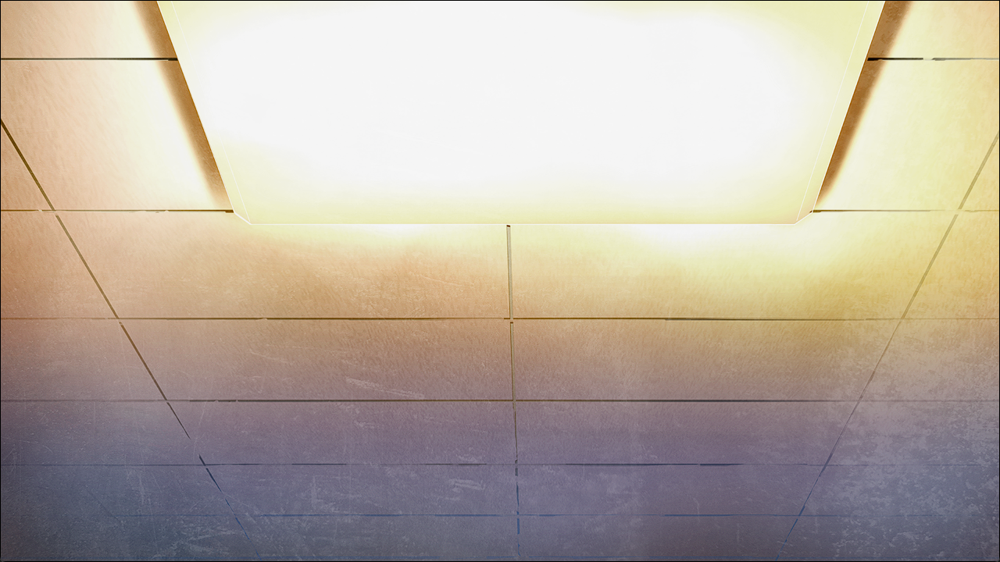
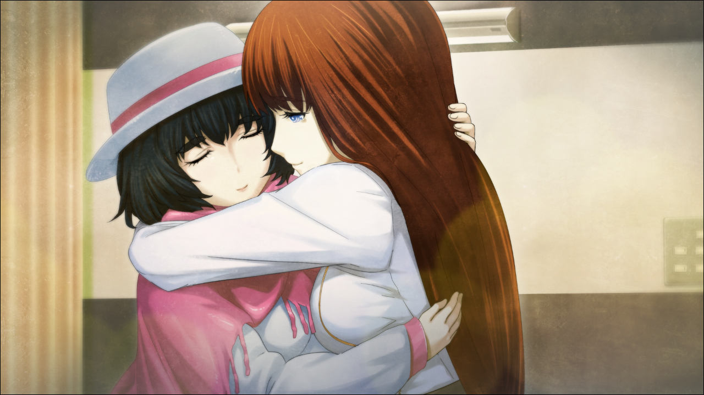

# 相互再归的鹅妈妈 - 08
> 1.064756  
> [ 2011/01/16 ] 篝恢复了未来的记忆，度过了充实而幸福的半年。  

| [←prev](./0119) | [menu](../) | [next→](./0121) |

---

“……我……还活着、吗？”  
篝睁开眼，发现自己躺在病房的床上。  
“篝小姐!”  
真由理双眼通红，凑近篝的脸盯着她。  
“冈伦，篝小姐醒过来了哦！”  
“篝！”  
“我……”  
“你之前差点被卡车撞到了。  
 还好没受伤，但失去了意识，以防万一还是叫了救护车。  
 因为你没有保险证，所以医疗费用可能挺吓人……”  
“没办法啊，当时只能这么做了。幸好篝小姐没事啊。  
 冈伦他啊，在千钧一发之际救了你哦。  
 我还以为你们俩都要死了……  
 真由喜……真由喜啊……呜呜……”  
“别哭啊，真由理。”  
“呜……”  
“啊，这样啊……隐约记得……冈部先生冲了过来的样子。  
 对不起，我到底怎么了呢……谢谢你。”  
“不用谢，没事就好。”  
百感交集的真由理抱住了篝。  
“太好了哦，篝小姐！我真的好担心啊……”  
“真由理小姐——”  
……不对。篝终于明白了全部。不是的，这个人不是“真由理小姐”。嗯，是啊，这个人是，妈妈。  
“终于……终于见到你了——！”  
这次反过来，是篝紧紧抱住了真由理。  
“妈妈！”  
“咿呀！？诶，妈、妈妈？  
 篝小姐，不对哦？真由喜不是你的妈妈哦？”  
“没错！妈妈，你就是篝的妈妈！！”  
不知不觉用上了小孩子的语气。分离的 10 年时间烟消云散，篝又变回了那个时候的篝。  
“你叫她妈妈……！篝，你恢复记忆了吗？！”  
“冈伦……叔叔。”  
“……！”  
“嗯。全都想起来了。我是椎名真由理的女儿，椎名篝。”  
“诶诶诶——！？但是，篝小姐，比真由喜还要年长哦？  
 而且，真由喜，那个，还没生过小宝宝……”  
“妈妈，我是来自未来的哦。未来的妈妈，认领了身为孤儿的我，把我收作养女。”  
“真由喜吗？”  
“是的啊，是妈妈赋予了我活下去理由。  
 妈妈为了让我逃离危险，把我送来这个最安全的地方。”  
“安全的地方？”  
“就是过去哦。  
 让我在妈妈年轻的时候，还处在和平中的日本，安全地生活下去。  
 但是，果然太孤独了。这里，没有妈妈……  
 不管是再安全的地方，和妈妈分开就没有意义了！  
 妈妈！我终于见到你了……！”  
柔软的病床上，篝紧紧抱住真由理，泪如泉涌。真由理虽然刚开始还不知所措，但是很快就温柔地抱了回去。  
“篝酱……”  
“妈妈！”  
“嗯。对不起……对不起哦……！”  
“呜……呜呜……哇啊啊啊——！！”  
“对不起……很辛苦吧，很孤独吧。  
 是妈妈不好，让你难过了这么久呢……  
 对不起哦……”  
“妈妈——！”  

就这样，我，椎名篝恢复了全部记忆。  
接下来的几个月里，只觉得好开心。每天都习惯在 LAB 集合，和妈妈还有朋友们一起玩。大家都是很好的人，每分每秒都过得很充实。特别是妈妈，会尽可能抽出时间陪着我。一起吃饭，一起逛街，一起漫无目地散步。这些微不足道的日常琐事，正是我从心底一直追求的。以前一直在脑海中回荡的“声音”，也在和妈妈不断的聊天中，不知不觉消失了。妈妈不论什么时候，都对我展露着笑容，而且，满心欢喜地听着我说话。真的，真的，好幸福。也办过好几次过夜聚会，在 LAB，在妈妈家，在琉华君家。我们一边吃点心一边聊天到深夜，晚上和妈妈睡在同一床被子里。在被窝里，两个人小声地唱着那首歌，那首妈妈说的“把两人联系在一起”的歌。  
的确，那首歌把我和妈妈联系在了一起。  
我小时候，从妈妈那里学会那首歌；  
妈妈是从铃羽姐姐那里听来的；  
铃羽姐姐是从由季小姐那里听来的；  
由季小姐是从冈伦叔叔的妈妈那里听来的；  
冈伦叔叔的妈妈是从冈伦叔叔那里听来的；  
然后冈伦叔叔是从——虽然不确定，但是果真如此的话，那真是一个美妙的故事。  

我也和妈妈聊了好多其他的事情，关于学校，关于 LAB，关于冈伦叔叔，关于未来，关于恋爱，真的聊了好多好多。有时候，妈妈会突然说起这样的话。  
“呐，篝酱，真由喜是这么想的。  
 这首歌也许是，用来鼓励最喜欢的人的歌吧。  
 那个人，失去了最重要的宝物，很伤心很伤心，于是陷入了沉睡。  
 那个人是如此的悲伤，无论怎么摇晃，他始终迷迷糊糊地不肯醒来。  
 但是呢，那个宝物并没有消失。  
 实际上，它就在只要稍微往前伸出手就能够到的地方。  
 但是那个人一直都没有注意到，宝物就在那么近的地方，一直沉睡着。  
 不过啊，那个人一定一直在等待某个人来叫醒他。  
 因为那个人就在身边，因为宝物并没有消失，  
 虽然不知道会在什么时候，但是总有一天他会醒来的。  
 我觉得，就是这样的一首歌。”  
妈妈说完，就微笑地看着我。被窗帘间透进来的月光所照耀，恍惚间看到了妈妈的眼睛，是那么的清澈。第一次见到颜色这么美丽的眼睛。  

但是，事后回想起来，以前也曾经见过，妈妈的那种那双眼睛——那个时候，我取回记忆的那个雨天，妈妈一边抱着我，一边露出了同样的眼神。那时候妈妈一直对我重复说着“对不起，让你变成孤身一人。”我本来以为，那是妈妈在替未来的妈妈道歉。然而，并非是这样，那时候的妈妈，并不是作为任何人，而是作为 2011 年的椎名真由理在向我道歉。  

领会到这个含义是在半年之后——2011 年 7 月 7 日，七夕那天。  

 

> (to be continued)
---

| [←prev](./0119) | [menu](../) | [next→](./0121) |
