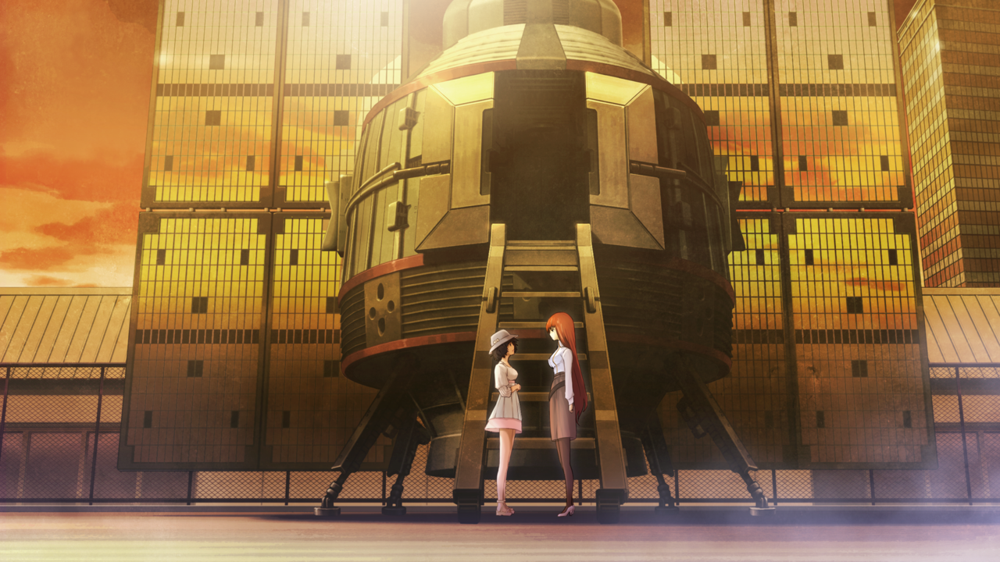
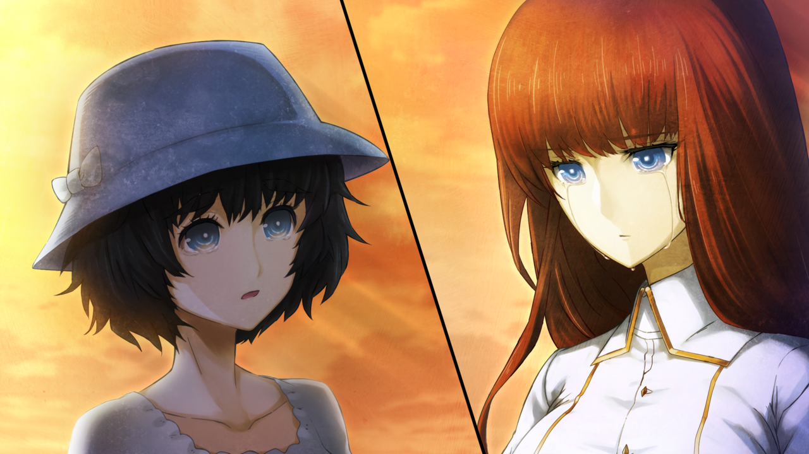
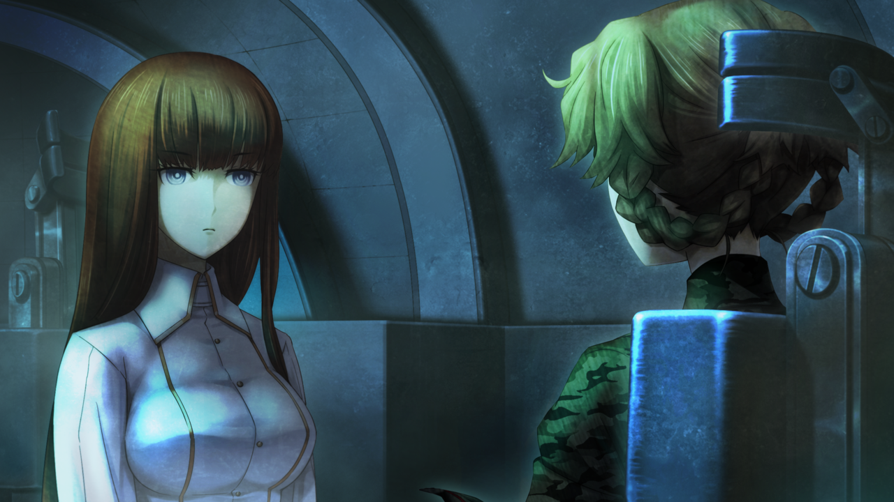

# 相互回归的鹅妈妈 - 09
> 1.064756  
> [ 2011/07/07 ] 真由理决定和铃羽回到那一天推冈伦一把，和篝道别。篝最终代替她乘上了时间机器。  

| [←prev](./0120) | [menu](../) | [next→](./0121) |

---

其实，我明白的……  
“妈妈把我叫到这个地方，有什么事吗？是准备给我什么惊喜吗？”  
篝沿着广播会馆的楼梯，一层层往上走着。她小声说着，仿佛真的期待着惊喜，也仿佛是故意在说给自己听。今天是 7 月 7 日，七夕，牛郎与织女相会之日。晚上，LAB 的成员们，还有天王寺一家，要一起在楼顶举行七夕派对。其实就是欢乐的烧烤派对。因为今天是晴天，晚上的星空一定很美。  
“应该和妈妈一起，早点回去继续做准备了。”  
其实，我明白的……叫我到此意味着什么。虽然明白，但是，我还是佯装不知。其实，我不想来这里的。我想要逃避，不想看到即将发生事情。  
踩着一级一级的台阶，往楼顶走着。  
“得快点了，妈妈在等着呢。”  
为什么，事到如今……  
“妈妈……！”  

打开通往屋外楼顶的门，夏天落日的余晖与温暖的风抚上脸庞。黄昏时分的天空，已经有些星星微微闪烁。真由理站在那里，站在楼顶上矗立的时间机器的旁边，一只手按住快被风吹走的帽子，另一只手伸向了天空。真由理张开的手掌，直直地伸向秋叶原那由蓝到红渐变的天空，好像要用手抓住，那颗早早开始闪烁的最亮的星星。真由理的视线，穿过手掌向着那颗星星延申，看向比星星更遥远的地方。这副景象，飘逸绮丽，如梦似幻，好像触之即碎。  
“妈妈……”  
篝忍不住叫出声来。感觉如果放着不管，真由理就要那样被星星带走了。  
“啊、篝酱！嘟嘟噜\~”  
“妈妈……！”  
篝紧绷的身体放松了下来——太好了，是平常的妈妈。没必要担心，妈妈不会抛下我不管，独自去某个地方。随着篝走近，真由理放下了伸向了天空的手。  
“怎么了？为什么要把我叫到这里？”  
“呵……”
真由理有些羞涩地笑了笑，然后一下子转过身去，抬头看向那边的时间机器。  
“篝酱就是坐着这个过来的呢。”  
“突然怎么了？又不是什么值得——”  
话语堵在了喉咙里，篝什么都说不出了。因为她注意到，时间机器的舱门是开着的。  
“为什么……？为什么时间机器的舱门开着呢？”  
真由理微微低头没有回答。这时候，一个身影从时间机器里出来了。  
“篝！？你为什么在这……”  
“我才要问啊，你们俩在这干什么？！”  
“真由姐……不是约好对篝保密的吗？”  
“没跟你说，不好意思呢，铃小姐。  
 真由喜啊，不管怎么说，还是想和篝酱好好告别呢。  
 我会很快结束的，你继续做准备吧。”  
“知道了，结束之后就上来吧。”  
说完，铃羽就回到了时间机器里。  
“保密？告别？准备？  
 妈妈和铃羽姐姐到底在说什么？  
 我完全不明白啊。”  
其实，我明白的。其实，收到妈妈发来的消息的那一刻，我就明白了。  
但是，不想承认。不想承认，时间机器会再一次把篝和妈妈分开。  

“那个，真由喜啊，接下来会和铃小姐一起，乘坐时间机器。为了让最重要的人醒来。”  
“没用的。世界线，会收束的。  
 不管妈妈和铃羽姐姐怎么努力，都改变不了。  
 谁都改变不了。”  
“或许……是的呢，真由喜一定改变不了。”  
“那为什么……！”  
“但是冈伦是不一样的，冈伦拥有改变未来的力量。  
 对那样的冈伦——那一天的冈伦，稍微推一把，这种程度真由喜还是能做到的。  
 机会只有在那一天了。”  
“不会那么顺利的！”  
篝用力抓住了真由理的双臂。但是，真由理只是悲伤地微笑着。  
“即便如此……真由喜也想再见他一面。  
 凤凰院凶真，我的牛郎星，我想再见他一面。”  
“我不要这样……！”  
其实，我明白的。恢复记忆已经有半年了，篝每天都从心底里觉得幸福。在和平的、远离战争的日本，和真由理、LAB 的成员们过着的日常生活，每天都如同宝石般闪耀，好想就这么一直持续下去。但是，其实，我明白的，那天真由理眼神里的含义，以及她会在大家都在欢闹的时候，突然陷入沉思般望向远方的理由。  
“我呢……？我会怎么样……？  
 如果，冈伦叔叔真的到达了命运石之门的话……  
 那么，战争也许就不会发生，也许会有很多人被拯救。  
 但是，那样的话，我就不能和妈妈相遇了啊……”  
“不会的哟。不论在怎样的未来，真由喜都会和篝酱相遇的哦。  
 在那个世界，篝酱也许就不是孤单一人。  
 也许是和真正的爸爸妈妈一起，每天过着幸福的生活。  
 即使如此，真由喜也会去找篝酱的，然后和篝酱成为很好很好的朋友。  
 所以篝酱，不用担心哦\~”  
“不管我还是妈妈，可能都会忘记对方啊！   
 都不记得我，如何来找我呢？！绝对做不到的啊！！”  
“不，真由喜，一定会记得篝酱的。”  
“凭什么……凭什么能一口咬定？！”  
“因为……这就是命运呀。  
 真由喜和篝酱的羁绊，是不会输给任何事物的。  
 所以，就算失去了现在的记忆，真由喜也绝对会找到你的。”  
“妈妈……”  
真由理双眼的泪水如同珍珠般不断滑落，但即便如此，她也笑着面对篝。这时的篝才第一次知道，椎名真由理这名女性，是多么坚强；知道了，她拥有着连本人都没有察觉的，无比坚定的信念；知道了，这个让人觉得很容易遇到危险的，谁都想保护她的可爱女孩子，实际上，比世界上的任何人，都对未来充满了信心。  

“那么，差不多该出发了。”  
真由理登上了时间机器。篝看着真由理一步步缓慢登上舷梯，从下面看得很清楚，她的脚在发抖。这样下去是不行的——这样下去的话，会和篝第一次搭乘时间机器，2036 年的那天一样。那种事，篝已经再也无法忍受了。  
“等等！”  
篝用力抱住了真由理的身体。  
“诶？”  
“不能让妈妈回过去！我要替妈妈去！”  
篝抢走了真由理手里的手机，强硬地拉住惊慌失措的真由理的手。  
“哇啊\~！”  
真由理失去平衡，掉下了舷梯。篝则代替她冲进了机器中。  
“篝，你认真的吗——？”  
篝不理会惊讶的铃羽，身体从舱门探出，笑着对真由理说道。  
“妈妈！冈伦叔叔的事，我会想办法搞定的。所以，妈妈就在那里等着我！”  
“篝酱！”  
“铃羽姐姐，关上舱门吧。”  
“这样好吗？”  
“嗯。”  
“我知道了。”  
“舱门开始关闭。”  
真由理一脸茫然地抬头看着篝。  
“篝酱……”  
“妈妈！我会一直爱着妈妈的！不管是过去，现在，还是未来！”  

舱门关闭了。已经再也看不到篝最喜欢的妈妈的身影了。篝用手一个劲儿地擦着眼泪，一言不发地做到副驾驶座上，用安全带固定好身体。坐在对面座位上的铃羽，嘴角微微翘起。  
“没想到，还会再次和你一起乘坐。”  
“只不过回到了最初的起点而已。”  
“和最初的时候可是有很大不同，那时候的你可是哇哇地哭个不停。”  
“铃羽姐姐明明也哭了……”  
“是啊……出发了啊，篝……回到过去。”  
“嗯。”  
铃羽操作控制台，座位开始振动。同时，时间机器中出现了蓝白色的光，这是开始时间跳跃的前兆。无法保证一切都能顺利进行，也许再也无法和真由理见面。即便如此，篝在心里发誓，一定要坚持到底，作为椎名真由理的女儿。  

*♪\~有个要寻找的东西\~♪*  
*♪\~星星在对我笑眯眯\~♪*  
*♪\~随着风眼睛眨呀眨\~♪*  
*♪\~伸出手的话就能够抓到哟\~♪*  

不论分开多远，这首歌都一定会将篝和妈妈再次相连。  

 

> (to be continued)
---

| [←prev](./0120) | [menu](../) | [next→](./0121) |
