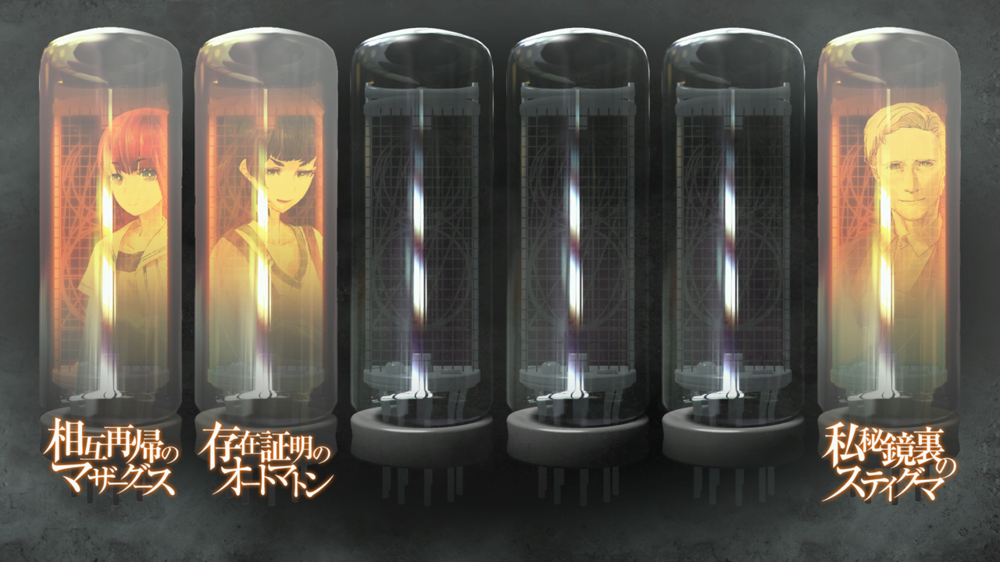

# 瓦尔基里报告 - 篝结局
> 1.064756  
> [ 2036/08/13 ]  

| [←prev](./0121) | [menu](../) | [next→](./0123) |

---

## 情报整理 | 各方势力
### LAB
- 冈部伦太郎
  - 未觉醒
  - 2025 年去世
  - 幼时因为篝唱的《星之奏》鼓励，凤凰院凶真觉醒
  - 在幼时和现在都救过即将被卡车撞到的篝
- 椎名真由理
  - 想再见到牵牛星——凤凰院凶真，决定随铃羽回到过去推冈伦一把
  - 最终行动被篝替代
- 比屋定真帆
  - 从冈伦处得知时间机器情报
  - 与众人分析得出，真正的战争起因是《中钵论文》背后的红莉栖原版论文，而记忆移植的目的也是为了时间机器相关的情报
  - 与桶子合力开发出了『时间跳跃机』
- 椎名篝
  - 被琉华子父亲的朋友发现，脑内没有任何之前的记忆
  - 借住在柳林神社
  - 在显像管工坊打工（记忆发生问题后暂缓）
  - 脑中被移植了红莉栖的记忆
  - 在红莉栖的意志下，用自身的记忆备份覆盖掉红莉栖记忆
  - 幼时被『教授』囚禁
  - 脑内能够听到“声音”
  - 觉醒了儿时在未来的记忆
  - 代替真由理回到了过去

### 同盟
- SERN-Rounder
  - 与天王寺（FB）谈判后，同意篝和铃羽在工坊打工，提供保护
  - 与铃羽合力擒获了 STRATFO 武装成员

### 敌对
- 【美】STRATFO
  - 『教授』在篝失踪的期间控制着篝
  - 保存着篝的记忆
  - 派出武装势力想要夺回篝
- 未知武装势力
  - 入侵了和光市办公室与真帆酒店
  - 想要抢夺红莉栖的笔记本电脑和硬盘

## 情报整理 | 重要物品
- 『Amadeus』
  - 项目自红莉栖死后就被冻结
  - 无法通过『Amadeus』获取记忆内容，但可以从拥有这份记忆的活人身上获得
- 红莉栖记忆备份
  - 被移植进篝的脑中
- 《中钵论文》
  - 大战导火索，但本身质量很差
  - 怀疑实际存在红莉栖所著原本
- 红莉栖笔记本电脑和硬盘
  - 密码未解锁，可由桶子破译
  - 由真帆保管

## 情报整理 | 重要事件
- 未知原因跳跃世界线——α 世界线重遇红莉栖
  - 发生时机：『Amadeus』疑似被劫持时接到“红莉栖”的联络，未接听后
  - 重遇活着的红莉栖：
    - 她仅仅通过简短的对话就洞察了全部真相，本来打算骗冈伦出门的事件偷偷将他送回去。结果冈伦察觉了，冲回 LAB 发现了红莉栖的行为。两人进行了饱含深情却又克制的告别。
  - 结束时机：红莉栖通过 D-Mail 将冈伦送回 β 世界线
  - 回归后的世界线与之前有所偏差：
    - 原本的冈伦亲自告知真由理关于篝、未来与时间机器的情报，现在二人按母女相处
    - 琉华子也终于共享了这些秘密
    - 篝脑内保留了儿时在未来的记忆，却没有失踪期间的记忆
    - “红莉栖”消失了，因为『Amadeus』项目自从红莉栖去世时就被冻结了
- 《星之奏》传递链条闭环
  - 篝 <- 真由理 <- 铃羽 <- 由季 <- 冈伦母亲 <- 初中凶真 <- 篝
  - 是鼓励最喜欢的人的歌

## Steins;Gate 达成条件
- ■■ 红莉栖的时间机器相关论文
  - ■■《中钵论文》的红莉栖原本
  - ■■ 红莉栖的笔记本电脑和硬盘
- ■■ 红莉栖的记忆备份
  - ■■■■■■■■■■
  - ■■ 篝脑中的记忆备份
- ■■■■■■■■■■■■■
  - ■■■■■■■■■■
  - ■■■■■■■■■■
  - ■■■■■■■■■■
- ■■■■■■■■■■■■■

---

“不论分开多远，这首歌都一定会将篝和妈妈再次相连。”  

LABMem No.010『椎名篝』
  

 

> Hope is always there in the “future”.
---

| [←prev](./0121) | [menu](../) | [next→](./0123) |
