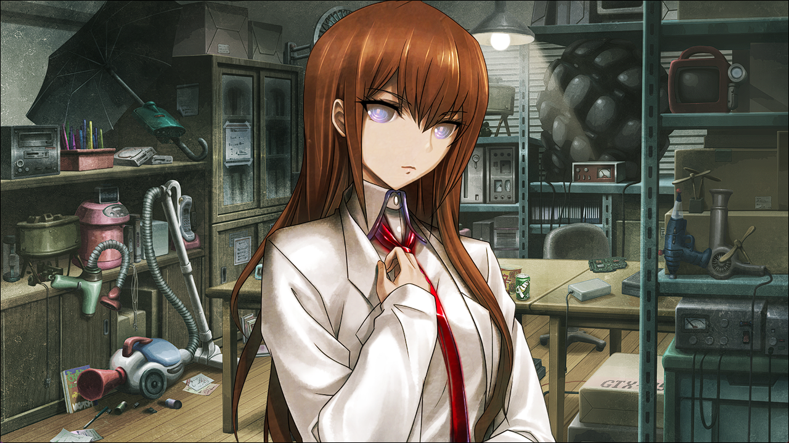
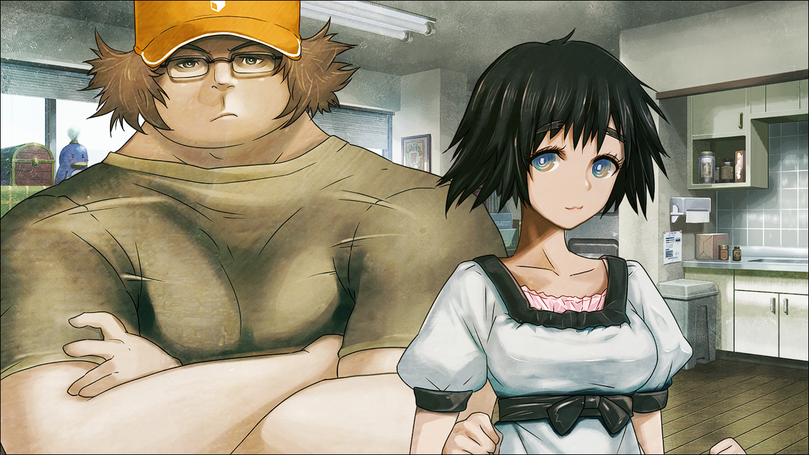
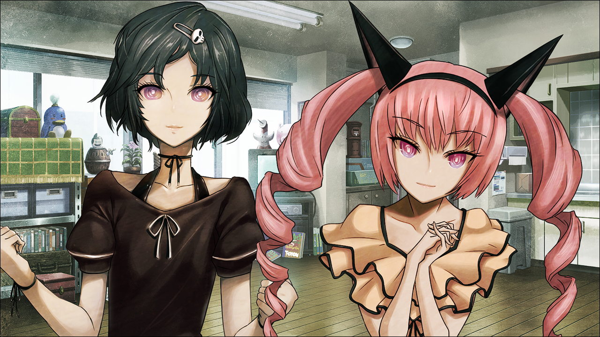
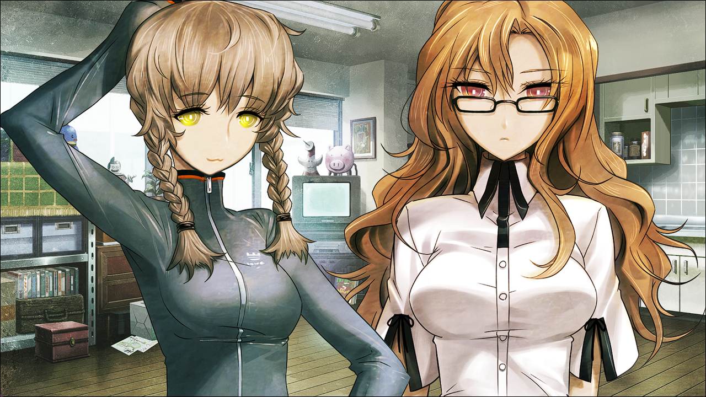
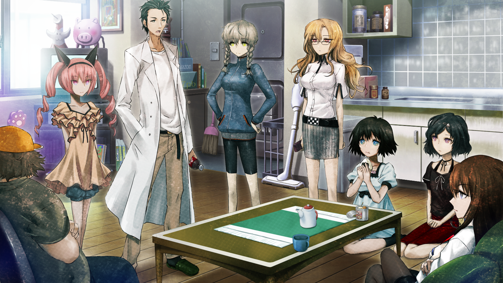

# 盟誓的文艺复兴 - 01
> ?.??????  
> [ ????/??/?? ] 接 0112 - 接听电话。来到了一个奇怪的地方。  

| [←prev](./0112) | [menu](../) | [next→](./0124) |

---

我将手机贴上篝的脸颊，按下了接听键。  
在铃声停止的下一瞬间，世界——景象开始扭曲起来——  

---  

在深邃的黑暗之中，没有声音，也没有温度，充斥其中的唯有黑暗、寒冷与寂静。没有人在，也无法分辨出自己是清醒的还是在沉睡，只有模糊暧昧的存在感。虚无——此处唯有虚无在无限扩张着——  
哎？我到底在干什么啊？记得是——  

“我说冈部，一直在那种地方睡的话，会感冒的哟。”  
“诶…？”  
画面由黑白逐渐恢复成彩色。我向着声音的方向转过去，拉开开发室的帘子，站在那里的是……  

“干嘛？”  
“什么啊，红莉栖，你在啊。”  
“你在啊这什么的，还真是有够过分的招呼啊。刚才开始不是就一直在这里么。”  
“是…这样吗？”  
“是啊。昨天跟前天，一直都在这里啊。”  
“这么说的话，好像真是这么回事。”  
“脑子里老是一股又暧昧，又朦胧的感觉。”  
“话是这么说，但是既不是想睡觉，又没有感觉到疲倦。”  
“只有意识是清醒的。”  
“就算是这样，还是感觉缺了什么——还是什么很重要的——有这样的感觉。”  
“说起来，桶子跟真由理在干嘛？”  
“…你啊，真的不要紧吗？是不是哪里不舒服？”  
“什么意思啊？”  
“桥田跟真由理啊，看，不是就在那吗。”  
“诶？”  
画面由黑白逐渐恢复成彩色，传来的是熟悉的声音。  

“冈伦，嘟嘟噜~。”  
“居然没有注意到我这么巨大的存在感，你没事吧，冈伦。”  
“啊啊，这样啊。”  
“桶子跟真由理，也是一直在那里的啊。”  
不，不只是他俩。  
画面由黑白逐渐恢复成彩色，传来的是熟悉的声音。  

“凶真，没精神喵？让菲莉丝的萌萌魅把你的精神夺回来喵~。”  
“凶真先生，有什么我能做到的话，还请一定告诉我呐。”  
“还有菲莉丝和琉华子。”  
接着是——  
画面由黑白逐渐恢复成彩色，传来的是熟悉的声音。  

“为了冈部伦太郎的话，去周围这边找找有没有能吃的草，我来做个特别果汁怎么样。”  
“我也…在的…冈部君。”  
“铃羽跟萌郁。”  
“LABMem 所有人，不都在这个 LAB 里的嘛。”  
是啊，这就是我的日常啊，我就是这样，一直在这里过着这样的日子的啊。  
“呼姆…所有人都在了啊。”  

“那么现在，第 65536 次圆桌会议正式开始！你们几个，都准备好了吗！？  
“真是，每次都搞这么郑重其事。”  
“你丫才是，差不多也该改改你那装模作样的脸色了吧，助手。”  
“所以说，我不是早说了我不记得什么时候成你的助手了啊喂。”  
“冈伦跟红莉栖酱，还是关系那么好呢~。”  
“眉来眼去的够了。爆炸吧现充。”  
“等一下，桥田。我什么时候，跟这家伙有眉来眼去了啊！”  
“所谓关系越好，就越是吵架喵。”  
“真羡慕…啊…。”  
“漆原琉华也来一起眉来眼去的不就好了嘛。”  
“诶？不，不行的呀！那种事我，做不到…。”  
“眉来眼去…。”  
“诶欸！你们几个！还要废话到什么时候！赶紧开始会议！”  
“于是，今天的议题是什么？”  
“那种事情当然已经决定好了。今天的议题就是——”  
“什么来着…？”  
“议题就是…。”  
“冈部？”  
“果然哪里不对…。”  
“冈伦？”  
“一眼看上去是跟平时没有什么不同…。”  
“怎么了，冈伦？”  
“…是啊，好冷啊。”  
“凶真？”  
“感觉不到。”  
“凶真先生…。”  
“感情也是。”  
“冈部伦太郎。”  
“温度也是。”  
“冈部…君…。”  
“大家都在的。”  
“明明是那样却，为什么冷这么暗这么冷…。”  

画面的颜色逐渐褪去，直到恢复成完全的黑暗。耳边依稀回荡着朋友们呼唤我名字的声音。  
“好冷——”  
“好冷好冷好冷好冷好冷好冷好冷好冷好冷好冷好冷好冷好冷好冷好冷好冷好冷好冷好冷好冷好冷好冷好冷好冷好冷。”  
“身体由内而外都要冻结一般的寒冷。”  
“就像是骨头变成了铁做的一样的感觉。”  
“就像是身体中的血管仿佛流动着水银一样的感觉。”  
“好冷。”  
“就像马上要冻住了一样。”  
“这到底，是什么？”  
“这究竟，在哪里？”  
“我…在哪里？”  
“我——”  

 

> (to be continued)
---

| [←prev](./0112) | [menu](../) | [next→](./0124) |
