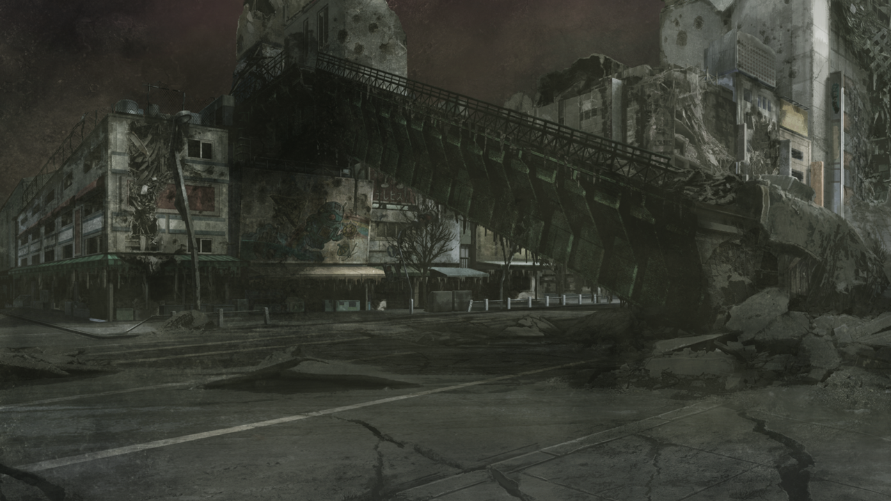
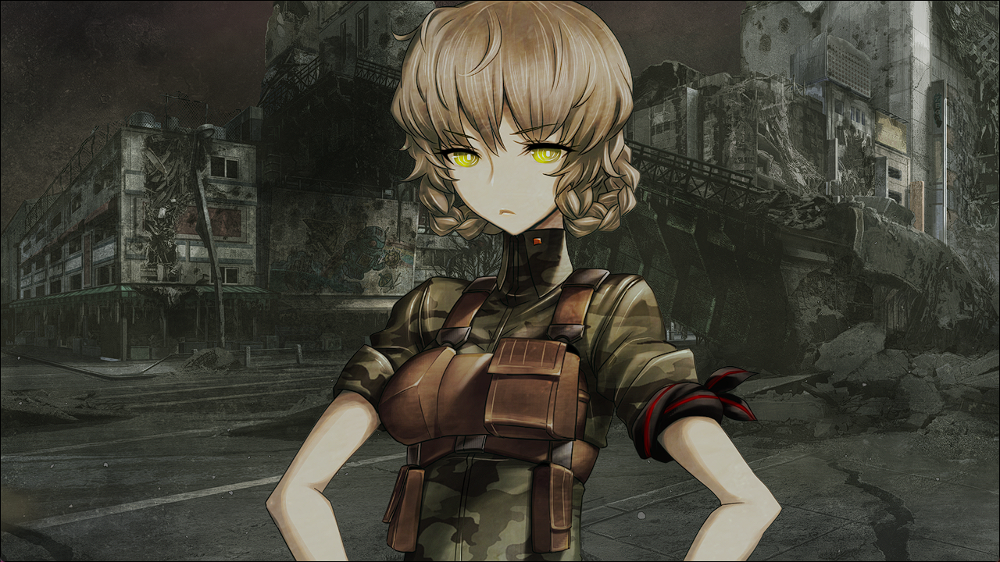

# 盟誓的文艺复兴 - 02
> 1.055821  
> [ ????/??/?? ]  冈伦在陌生的地方苏醒，来到了好像是一片废墟的地方。  

| [←prev](./0123) | [menu](../) | [next→](./0125) |

---

这里是……哪里？我到底……在干什么？”  
“……”  
我试着发出声音，但是做不到。感觉我应该是躺在床上，而且是很硬的那种硬板床。慢慢环顾四周，这里既不是 LAB，也不是我家，是个让人感觉很不好的阴暗房间。自然，我不可能认识这里。为什么我会在这种地方？  
“唔……！”  
脑袋里好像有什么——就像是被插进了电极一般，抽搐刺痛着。我保持躺在床上的姿势，想要把手举起来，动作却太过沉重而做不到，像是所有关节都固定住了一样。  
“呃……唔啊……”  
我调动起全身的力量，好不容易慢慢抬起了身体。只要动作稍稍大些，各个关节就会发出悲鸣，全身上下都疼痛难忍。不知道过了多久，我终于靠着床头坐了起来。往下一看，注意到自己现在正穿着病人用的白色患者服，头上还戴着某种跟头盔差不多的装置，从那里延伸出来的线缆连接着很怪异的机械。我到底，为什么会变成这种样子？直到刚才我还——  
对了，是篝，她的脑中被植入了红莉栖的记忆。为了把红莉栖的记忆从她脑中去除，用篝本人的记忆进行重新覆盖——然后……啊啊，想起来了。那之后，世界线又一次变动了。然后——怎么了？我试着回忆，但是脑袋里总觉得被雾霭所笼罩，记忆模糊不清。  

总而言之，现在应该优先去确认这里到底是什么地方。  
我把头上的装置取了下来，从床上离——  
“啊……！”
我一下子摔在了地上。奇怪啊，是因为头脑还没有彻底清醒，产生了眩晕什么的吗？正这么想着，想再站起来的时候——  
“咕…！”  
腿使不出力气。反复试了好几次，最后抓着床，勉强站起来了。仅仅只是这样双脚站立，就已经疲劳到喘着粗气。我是患上了什么糟糕的病症吗？还是因为我一直都这么睡了好几天？又费了好大劲，拖着使不出力气的双脚，总算是到达了门边。  

门异常的沉重。不，也许单纯是因为我没有力气，所以感觉它很重。总之，倾尽全身的力量奋力去推，总算是把门给打开了。虽然似乎上着锁，但是从内侧还是可以打开的。  

我靠墙壁支撑着身体，继续在阴暗的过道中前进。前面有台阶，我抓着扶手，慢慢地慢慢地，一步一步走上台阶，尽头处有着像是舱门一般的出口。  
我终于攒足了力气，使劲打开了舱门。这是——在一栋老旧的大楼里。我继续保持着这种完全摸不到头脑的状态，在墙壁和天花板都剥落了的过道中继续前行，终于找到了通向外面的门。  
疲劳至极的我来到外面，眼中映出的景象是——  

这是——一大片凄惨的瓦砾山。  
“这是……怎么回事……”  
被破坏而化为废墟的建筑群，断壁残垣间裸露的扭曲的钢筋……一开始还以为是电影片场还是别的什么，但是比起人工造景，眼前的这份光景实在是过于真实了。墙壁和窗户、还有天花板，到处都被破坏了，分崩离析的破片都将地面掩埋了起来。街道上的柏油路也满是裂痕和窟窿，甚至无法在上面行走。不仅仅是眼前。环视着整个地方，映入眼帘的都是同样的光景。闻得到油的臭味，还有像是在熏制什么的臭味。看向天空，也是一片发红的昏暗。虽然想着是不是因为多云的关系，然而并不是那么回事。覆盖着整片天空的黑色帷幕间隙，隐隐约约漏出像是阳光的光线。  
“呃……咳咳、咳咳咳……”  
喉咙感受到强烈的刺痛，引发了咳嗽。我赶忙用衣服的袖子捂住嘴巴。这份痛楚甚至在向眼睛蔓延。  

再一次强迫自己冷静下来，尝试去回忆到底发生了什么，果然还是得不出任何结论。毫无疑问的是，世界线发生变动的时机，正是犹豫之后终于下定决心，将篝的脑中的红莉栖的记忆覆盖消除。**被植入篝脑中的那份记忆，也是『Amadeus』的“红莉栖”所拥有的记忆。那份记忆的拥有者的变动——也即是，红莉栖的时间机器理论拥有者的变动，应该会让世界线发生变化**。于是这里是被变动后的世界线。那么，这份光景就是说——  

视线的角落，突然发现某个突出的黑色的棒状物。我慢慢靠近，仔细查看，那东西从瓦砾堆中伸出，末端分成了 5 个……  
“噫——！呜噗……咕哈……呜、呜呕……”  
是手，已经彻底炭化的焦黑的人手。胃中涌起一股强烈的不适感。  
“——？”  
不经意间感觉有什么在动。有什么……在哪里？我竖起耳朵探听周围的动静。是大楼那边，有什么东西发出了声音。是有人在吗？如果是的话，也许能够找他问问，这里是什么地方，还有这里为什么会变成这样。  
我尽可能注意着不发出声音，小心翼翼地从已经崩坏的大楼的墙壁间窥觑。的确有，这里，有人在，还很多。不，准确来说也已经不能称之为人了，只是人形的肉块罢了，而且，如山一般堆积着。几只狗聚集在那个肉块山上，有一只嘴巴里叼着什么滑溜溜的长东西跑了下来——是肠子。它们，在吃尸体。强烈的腐臭，狗群咀嚼的声音，成群虫子翅膀的拍打声，实在是一幅地狱的画卷。  
“啊……啊啊……啊啊啊……！”  
某具不知名的尸体用虚无的眼神盯着我。眼球倏地掉了出来，空洞中涌出了黑色的虫子……  
我哀嚎着从那里逃走了。拼死向前迈出不稳的脚步，鼓舞着已经快要破裂的心脏，竭尽全力地奔跑着。  

就不能——就不能，有个正常的地方吗！？然而，不管我再怎么向前跑，只有同样的光景再不断延续着。瓦砾山，废墟堆，还有到处都是的已经丢掉性命的人，没有任何活人的气息——接着，我突然就解开了迷惑。  

已经崩坏的巨大建筑群，宽大的道路上裂开了数条大缝，然后是——刺向地面的扭曲高架桥，几条铁轨和腐朽的枕木……我知道的，我知道这个地方。尽管已经面目全非，但是不会错的。这里是——秋叶原的街道。也就是说——  
LAB……怎么样了……？真由理呢？桶子呢？菲莉丝呢？琉华子呢？铃羽呢？还有真帆和篝，他们都怎样了！？正想确认这件事，朝 LAB 的方向跑去时——  
背后传来了脚步声，是粗暴地践踏着瓦砾的脚步声，而且不止一人。脚步声逐渐变大，最后我在崩坏的大楼间看到了——全副武装的男人们，一共有 3 人，每个人手里都拿着自动步枪。  
“你小子，在那干嘛！？”  
那群人一发现我就一齐把枪口对准了我。  
“啊……”  
有好多事想问，有好多事想知道，但是那一瞬间出现在脑中的，只有马上逃走这个想法。然而，尽管想要转身逃跑，身体却动弹不得。  
“别动！！”  
他们大概是察觉到了我想逃走的意图，伴随着怒斥声，还有几声干脆的击发声——脚边的混凝土被射穿了几个洞。他们射击了！真的射击了！用真正的枪对着我！再近一点就击中我了！  
“啊……啊啊……”  
我恐惧地大口吸着气，双脚战栗着。那群男人保持枪口对准我的姿势，不断拉近了距离。快逃！不逃走的话——然而，身体却好像不是自己的，并不接受我大脑发出的指令。在此期间，那群男人的枪口还在不断向我迫近。  
“诶……？”
接着——又响起了干脆的击发声。其中一个男人猛然倒向一旁，头部撞到瓦砾上，然后一动不动了。剩下的两人，显然因为这突发事态措手不及，狼狈地把枪口转向了左右警戒着。  
“碍事！”  
呆立在原地的我，突然被什么人拽倒在地。接着又传来了几声枪响，剩下的两个男人几乎同时向后栽倒，还保持架着枪的姿势。死了！就在我的眼前！有人，死了！我屁股着地摔了一跤，呆愣愣地盯着眼前的场景，以及站在我面前，穿着军靴的双脚。  
“你这家伙，想死吗？”  
我抬起头，站在那里的是——  

是铃羽——  
“喂，你准备坐在那里发呆多久啊？”  
“……是你……杀的吗？”  
“你在说些什么天真的话啊……”  
我迄今为止，从未听过她用如此冰冷的声音说话。  
“你是……铃羽，对吧……？”  
她那像是戴了铁面具一样的表情，被惊讶所取代了。但也只有一瞬间，就马上换成了更严峻的威慑的表情。  
“你……是什么人？”  
“……你不认识我了吗？”  
难道因为世界线的改变，现在我面前的铃羽不认识我了吗？  
“我是冈部啊……冈部伦太郎……”  
听到我的名字之后，铃羽的表情又变化了。  
“冈部……伦太郎？怎么会……这不可能……”  

 

> (to be continued)
---

| [←prev](./0123) | [menu](../) | [next→](./0125) |
