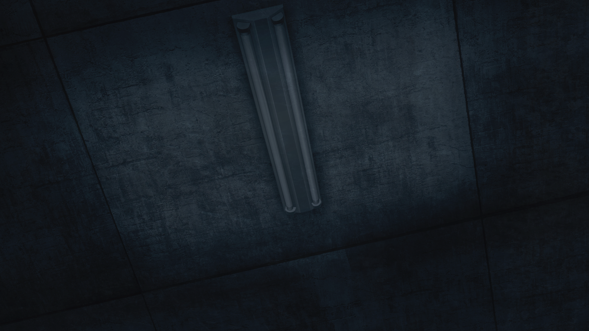

# 盟誓的文艺复兴 - 02
> 1.055821  
> [ ????/??/?? ]  冈伦在陌生的地方苏醒，来到了好像是一片废墟的地方。  

| [←prev](./0123) | [menu](../) | [next→](./0125) |

---

“这里，是…？”  
“哪里？”  
“我到底在，干嘛？”  
“啊……”  
“想要发出声音，但是做不到。”  
“看起来我应该是，躺在床上的样子。”  
“而且是，很硬的那种硬板床。”  
“慢慢的看向周围。”  
“既不是在 LAB，也不是在我家。”  
“是个让人感觉很不好的阴暗房间。”  
“自然，不可能认识这里。”  
“为什么我会在这种地方？”  
“脑袋里好像有什么——就像是被插进了电极一样的东西一般的抽搐刺痛着。”  
“保持着躺在床上的姿势想要把手举起来，动作却太过沉重并不能举得起来。”  
“像是所有关节都固结住了一样。”  
“呃….呜啊…。”  
“把全身的力量都调动起来，好不容易的慢慢抬起了身体。”  
“只要稍稍有些大动作，各个关节就会发出悲鸣，全身上下都疼痛难忍。”  
“不知道过了多久，好不容易腰靠着床把视线往下一转，注意到了自己现在正穿着病人用的白色患者服这件事。”  
“头上安着什么跟头盔差不多的装置，从那里延伸出来的绳子连接着很怪异的机械。”  
“我到底，为什么会变成这种样子？”  
“直到刚才我还——”  
“是的，是篝。”  
“是脑中，被植入了红莉栖的记忆的篝。”  
“为了把红莉栖的记忆从她脑中去除，用篝本人的记忆进行重新覆盖——”  
“然后…。”  
“啊啊，想起来了。”  
“那之后，世界线又一次变动了。”  
“然后——怎么了？”  
“想要回忆起来，但是脑袋中总觉得被什么雾霭所笼罩，记忆模糊不清。”  
“总而言之，现在应该优先去确认这里到底是什么地方。”  
“我把头上的装置取了下来，从床上离——”  
“彻底的摔倒在了地上。”  
“奇怪啊。”  
“是因为头脑还没有彻底清醒，产生了眩晕什么的吗？”  
“正这么想着，想再站起来的时候——”  
“咕…！”  
“脚使不出力气。”  
“反复试了好几次，最后倚靠着床好不容易是，能够做到站起来了。”  
“哈啊…呃…。”  
“仅仅只是两脚这么站着，就已经疲劳到了这种程度。”  
“是患上了什么很糟糕的病症吗？”  
“还是因为在这几天中，一直都这么睡着？”  
“拖着使不出力气的双脚，总算是到达了门边。”  

“门异常的沉重。”  
“不，是单纯因为我感觉是这样吗。”  
“总之，倾尽全身的力量奋力去推，总算是把门给打开了。”  
“虽然似乎上着锁，但是从内侧还是可以打开的。”  

“靠墙壁支撑着身体，继续在阴暗的过道中前进。”  
“前面有台阶。”  
“抓着扶手，慢慢地慢慢地小步在台阶移动着，前面有着像是舱门一般的出口。”  
“继续费劲全力，使劲打开了舱门。”  
“这是——在一栋旧大楼里。”  
“继续保持着这种完全摸不清头脑的状态，在墙壁和天花板都剥落了的过道中继续前行，终于是找到了通向外面的门。”  
“疲劳至极的我来到外面，眼中映出的景象。”  

“这是——”  
“一大片凄惨的瓦砾山。”  
“什么啊…这都…。”  
“被破坏而化为废墟的建筑群。”  
“从中露出的扭曲的钢筋。”  
“一开始还以为是电影片场还是别的什么。”  
“但是那样的话，眼前的这份光景实在是过于真实了。”  
“墙壁和窗户，还有天花板，到处都是一副被破坏的样子，四处飞散的破片都将地面掩埋了起来。”  
“街道上的柏油路也破了个大洞的，连行走都成为不可能。”  
“不仅仅是眼前。”  
“360 度环视着整个地方，映入眼帘的都是同样的光景。”  
“闻得到油的臭味。”  
“还有像是在熏制什么的臭味。”  
“看向天空。”  
“也是一片阴暗。”  
“虽然想着是不是因为多云的关系，然而并不是那么回事。”  
“覆盖着整片天空的黑色帷幕对面，隐隐约约能看见漏出的像是阳光的光线。”  
“呃…咳咳，咳咳…。”  
“被强烈的喉咙刺痛引发了咳嗽。”  
“赶忙用衣服的袖子捂住了嘴巴。”  
“这份痛楚就像是连眼睛也要感染一般的奔走着。”  

 

> (to be continued)
---

| [←prev](./0123) | [menu](../) | [next→](./0125) |
