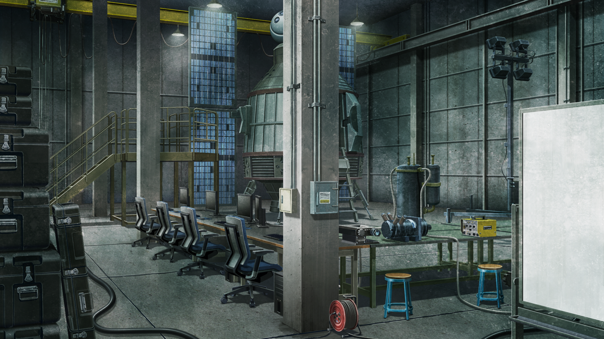

# 盟誓的文艺复兴 - 03
> 1.055821  
> [ 2036/03/07 ] 铃羽带冈伦来到了一个地方，在那里见到了中年的桶子。这才发现原来现在居然是 2036 年。可是冈伦不是应该在 2025 年去世的吗？桶子为冈伦讲述了这 25 年的经历，与冈伦为何会在 2036 年醒来。冈伦隐约意识到，世界被欺骗了。  

| [←prev](./0124) | [menu](../) | [next→](./0126) |

---

黑暗中，回荡着两个人冰冷单调的脚步声。  
“这边……”  
在我说出名字之后，铃羽用很惊讶的表情，打量了我一阵子。终于，她在和什么地方取得联络之后，态度一变，让我跟着她走。尽管如此，在来这里的路上，我还是被蒙住了眼睛。所以，我完全不知道是怎么过来的，也不知道这是哪里。  
“停下。”  
我遵从她说的话停下了脚步。听到敲门的声音，我才发现那里有一扇门。  
“你好萌好萌。”  
“心动动。”  
“进来吧。”  
这么看，刚才的应该是暗号。设定这种傻瓜一样的暗号的人，在我认识的人里就只有一个。  

门锁打开的声音感觉很厚重。门被打开，眼前出现了一间被昏暗的光芒所包裹的房间。屋子里有着各种各样破铜烂铁一样的机械，使得房间显得格外狭窄。墙上并排摆着各种各样的仪表，前面坐着一位男性，直直地看着我。  
“太好了。终于醒了呢，冈伦……”  
他是谁？为什么知道我的名字？他的声音很深沉，看年纪应该是四十多岁，体格良好，脸上薄薄的胡子随意生长着，眼镜后面的瞳孔闪烁着锐利又柔和的光芒。总觉得在哪里见过……  
“那个……你是……？”  
“讨厌啊，竟然把我忘记了？不管怎么说你都太薄情了啊，冈伦。”  
这个语调，还有这个声音……能想到的只有一个人。不，但是怎么会——  

“难道是……桶子……吗？”  
听到我战战兢兢地说出口，男性笑了出来。  
“太好了，还记得我啊，我还以为你已经彻底忘记了呢。”  
“桶子……你真的是桶子吗？”  
“这样的好男人，除了我就没有别人了吧。对吧，铃羽？”  
“你要是再瘦一点我也不是不能承认。”  
“不要这么说啦，就算这样我也比年轻的时候瘦了很多哦。”  
我面前的桶子，确实比我认识的桶子瘦了好多。  
“话说，爸爸……你的用语是不是有点奇怪？”  
“我也很久没用过这种说话方式了啊，但是对冈伦我还是觉得这么说话比较习惯吧。”  
比起说话方式，我更加不解的是他的年龄，不管怎么看都已经是中年人了，各个角度都像是四十岁多的脸。  
这时，房间角落的换衣镜进入了我的眼帘。镜子里，站着一个没有见过的男人。和桶子一样，四十多岁的男性。那家伙用他那消瘦阴沉的脸一直盯着我。慢慢试着举起了右手，就像模仿我一样，那个男性也慢慢举起了左手。  
“桶子，告诉我……”  
“请随便问。”  
“现在是……哪一年……？”  
微笑从桶子的脸上褪去，他用无比认真的表情回答我：  
“2036 年，世界正处于战乱之中。”  

桶子向我详细地说明了现况。  
“也就是说，现在真的是 2036 年吗……”  
“就是这样。”  
实在难以相信，但是桶子的身影，和我自己的样子，已经说明了一切。2036——2010 年的铃羽曾说过，不到十年，第三次世界大战就会开始，57 亿人会在战争中殒命，东京的人口只剩下十分之一。在那之后，尽管第三次世界大战终结，但混乱仍在继续，日本境内——不，世界各地，战火到 2036 年都还持续着。这就是我刚才看到的光景吗……  
“但是，为什么关于这些我什么都不记得？”  
现在我的脑海里的记忆停留在 2011 年，没有任何一件关于这大约 25 年的记忆。那一天——从篝的脑中消抹除了红莉栖的那一天，就是我的最后的记忆了。  
“还有，我从铃羽那里听说了，我会在 2025 年死去，为什么我还活着？”  
“关于这件事我也想知道，爸爸。”  
铃羽附和道。  
“我们大家，都听说冈伦叔叔在十年前就已经死了。”  
铃羽探出身体，抓住桶子的衣领追问着。  
“爸爸，这到底是怎么一回事？难道你骗了我们吗？”  
“冷静一下，铃羽，我会好好说明的。”  
桶子用很怀念的眼神看着我，开始了说明。  

“冈伦只有到 2011 年 1 月中旬的记忆对吧？”  
“啊啊，2011 年的 1 月中旬世界线变动了，那之后的事情我就不记得了……”  
自己都没有意识到，就老了 25 岁，这个事实伴随着不安，一直在我的内心骚动。  
“果然身体方面还有点问题吗？还是仍在混乱中呢……  
 话说现在的冈伦脑内，本来应该有直到 2011 年 1 月末的记忆的……”  
“月末？为什么是月末？”  
“因为真帆碳是在 2011 年 1 月末，把冈伦的记忆数据化保存的。  
 因为你说想帮忙『Amadeus』的研究，所以就拜托真帆碳提取了你的记忆样本。”  
“我……『Amadeus』……”  
我突然意识到了一个非常严重的问题。  
“这么说，难道现在我脑内的是……”  
“对，就和你想的一样，现在冈伦脑内的，就是那时——2011 年数据化的记忆……”  
数据化的……记忆，在我的脑内……  

“等下爸爸，我完全不懂你在说什么。  
 差不多该说明一下，为什么冈部叔叔还活着吧？  
 你说过叔叔在 2025 年已经死了吧？”  
“是死了啊，从事实的角度说是这样……”  
“事实的角度？”  
“时间机器开发竞争，在那个时期最为激烈。  
 各国各种机关，都想得到牧濑红莉栖生前留下的**论文**和**记忆**。  
 当时，牧濑红莉栖的遗产已经全部都被交给了 STRATFO。  
 不过他们虽然有那些东西，却还是无法确认论文的内容，因为无法解锁呐。  
 顺便一提，开发那个加密锁的，正是 2010 年的我。  
 所以 STRATFO 就把牧濑红莉栖认识的人全部抓住，想要问出信息……”  
“所以，我就……”  
“他们为了从冈伦的记忆里取出关于牧濑红莉栖的信息，运用了各种各样的手段。  
 我们救出你的时候，冈伦的精神已经崩溃了……就连基本的生存能力也丧失了。  
 恢复精神基本是不可能的，和已经死掉差不多是同样的状态。”  
“爸爸的意思是……**肉体还存活**吗？”  
“就是那样。这也是冈伦自己留下的后手，因为他一直有自己会被盯上的危机感哦。”  
“但是，至少也可以向我说明一下吧。”  
“俗话说，想要欺骗别人，首先要欺骗同伴吧？”  
“怎么这样……”  
铃羽有些无精打采，因为没有得到父亲的信赖所以受打击了吧。  
“别摆出那样的表情啦铃羽，知道这件事的，即便『瓦尔基里』中也只有很少一部分啦。”  
我好像听过『瓦尔基里』这个名字，铃羽在 2010 年也经常提到，是桶子和铃羽所属的抵抗组织的名称。  
“继续说吧。冈伦由于精神崩坏，丧失了生存能力。  
 如果放任不管的话，就连肉体也会死去。  
 于是，知道真相的一部分人，在另外的设施一直照顾着你。”  
从 2025 年到 2036 年，这 11 年间，在不能让任何人知道的情况下……就算只维持肉体活着，营养也是必要的。而且如果一直躺着，关节会僵化，皮肤也会生褥疮而裂开。为了防止这些，一直有人在照顾我……  
“难道是，真由理吗？”  
“不止真由喜，菲莉丝碳和琉华氏，还有真帆碳也是。”  
还活着……真由理、菲莉丝和琉华子——在这么恐怖的世界里，他们也还活着，照顾着变成了这样的我，一直如此……  
“呐，桶子……为什么我现在才醒过来？”  
我的记忆在 2011 年就被数据化了。有记忆数据的话，应该能更早像这样覆盖到脑内啊？  
“原因很简单。因为直到不久之前，都还不知道冈伦的记忆数据在哪里。  
 冈伦和牧濑红莉栖的记忆数据，一直被 STRATFO 保管着。  
 一直都不知道保管场所，直到半个月前才发现。  
 你猜在哪里？肯定会大吃一惊哦。”  
“哪里？”  
“就在咱们眼皮底下——咱们的大学哦。”  
“难道是……东京电机大学吗！？”  
“在大学地下，有个那些家伙的支部。不过，现在也差不多变成废墟了呐。”  
 我们半个月前才找到冈伦的记忆数据，马上就向脑内覆盖了……”  
但是，在那之后过了 10 天，我也没有苏醒的迹象。他们在觉得果然不成，正打算放弃的时候——我就这样苏醒了，时隔 25 年。25 年啊……  

“……”  
我盯着自己的手，痩得不成样子的手上有着无数血管凸起；映在镜子上的脸交错着皱纹，显得极不健康；头发也白了一半。  
“没想到一睁眼就过了 25 年……什么浦岛太郎的故事啊。”  
“我理解你，心情很难平复吧。”  
当然很受打击，但于我而言最有冲击性的是——  
“这份记忆是曾经被数据化过的吧……”  
从孩提时代开始的记忆、那个夏天的记忆、和红莉栖的记忆，全部都曾变成过 0 和 1。这，还可以称之为人类吗？我还算是人类吗？  
“但是这么说的话，牧濑氏的时间跳跃机的技术不也一样吗？冈伦经历过很多次了吧。”  
……的确是那样。但是，就算头脑明白这道理，却还是没办法整理自己的心情。被隔断了的 25 年的时间，就像把这时间都忘却在了数字世界当中一样，甚至有种这段时间是被夺去了的感觉。  

“我果然还是无法接受……”  
“不要这么说嘛，铃羽。”  
“爸爸也是的，像这样欺骗了整个世界什么的。”  
“所以说，那是没办法的事情啊。”  
欺骗……吗？说到被欺骗，我也是一样吧。我被告知会在 2025 年死亡的命运，被告知这是在 β 世界线里无法改变的事实，但是不管形式如何，我现在还是像这样活着。就连跨越了时间的过去的我，也被未来欺骗了。不止我一个人，铃羽和其他人也是，整个世界都被欺骗了。  
“哎……？世界……被欺骗了……？”  

 

> (to be continued)
---

| [←prev](./0124) | [menu](../) | [next→](./0126) |
