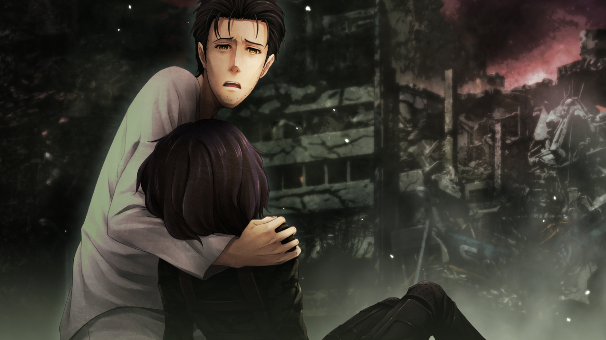

# 盟誓的文艺复兴 - 04
> 1.055821  
> [ 2036/03/07 ] 幼时的篝来访，冈伦与她交谈，但没有说出自己的名字。桶子把冈伦醒来的消息通知真由理等人，结果发现她们中计外出寻找食材，遭遇袭击。冈伦赶到现场。琉华子为保护众人重伤，在冈伦怀中去世。至死他都想再见冈伦一面，一直以为自己被排除在外，想要成为冈伦真正的伙伴。  

| [←prev](./0125) | [menu](../) | [next→](./0127) |

---

突然，外面传来敲门声，有人过来了。铃羽靠近了门。  
“你好萌好萌。”  
“心动动。”  
还是那个毫无紧迫感的暗号，铃羽把门锁打开，进来的是一位年幼的少女。  

“桶子叔叔，铃羽姐姐，嘟嘟噜\~♪”  
“篝，我不是说过，除了有要紧事不要来这里吗？”  
篝……这个孩子，是小时候的篝吗？  
“对不起……但是妈妈她们都出门了，没有回来嘛。”  
“嘛嘛，也没必要那么指责她啦。”  
“爸爸又这么惯着她，这种事情不好好说清楚不行。”  
无视和 25 年前没什么变化的父女，我的目光看向了篝。篝也好像注意到了我。  
“你好。”  
“……你好。”  
“叔叔是谁？”  
“我吗？我是……啊对，我是你妈妈的朋友。”  
思考了半天该怎么说，结果我还是没有说出我的名字。  
“真由理妈妈的？”  
“啊啊，是的……”  
“诶……”  
“妈妈温柔吗？”  
“嗯！”  
“喜欢妈妈吗？”  
“嗯！最——喜欢了！！”  
“这样啊……”  
看篝的表情，喜欢的感情像是要满溢出来。真由理一定很耗费心血在培养她吧。她一直以来都接受着真由理满满的爱。但是……她会在这之后跳往过去，和最喜欢的真由理妈妈分别，一个人在过去的世界里……然后被他们抓住，被当作实验品。  

“话说爸爸，叔叔已经醒了的事，你告诉真由姐她们了吗？”  
“啊，不好！完全忘记了，得早点告诉她们！”  
桶子取出了小型无线通讯器一类的东西。  
“这里是『巴雷尔·提托』，请回答，这里是『巴雷尔·提托』。”  
“这里是『与星尘的握手』，请讲。”  
扬声器传出来的，正是真由理的声音。虽然和那个时候比起来，声音要沉着一些，但这肯定是真由理的声音没有错。说起来，『与星尘的握手』什么的……  
“妈妈——！”  
“啊，篝酱，在桶子叔叔那里吗？”  
“嗯。”  
“叔叔他有非常重要的事情要做，不要老是打扰他哦？”  
“好——”  
“比起这事，真由喜，有一条特别新闻！”  
“特别新闻？”  
“啊啊……用心听好，冈伦他……醒来了。”  
“啊……!真的吗？真的……冈伦他……？”  
“怎么了吗，真由喜？”  
“冈伦……冈伦他……”  
“难不成，冈部先生他……醒来了吗！？”  
“真的！？冈伦他，起来了喵！？”  
无线电的另一侧，陆续传来了过往熟悉的声音。从声音上感觉，我所知道的大家还真是没怎么变。  
“所以，你们三人，还是快点回来的好。”  
“呜……”  
“真由喜？怎么了，真由喜！？”  
“没事，真由喜因为太高兴，发不出声音了喵。”  
“嘛，也没办法，毕竟最希望冈伦复活的，正是真由喜啊。  
 总之，大家赶快先回来。”  
“了解喵，取得食材后马上就回来。”  

在喜悦的声音中，我偶然注意到铃羽的表情充满阴郁。  
“……怎么了，铃羽？”  
“为什么……真由姐他们，要出去找食材？明明今天是没有预定的……”  
“诶？”  
“不是喵，确实是今天啊，昨天晚上来过联络……”  
“……糟糕！那是陷阱！大家，现在马上回——”  
“呀啊！？”  
铃羽的话，被扬声器那边的悲鸣盖过了。  
“怎么了！？发生什么事了！？”  
“我们被袭击了！敌袭——！”  
“可恶——！！”  
“真由理酱！菲莉丝！快点逃！这里由我来处理！”  
“但是，这样的话琉华喵就！”  
“我没问题的，快！”  
“不可以，琉华君！！”  
“琉华喵！！！”  
“爸爸！！”  
“哦！！”  
桶子向最早跑起来的铃羽追去。  
“等一下，桶子！我也一起去！”  
“但是……冈伦，你的身体……”  
“……让我去吧。拜托了……”  
桶子稍微停了一下，犹豫了一瞬，马上点点头，让我扶着他的肩膀。虽然桶子的身材比起以前要瘦削了不少，但体格还是那么庞大。我以他的肩膀作为支撑，紧追在铃羽后面。  

在桶子的支撑下走了一段时间，终于看见了几个人影。或许前方正在进行着激烈的战斗——虽然做好了这样的觉悟，但周围却一片寂静。在对面的方向，有几个士兵装扮的人倒在地上。铃羽站在前方，还有两个女人蹲在她旁边。然后，在她们的脚边——  
“唔……”  
“琉华……子……”  
只要看一眼就明白了，那里躺着的琉华子。  
“冈……伦……？”  
“冈伦……琉华喵……琉华喵他……” 
真由理和菲莉丝原本正注视着倒在地上的琉华子，见我过来抬起了脸庞。她们都是一副饱经风霜的憔悴模样。  
“啊……啊……”  
“冈部……先生……？”  
虽然变得精悍了许多，但那幅柔和得像女性一样的面容还没有变。琉华子用他已经无法聚焦的双眼看向了我。  
“琉华子……”  
“真的是…冈部先生……吗？”  
“啊啊……琉华子……是我……”  
“呵呵……这种称呼方式……看来是真的冈部先生了……咳！”  
琉华子咳嗽了几下，嘴角留下了鲜红的血。在他的右胸，鲜血还在流淌着，染红了衣服，并在地面上扩散开来，一看就知道是致命伤。  
“太好了……刚刚的话……看来不是，骗人的呐……”  
“啊啊……多亏了你们，我才能这样醒来……谢谢……”  
琉华子的手像是要抓住什么的样子伸向空中。也许在他的眼中，已经看不到我的身影了。我握住的那只手，以惊人的速度冷了下来。  
“冈、部……先生……”  
“怎么了？”  
“我……做到了……”  
“啊啊……”  
“多亏了……凶真师傅教的……清心斩魔流……才能，保护真由理酱……与大家……”  
“啊，嗯……”  
“我……成为……伙伴，了吧……？  
 成为了……大家……真正的伙伴，是吧……？”  
“笨蛋……你从一开始就一直是……我们的伙伴啊……”  
琉华子冰冷的手伸了过来，抚上了我的脸颊——然后露出了灿烂的笑容。  
“……诶嘿嘿……真高兴啊……”  
说完这句话，霎时，我脸上的触感消失了。  
“琉华子！琉华子！？”  
“琉华……君……？”  
冰冷的手无力地垂落在满是瓦砾的地面上。  
“啊……啊……”  
“琉华喵！！！”  
他就这样不再动弹了。  
“啊……啊啊……”  
“怎么……会这样……”  
“……太好了，琉华君一直想见冈伦呢。最后能见上一面，真的是，太好了……”  
太好了……？这叫太好了？这种结局？真由理这句话，终于让我明白了，在我沉睡的这 25 年里，他们到底经历了多么残酷的、犹如地狱般的时间。  
“漆原琉华……你刚刚的战斗，真的很出色……我们，因为你得救了……谢谢你，请安息吧……”  
“咕……这种、这种事，太过分了……  
 呜……啊啊啊啊啊啊啊啊——!”  

 

> (to be continued)
---

| [←prev](./0125) | [menu](../) | [next→](./0127) |
