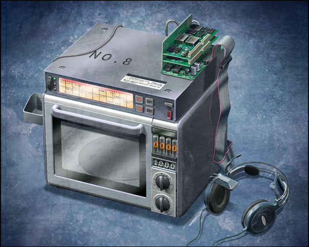

# 盟誓的文艺复兴 - 05
> 1.055821  
> [ 2036/03/07 ]冈伦终于亲身体验到了自以为知道却始终没有正视的 β 世界线未来战争的地狱，意识到了自己的一直以来的自以为是与自我欺骗，实际上谁都没能拯救，只有自己得救。冈伦收到了 2025 年的自己的口信，要将红莉栖从『Amadeus』的诅咒中解放出来。他终于下定决心，通过桶子和真帆一直精心维持的时间跳跃环境，进行近 3000 次的时间跳跃回到过去。这部分，游戏的处理是直接一个转场带过，不如动画处理得燃。跳跃回过去的方案是桶子提出的，和真帆共同维护的；动画处理为冈伦自己意识到时间跳跃装置的存在，是因为衔接的是前文时间跳跃的剧情。游戏里真帆主动提出自己改良了时间跳跃的长度，要冈伦以后替她向红莉栖炫耀。并且游戏中当前世界线应该没有『Amadeus』的“红莉栖”，只有记忆备份。  

| [←prev](./0126) | [menu](../) | [next→](./0128) |

---

“真由喜怎么样了？”  
“哭累了正在睡着呢。”  
“没办法啊，真由喜和琉华氏一直都是很好的朋友……”  
“唔……琉华哥！”  
琉华子……死了。为了保护真由理和菲莉丝而牺牲了。  
“唔……!”  
他的死亡，与我脑海中不断重复的真由理的死亡重叠在了一起。在我怀中逐渐冰冷下来的真由理，然后是琉华子。无论到哪里都是这样，真由理也是，琉华子也是，然后红莉栖也是。大家都死了，死了！  
“因为这场战争，非常多的人死去了。  
 小学的朋友、初高中的朋友、还有大学的朋友……  
 亲戚、老师、认识的人、大人和小孩们，还有……重要的人……  
 非常多……真的是非常多的人死去了……”  

我知道的。不——我一直都**以为**自己是知道的。不到达命运石之门的话，留在 β 世界线的话，全世界迟早会被战火所笼罩。这是听说过无数次的事了。那会是一个怎样的未来，**我一直以为自己知道**。但那只不过是，遥远的未来罢了，没有半点现实感，有的，只是想象罢了。我曾经经历过数百次、数千次的噩梦，原以为没有比那再糟糕的地狱了。但是像这样，亲眼看到、亲耳听到、亲身体会的现在，让我知道了那些都并非只是想象。堆积如山的死尸；成群的饥不择食的野狗；倒下的士兵；炙烤过的肉味；腐烂的内脏味；现在仍然残留在手上的，琉华子的血的温度；真由理的血的温度；红莉栖的血的温度……我想着只要拯救了真由理就行了，对红莉栖见死不救，逃避现实，即使如此，我还以为至少拯救了真由理他们。但是，**到最后我谁也没能拯救，获得拯救的，只有我自己罢了**。自己，只有我自己得救了，其他人谁都没能拯救。红莉栖也是，真由理也是，篝也是，琉华子也是。我谁都没能拯救。  

“把红莉栖从『Amadeus』的诅咒中解放出来吧。”  
“诶？”  
“这是 2025 年的冈伦，留下的口信……”  
“我留下的……口信……？”  
“11 年前的冈伦是这样说的：
 ‘寻找 *STEINS;GATE* 这条世界线的道路是凶险的。  
 只是重复一次两次，是不可能找到方法的吧。  
 但是，  
 **从那时开始，我们做的所有事情，不是都会成为通往命运石之门的道路吗——**  
 **无数的未来，不是都与过去连接在一起吗——**  
 所以，  
 **我们现在所处的世界，并不是无用的，一定也是必要的**。  
 至少现在的我是这么认为的。  
 当然，我也不是说这个世界继续这样下去就好。’”  
“桶子……”  
“所以说啊，冈伦，再回去重新思考一次吧？回到你记忆中断的那段时间里……”  
“回到 2011 年……吗？但是，那种事……”  
镜子里，映照着多了几分沧桑的我。  
“再说，以这样的姿态回去，我能做什么……？”  
“做得到哦。”  
无线电里又传来了有些熟悉的声音。  
“好久不见呐，冈部先生，有 11 年了吧。”  
“比屋定吗……？”  
“往房间里面看。”  
像是为了配合这句话，桶子不知何时站到了房间深处，一个光线昏暗的角落。突然的亮光照明了镇座在那个角落的物体——  

“电话微波炉（暂定）……”  
“是我根据你和桥田先生的描述制作出来的哟。看，也配上了 VR 耳机哦。”  
“因为想着可能会有这种事，飘升机也准备好了。”  
“……”  
桶子和我进一步说明了，在我失去意识的这 11 年里，他们一直维持着让我可以“接收”时间跳跃的环境。原来如此啊……就算我没有意识，只要预先在我太阳穴附近设置好自动受信装置，这样就可以了。2025 年我倒下后，这具身体，一直都是真由理他们照顾的。桶子和真帆，在 11 年前就预想到了这件事吗？或者说，这也是 2025 年的我留下的后手吗？  
“不断改良后的结果，可以跳跃的时间延长到了 336 小时。”  
“336 个小时……两周吗。”  
“可是，只能这样跳跃到中途。  
 因为是 10 年前改良的时间跳跃装置，所以再往前还是只能跳跃 48 小时。”  
也就是说，想要回到 2011 年 1 月末，简单计算下——怎么说也要近 3000 次的时间跳跃……  
“这将会是前所未有的艰辛旅程。就算这样你还要回去吗……”  
“……”  
近 3000 次的时间跳跃——究竟现在的我能够做到吗？  
“累了的话，在途中休息一下就好。”  
“桶子……”  
“没问题的。不管到了什么时间，我们都一定会在的。”  
“比屋定……”  
“我呐……感到后悔……  
 因为『Amadeus』，那孩子死后还被这么多怀有邪念的人所利用……  
 几年……几十年……  
 所以我也拜托你……把那孩子……把红莉栖从丑恶的欲望漩涡中解放出来……  
 拯救红莉栖……能做到这件事的，冈部先生……只有你了……”  
“……”  
我不知道，现在的我能不能做到；也不能保证，接下来的道路一定会通往命运石之门。尽管这样——  
“再重新……思考一次吧……”  
我能做到什么？我应该做什么？  

“二位……拜托了！”  
“*Okey-dokey!*”  
听到我的回答，桶子迅速地开始准备。  
“冈部先生。”  
“嗯……？”  
“如果可以的话，下次见到红莉栖时帮我带句话：  
 ‘未来的我制作的时间跳跃装置，可以跳跃的时间是你的 7 倍哟！’”  
“……我知道了。”  
见到红莉栖的话——  
“冈伦，这边的准备已经 OK 了！”  
“真快呐。”  
“毕竟我一直都在维护呐。”  
“真不愧是你啊。”  
“还好啦。”  
电话微波炉（暂定）和 VR 耳机，和我在 LAB 里见到的多少有点不同，但毫无疑问，是我们的未来机械……  
“啊但是，不和真由姐她们说一声没关系吗？”  
“……现在不进行跳跃的话，决心就要减弱了。  
 而且，就算现在不见，总还会见到的，在过去的世界里……”  
“说的也是。”  
我从咧嘴笑着的桶子手里接过 VR 耳机，戴在了头上。  
“那么，就这样。两周前再见吧。”  
“啊啊，两周前再见。”  
“保重啊。”  

然后——  
我再一次地跳跃到过去——  
那是，非常非常漫长的——  
漫长到难以想象的旅途。  

 

> (to be continued)
---

| [←prev](./0126) | [menu](../) | [next→](./0128) |
