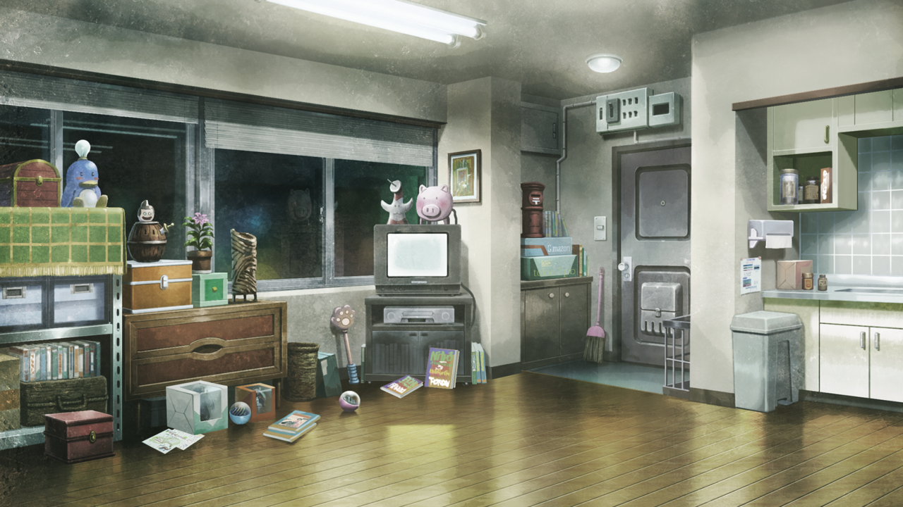

# 盟誓的文艺复兴 - 06
> 1.055821  
> [ 2036/??/?? ] 幼时的篝来访，冈伦与她交谈，但没有说出自己的名字。桶子把冈伦醒来的消息通知真由理等人，结果发现她们中了陷阱外出寻找食材，遭遇袭击。  

| [←prev](./0127) | [menu](../) | [next→](./0129) |

---

突然，外面传来敲门声，有谁过来了的样子。铃羽靠近了门。  
“你好萌好萌。”  
“抓住我的心。”  
“还是那个毫无紧迫感的暗号，铃羽把门锁打开。打开了门，进来的是一位年幼的少女。”  

“桶子叔叔，铃羽姐姐，嘟嘟噜\~”  
“篝，我不是说过这里除了有要紧的事情都不要来吗。”  
“篝……”  
“这个孩子，是小时候的篝吗！”  
“对不起。但是妈妈她们大家出门了没有回来嘛。”  
“嘛嘛，也没必要那么指责她啦。”  
“爸爸又这么惯着她，这种事情不好好说的话是不行的。”  
“无视和 25 年前没什么变化的父女，我的目光看向了篝。”  
“篝也好像注意到了我。”  
“你好。”  
“……你好。”  
“叔叔是谁？”  
“我吗？我是……”  
“……？”  
“是这样啊……是你的妈妈的朋友。”  
“思考了半天该怎么说，结果我还是没有说出我的名字。”  
“真由理妈妈的？”  
“啊啊，是的……”  
“诶……”  
“妈妈温柔吗？”  
“嗯！”  
“喜欢妈妈吗？”  
“嗯，最——喜欢了！！”  
“这样啊……”  
“从篝的表情上看，喜欢的感情像是要满溢出来。”  
“一定是真由理很耗费心血培养起来的吧。”  
“一直以来，满满的接受着真由理的爱。”  
“但是……”  
“但是她会在这之后跳往过去。”  
和最喜欢的真由理分别，一个人在过去的世界里……然后被他们抓住，被当作实验品。  

“说起来啊爸爸，告诉真由姐她们了吗？叔叔已经醒了的事情。”  
“啊，不好！完全忘记了，得早点告诉她们！”  
“桶子取出了小型无线机一样的东西。”  
“这里是『巴雷尔·提托』。请回答，这里是『巴雷尔·提托』。”  
“这里是『与星尘的握手』。请讲。”  
“扬声器传出来的，正是真由理的声音。”  
“虽然和那个时候比起来，声音要沉着一些，但这肯定是真由理的声音没有错。”  
“说起来，『与星尘的握手』什么的……、。”  
“妈妈——！”  
“啊，篝酱。在桶子叔叔那里么？”  
“嗯。”  
“叔叔他有非常重要的事情要做，不要老是打扰他哦？”  
“好——的。”  
“比起这样的事，真由喜。有一条特别新闻！”  
“特别的新闻？”  
“啊啊……用心听好。冈伦他……醒来了。”  
“……!。”  
“真的，么？真的……冈伦他……？”  
“怎么了么，真由喜！？”  
“冈伦……冈伦他……”  
“难不成冈部先生他……醒来了么！？”  
“真的！？冈伦他，起来了喵！？”  
“无线电的另一侧，陆续听到了过往熟悉的声音。”  
“从听到的声音上感觉，我所知道的大家还真是没怎么变。”  
“所以，你们三个人，还是快点回来的好。”  
“…………”  
“真由喜？怎么了，真由喜！？”  
“不行。真由喜因为太高兴，发不出声音了。”  
“嘛，也没办法。毕竟最希望冈伦复活的，正是真由喜啊。”  
“真由理……”  
“不管怎么说，大家赶快先回来。”  
“了解了。取得食材后马上就回来。”  

“在喜悦的声音中，偶然发现，充满着阴郁表情的铃羽。”  
“……怎么了，铃羽？”  
“……为什么，真由理姐姐他们，要出去找食材？明明今天是没有预定的……”  
“诶？”  
“不是这样的。确实是今天，昨天晚上来了联络说……”  
“……糟糕！那是陷阱！大家，现在马上回——”  
“呀啊！？”  
“铃羽的话，被扬声器那边的哀叫声盖过了。”  
“怎么了！？发生什么了！？”  
“我们被袭击了！敌袭——！”  
“可恶——！！”  
“真由理酱！菲莉丝！快点逃！这里由我来处理！”  
“但是，这样的话琉华喵就！”  
“我的话没问题的，快！”  
“不可以，琉华！！”  
“琉华喵！！！”  
“爸！”  
“哦！！”  
“桶子去追一早就跑了的铃羽。”  
“等一下，桶子！”  
“我也一起去！”  
“……但是，冈伦，你的身体……”  
“……让我去吧。拜托了……”  
“桶子稍微停了一下，犹豫了一瞬，马上点了点头，让我扶着他的肩膀。”  
“虽然桶子的身材比起以前要瘦削了不少，但体格还是那么庞大，我以他的肩膀作为支撑，紧追在铃羽后面。”  

 

> (to be continued)
---

| [←prev](./0127) | [menu](../) | [next→](./0129) |
