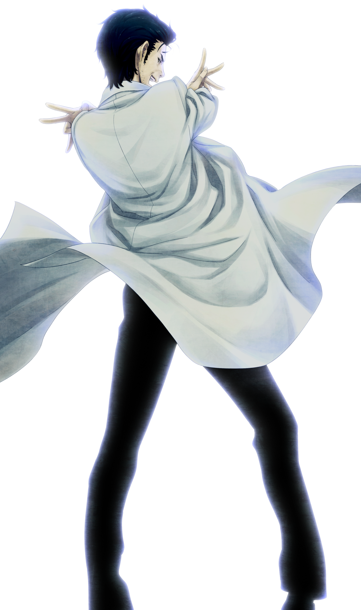

# 盟誓的文艺复兴 - 07
> 1.055821  
> [ 2036/03/07 ] 冈伦赶到现场。琉华子为保护众人重伤，在冈伦怀中去世。至死他都想再见冈伦一面，一直以为自己被排除在外，想要成为冈伦真正的伙伴。冈伦终于亲身体验到了自以为知道却始终没有正视的 β 世界线未来战争的地狱，意识到了自己的一直以来的自以为是与自我欺骗，实际上谁都没能拯救，只有自己得救了。  

| [←prev](./0128) | [menu](../) | [next→](./0130) |

---

“在桶子的支撑下走了一段时间，看见了几个人影。”  
“或许在那里，正在进行着激烈的战斗——虽然做好了这样的觉悟，但周围却一片寂静。”  
“在对面的方向，有几个像是士兵一样的人倒在地上。”  
“铃羽站在前方。”  
“在她旁边蹲着的，还有两个女人。”  
“然后，在她们的脚旁——”  
“唔……”  
“琉华……子……”  
“只要看一眼就明白了。”  
“在那里躺着的琉华子。”  
“……冈…伦……？”  
“窥视着倒在地上的琉华子的两人，把脸庞抬了起来。”  
“冈伦……琉华喵……琉华喵他……”  
真由理和菲莉丝，都是一副饱经时光的憔悴的样子。  
“啊……啊……”  
“冈部……先生……？”  
“虽然变得精悍了许多，但那幅柔和的像女性一样的脸庞还是没有变。”  
“琉华子目光的焦点聚在了我身上。”  
“琉华子……”  
“真的是…冈部先生……么？”  
“啊啊……琉华子……是我……”  
“嘿嘿……这种称呼方式……看来是真的冈部先生了……咳！”  
“咳嗽的琉华子嘴边，留下了鲜红的血。”  
“琉华子右胸流出的血染红了衣服，并在地面上扩散开来。”  
“一看就知道是致命伤。”  
“太好了……刚刚的话……看来不是，骗人的呐……”  
“啊啊……多亏了你们，我才能这样醒来…谢谢……”  
“琉华子的手像是要抓住什么的样子伸向空中。”  
“也许在他的眼中，已经看不到我的身影了。”  
“和我握着的手，以惊人的速度冷了下来。”  
“冈，部……先生……”  
“怎么了？”  
“我……做到了……”  
“啊啊……”  
“多亏了……凶真先生教的……清心斩魔流……才能，保护真由理酱…与大家……”  
“啊，嗯……”  
“我……成为了……伙伴，是吧……？”  
“成为了……大家……真正的伙伴，是吧…..？”  
“笨蛋……你从一开始就一直是……我们的伙伴啊……”  
“琉华子冰冷的手伸了过来，碰到了我的脸颊——”  
“然后露出了灿烂的笑容。”  
“……诶嘿嘿……真是高兴啊……”  
“说着这样的话。”  
“霎时。”  
“脸上的触感消失了。”  
“琉华子！琉华子！？”  
“琉华…君…？”  
“冰冷的手就这么落在了满是瓦砾的地面上。”  
“啊……啊……”  
“琉华喵！！！”  
“就这样不再动弹。”  
“啊……啊……”  
“怎么……会这样……”  
“……太好了。琉华君，一直就想见冈伦呢。最后能见上一面，真的是，太好了……”  
“太好了……？”  
“说这太好了……？”  
“这种结局 ……？”  
“真由理的这句话，终于让我知道在我沉睡的这 25 年里他们到底经历了多么残酷的，犹如地狱般的时间。”  
“漆原琉华……刚刚你的战斗，真的很出色……我们，被你救了……谢谢你，请安息吧……”  
“…………”  
“咕……这种，这种事情，太过分了……”  
“唔，啊啊啊啊啊啊啊啊……!。”  

“真由氏怎么样了？”  
“因为哭累了正在睡着呢。”  
“没办法啊。真由氏和琉华氏一直都是很好的朋友……”  
“唔……琉华哥！”  
“琉华子……死了。”  
“为了保护真由理和菲莉丝，不幸地去世了。”  
“唔……!。”  
“他的死亡，与真由理的死亡重叠在了一起。”  
“在我手中不断冰冷下来的真由理。”  
“然后是琉华子。”  
“无论到哪里都是这样。”  
“真由理也是。”  
“琉华子也是。”  
“然后红莉栖也是。”  
“大家都死了。”  
“因为这个战争，非常多的人死去了。”  
“小学的朋友，初高中的朋友，还有大学的朋友……”  
“亲戚，老师，认识的人，大人和小孩们，还有……最重要的人……”  
“…………唔。”  
“非常多的……真的是非常多的人死去了……”  
“我知道的。”  
“不——我一直都认为自己是知道的。”  
“如果不找到命运石之门的话。”  
“在 β 世界线的话，全世界会被战火所包围。”  
“这是听说过无数次的事了。”  
“那会是一个怎么样的未来，我一直以为自己知道。”  
“但那只不过是，遥远的未来罢了。”  
“没有一点的现实感。”  
“有的，只是幻想。”  
“在那里有的只是是没有半点现实感的，漠然的想像。”  
“曾经被我数百次，数千次经历的噩梦。”  
“我原以为没有比那再糟糕的地狱了。”  
“但是像这样，亲眼看到，亲耳听到，亲身体会的现在，让我知道了那些都只是幻想。”  
“堆积如山的死尸。”  
“成群饥不择食的野狗。”  
“倒下的士兵。”  
“烟熏过的肉味。”  
“腐烂的内脏味。”  
“现在仍然残留在手上的，琉华子的血的温度。”  
“真由理的血的温度。”  
“红莉栖的血的温度。”  
“我想着只要去救真由理。”  
“对红莉栖见死不救，逃避现实，我以为救到了真由理他们。”  
“但是，到最后我谁也没能救到。”  
“要说有谁获得拯救的，只有我自己罢了。”  
“自己，只有自己得救了。”  
“别人谁都没救到。”  
“红莉栖也是。”  
“真由理也是。”  
“篝也是，琉华子也是。”  
“谁都没能救到。”  

 

> (to be continued)
---

| [←prev](./0128) | [menu](../) | [next→](./0130) |
