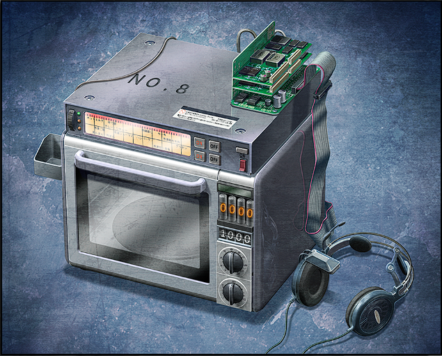

# 盟誓的文艺复兴 - 08
> 1.055821  
> [ 2036/03/07 ] 冈伦收到了 2025 年的自己的口信，要将“红莉栖”从『Amadeus』的诅咒中解放出来。他终于下定决心，通过桶子和真帆一直精心维持的时间跳跃环境，进行近 3000 次的时间跳跃回到过去。这部分，游戏的处理是直接一个转场带过，不如动画处理得燃。  

| [←prev](./0129) | [menu](../) | [next→](./0131) |

---

“把‘红莉栖’从『Amadeus』的诅咒中解放出来吧。”  
“诶？”  
“是 2025 年的冈伦，留下的口信……”  
“我的……口信……”  
“寻找命运石之门这条世界线的道路是凶险的。只是重复上一次两次，是不可能找到方法的吧。”  
“但是，从那开始发生的事情，不是会成为通往命运石之门的道路吗——”  
“许多个未来的前方，不是会和过去连接在一起吗——”  
“11 年前，冈伦你是这样说的。”  
“把“红莉栖”解放出来……”  
“所以说，我们所在的世界并不是无用的。一定是必要的世界。至少现在我是这么认为的。”  
“当然，也肯定不能说这样就好。”  
“桶子……”  
“所以说，冈伦。再回去重新考虑一下不好吗？回到冈伦记忆中断的那段时间里，呐……”  
“回到 2011 年…么？但是，那种事……”  
“镜子里，映照着多了几分沧桑的我。”  
“第一，以这样的姿态回去，我能做到什么…？”  
“做得到哦。”  
“发现无线电那边有声音传了出来。”  
“好久不见呐，冈部先生。有 11 年了吧。”  
“比屋定小姐么…..？”  
“往房间里面看。”  
“像是在回答这句话一样，桶子不知何时站到了房间深处的，一个光线昏暗的角落。”  
“突然的亮光照明了镇座在那一角的东西——”  

“电话微波炉（暂定）……”  
“在听你和桥田先生描述过后制作出来的哟。看，不是也准备了 VR 耳机么？”  
“因为想着会有这种事，飘升机也准备好了。”  
“…………”  
“桶子进一步和我说明了，在我没有意识的这 11 年里，他一直在维持可以“接收”时间跳跃的环境。”  
“原来如此啊……”  
“就算我没有意识，只要预先在我太阳穴附近设置好自动受信装置，这样就足够了。”  
“在 2025 年我倒下后，这幅身体，一直都是由真由理他们照顾的。”  
“桶子和真帆，在 11 年前就预期了这件事。”  
“也许，这也可能是 2025 年我的指点吧。”  
“不断改良后的结果，可能的跳跃时间延长至 336 个小时。”  
“336 个小时……两周么。”  
“可是，这是途中才改的。改良这台机器是 10 年以前，所以在那之前仍然只能跳跃 48 小时。”  
“也就是说，想要回到 2011 年 1 月末的话，单纯计算一下——怎么说也要近 3000 次的时间跳跃……”  
“这将会是前所未有的艰辛的旅程。就算这样你还要去的话……”  
“…………”  
“将近 3000 次的时间跳跃——究竟现在的我能够做到吗？”  
“累了的话，在途中休息一下就好。”  
“桶子……”  
“没问题的。不管到了什么时间，我们都一定会在的。”  
“比屋定……”  
“我呐……感到后悔……  
因为『Amadeus』，那孩子死后还被这么多怀有邪念的人所利用……  
 几年……几十年……  
 所以我也拜托你……把那孩子……‘红莉栖’从丑恶的欲望漩涡中解放出来……  
 救救红莉栖……能做到这件事的，冈部先生……只有你了……”  
“…………”  
“我并不知道现在的我能不能做到。”  
“而且也并不能保证，接下来的道路一定会通往命运石之门。”  
“尽管这样——”  
“再一次，考虑，么——”  
“我能做到什么。”  
“我应该做什么。”  
“二位，拜托了……”  
“okey dokey！”  
“一听到回答，桶子就开始快速地着手准备了。”  
“冈部先生。”  
“……？”  
“如果可以的话，下次遇到红莉栖的时候和她说，“未来的我，可是做出了可以跳跃的时间是你的 7 倍的机器哟”。”  
“……我知道了。”  
“见到了红莉栖的话——”  
“冈伦。这边的准备已经 OK 了！”  
“真是快呐。”  
“毕竟一直都在维护呐。”  
“真不愧是你啊。”  
“还好啦。”  
“电话微波炉（暂定）的 VR 耳机。”  
“这个和我在 LAB 里见到的，多少有点不同，但那是我们的未来道具这点是毫无疑问的……”  
“啊，但是不和真由理姐她们说的话没问题么？”  
“……现在不进行跳跃的话，决心就要被钝化了。”  
“而且，就算现在不见，总是会见的。在过去的世界里……”  
“说的也是。”  
“从扬着嘴角微笑的桶子那里接过 VR 耳机，装在了头上。”  
“那么，就这样。两周前，再见吧。”  
“啊啊，两周前再见。”  
“保重啊。”  

然后——  
我再一次地跳跃到过去——  
那是，非常非常漫长的——  
漫长到难以想象的旅途。  

 

> (to be continued)
---

| [←prev](./0129) | [menu](../) | [next→](./0131) |
