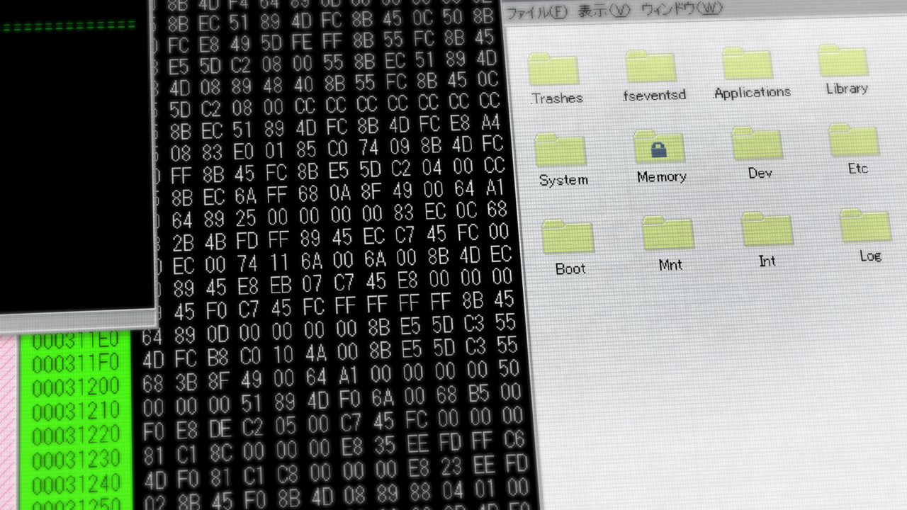

# 盟誓的文艺复兴 - 09
> 1.055821  
> [ 2011/02/01 ] 桶子入侵了大学和 STRATFO 的服务器，发现大学的『Amadeus』数据不见了，并且多了加密的文件夹；STRATFO 一直在进行记忆移植的人体实验，最近还在准备新的实验，可疑的是在其服务器中并未发现疑似红莉栖记忆的数据。  

| [←prev](./0130) | [menu](../) | [next→](./0132) |

---

“桥田先生……你真厉害啊……”  
过了 30 分钟，我听到电脑前的真帆发出感叹。  
“成功了吗？”  
“我出马这种就是小事一桩。”  
“超级黑客果然名不虚传。赶紧搜索『Amadeus』的数据吧。”  
“稍等，正在打开……”  
听着鼠标点击声，我咽了咽口水看向屏幕。  

“……没有，『Amadeus』和红莉栖的记忆数据，都从原来的位置中消失了……”  
“难道已经被转移了吗……”  
等等……我拿出手机，解锁到主界面，『Amadeus』的图标还在原来的位置。  

“你看……你觉得通过这个 APP 可以连上『Amadeus』吗？”  
真帆看向我的手机画面。  
“不知道……『Amadeus』的数据已经不在服务器里的话，理论行是不行……但可以试试。”  
不过这时我却有些犹豫。  
“怎么了？”  
“考虑到如果真的能连上的话……得谨慎行事。”  
“是呢……也许有人在监视。”  
“嗯？”  
“怎么了，桶子？”  
“这里……有个额外加密的文件夹……”  
“哪个？”  
真帆探过身子看向屏幕，画面中一个叫 “Memory” 的文件夹额外加了锁。  
“……奇怪，这种文件夹……之前都没有的……”  
“好像安全措施很高级，和刚才的不是一个级别。”  
“难道『Amadeus』被移到了那里？”  
“但会是谁做的？有那种权限的，就只有雷斯吉宁教授。”  
“雷斯吉宁教授有另外的身份，或者是教授遇到了什么事……”  
虽然两种情况都不是很乐观。  

“桶子，那个文件夹先别动，接下来要入侵 STRATFO 的服务器。”  
“诶？STRATFO 是那个……为什么是 STRATFO？”  
“它恐怕和这次的骚动有关。你以前也入侵过，应该很简单吧？”  
“话说冈伦你怎么连这种事都知道？超能力？”  
“你以为我是谁？狂气的疯狂科学家早已看穿了一切。”  
“稍等——”  
桶子一边说一边向电脑输入什么。”  
“STRATFO 的服务器……嗯……好了。”  
不愧是曾经骇入过，这次要比入侵大学服务器的速度快多了。  
“找那个『Amadeus』的系统数据就行了吧？”  
“等一下！”  
真帆夺过桶子的鼠标，点开了某个文件夹，里面似乎是很多文档。  

“这个是报告……”  
真帆一个个地打开文档，当然内容是英文，所以我和桶子读不懂。  
“这是……！？”  
“到底是什么报告？”  
“实验……STRATFO 进行的人体实验。”  
“人体……实验……”  
“看来 STRATFO 一直在进行记忆移植的实验。  
 已经进行过好多次实验，将某人的记忆移植到另一人身上并使其稳定。”  
把记忆数据移植给他人的实验……那是——  
“最开始用的还是动物，最后就用了活生生的人……  
 似乎是找来了无依无靠的人作为实验体。无论年龄、人种……”  
说完这些，真帆再次看向报告。  
“怎么了？还有别的吗？”  
“看来他们正计划着新的记忆移植实验……”  
实验目的想必和时间机器有关。他们为获取时间机器相关情报，试图打开红莉栖的记忆黑匣子。不必通过『Amadeus』获取密码，也不必得到笔记本和硬盘，只要能够直接从记忆中抽取时间机器的相关信息，就能得到想要的一切。也就是和之前的世界线上，篝遭遇的事相同——不，是更进了一步。  
“总是现在要优先找到红莉栖的记忆数据。桶子，有看起来疑似的数据么？”  
“嗯……”  
桶子拿回鼠标，表情严肃地搜索着。  
“不……没有，没有看到类似的东西。”  
怎么回事？难道不是 STRATFO 从维克多·孔多利亚大学夺走了『Amadeus』的数据？  
“最可疑的果然还是大学的服务器吧，那个上了锁的文件夹。”  
也就是说……他们在没有夺得数据的情况下，还是要搞些什么？是和我们一样入侵过了？还是……  
“怎么办？”  
“……相信真帆吧。桶子，能入侵吗？”  
“可以是可以，但这个要费一番功夫了……”  
“大概要多久？”  
“不清楚……搞不好要花半天以上……”  
桶子都这么说，也就是说安全措施做得相当严密吧。  
“而且，如果入侵中途暴露就全完了。”  
要删除红莉栖的记忆数据，入侵是必要条件。在桶子的入侵完成之前，必须要把 STRATFO 的注意力引向别处。问题是要怎么引……  

“和『Amadeus』通信时，这边的位置信息会怎么样？”  
“会全部暴露，当然也会暴露给那些掌握『Amadeus』程序本体的人。”  
果然如此。  
“问题是能否连上『Amadeus』……”  
先试试这个 APP 还能不能用吧。如果能连上的话……我想到了个点子。  
“真帆，我有个不情之请。”  

 

> (to be continued)
---

| [←prev](./0130) | [menu](../) | [next→](./0132) |
