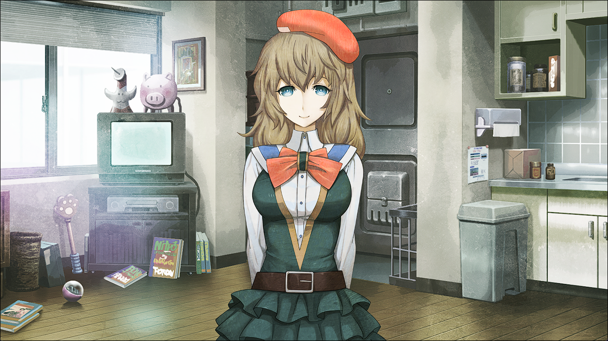

# 盟誓的文艺复兴 - 10
> 1.055821  
> [ 2011/02/02 ] 

| [←prev](./0131) | [menu](../) | [next→](./0133) |

---

“行动开始后过个将近一天。桶子还没有成功解锁文件夹。幸运的是到现在还没有被对方察觉的迹象。但也不能就此安心。桶子忙着的期间，我完成了现在我能做的事，之后就交给真帆了。因为我的行动，也许未来已经发生了改变。但即使如此该做的事还是要做。玲羽从刚才开始就一副如临大敌的表情抱着双臂。看上去沉着冷静，实则食指在不安分地划动着。  
“叔叔。没有什么我们能做的事吗？”  
“终于开始了回避第三次世界大战的行动，自己却什么也做不了，对此感到了自责。”  
明明想着要做什么不可，却只能等待。不耐烦，焦躁。但那也是这里的所有人都感到的情绪吧。  
“再等一会……桶子和真帆都在努力着……”  
“只要托给真帆的事完成后，我们就有事可做了。”  
“菲莉丝去买些甜品喵。累的时候吃甜的东西最好喵。”  
“啊，那我也——”  
“两人从沙发上站起来的同时，开发室的帘子被拉开。”  
“所有人都看向那里。真帆稍稍吓了一跳，马上又笑了笑，接着又摆出严肃的表情。 。”  
“真是的，能不能不要一次拜托别人这么多高难度的事啊。”  
“对不起……那……完成了吗？”  
“姑且按你说的完成了。”  
“里面的电子微波炉，已经连上了一个和半年前见过的不同的头戴装置。”  
“是曾经用来备份过我的记忆的那个的改装。”  
“因此才能在这么短时间内完成。”  
“时间跳跃装置。”  
“完成了吗……”  
“这样一来，未来的我跳到这里后又能往前跳 48 个小时了。”  
“还有这些也。”  
“真帆递过来两台手机。”  
“那正是为了接下来的战斗的秘密的道具。”  
“是请真帆追加开发的东西。”  
“是使用简单的 AI 来欺骗对方的模拟应答 APP 一类的东西。”  
“真是厉害。竟然能在这么短时间内做出 AI。”  
“你自己拜托的，还好意思说。”  
“真帆的脸色透出疲劳。”  
“因为有『Amadeus』使用的音声软件，借用那个缩短了开发时间。”  
“而且这也不是 AI 那种了不起的东西。”  
“用这种东西真能糊弄过去吗？对方可是“红莉栖”啊？”  
“只要争取到一点时间就够了。只要让他们的注意偏离桶子的入侵就行了。”  
“目的只是扰乱 STRATFO 的行动。”  
“不须要长时间的对话。”  
“而是要用短时间启动，然后马上挂掉通话这样的方法。”  
“好了，正戏现在要开始了。”  
“但在那之前——”  
“把已经打好的文字发给了桐生萌郁。”  
“按计划行事。”  
“发完后再次面向这里的所有人。”  

“那么，开始说明作战概要。”  
“玲羽，真由理、菲莉丝、琉华子。”  
“把真帆处得到的两台手机发给这 4 人。”  
“4 人分为 2 人一组。”  
“然后拿着这个手机在市内各处移动。”  
“各组间最好尽量分开。就一组走中央线，另一组走山手线吧。”  
“保持双方联络的同时，启动手机里装好的『Amadeus』APP 在。”  
“在桶子尝试入侵的那段时间里，我特意离开秋叶原，在东京站连接了『Amadeus』。”  
“然后连上了。”  
““红莉栖”应答了。”  
“虽然我马上挂断了，但不会有错。”  
“这个 APP 还能用。”  
“这是利用这个 APP 的作战。”  
“启动后要怎么办~？”  
“『Amadeus』是基于牧濑红莉牺这一人物的记忆做出来的人工智能。”  
“我们现在要去欺骗她。”  
“没错。我现在要做的就是欺骗“红莉栖”。”  
“接触『Amadeus』会向对方暴露这边的位置信息。”  
“反过来利用这点，就是我计划的作战。”  
“启动『Amadeus』的同时，另一个程序也会启动。”  
“另一个程序是什么喵？”  
“能点一下那个 S 形状的图标吗？”  
“那个……是这个喵？”  
“菲莉丝在手机上点了一下。”  
【喂喂，是我。】  
“哇，是冈伦的声音。”  
“和他说话试试。”  
“今天有什么事喵？”  
【没什么特别的事，只是想和你说下话。】  
“好棒。会自动回答呢……”  
“我拜托真帆制作的是，会选取会话中的单词和语句，对于特定类型的会话能够自动回答的装置——要说的话算是聊天机器人。”  
“冈伦和我的聊天机器人——名为『Salieri』。”  
“受那个有名的电影影响，萨列里这一人物总是充满了劣等感，容易被认为是个卑劣的人物，但实际却是一位杰出才俊。”  
“虽然这样对萨列里本人不太好意思，但现在不是纠结这种事的时候。”  
“启动『Amadeus』后，我们的聊天机器人就会自动回复。”  
“就是说……让对方认为正在说话的是冈部先生？”  
“正是如此。”  
“那样『Amadeus』就会深信我人在那个地方吧。”  
“本来还想准备更多的客户端，但『Amadeus』需要客户端认证，能够连接的客户端是有限的。”  
“只准备了我和真帆的两台，但短时间内应该够了。”  
“当然，真帆的手机上装的是真帆的“萨列里”。”  
“此外，我刚才还给萌郁发了个 RINE。”  
“按照计划，从那时起就会传出我和真帆手上有红莉栖的电脑和硬盘的消息。”  
“虽然是要进行记忆实验，但也不能让其他机关得到电脑和硬盘。”  
“他们得到这个消息后应该会迫不及待地来找我。”  
“『Amadeus』在他们手上。”  
“他们从『Amadeus』处获得我的位置信息后一定会前去那里找我。”  
“但实际上我们不在那里。”  
“不仅如此，下次又会有我们在别的地方出现的信息，再赶往那里……”  
“这样戏弄他们，来让他们注意不到服务器被入侵，这就是作战。”  
“以上就是这次的任务。”  
“全员点头。”  
“千万要记住，严禁长时间接触『Amadeus』。”  
“还有，挂掉『Amadeus』后，要马上离开那里。有任何异象都要马上联络我们。”  
“这些一定要做到。明白了吗？”  
“那个……我该做什么好？”  
“听着我们的话的篝，怯生生地举起手。”  
“他们认识你的脸。不要离开这里为好。”  
“但我也想贡献点什么啊。妈妈和大家都在努力，我却什么也做不了，我讨厌那样。”  
“头疼了……”  
“拜托了，冈伦先生。让我也帮忙吧。”  
“不是不明白篝的心情。”  
“但还是不能让她遭遇危险。”  
“对不住……”  
“篝酱。真有喜会连篝酱的那份一起努力的。所以听冈伦的话，好吗？”  
“妈妈……”  
“知道了。妈妈这么说的话……”  
“看来是接受了。”  
“叔叔。在一切结束之前，不应该把篝藏到什么地方去吗？”  
“是啊。但要藏哪里？”  
“要藏的话，琉华子家，或者菲莉丝家吗……”  
“要不到我的藏身处去？”  
“藏身处？你还有那种东西？”  
“打工用的有好几个呢。可以的话请便。”  
“好，决定了。篝也没问题吧？”  
“……好，知道了。”  
“问题是不能让篝单身一人……”  

“那个，能不能也让我做些什么？”  
“诶……”  
“突然听到玄关传来的声音，不知道什么时候由季站在那里。”  
“由季，小姐……”  
“从桥田先生那里拿到了这里的钥匙……”  
“很抱歉的样子把手里的钥匙给我们看。”  
“那个……昨夜，桥田先生和我联络过，好像很辛苦的样子，就想拿点慰问品来着……”  
“由季收起钥匙，把手上提着的蛋糕的纸袋子稍微提起来让我们看了看。”  
“……虽然不太清楚情况，想着看有什么我能帮忙的……”  
“但是，不好把阿万音氏也卷进来……”  
“不，只是陪篝呆在一起。没问题吧。”  
“我之前，怀疑袭击 LAB 的是不是由季。”  
“但是现在想起来，那是错误的。”  
“而且如果她就是那个骑行服的女人的话，没有必要做这么绕圈子的事情。”  
“那就应该，利用熟人的立场接近，只要邀请一起外出之类的，然后绑架就可以了。”  
“更没有特地冒着危险袭击的必要。”  
“不好意思。”  
“那么，由季小姐请和篝呆在一起。”  
“直到所有完毕之前，就呆在桶子的藏身处。地址的话问桶子。”  
“情况的话……等到安稳下来再告诉你。”  
“明白了。”  
“由季坚定的点点头。”  

“这样一来所有都完备了。”  
“我再一次，看了一圈 LAB 里的所有人。”  
“那么，大家。之后就按说好的——”  
“等等，冈伦。”  
“告别……不说可以吗？对“红莉栖”。”  
“告别……”  
“对方是『Amadeus』——人工智能。”  
“是经由人手制造出来的存在，并不是红莉栖本人。”  
“好好的，告别吧？为了不后悔……”  
“真由理，把刚才交给她的手机，还给了我。”  
“……”  
“是……啊。”  

 

> (to be continued)
---

| [←prev](./0129) | [menu](../) | [next→](./0131) |
