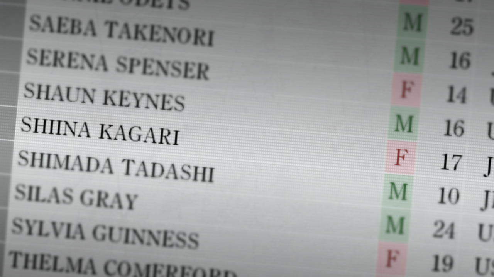

# 盟誓的文艺复兴 - 11
> 1.055821  
> [ 2011/02/02 ] 

| [←prev](./0131) | [menu](../) | [next→](./0133) |

---

“抱歉，能在这里等我一下吗？”  
“嗯……”  
“让真由理和琉华子等着，我走到秋叶桥的中央。”  
“和『Amadeus』接触的话，地点会被知道。”  
“因此，才选了这里。”  
“曾经，陷入无可奈何和悲叹的我，第一次向红莉栖倾述的地方。”  
“……”  
“等着大音量放着和那花哨的车体不相配的轻快的歌剧音乐的道路宣传车的通过，我按下了『Amadeus』的图标。”  
“她立即出现了。”  
“真是好久不见了呢。”  
“是啊……”  
“我还以为你把我忘记了。”  
“怎么可能忘记。”  
“怎么可能会忘记。”  
“发生了很多事情……”  
“到底是第多少次的告别呢。”  
“和红莉栖多少次的重复着分别。”  
“然而还是无法习惯。”  
“那么，今天怎么了？”  
“对你，想要问一些事情……”  
“什么？又是“时间机器可以制作吗”这种话？”  
“……”  
“开玩笑的，接着说。”  
“我说，如果。如果用自己的生命作为交换，就能拯救朋友的性命，你的话会怎么办？”  
“……那个，不明白你提问的意图啊。”  
“希望你能回答。”  
“从我的话语和表情明白我是在认真说话，“红莉栖”的表情也认真起来。”  
“……那个朋友是，重要的人吧？”  
“啊啊……”  
“我还有很多想要干的事情。不得不干的事情也有。但是……”  
“就算如此……如果那个朋友或周围的人会变得幸福的话，我也会乐意的接受……也说不定……”  
“红莉栖……”  
“抱歉。事实上并没有遇到这种事情，只不过是想象而已，也无法断言……”  
“就算如此，就算有一个人愿意记住我的事情的话……不会忘记我的人存在的话……”  
“总之，把我的事情忘掉吧。今天发生的事情，还有至今为止发生的事情。”  
“这就是我的愿望……”  
“……”  
“才不会忘记……”  
“诶？”  
“绝对。”  
“我绝对不会忘记……”  
“这是誓言。”  
“为了接下来穿越无数时间的誓言——”  
“冈部……先生？”  
“……问了你无聊的问题抱歉了。”  
“唔……这倒是无所谓……发生什么了？”  
“不，什么都没发生，什么都……”  
“……”  
“那么就，再见，了。”  
“等等!。”  
“诶……？”  
“啊，嗯。总觉得，无法再次相见了的感觉……”  
“红莉栖……”  
“……没有这种事情。”  
“……是啊？我真是的，为什么忽然这么认为呢……”  
“……会见面的，一定。”  
“嗯。”  
“是的，这并不是永远的诀别。”  
“再见……”  
“所以不说永别。”  
“直到和你再次相遇的那时候——”  
“再见……”  
“嗯，再见，呢……”  
“红莉栖……”  
“下次见面到底会是什么时候呢。”  
“但是一定，我会找到你的。”  
“一定——”  
“我回到真由理和琉华子的身边，把手机——“红莉栖”托付给她们。”  
“……告别完了？”  
“啊啊……”  
“那么，拜托了。”  
“嗯。”  
“看着真由理他们的背影消失在流向车站的人群中，我向 LAB 走去。”  
“刚才的道路宣传车，依然播着**轻快的音乐**从大路上穿过。”  

作战开始已经经过了差不多 5 小时了。”  
“屋内，只有桶子敲击键盘的声音在回响。”  
“怎样了，桶子？”  
“到现在为止，应该还没有被发现。”  
“还要花很长时间吗？”  
“嗯——最快也要差不多 3 个小时。”  
“果然，没有那么简单。”  
“桶子也相当疲劳了，一直在努力着。”  
“从真由理她们那里也传来适宜的联络。”  
“真由理和琉华子，菲莉丝和铃羽这样的组合来行动，不愧是有着相当的交往，通过各自之间很好的连携，在东京里到处乱转。”  
“据铃羽说，多次发现可疑的人物，萌郁也传来“那些家伙咬饵了”这样的联络。”  
“现在为止，没有任何人遇到危险，Operation 平安无事地进行中。”  
“但是，我不认为这种烟雾弹可能一直奏效。”  
“虽然想尽可能早的把红莉栖的记忆数据删除，为此最终也只有让桶子再加一把劲了。”  
“不好意思啊，桶子。”  
“不是说好不说这个吗。”  
“回忆起 25 年后桶子的身影。”  
“这家伙在那么遥远的未来世界也依然，一直陪着我。”  

“冈伦先生……稍微过来下？”  
“直到刚才，因为太累睡在开发室里面的真帆，不知什么时候起来了。”  
“嗯？怎么了？”  
“这个……看看……”  
“递给我一叠纸。”  
“刚才的 STRATFO 的报告的打印版。”  
“看样子，是醒来后详细的看过了。”  
“这是……？”  

“这是被 STRATFO，作为实验品的人的名字的名单……”  
“原来如此，被做成了一览表，写着人名和性别，年龄之类。”  
“这里……”  
“小小的手指指向其中的一个。”  
“那里写着的是。”  
“SHINA KAGARI。”  
“椎名篝！？”  
“她……被 STRATFO 当成了实验对象（marmot）了……”  
“……”  
“当然，这种可能性很大。”  
“正因如此，那些家伙才一直在搜寻篝。”  
“篝的脑中曾有红莉栖的记忆……”  
“就算如此，果然像这样直接看到证据还是造成了冲击。”  
“但是，似乎没有进入到最终实验。上面写着在那之前就逃走了。”  
“这个话，让我的心放下了。”  
“如果，篝的身体里还有红莉栖的记忆的话，前一个世界线发生的事情又会重演。”  
“这个果然是，世界线变更带来的影响吧。”  
“尽管那样，她多年在 STRATFO 这件事情还是没有错。”  
“在那期间，接受了其他的各种各样的实验的事情……”  
“稍微，有些担心……”  
“……”  
“我一定想的和真帆是同一件事情。”  
“篝现在，和由季两个人呆在桶子的藏身处。”  

 

> (to be continued)
---

| [←prev](./0129) | [menu](../) | [next→](./0131) |
