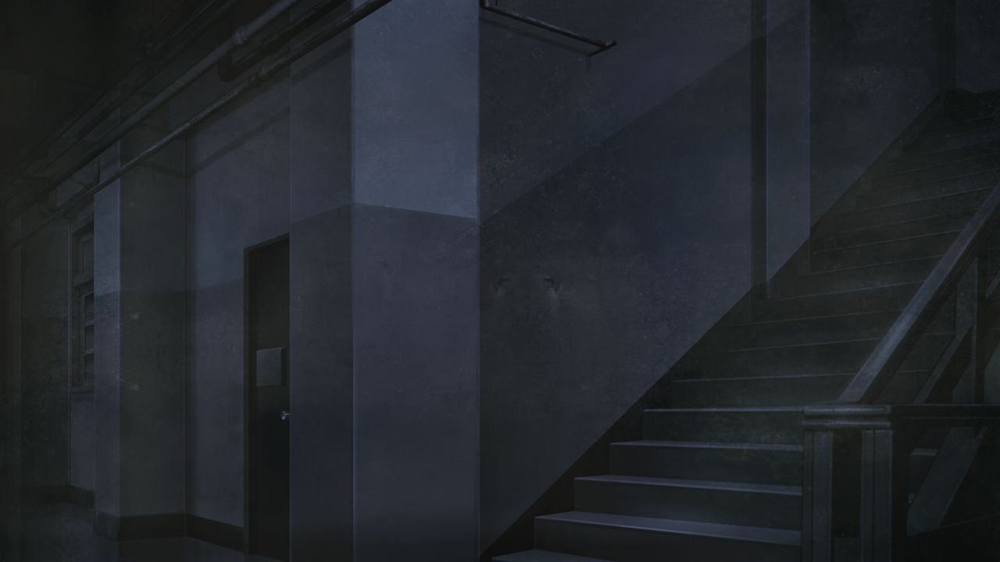
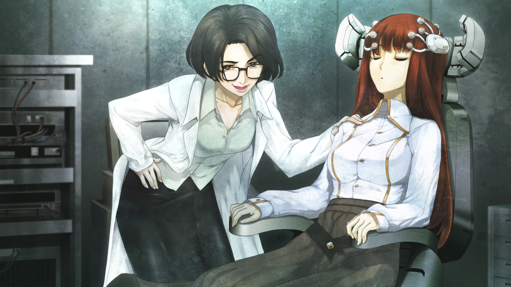

# 盟誓的文艺复兴 - 12
> 1.055821  
> [ 2011/02/02 ] 凶真和铃羽闯入了东京电机大学地下的 STRATFO 支部，结果发现莱耶丝杀光了其他人绑架了篝。她的真实身份是 DURPA 军方。  

| [←prev](./0133) | [menu](../) | [next→](./0135) |

---

我们来到了神田的某个建筑群。里面还亮着灯，就算是这个时间，大门也还开着——大学就是这个样子。不出所料，我们毫无困难地进入了建筑物内。  
“篝在这里……？”  
“嗯，应该是的。”  
如果 2036 年的桶子所言属实，STRATFO 的支部就在我的母校——东京电机大学的地下。这个神田校区里，有 1 号馆、5-7 号馆，还有 11-15 号馆和鳞次栉比的校舍，其中，只有 5、6、10、15 号馆是与周围的建筑分散开来的，其他校舍都集中在一个区域内。有地下室的只有 11 和 15 号馆，所以我认为，STRATFO 的支部应该就在我们所处的这个 11 号馆，因为这里不仅最新，设备齐全，也有 17 层之高，出入的人群也很多。虽然不知道这里到底有多少 STRATFO 的人，但是应该有一部分人出去搜捕我了。如果真是这样，现在这里肯定正处在人力不足的状态。铃羽也在，我们有胜算。  
“这边。”  
我带着铃羽，径直向楼梯走去。虽然馆内有 3 处电梯，但是铃羽提出，如果发生了紧急事态，活动空间不足的电梯会很危险。问题在这之后。地下有两层，大小房间加起来有 20 间以上，哪一个才是支部的所在呢？  

“叔叔，这边。”  
“你知道地方吗？”  
“我想起来了，我以前入侵过这里。  
 虽然我那时候看到的建筑物已经倒塌，外观也截然不同，但肯定没错。”  
铃羽毫不犹豫地向里面走去。她拿着枪，稳稳当当地放低腰板，足下毫无声响地跑步的样子，简直像一只猫。然后，她在一个房间前站定，向我点了点头。这个房间与其他房间如出一辙，但是没有铭牌。这里面的确是一个大房间，本该是一个配电室的。  
“我去救篝。叔叔，自己保护好自己。”  
“啊，嗯……”  
我掏出插在腰带后方的格洛克，相当有分量。虽然大体向铃羽请教了一下使用方法，但是没有开枪经验的我到底能不能用好还是个问题，用来虚张声势的话应该还是能做到的。”  

“要上了，3、2、1……”  
倒数结束的瞬间，铃羽一枪射烂了门把手，踹开门，成功突入了房间，动作行云流水。我紧随其后跑进房间，立刻注意到情况有异。最初是闻到一股异臭，令人作呕的铁锈味，那是血的味道。房间的地板上，弥漫着一层血泊，乍一看有四五个人倒在血泊中。当然，这并不是铃羽做的，在我们来之前就已经成这样了。  
（……怎么回事？）  
我跟着铃羽慢慢向前推进的铃羽，走向房间深处。倒下的既有日本人，也有一眼就能看出是外国人的。更深的地方似乎还有房间，半开着的门后，倒着一个体型魁梧的金发白人。站在他的旁边是——  
“比我想的要早呢，*Rintaro*。”  
“……怎么会。”  
叫着我的名字的那个性感的声音，还有那外国的腔调……  

“莱耶丝教授……？”  
“看到你这么精神真是太好了。”  
“为什么……”  
“只是想让他们，把我在找的东西还给我来着。”  
莱耶丝教授如同踏着舞步飘然转身。在她身后，篝坐在一个带有奇怪的装置的椅子上。  
“篝！”  
“……”  
“怎么了，篝！听不到吗？”  
篝的头被一个奇怪的装置套着，无论我怎么呼唤，她都坐在椅子上纹丝不动。  
“哎呀，她好不容易能安稳地睡上一觉，要是被叫起来可就太可怜了。”  
与当初见到的开朗模样不同，现在的莱耶丝脸上挂着一副无法想象的尖酸嘴脸。  

“小心！那家伙，是军人！”  
铃羽早已将枪口对准莱耶丝，但是莱耶丝好像并不在意。  
“军人？”  
话说回来，天王寺曾说过，搜捕篝的人，跟西方的军队有关，一般的谍报机关怎么可能自绝性命。  
“那边的那位小姐是何方神圣啊？”  
“把篝还来。”  
“表情不错啊，日本竟然也有能露出这种表情的人，我是闻所未闻呢。  
 总之，把枪交给我，否则 *Shiina·Kagari* 就要葬身于此了哦。”  
“我会在你碰篝的一瞬间杀死你。”  
“啊是吗？我进行的是组织的行动。就算杀了我一个，情况也不会有任何变化哦。”  
“……”  
“铃羽……”  
“……唔。”  
铃羽一脸懊恼地盯着她慢慢蹲下，将枪放在脚边。  
“真是乖孩子呢。然后，把双手背到头后乖乖站好。  
 然后是 *Rintaro*，我应该跟你提出了交换条件吧，你有乖乖带过来吗？”  
“……”  
“啊啦啊啦，真是坏孩子呢。你没带过来的话，我这边也不能把 *Shiina·Kagari* 交给你呢。”  
虽然她说篝睡着了，但仔细看可以发现，她的眼睛并没有完全闭上，微微张开的眼睑下是一双空洞的瞳孔，看不到一丝理性的光芒。  
“你对篝干了什么？”  
“很遗憾，我还什么都没干呢，只是稍微让她听了一下他们用的摇篮曲而已。  
 但是，你看起来并不想对我的交换条件有所回应啊，要不要现在开始干点什么呢？”  
她一脸迷乱地用枪身轻抚着篝的脸颊。  
“红莉栖的笔记本电脑和硬盘被藏在一个特殊的地方。  
 你不交出篝的话，我这边也不打算告诉你。先把篝放开。”  
“讲条件是没有用的哦，*Rintaro*。  
 如果你不想交出来的话，那我就用我的方式吧。”  
说不上威胁也说不上恐吓，莱耶丝就像进行着日常对话一样。被鲜血的颜色与气味簇拥着，格外助长了这种糟糕的感觉。  
“这是……你干的吗？”  
“是啊，如果他们少做一些多余的事就能多苟延残喘一会儿了，真可惜呢。”  
“为什么要做这种事？”  
“很简单的道理，因为他们发觉我的真实身份了。”  
“真实身份……”  
“那边的小姑娘不是说过了吗？”  
“军方吗？”  
“同时也是研究者——DURPA，反正说出来你也不知道吧。”  

“DURPA……美国国防高等研究计划局？莱耶丝教授……怎么会……？”  
通过小型蓝牙耳机传来了真帆的声音。以备不时之需，我一直与桶子保持通话状态。  
“冈伦……再帮我拖一段时间。”  
在这种情况下，拖延时间……真是离谱的要求。但是，迄今为止，我也拜托了桶子很多离谱的事，这次应该由我来响应他的离谱了。不能让她对篝下手。铃羽失去了武器，难以行动。我必须要做些什么，得驾驭这个场面才行。  

 

> (to be continued)
---

| [←prev](./0133) | [menu](../) | [next→](./0135) |
