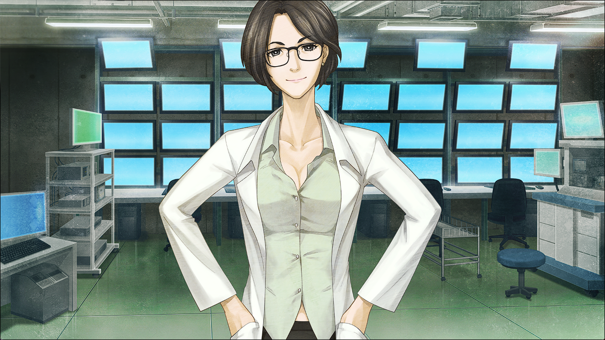

# 盟誓的文艺复兴 - 12
> 1.055821  
> [ 2011/02/02 ] 

| [←prev](./0131) | [menu](../) | [next→](./0133) |

---

“嗯……谁啊，在正忙的时候……”  
“打断对话的响的不停电话，似乎是桶子的。”  
“嗯？阿万音氏……怎么了啊。”  
“有不好的预感。”  
“嗨，喂喂。阿万音氏，怎么了？发生什么了？”  
“……诶？篝碳她？”  
“篝怎么！？”  
“……不见……了……”  
“啥！？”  
“一把抢过来递来的手机，放到耳边。”  
“是我，冈部！篝不见了，真的吗？”  
“冈部先生！实在抱歉！明明有我跟着在！”  
“到底是为什么！？被谁带走了吗！？”  
“不是。这个……篝自己……我拼命的阻止了，但是好强的力气……”  
“自己……？”  
“怎么回事？”  
“果然由季……”  
“不，不会是这样。”  
“如果由季有动手的话，没有特地向我汇报的必要。”  
“但是，那么究竟是为什么篝会自己跑出去？”  
“能开到扬声器模式吗？我也想问几句。”  

“我按她说的把通话切到了扬声器模式。”  
“由季小姐，篝跑出去之前的情况详细给我讲讲。有什么奇怪的事情吗？”  
“并没有……之前一直在聊着天……”  
“看了什么奇怪的影像吗？或者是声音之类……”  
“不……啊，请等等。话说起来，外面传来奇怪的音乐。似乎是什么道路宣传车……我还在想格外大的声音呢……”  
“道路宣传车？”  
“莫非是白天开过的那个？”  
“就是它。”  
“刚才的文件里写着。过去，STRATFO 进行的各种实验。”  
“实验中也包含了 *Brain·Washing*。”  
“洗脑吗？！”  
“应该是只要听到特定的音乐，就会自发的行动起来，被这样洗脑了。”  
“不这样想的话，我不认为会在这种情况自己跑出去。”  
“道路宣传车播放的那个曲子——”  
“K6205……”  
“那个是，把篝引向魔鬼的笛声——魔笛！”  
“文件里也写了。因为椎名篝的适合性非常优秀，眼下正在搜索去向……”  
“可恶！！”  
“恐怕不仅仅是秋叶原，还在各种地方开过了吧。”  
“完全中了这招。”  
“怎么办，冈伦……”  
“把篝叫出去的是 STRATFO 的那群人这点不会错。”  
“这样一来，我们能做的事情是——”  

“电话再次响了起来。”  
“这次是我的手机。”  
“为了这次的作战，我让菲莉丝帮忙准备了几部手机。”  
“大家联络用的手机和，让篝拿着的手机。”  
“然后——”  
“——！”  
“来电，是从篝拿着的手机打来的。”  
“恐怕并不是篝本人……”  
“究竟是什么人。”  
“……”  
【是 *Okabe Rintaro* 吧？”  
“被加工的声音的无机质更加让人毛骨悚然。”  
“啊，是的。你是？”  
【椎名篝在我们的手里。交换条件不用说你也知道吧？】  
“红莉栖的 PC 和硬盘。”  
“给我点考虑时间。”  
【考虑？有什么考虑的必要。】  
“……”  
【交换定在明天。地点和方法之后联络你。】  
“单方面说完，电话被挂断了。”  
“说要和红莉栖的 PC 和硬盘交换……”  
“那，怎么办？”  
“……”  

“篝被洗脑了这种事情……”  
“听了我们的话，玲羽咬着牙后悔着。”  
“我在那通电话之后，立即把铃羽叫了回来。”  
“同时，也让桐生萌郁回到了 LAB。”  
“希望你直接告诉我。假设听从对方的要求，你认为篝会还给我们吗？”  
“……不认为。”  
“从萌郁的嘴里说出的，直接的回答。”  
“我也不认为。对方是会用洗脑这种肮脏手段的人。只要没有用了，会毫不留情的干掉。”  
“最坏的情况，你也会被杀掉……”  
“特地指名我，也就是他们已经掌握了我知道一定程度的情报的证明。”  
“回想至今为止的袭击事件，他们一定会毫不留情的。”  
“而且那伙人想要的是，红莉栖的遗产。”  
“红莉栖所留下的遗产，还有她自身的记忆——不想让这些再继续成为纷争的种子。”  
“这样的话，我该做的事情只有一个。”  
“只有这边发起进攻，夺回篝了。”  
“虽然很危险，但是只有这样了。”  
“真由理她们直到这个时间还依然在努力奋斗。”  
“因此那些家伙应该还认为我现在还在都内辗转逃亡。”  
“你说发起进攻，……连对手在哪里都不知道？”  
“在哪里的话我知道。”  
“真的吗！？叔叔，什么时候……”  
“铃羽，愿意帮忙吗？”  
“*Okey-dokey!*”  
“视线转向萌郁，她摇着头。”  
“这种程度……恕不奉陪……”  
“也是啊。”  
“不行哟。两个人，太危险了。”  
“不，比起人多行动起来危险可能更少。”  
“而且我还暂时不会死的，这是命运定下来的。”  
“不对真由理她们说吗？”  
“说了也只会让她们担心的。”  
“……”  
“桶子，拜托继续解锁，还有手机保持通话状态。”  
“*Okey-dokey!*”  
“叔叔，这个……”  
“铃羽递给我的是，自动手枪。”  
“格洛克……”  
萌郁一眼就认出了手枪的型号
“有个万一，自己来保护自己。”  
“……”  
“我虽然很纠结，还是收下了这把枪。”  
“初次拿在手上的枪，比想象中的重了很多。”  

 

> (to be continued)
---

| [←prev](./0129) | [menu](../) | [next→](./0131) |
