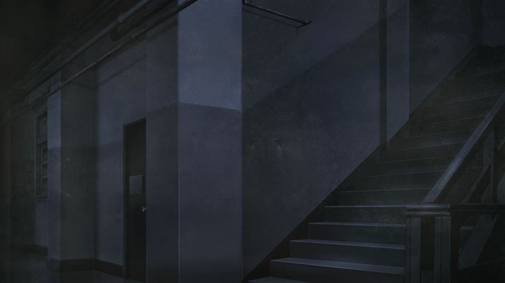

# 盟誓的文艺复兴 - 13
> 1.055821  
> [ 2011/02/02 ] 铃羽和凶真闯入了东京电机大学地下室的 STRATFO 支部，结果发现莱耶丝杀光了其他人绑架了篝。她的真实身份是 DURPA 军方。  

| [←prev](./0131) | [menu](../) | [next→](./0133) |

---

“位于神田的这栋建筑物，还亮着灯。”  
“就算是这个时间，门还是开着的。”  
“大学就是这个样子。”  
“不出所料，毫无困难的进入到了建筑物内。”  

“篝在这里……？”  
“嗯，应该是这样。”  
“如果 2036 年的桶子所言属实的话，STRATFO 的支部就在我的母校，这个东京电机大学里。”  
“大学的神田校区里，有 1 号馆、5-7 号馆，还有 11-15 号馆和鳞次栉比的校舍。”  
“这里面，只有 5、6、10、15 号馆是与周围的大楼分散开来的，这以外的校舍都是集中在一个区域内的。”  
“其中只有 11 和 15 号馆有地下室。”  
“所以，我想 STRATFO 支部恐怕就在我们所处的这个 11 号馆。”  
“因为这里不仅最新设备齐全，也有 17 层之高，出入的人群也是相应的多。”  
“虽然我们不知道这里到底有多少 STRATFO 的人，但是应该有一部分人出去搜捕我了。”  
“如果真是这样，现在这里肯定正处在人力不足的状态。”  
“铃羽也在这边。”  
“我们有胜算。”  
“这边。”  
“我催促着铃羽，径直向楼梯走去。”  

“虽然馆内有 3 处电梯，但是铃羽提出，如果发生了紧急事态，没有活动之处的电梯很危险。”  
“问题在这之后。”  
“地下 2 层，大小房间加起来有 20 间以上。”  
“这之中哪一个才是供支部使用的呢。”  
“叔叔，这边。”  
“你知道地方吗？”  
“我想起来了，我以前入侵过这里。”  
“虽然我所知的那个建筑物已经倒塌，外观也截然不同，但肯定没错。”  
“铃羽毫不犹豫地向里面走去。”  
“她拿着枪，稳稳当当地放低腰板，足下毫无声响地跑着的样子，简直像一只猫。”  
“然后，她在一个房间前站住，向我点了点头。”  
“与其他房间如出一辙。”  
“但是没有铭牌。”  
“这里面的确是一个大房间，本该是一个配电室的——”  
“我去救篝，叔叔，自己保护好自己。”  
“啊，嗯……”  
“我掏出插在腰带后方的格洛克。”  
“相当有分量。”  
“虽然大体上请教了一下使用方法，但是没有开枪经验的我到底能不能用好还是个问题，只是恐吓应该还是能做到的。”  

“上了哦。3、2、1……”  
“用倒计时作为信号，铃羽一枪射烂了门把手，踹开门，成功突入了房间。”  
“简直有如行云流水一般的动作。”  
“紧随其后跑进房间的我，立刻注意到了异常情况。”  
“最初感觉到的是一股异臭。”  
“呛人的铁臭。”  
“那是血的气味。”  
“房间的地板上，弥漫着一层血泊。”  
“那里倒着一些人。”  
“乍一看有 4、5 个人。”  
“当然这并不是铃羽做的。”  
“在我们来之前就已经是这样了。”  
“……怎么回事？”  
“跟随着慢慢走过去的铃羽，我向房间的深处前进。”  
“倒下的既有日本人，也有一眼就能看出是外国人的。”  
“似乎更深的地方还有房间。”  
“半开着的门后，倒着一个体型魁梧的男人。”  
“他的旁边是——”  
“比我想的要早呢，*Rintaro*。”  
“……怎么会。”  
“叫着我的名字的那个性感的声音。”  
“还有那外国的腔调。”  
“莱耶丝教授……？”  
“看到你这么精神真是太好了。”  
“为什么……”  
“只是想让他们还我在找的东西来着。”  
“莱耶丝教授如同踏着舞步飘然转身。”  
“在她身后，篝在那里坐着。”  

“篝！”  
“……”  
“怎么了，篝！听不到吗？”  
“篝的头被一个像是机械的奇怪的东西盖住了。”  
“无论我怎么呼唤，她都坐在椅子上纹丝不动。”  
“哎呀，她好不容易能安稳地睡上一觉，要是被叫起来那可就太可怜了。”  
“异于当初相识时的开朗，那是一副无法想象的尖酸的笑脸。”  
“小心！那家伙，是军人！”  
“铃羽早已向着莱耶丝摆出枪口。”  
“但是莱耶丝好像并没有在意她。”  
“军人？”  
“话说回来，天王寺曾说过。”  
“在搜捕篝的，跟西方的军队有关。”  
“一般的谍报机关怎么可能自绝性命，他这么说。”  
“那边的，何方神圣？”  
“把篝还来。”  
“不错的表情啊，日本竟然也有能露出这种表情的人，我是闻所未闻呢。”  
“总而言之，把枪交过来。否则 *Shiina·Kagari* 就要葬身于此了。”  
“我会在你杀死篝的那一瞬杀死你。”  
“啊是吗。我进行的是组织的行动。就算杀了我一个，情况也不会有任何变化。”  
“……”  
“铃羽……”  
“……唔。”  
“铃羽一脸懊恼地，将枪放到了脚边。”  
“真乖呢。顺便，把双手背到头后乖乖站好  
“然后是 *Rintaro*，我应该跟你提出过交换条件吧，你有好好带过来吗？”  
“……”  
“哎呀哎呀，真是坏孩子。你没带过来的话，我这边也不能把 *Shiina·Kagari* 交给你呢。”  
“虽然她说篝睡着了，但仔细看可以发现，她的眼睛并没有完全闭上，。”  
“微微张开的眼睑下是一双空虚的双瞳，看不出一丝理性的光芒。”  
“你对篝干了什么？”  
“遗憾的是，我还什么都没干呢。只是稍微让她听了一下他们用过的童谣。”  
“但是，你看起来并不想对交换条件有所回应啊，要不要现在开始干点什么呢。”  
“她一脸迷乱地用枪身轻抚着篝的脸颊。”  
“红莉栖的笔记本电脑和移动硬盘被藏在了一个特殊的地方。”  
“你不交出篝的话，这边也没有告诉你的打算。”  
“先把篝放开。”  
“讲条件是没有用的哦，*Rintaro*。”  
“如果你们不想交出来的话，那就让我用我的方式吧。”  
“说不上威胁也说不上恐吓。”  
“莱耶丝就像进行着日常对话一样说道。”  
“被鲜血的颜色与气味所簇拥着。”  
“格外助长了这种糟糕的感觉。”  
“这是，你干的吗？”  
“是啊。如果他们少狗拿耗子就能多苟延残喘一会儿了，真可惜呢。”  
“为什么要做这种事。”  
“很简单的道理。因为他们发觉我的真实身份了。”  
“真实身份……”  
“那边的小姑娘不是说过了吗？”  
“军方吗？”  
“同时也是研究者。DURPA——反正说出来你也不知道吧。”  

 

> (to be continued)
---

| [←prev](./0129) | [menu](../) | [next→](./0131) |
