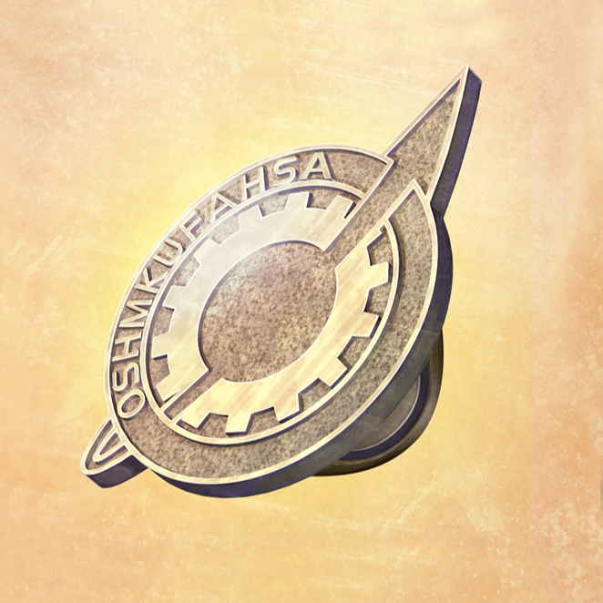

# 盟誓的文艺复兴 - 15
> 1.055821  
> [ 2011/02/06 ] 凶真给众人分发完全版 LABMem 徽章，决定脚踏实地，把过去和可以认为是过去的未来连接起来。

| [←prev](./0136) | [menu](../) | [next→](./0138) |

---

周日上午，真由理的 cosplay 伙伴们，吹雪、枫、由季来 LAB 玩，现在要离开了。  
“那，真由喜，我们还会再来的。”  
“嗯，再会\~”  
“下次琉华君也一起 cosplay 吧。”  
“啊，这个……那个……我会考虑的。”  
“冈伦先生还有大家，打扰你们了。”  
“嗯，随时可以再来。”  
“嗯……”  
“怎、怎么了？”  
“冈伦，总觉得你的气场变了呢。”  
“是……吗？”  
“嗯，总觉得比以前好相处多了。”  
“真是的，吹雪，当面说很失礼哦。”  
“诶？枫刚刚不也是这么说的嘛。”  
“等、等等！”  
“诶嘿嘿\~。”  
“真是的……”  
吹雪一如既往的不见外。她说的对，终于下定决心振作起来的我，回看之前的我，也觉得看不下去。  
“啊，那么，我也该告辞了。”  
“啊，今天也打工？”  
“是，结束后再联络，定一下周末的要做的事吧。”  
“OK，那我等着你的联络哦。”  
“什么什么，发生什么了喵？桶子喵和由季喵之间的气氛真好喵！”  
“是、是吗？啊，但是我对菲莉丝碳的爱意也分毫不减哦。”  
“真是的，爸爸，你又这样！”  

围绕牧濑红莉栖的记忆和『Amadeus』的骚动全部平息，平和的日常生活又回到了我的身边。发生在东京电机大学地下室的事，迄今为止还没有任何报道。事后第二天再去学校，地下室已经被封锁了，说是某个实验失败引起了事故，恐怕是被军队或是 STRATFO 处理掉了吧。那件事过后，我的周围暂时还没有不协调的气氛。那个地方应该没有留下任何与我们有关的痕迹，大概事情也不会波及到我们吧。  
“话说回来，那个到底是怎么回事啊。”  
“你说哪个？”  
“那女人在给篝下载记忆的时候，不是很顺利啊。”  
“只是系统没有好好运行而已吧？”  
“桶子喵说得对喵，铃喵没必要想那么多喵。”  
“嗯——真是这样吗？总觉得很在意……”  
看起来一直在深思着什么的篝开口道：  
“话说，那时——没什么，但是……”  
“喂喂，篝，不要话说到一半就停啊，很让人在意的。”  
“那时，我感觉听到了什么声音。”  
“声音？”  
“嗯，在脑海深处，也不知道是谁在喊‘不行——！’。  
 那时的事我几乎都不记得了，所以可能只是梦或者是别的什么……”  
“会不会是『Amadeus』？说不定“红莉栖”在最后关头，拒绝了自己的记忆被写入篝的脑中……”  
“这真不像是以真帆的逻辑能得到的意见啊。”
不过，听了真帆的话，琉华子和真由理看向了对方。  
“那个……在我们最后一次连接『Amadeus』的时候，通话中途就被切断了。”  
“明明冈伦的 bot 还在说话，但她不知怎么的，好像很慌张的样子，就中断了连接。”  
难道，就是那个时候……  
“不过，这种事可能吗？”  
“不知道，不过，『Amadeus』应该也和人类一样，有自我防卫的本能吧。  
 所以，发现自己的记忆要被用到不好的事情上……也不是不可能。”  
虽然不是现在这条世界线，红莉栖的记忆也曾在篝的脑中存在过。说不定在这里，“红莉栖”一直防备着自己被再一次利用，从而波及到篝。可能另有真正的原因，但至少我想要这么认为。  
“呐，冈伦，其实我也有一件不明白的事。”  
“什么？”  
“按你的说法，至今为止因为『Amadeus』，引发了数次世界线变动吧？  
 可是，我们还记得那时的事，就意味着这次没有发生变动吧？这是为什么？”  
这也是我在事后马上考虑的问题。  
“啊，关于这个，我推测，至今为止的世界线变动的原因，可以认为是  
 **根据我们对『Amadeus』采取的行动，让红莉栖的记忆落入了谁的手中**。”  
不管是谁得到了『Amadeus』，都不可能不利用她来改变过去吧。  
“但这次，作为原因的『Amadeus』和红莉栖的记忆本身都被删除了。  
 原因被消除了，相应的世界线变动也就不会发生了……大概是这样。”  
STRATFO 和 DURPA 争端的火种被消除了，红莉栖留下的数据也被破坏了。红莉栖的记忆这份遗产，以此为媒介连接的未来都不复存在了。但是，现在铃羽和篝还在我的眼前。她们两个还在这里，就意味着未来还没有被改变。这当然也是早就明白的——世界线的收束，在抵达命运石之门之前，都没法避免。即使如此，**这次的事件肯定不是无用的**。在那个时候——2036 年的世界察觉到的微小的灵感。**这个世界，应该就是为了连接到那里所做的准备**。  
“那么，接下来要怎么办？”  
“是啊，虽然有很多事要做，不过在那之前——”  
我从白衣的口袋里掏出了准备好的东西。  
“我有礼物要送给大家。”  
“这是……？”  

“LABMem 徽章——我们全员作为 LAB 成员的证明。”  
OSHMKUFAHSA——徽章上，刻着所有成员名字的首字母。当然，红莉栖和萌郁的名字也在上面，并新追加了比屋定真帆（*Hiyajo Maho*）、椎名篝（*Shiina Kagari*）、还有阿万音由季（*Amane Yuki*）的名字。**把过去和可以认为是过去的未来连接起来**，这就是现在的我应该做的事。  
“LABMem……我的宝物，又多了一个。”  
篝很开心地把徽章抱在胸前。”  
今后我们要走的道路，大概会是更加艰辛的荆棘之路，但光明肯定会存在。  
“我，好像有点明白，红莉栖和冈伦先生关系这么好的理由了……”  
“我也是，终于知道为什么爸爸他们这么依靠冈伦叔叔了……”  
“我也知道妈妈为什么一直喜欢冈伦先生了……”  
“篝、篝酱，不是的，真由喜只是冈伦的人质，所以那种事……”  
“等、这、什么？只有冈伦这么受欢迎，不可原谅！现充爆炸吧！”  
“爸爸你已经有妈妈了吧！”  

无数的未来和无数的过去，都一定会在收束的地方相遇。所以——  
“啊，是我……  
 什么？你问什么时候来救你？别急，现在还没到那个时候。  
 哼哼哼……你以为我是谁？听好了，狂气的疯狂科学家，凤凰院凶真决不会食言。  
 所以，你暂且等着就好。  
 总有一天，我会解开束缚着你的时间的诅咒，把你拯救出来。  
 啊……绝对……”  
红莉栖，到再见之时，我会把我所有的思念都奉献给你。  
“*El·Psy·Congroo!*” 

 

> (to be continued)
---

| [←prev](./0136) | [menu](../) | [next→](./0138) |
