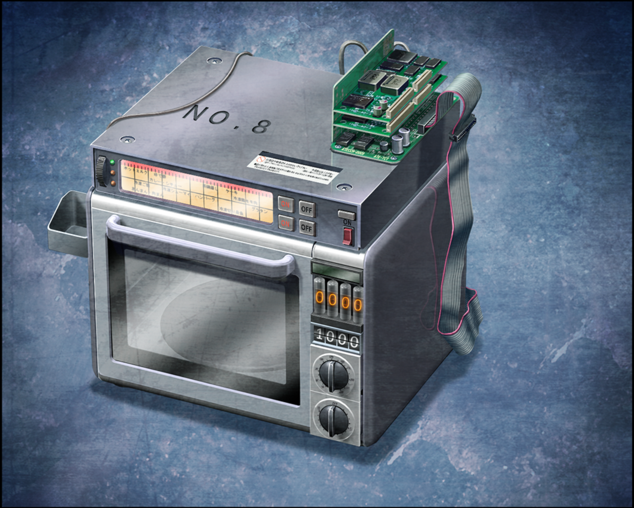
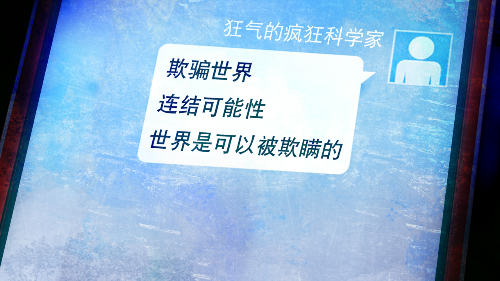

# 盟誓的文艺复兴 - 16
> 1.055821  
> [ 2011/12/18 ] 通过 D-RINE 传达了世界可以被欺骗的信息。凶真决心改变过去，与红莉栖重逢，带领 LABMem 全员执行「*Operation·Helhelm*」。  

| [←prev](./0137) | [menu](../) | [next→](./0139) |

---
那场骚动之后过了快一年，真帆久违地来到了未来道具研究所。  
桶子：“哦？来了来了。”  
真帆：“好久不见了，各位。”  
真由理：“哇，是真帆小姐啊。我好想你啊\~嘟嘟噜\~♪”  
琉华子：“好久不见，真帆小姐。”  
菲莉丝：“真帆喵这么精神比什么都好喵。”  
真帆：“嘿嘿，看大家都没什么变化我也安心了。”  
铃羽：“你也是，还是老样子啊。”  
真帆：“反正我还是这么小对吧。”  
铃羽：“我不是那个意思啦。”  
真帆：“我知道，开玩笑的啦。”  
篝：“呜…………”  
真帆：“怎、怎么了？”  
篝：“这一年都没有见到真帆小姐，好寂寞啊\～”  
真帆：“等、等等！也不用抱得这么紧……”  
篝：“可是……可是……”  
真帆：“抱歉……本来夏天就想来的，可是大学里也有很多事……”  
那场骚动给真帆她们的研究所带来了很大的问题，这是理所当然的。不止是『Amadeus』，莱耶丝教授还有许多大学相关人员，都跟那个事件有关。  
“辛苦你从那么远的地方过来，真帆。”  
“这是应该的，毕竟我也跟这件事有不小的关系，过来亲眼见证也是我的该做的。”  
“可是，真的好吗？这一年的善后都会白费哦？”  
“不会白费的。  
 况且，你不是说，这个世界的未来和过去是连接在一起的吗？  
 所以我也只是在这个世界做了我该做的事罢了。”  
“……啊，是啊。”  
2036年，应该在 2025 年已经死去的我还活着，这一事实把所有人都欺骗了，不论是过去的我，还是未来的所有人——世界，被欺骗了。本以为既定的未来，却以不同的形式实现了。  
那么，我是不是也能欺骗世界呢？  
**通过欺骗世界，不就能回避已经确定的未来吗**？  
世界如果能被欺骗的话——不就能抵达命运石之门吗？  
然而，要怎样去欺骗，很遗憾，现在的我还找不到方法。即使这样，未来的我也说了，众多未来的前方，都会和过去连接在一起。那么，现在我应该做的事只有一件——  
“桥田先生，那个东西已经做好了吗？”  
“当然，应该已经可以用了。”  

开发室的深处放着陈旧的微波炉造型的装置。是在那场骚乱中，在真帆的帮助下成功再现的时间跳跃装置，如今桶子为它追加了新的机能。  
“话说回来，竟然是这样的东西在掌握着世界的命运啊。”  
没错，所有的事情都是从这里开始的。我们的命运、红莉栖的命运，都是被它玩弄的结果。和原来的电话微波炉（暂定）的一个不同点在于，和它连接的手机变成了智能手机。向过去发送的邮件，无论如何都会被 SERN 捕捉到。那样的话，我们又会被 SERN 盯上，也就等同于，把牺牲了红莉栖选择的这个世界，再次卷入到灾祸中，那就没有意义了。但是，现在的通信手段不止邮件，还有别的传递消息的方法，我们现在频繁使用的 RINE 也是其中之一。  
“就命名为 **D-RINE** 吧。”  
当然，把文字信息发送回过去的原理是一样的，利用显像管电视的电子来控制重力，从而使信息通过奇点。另外，能发送的文字数和 D-Mail 一样，也是 18 个文字。不过，这样就不用担心会被 SERN 捕捉到，应该也不用担心真由理会再次牺牲了。问题是，无法向 RINE 成为通信手段之前的时间点发送信息，这也是没办法的。现在，**把可能性都连接起来**，才是最重要的事项。  
“真是的，为了实现你的需求，不能被任何方面捕捉到，我费了好大功夫来着。  
 只是为了找漏洞，就花了好长时间的说。”  
虽然抱怨，桶子还是完美地达到了我的要求，真是干得漂亮。  
“不愧是 *My·Favorite·Right·Arm*。”  
“啊，真是怀念的称呼。”  
“可是，冈伦，这样真的好吗？”  
“是啊喵，再做这件事，凶真又会有痛苦的回忆了不是喵？”  
“大概会吧……”  
“那你还——”  
“但是，即使如此，我也必须去做。”  
“冈伦……”  
我明白真由理她们在担心，我会再次受到打击而消沉。可是，这样下去的话，一定会发生第三次世界大战，铃羽和篝还在这里就很能证明了。前方只能通往一个未来，但是，为了抵达命运石之门，应该还存在其他必要的未来。为了到达那个未来，必须回到过去重来一遍。没关系的，现在的我，无论多少次都能重来。无论会发生什么，都一定能够克服，直到到达约定之门的那一天。为此准备的信息已经写好了，**我一定是为了传递这个信息而来到的这条世界线的**。当然，我也不知道收到信息的我会怎么想，怎么行动。即使如此，我也一定能做到。一定能连接上，其他的未来，以及过去。  

“篝……你觉得不安吗？”  
“因为……如果，过去改变了，和平的时代到来了……说不定我就没法和妈妈相遇了……”  
“篝酱……”  
“不用担心。”  
“诶……？”  
“根据世界线收束理论，该发生的事一定会发生，已经这么定好了。  
 就算世界线改变了，你也能和真由理相遇的。”  
“真的吗！？”  
“嗯，我保证。”  
“妈妈！”  
“太好了，篝酱，有冈伦的保证就能安心了哦\～在未来，我们肯定会相遇的。”  
“嗯！”  
“叔叔，谢谢……”  
“不用道谢，本来就是我播下的种子。”  
而且，真正麻烦的是今后的事。  
“不，即使如此我也要说，谢谢。”  
“那个台词，爸爸也要！也对爸爸说 Please！”  
“爸爸也是，谢谢。”  
“再来一次！视线再往上一点，眼含泪光地再说一次吧，我的女儿！”  
改变了过去的话，这一年来我好不容易做到的事都会相当于没发生过。经历了未来的事也好，花了恍若隔世般漫长的时间再次回来的事也好，但这并不代表，那些经验都会白费。现在的我，和即将踏上旅程的过去的我，还有这之后的未来——把那些经验都交汇起来之后，连接着未来的那扇门——命运石之门——一定在等着我们。

“那么要上了！以凤凰院凶真的名义，现在开始实行新的作战——  
 「*Operation·Helhelm*（海伦海姆）」！LABMem 全员，都准备好了吗！？”  
“*Okey-dokey!*”  
为了找到那个方法，我将再次改变过去——红莉栖，为了有朝一日，能与你重逢。  

 

> (to be continued)
---

| [←prev](./0137) | [menu](../) | [next→](./0139) |
