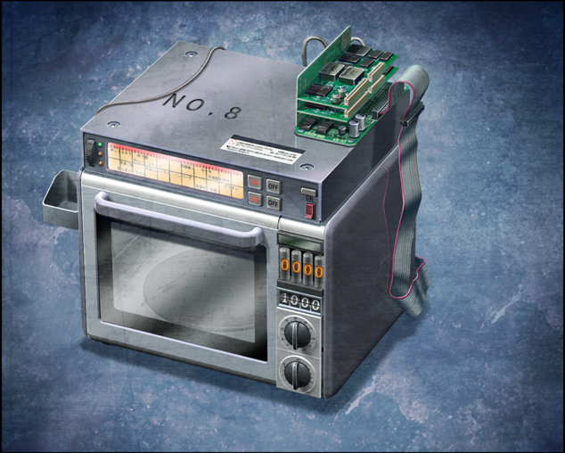
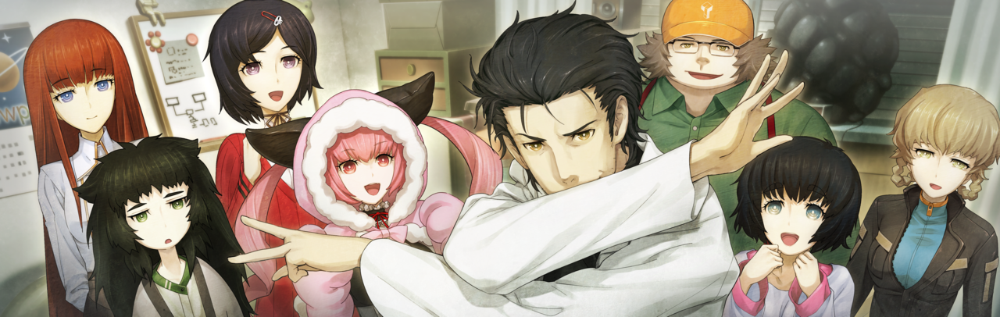
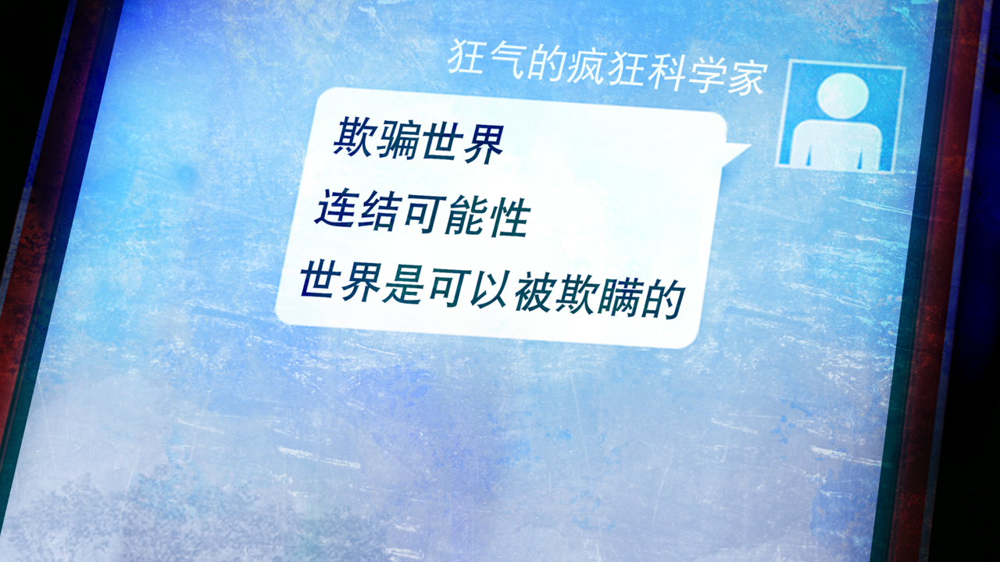

# 盟誓的文艺复兴 - 17
> 1.055821  
> [ 2011/12/18 ] 

| [←prev](./0131) | [menu](../) | [next→](./0133) |

---
那场骚动之后过了一年，真帆久违地来到了未来机械研究所。”  
“哦？来了来了。”  
“好久不见了，各位。”  
“哇，是真帆小姐啊。我好想你～嘟嘟噜\~♪”  
“好久不见，真帆小姐。”  
“看你这么精神比什么都好喵。”  
“呵呵。看大家都没什么变化我也安心了。”  
“你也是，还是老样子啊。”  
“反正我还是这么小对吧。”  
“我不是那个意思啊。”  
“我知道。开玩笑啦。”  
“呜…………”  
“怎、怎么了？”  
“这一年都没有见到真帆好寂寞啊～。”  
“等、等等！就算不这么抱着我也……”  
“可是……可是……”  
“……抱歉。本来夏天就很想来的，可是大学里也有很多事……”  
“那场骚动理所当然的给真帆她们的研究室带来了很大的问题。”  
“这是当然的。”  
“因为不止是『Amadeus』，莱耶丝教授等许多大学相关人员，都跟那个事件有关。”  
“辛苦你从那么远的地方过来了，真帆。”  
“这是理所当然的吧。毕竟我也跟这件事有不小的关系，过来亲眼见证也是我的该做的。”  
“可是，真的好吗？这一年的善后都会白费哦？”  
“不会白费的。况且，说这个世界的未来和过去是联系在一起的，不就是你吗。”  
“所以我也只是在这个世界做了我该做的事。”  
“……啊，是啊。”  
“2025 年应该已经死去的我还活着的事实。”  
“把所有人都骗了。”  
“过去的我。”  
“未来的所有人。”  
“世界——被欺骗了。”  
“本以为既定的未来。”  
“却以不同的形式实现了。”  
“那么——我不是也能欺骗世界吗。”  
“通过欺骗世界，不就能回避已经确定了的未来吗。”  
“那么，世界如果能被欺骗的话——就能抵达命运石之门不是吗。”  
“然而，要怎样去欺骗，很遗憾现在的我还找不到方法。”  
“就算这样，未来的我也说了。”  
““寻找命运石之门这条世界线的道路是凶险的。只是重复上一次两次，是不可能找到方法的吧。”  
“但是，从那开始发生的事情，不是会成为通往命运石之门的道路吗——”  
“许多个未来的前方，不是会和过去连接在一起吗”——11 年前，冈伦你是这样说的。”  
“所以说，我们所在的世界并不是没用的。一定是必要的世界。至少现在的我是这么认为的。”  
“许多个未来的前方，会和过去连接在一起——”  
“那么，现在我该做的事只有一件——”  
“桥田先生。之前的那个东西已经做好了吗？”  
“当然，应该已经可以用了。”  

“在开发室的深处镇坐着的，陈旧的电子烤箱。”  
“是在那个骚乱中，在真帆的帮助下成功再现的时间跳跃机器。”  
“桶子给它追加了新的机能。”  
“话说回来，竟然是这样的东西在掌握着世界的命运啊。”  
“没错，所有的事情都是从这里开始的。”  
“我们的命运和红莉栖的命运，都是被它玩弄的结果。”  
“和原来的电话烤箱的一个不同点在于，和它连接的手机变成了智能手机。”  
“向过去发送的邮件，无论如何都会被 SERN 捕捉到。”  
“那样的话，我们又会被 SERN 盯上吧。”  
“那样做就等同于，把牺牲了红莉栖所选择的这个世界再次卷入到灾祸中。”  
“那就没有意义了。”  
“但是，现在的通信手段不止有邮件。”  
“还有别的传递消息的方法。”  
“我们现在频繁使用的 RINE 也是其中一个手段。”  
“就命名为 **D-RINE** 吧。”  
“当然，把文字信息发送回过去的原理也是一样的，利用显像管电视的电子来控制重力，从而使信息通过奇点。”  
“另外，能发送的文字数和 D-Mail 一样也是 18 个文字。”  
“不过，这样就不用担心会被 SERN 捕捉到。”  
“应该也不用担心真由理会再次牺牲了。”  
“问题是，无法向 RINE 成为通信手段之前的时间点发送信息，这也是没办法的事。”  
“现在，把可能性都连接起来，才是最重要的事项。”  
“真是的，因为你提了哪里都不能被捕捉到这种要求，我费了好大的功夫来着。”  
“为了找漏洞，花了好长时间的。”  
“虽然这么说着，完美地达到了这个要求也是干得漂亮。”  
“不愧是我最可靠的右手。”  
“啊，真是怀念的称呼。”  
“可是，冈伦。这样真的好吗？”  
“是啊喵。因为这件事，凶真又会有痛苦的回忆了不是喵？”  
“大概会吧……”  
“既然这样的话——”  
“但是，即使如此我也必须去做。”  
“冈伦……”  
“…………”  
“这样下去的话，一定会发生第三次世界大战。”  
“看到铃羽和篝还在这里就很清楚了。”  
“前方只能通往一个未来。”  
“但是，为了抵达命运石之门，应该还存在其他必要的未来。”  
“为了到达那个未来，必须回到过去重来一遍。”  
“没关系的。”  
“如果是现在的我的话，无论多少次都能重来。”  
“无论会发生什么，都一定能够克服。”  
“直到到达约定之门的那一天。”  
“为此准备的信息已经写好了。”  
“我一定是为了成为这个信息的传递者而来到的这个世界线。”  
“当然，我也不知道收到信息的我会怎么想，怎么行动。”  
“即使如此，我也一定能做到。”  
“一定能连接上。”  
“别的未来。”  
“以及过去。”  

“篝……你觉得不安吗？”  
“因为……如果，过去改变了，和平的时代到来了的话……说不定就没法和妈妈相遇了……”  
“篝酱……”  
“不用担心。”  
“唉……？”  
“根据世界线收束理论，该发生的事一定会发生。已经这么定好了。”  
“就算世界线改变了，你也能和真由理相遇的。”  
“真的吗！？”  
“嗯，我保证。”  
“妈妈！”  
“太好了，篝酱。有冈伦保证的话就能安心了哦～在未来，我们肯定会相遇的。”  
“嗯！”  
“叔叔叔，谢谢……”  
“不用道谢。本来就是我播下的种子。”  
“而且，真正麻烦的是今后的事。”  
“不。即使如此我也要说。谢谢。”  
“那个台词，也对爸爸爸爸说！也对爸爸爸爸说 Please！”  
“爸爸也是，谢谢。”  
“再来一次！视线再往上一点，眼含泪光地再对我说一次吧，我的女儿！”  
“改变了过去的话，这一年来我好不容易做到的事都会相当于没发生过。”  
“经历了未来的事也好，花了恍若隔世般漫长的时间再次回来的事也好。”  
“但这并不是说，那些经验都会白费。”  
“现在的我，和即将踏上旅程的过去的我。”  
“还有这之后的未来——”  
“把那些经验都交汇起来之后，连接着未来的那扇门一定在等着我们。”  
“命运石之门。”  

“那么要上了！以凤凰院凶真的名义，现在开始实行新的作战，Operation Helhelm（海伦海姆）！LABMem 全员，都准备好了吗！？”  
“为了找到那个方法，我将再次改变过去。”  
“*Okey-dokey!*”  
“红莉栖——为了有朝一日，能与你重逢。”  

 

> (to be continued)
---

| [←prev](./0129) | [menu](../) | [next→](./0131) |
