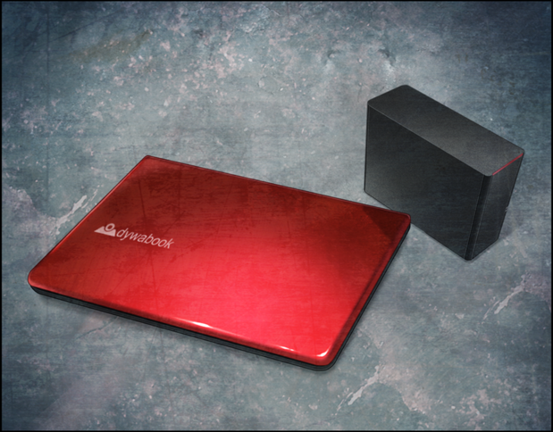

# 永劫回归的潘多拉 - 09β
> 1.129954  
> [ 2011/01/23 ] 接 0035 - 先谈事情。冈伦和桶子决定把所有事情告知真帆，并且说服了她同意破坏红莉栖的笔记本电脑和硬盘。  

| [←prev](./0035) | [menu](../) | [next→](./0141) |

---

我挂断了电话，现在先专心和桶子谈事情吧。  
“那么，要和我说什么？”  
“别装傻了，既然我和比屋定一起过来，你应该懂了吧。”  
 红莉栖遗留的笔记本和硬盘，交出来吧。”  
“冈部先生知道密码是什么吗？”  
“……密码什么的，无所谓。”  
“什么意思？”  
“我要说的只有一点：破解这台笔记本电脑的行为，现在立刻停止吧。  
 这台笔记本电脑里，也许沉睡着会让世界陷入混沌的、了不得的东西……”  
“……”（x2）  
“喂，听到了吗？”  
“中二病<abbr title="发音 Otsu，おつかれさま（Otsukaresama）的网络缩写，以讽刺的语气表示“干得好”、“辛苦了。”">乙</abbr>！”  
“你原来是这种人啊……”  
“不、不是的！我是很认真的！不是什么凤凰院凶真那样的设定！”  
“中二病……乙！”  
“都说了不是中二病了！”  
我用力敲了下桌子，震得一个空罐子滚落到地上。  
“好了，听着，这件事也关系到铃羽。”  
“铃羽？”  
“你知道吧，关于铃羽的使命。”  
“<abbr title=" くわしく （kuwashiku）的网络缩写，意思是“请详细说说。”">KWSK</abbr>。”  
“《中钵论文》。”  
这个关键词桶子应该就理解了。  
“当真？”  
“一开始就是认真的。”  
“这样啊……嘛，我也在猜会不会是这回事。”  
桶子没再多说，打开了设置在旁边的架子上锁着的防火箱，拿出了里面的笔记本电脑和硬盘。笔记本电脑是搭载着 12 英寸显示屏的日本造产品，颜色是深红色；硬盘则是以耐震性优良的塑胶外壳为卖点的美国货。  

“这就是红莉栖的……确认一下，安全系统还没被破解吧？”  
“嘛，在我们编写的软件面前，什么黑客都只能举手投降。”  
“不要继续破解了。”  
“但是，我已经收下委托费了……”  
桶子抱歉地看着比屋定，比屋定则一直死死地瞪着我。”  
“我刚刚也问过，关于红莉栖的事件，你们到底在隐瞒什么？”  
“追究真相，不一定就是对的。”  
“那不过是你的一己之见，连用来做出判断的信息都没有给我。”  
“很危险的！你之前都被袭击了，应该明白了吧！”  
“我不想成为只会躲在‘骑士’身后的胆小鬼。  
 作为科学家，我不想停止走向真相的努力。无论在那里，隐藏着怎样的危险。”  
“真是一根筋啊……！”  
“换作是红莉栖，大概也会这么说的，不是吗？”  
我无法反驳，正如比屋定所言，在我印象中，和红莉栖也有过相似的对话，那是在准备调查 SERN 之前。  
“事到如今，也只能好好告诉她了。”  
“桶子！”  
“真帆碳的表情一看就知道，不管你说什么她都不会接受的。”  
“嗯，不会接受的。”  
“而且，这样一知半解地牵扯进来，反而更危险不是吗？如果冈伦说的是真的的话……”  
的确，桶子说的也有道理，这样下去，比屋定很可能会不自觉地探究危险的事物，然后陷入无法挽回的境地。在拿到“红莉栖的遗产”那一刻起，她就已经处在了第三次世界大战的导火线上，而本人却完全没有意识到这点。这台电脑已经不是‘朋友的遗物’这种私人等级的物品了，而是会引起国家规模的争夺战的东西。说俄语的纵火犯闯入了红莉栖在美国的家；之后，一帮自称 FBI 的男人前往维克多·孔多利亚大学雷斯吉宁教授的研究所调查。可以说，现在已经是热战爆发前的紧张局势了。在国家争端面前，我们这样的人根本如蝼蚁一般无力。  
“要说的话，也要告诉她有关铃羽的事情了。桶子，你认为可以吗？”  
“也只能这样咯。”  
听到桶子的回答后，我面向比屋定。  
“比屋定小姐，能答应我一件事吗？  
 你是科学家，我相信也是极为理性的人。  
 不要被感情操控，而去做一些草率的事。”  
——不要像过去的我那样。  
“接下来要讲的远超你的想象，你可能觉得我在痴人说梦，但这就是事实，所以——”  
“不要兜圈子了，到底想让我答应什么？”  
“绝对不要想着，去拯救牧濑红莉栖。”  
“拯救……红莉栖？”  
比屋定看起来无法理解我在说什么，一下子愣住了。  
“如果不能答应我这一点，我就不准备告诉你了。怎么样？”  
“也就是说，存在拯救她的可能性？”  
“虽然你可能会产生这种想法，但实际上可能性为零。”  
“……刚刚也说了，连用来判断的信息也没有的话，我无法轻易做出回答。”  
“……”  
“告诉我吧，告诉我一切。”  

我深深吐了口气，从头开始讲起。讲解的内容，包括时间机器、铃羽、还有第三次世界大战，以及，中钵博士和红莉栖的关系。还有，所谓的《中钵论文》，其实可能是以红莉栖所写的原本为基础的，所以红莉栖的笔记本电脑和硬盘里，可能存有《中钵论文》的原版，很快俄罗斯和美国就要开始围绕这份资料展开争夺战了。然而，关于红莉栖死亡时的情况，我还是……隐瞒了。比屋定听我说着这些，始终露出困惑的表情。就像一个刚刚上初中的孩子，面对一排排无法理解的数学公式一样，直到我说完了都还没有改变。  
“这些……都是真的吗？不是编出来的吧？”  
“是真的。”  
比屋定没有问我，而是看向桶子。桶子给了她肯定的答复。  
“果然，无法相信吗？”  
“也、也不是，只是和我预想的相差太远，思维有些跟不上。”  
“你预想的是？”  
“我以为是『Amadeus』的军用化。”  
“军用化……”  
“红莉栖也经常出入精神生理学研究所，她说经常有一些外人过来，好像是国防部的人。”  
俄罗斯、FBI 之后，这次是国防部吗？情况越来越可疑了。  
“『Amadeus』可以杀人吗？怎么能做到？”  
“比如说，把身经百战的飞行员的记忆数据，复制到无人战斗机上使用。  
 还有之前说过的医疗上的应用，还记得吗？”  
“那个，把记忆数据写回人类的大脑吗？”  
“对。如果能修改记忆数据，再写回去的话，就能制造出可怕的怪物，  
 像是‘不会感到恐惧的士兵’或者‘不论何种不人道的任务都能平静完成的部队’。”  
“哇，简直是好莱坞电影啊。”  
桶子的感慨和我相同，现实已经要追上小说和电影了吗？  
“我本以为，一定是红莉栖偶然间得到了这种实验的证据，才被盯上了……”  
比屋定用手拿起笔记本电脑。红色的外壳是镁合金做的，所以比看起来要轻很多。  
“但是没想到，居然是时间机器……”  
“不管怎样，马上把它破坏掉比较好。”  
“不确认一下里面的内容吗？不一定存着你说的论文啊。”  
“有没有已经不重要了。  
 ‘红莉栖的遗物仍存于这个世界’——仅此一点就可能成为战争的导火索。”  
比屋定看起来还是不能接受。  
“但是，这是红莉栖曾经活在世上的证明，红莉栖留下的意志啊。  
 这种东西，就这么轻易地破坏掉……”  
“如果知道了里面的内容，下次可能就是你被盯上了。”  
“就算这样……”  
既然她无法接受，就只能试试用其他的方式说服了。  
“这台电脑的密码，你一定也问过‘红莉栖’了吧？”  
“啊……？”  
“我是说『Amadeus』。”  
“当然，一开始就问过了。”  
“但是得到的密码不对，对吧？”  
比屋定点了点头。  
“很奇怪吧？正常应该知道的，可是『Amadeus』的“红莉栖”却不知道。  
 那么，能想到的可能性只有一个——  
 红莉栖本人在『Amadeus』不知道的情况下，把密码改了。  
 你觉得她为什么这么做？  
 难道不是因为，不想让其他人知道内容吗？  
 这种类似挖掘坟墓的事，还是不要做了吧，呐？”  
“挖掘坟墓……这种说法！  
 对不起，的确，可能就如冈部先生所说……  
 也许我对红莉栖太执着了。”  
“我很了解，红莉栖在你心里有多重要。  
 但是唯有这件事，还是不要插手比较好。”  
 这东西，别说是潘多拉的盒子了，很可能会成为地狱之门。”  
“中二病乙！”  
“不要老打岔啊……”  
比屋定好像在抱易碎品一样，把笔记本电脑抱在怀里，微微叹了口气。  
“我明白了，冈部先生，  
 我现在已经明白发生什么了，虽然还有些混乱。”  
 把笔记本电脑和硬盘破坏掉吧。”  
“谢谢。”  
能理解真是太好了……  
“你果然很了不起。”  
“为什么？”  
“普通人对于这些话，要么全盘否定，要么即使不否定，也会有所怀疑。”  
“你太抬举我了。如果是平常的我，别说是否定，我连听都不会听的。  
 所谓的科学家，本来应该不否定任何微笑的可能性的……  
 却往往对自己的主张、常识、想法，有着固执的倾向。”  
“那，这次是为什么？”  
“这个……因为和牧濑红莉栖有关。”  
比屋定脸上浮现了自嘲般的笑容。  
“时间旅行理论？『时间跳跃机』？开什么玩笑啊，这种东西怎么可能存在？  
 但是，如果是红莉栖，就有可能做到。毕竟那孩子，可是一直在颠覆我的常识啊。”  
“这样……啊。”  
毕竟比屋定的『Amadeus』的 ID 是 Salieri——刚想这么说，还是制止了自己。因为那个 ID 里，有着一名科学家不能被碰触的忧郁思绪。  

“那委托金怎么办？说实话，从真帆碳那里收到的那部分，已经花在预订月底发售的工口游戏了。”  
“桶子……你没救了啊。”  
“就是为了这个才做地下兼职的……！”  
“算啦，我也没说要你退款。本来也觉得不会有什么结果的。”  
“不是我说，再有三天，密码的解析就完成了，真的哦！”  
“就当是这样吧。”  
比屋定微微一笑，大度地放过了桶子，然后又看向我。  
“顺便，让我看看证据吧。”  
“证据？”  
“就在某个地方吧？那台——时间机器。另外，我有些事想问问铃羽小姐。”  
“那个，怎么说呢……”  
虽然桶子已经允许了，但是还没得到铃羽的同意，就把时间机器的事情告诉了比屋定。这段时间，我和铃羽还有些争执，不是很想带着这个话题去见铃羽……而且，要让她看时间机器的话，也要得到铃羽的许可……事情有点麻烦。  
“那个，桶子，你能和铃羽说一下——”  
话还没说完，桌上的内线电话急促地响了起来——  

 

> (to be continued)

---

| [←prev](./0035) | [menu](../) | [next→](./0141) |
