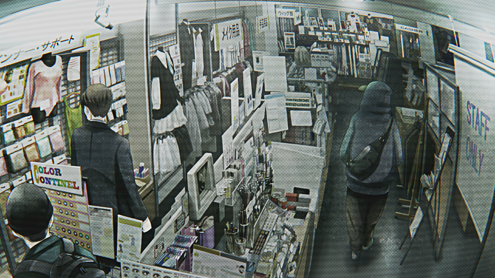
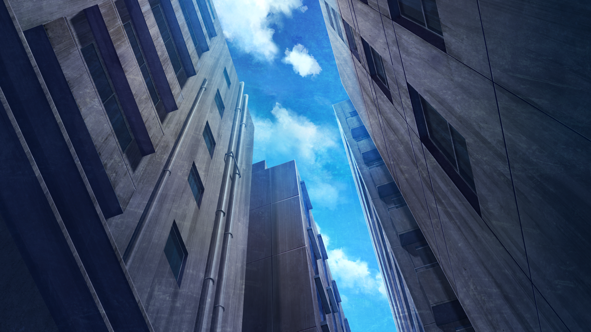
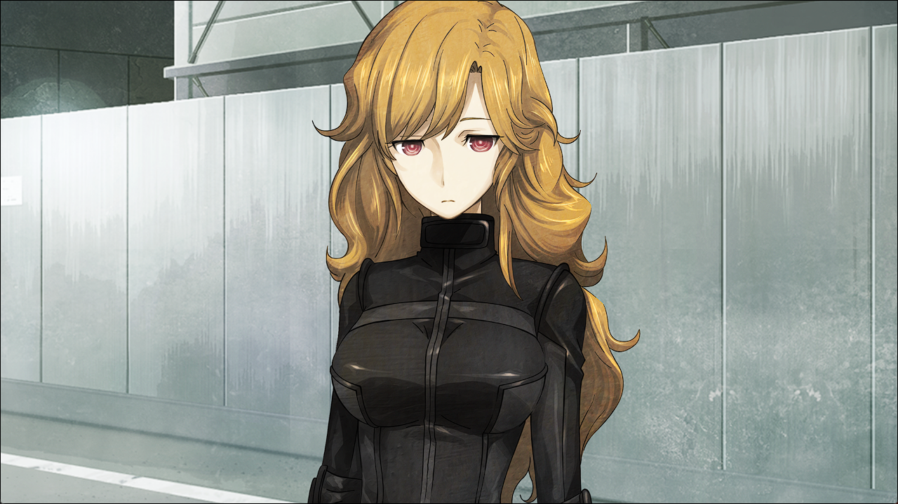
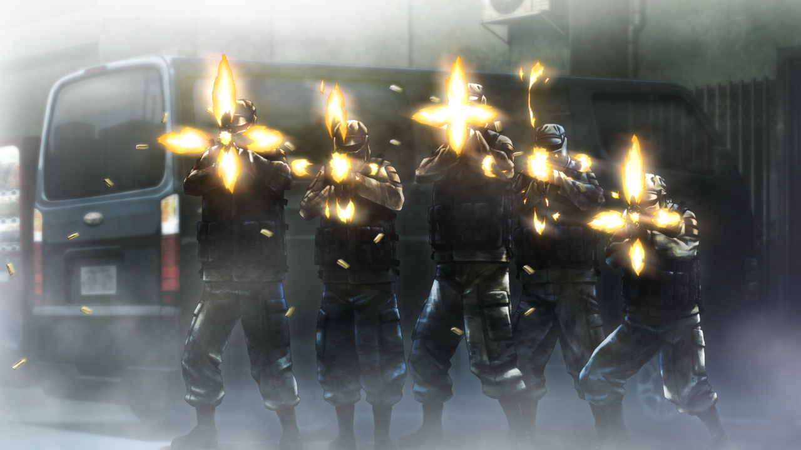

# 永劫回归的潘多拉 - 10
> 1.129954  
> [ 2011/01/23 ] 桶子的秘密基地被袭击，众人逃离不成，被桐生萌郁带领的 Rounder 擒获，目标是红莉栖的笔记本电脑和硬盘。千钧一发之际说俄语的士兵赶来，直接开枪，射杀两名 Rounder，破坏了红莉栖的笔记本电脑和硬盘。  

| [←prev](./0140) | [menu](../) | [next→](./0142) |

---

“啊——正在谈重要的事情，怎么了哦——？”  
桶子的语气虽然和平常一样，但他脸上突然显露的紧张神色，没有逃过我的眼睛。有种不好的预感。  
“喂？发生什么了？”  
桶子一边和对面通话，一边噼啪噼啪地切换着监视器的频道。原本显示着店里的画面的 6 个显示屏，经过一番操作，画面切换到大楼入口、安全出口、过道、电梯间等位置。原来不止是店里，店外也有布有监视器呐……现在不是惊讶的时候，伴随着杂讯的影像中，出现了数个姿态怪异的男人的身影。  

“这些家伙是什么人啊……？”  
大楼的入口、1 楼的电梯间、7 楼的电梯间、还有安全通道楼梯的平台、cosplay 商店的门口，刚刚还没有人，现在这几个地方，分别都有 4 个男人姿态很不自然地站着，而且彼此之间并没有交谈，只是沉默地站在那里。总共有 20 人，他们造型不一，有穿西装的上班族，有秋叶原系的服装，也有被军装包裹的家伙。单独来看的话，每个人的装扮在秋叶原都不是很显眼。然而，在这么冷清的杂居大楼里，突然如此凑巧地出现这么多人，令人细思极恐。  
“*Okey-dokey!* 要放弃这里了，你也赶快撤比较好，真的。”  
桶子通话的对象应该是看店的店员，说完后就挂断了，看向我和比屋定。  
“情况就是这样，快撤吧。”  
“诶？”  
桶子顾不上愕然呆立的我和比屋定，拿出一个登山包，匆忙地把桌上的硬盘、储存卡、数据盘等塞了进去。  
“那台笔记本电脑拜托递给我。”  
比屋定被催促着，眨了眨眼睛把笔记本电脑和硬盘递给桶子。  
“喂，那群家伙是什么人？”  
“果然是冲着红莉栖的笔记本电脑来的吗？”  
“谁知道呢，毕竟我也搞过很多事，以前也有过这种事情。嘛，所以才叫地下兼职。”  
“喂喂……”  
桶子从比屋定手里接过笔记本，和硬盘一起装进了登山包，背在背上。  
“还有，要怎么撤啊？店的入口可是有那群家伙在。”  
“真可惜，这个地方我还很喜欢的，终于要放弃了啊……”  
桶子的语气很轻松，脸上的表情却很认真。他走到房间的一个角落，那里贴着一张金发虚拟歌姬的等身大海报。  
“凛碳，对不起了。”  
桶子撕下海报，小心翼翼地不伤到她。后面有一扇玻璃拉门，打开后好像通往一个混凝土阳台。  
“这边哦……”  
难道要从这里撤？这里可是 7 楼啊？没时间犹豫了。桶子也没确认我们是否同意，一个人先到了阳台上。我也推了下比屋定的后背，示意她先走。  

阳台上和房间里一样，也堆满了各种各样的杂物。除了老旧的电脑和显示器，还有明显已经坏掉的游戏机等，基本没有落脚的地方。也是多亏如此，只要稍微弯下腰，外面就看不到我们在这里通过。或许是预料到会有紧急情况，才故意这么摆设的吧。接下来上演的，就是像间谍电影一样的逃亡戏码了。移开隔壁阳台上的一块大纸板，移动到大楼另一边的某个房间，接着通过应急楼梯前往 2 楼，那里有一间桶子和几个熟人合租的房间，从浴室的窗户跳到隔壁楼的空房间。这时桶子接到消息，那群人已经闯入了 cosplay 店里，听完我感到背上发冷。我们赶紧从这栋楼的紧急出口逃出去，外面是另外两栋楼夹缝中的、昏暗狭窄、没什么人走的小路，应该不会被那群人发现。  

但是……我们太天真了。好像已经看穿了我们的行动一样，另外一群人早已包围了小路严阵以待。面对这出乎意料的情况，我们刚想逃走，比屋定就被其中一人抓住了。事到如今，我和桶子完全无法抵抗，就被反扭着手臂，按在地上。和闯入大楼的那群人不同，这群人头戴黑色的全覆式头盔，身穿黑色的骑手装。其中，抓着比屋定的人，从身型上看明显是女性。这种装扮袭击我们的女人，我的记忆中只有一个——  

“……不要出声，照我说的做，否则……会没命。”  
穿黑色骑手装的女人左手控制着比屋定，右手拿出了军用匕首，把它抵在比屋定的脖子上。她的声音，即使因为头盔变得十分沉闷，我也很熟悉。  
“住——住手！”  
我的脑海中，一段令我毛骨悚然的可怕记忆苏醒了。“椎名真由理，不需要。” ——虽然那是发生在其它世界线的事，但是，曾经夺走我最重要的青梅竹马的那个冷血的声音，如今，又再度出现在这里。  
我把牙齿咬得吱吱作响，紧盯着那个穿黑色骑手装的女人。  
“你要的东西我会交出来，所以快住手……！”  
在我挤出这句话后，穿黑色骑手装的女人把匕首从比屋定的脖子挪开，然后让另一个男人控制比屋定，自己脱掉了头盔。  

桐生……萌郁……！果然是你……！  
“你是……！”
比屋定一脸的难以置信，毕竟在她的认知中，这个女人应该是一名采访过自己的杂志编辑。  
“……东西……在哪儿？”  
桐生萌郁的双眼完全不含任何情绪，和那时——8 月 13 日一样。我也被另一个家伙粗暴地拽了起来，手臂一直被扭在背后。我拼命忍着，不让自己因剧痛叫出声来。  
“先……放开我的手！这样我，没法，好好说话……”  
桐生萌郁微微颔首，对同伙示意了一下。那个人放开手，我被强行固定的关节终于轻松了；桶子也被放开，嘟囔着站了起来；可是比屋定还被控制着。  
“……和比屋定博士……交换。”  
“……桶子，把包给我。”  
“啊，嗯。”  
桶子把背着的登山包放了下来。  
“不、不行！不能给！”  
“比屋定小姐，别抵抗！那家伙真的会杀人的，那不只是威胁。”  
“但是！”  
“如果红莉栖知道你为了她的论文牺牲，她会高兴吗？”  
比屋定的表情，像一个哭泣的孩子一样扭曲着。我一边紧盯着桐生萌郁，一边从桶子的登山包里拿出了笔记本电脑和硬盘。  
“就是这个。”  
“……把整个登山包给我。”  
“先放开比屋定小姐。”  
“…………”  
桐生萌郁没有回应。既然如此，只能虚张声势赌一把了。  
“想要知道解锁的密码的话，就不要对我们出手。”  
我把笔记本电脑和硬盘放回包里，拿着登山包走向桐生萌郁。我拼命给自己鼓劲，抑制声音的颤抖。  
“这东西没有密码的话绝对启动不了，全世界的黑客都拿它没办法。  
 只要能保证我们的安全，我就告诉你。我可不想一把东西交出去就被杀掉。”  
当然，如果我们也没有破解密码的事暴露的话，就全都完了。桶子递过来一个询问的眼神，我无视了他。千万别说漏嘴啊，桶子……  
“……的确……如此呢。”  
很好、上钩了……！这样一来——  
“……那么，请你们其中一人，跟我们走。”  
“诶……？”  
“……现在立刻释放两人。之后，密码正确的话，再释放另一人。”  
可恶……这样就不能全逃走了……  
“不行，留下的那个人的生命得不到保证。”  
“……那，就三个人都来。”  
“唔……！”
这个女人！我的背上不断渗出冷汗。我这种从未参与过人命交易的外行，完全想不到，这种情况下要怎么办才好。  
“……桥田至，过来。”  
“诶？我！？”  
“……听说，你是专家。带上登山包，过来。”  
“不、那个……”  
“……你跟我们走的话，可以在这里放走他们俩。”  
“等下！既然这样我跟你走，总可以了吧？”  
“……上面没有说过任何你的事情，也不清楚你是否知道密码。”  
被识破了……！桐生萌郁又一次把匕首抵在比屋定脖子上。  
“啊！”  
“……桥田至，快过来。”  
“这种台词，希望你能在工口场景对我说啊……”  
虽然嘴巴很轻浮，但是桶子那完全颤抖的声音暴露了他。要怎么办？这样下去桶子会被杀掉……！脑中转过千百个念头，却依然想不出破局之策。在这条世界线，桶子至少活到了 2036 年，并且开发出了时间机器，这是铃羽明确证实了的。既然世界线会收束，那么即使桶子在这里被桐生萌郁带走，也不会被杀……应该这么想吗？不……不能因此就抛弃他……  
桐生萌郁的一个同伙看了下手表，桐生萌郁好像也注意到了。也许这种光天化日下的绑架剧已经拖了太长时间，所以开始着急了。虽然我期待着能有路人经过，但是也没法保证事情会朝好的方向发展。必须自力更生，想办法打开局面……  
“……还是说，先杀掉一个，给你们看……比较好？”  
以此为信号，冰冷的匕首从背后贴紧了我的颈动脉。  
“唔……！”
“冈伦！”  
“不要！”  
桶子和比屋定尖叫着，但这些突然间都失去了真实感，感觉好像发生在很遥远的地方，听说人在突然面对死亡的时候都会这样——反正我不是死在这里的吧？我问自己，问不在场的铃羽，问这个世界……当然，没有人能回答我。也许不会死的事实，和这种情况下能不能做点什么，毫无关系。脖子被人用刀抵着，我这个区区大学生，早已经被超出极限的恐惧笼罩了。即使已经见过无数次他人的死亡，轮到自己果然还是不习惯。这又让我不禁回想起了红莉栖的鲜血，过去的回忆向我袭来。我全身颤抖着，几乎要瘫坐在地上。已经……什么都做不了了吗？  

快要放弃的时候，狭窄的小路前方，一辆黑色面包车急停下来，堵在了那个和其他道路交叉的 T 字路口。车侧面的滑门打开，跳下来好几个手持小型自动步枪的男人，全员都身穿灰色军装，头戴只露出眼睛的巴拉克拉法帽，一看就知道是军队的士兵。而且从强壮的体格和肤色上看，明显不是日本人。我立刻反应过来，这是真实的，不是什么 cosplay，那些枪是真的。我的大脑提醒我，这里即将展开战斗。8 月 13 日的袭击，以及持续到前几天为止的、处在战争状态的世界线得来的经验，在这一瞬间苏醒了。  
“全员隐蔽！”  
是敌是友并不重要，桐生萌郁在我发声的同时也做出反应。她确认了闯入者的样子，毫不犹豫地冲入旁边建筑的阴影中，其他 Rounder 也一起向周围散开。比屋定被放开后，站在路中央慌张地四处张望。”  
“真帆，趴下！”  

只有那个按住我的那个男人反应迟了一步。刺耳的枪声响起，用刀子抵着我的男人，脑袋和头盔一起被贯穿了。受此波及，我也倒在地上，由于冲撞，扔出了手中桶子的登山包。一名 Rounder 立刻冲过去捡起，然后朝远离面包车的方向跑去。一名看起来像是指挥官的男人从面包车上下来，大喊了一声什么，貌似是用俄语下达了指令。于是士兵们举枪瞄准了逃跑中的 Rounder 的后背，下一刻，他的身体飞了出去，连同手上的登山包一起被撕裂了。登山包被打碎，或完好或破碎的物品散落在柏油路上。然而还不够，子弹如雨一般，偏执地倾泻在目之所及的一切物品上，直到将所有东西被粉碎成难以分辨的残骸。我没空管这些，爬到电线杆的阴影中隐蔽起来。  
数息之后，枪声停止了。我环顾四周，操着俄语的士兵逼近过来。不知什么时候，以桐生萌郁为首的那群 Rounder 已经不见了，只留下两具尸体。士兵们训练有素分工有序，有人警戒周边的情况，有人回收笔记本电脑和硬盘的残骸，有人抱起 Rounder 的两具尸体，迅速打扫完战场回到面包车上，过程中完全无视了我们。从面包车出现到离开，不过短短几分钟。路上只剩下滚落的微小碎片、两摊血迹，还有趴在路上颤抖的比屋定、建筑物的阴影中吓呆了的桶子和电线杆下泄了气的我。我的心脏一直砰砰响着，事情结束之后，才发觉脖子的疼痛，好像是倒下的时候，被抵在脖子上的匕首稍微割到了。  

过了一会儿，终于从远处传来了警笛声。这时我才终于想起，这里是日本的秋叶原。第三次世界大战，也许已经在我们不知道的地方开始了。我再次体会到，在国家争斗面前，我们果然如蝼蚁一般无力。  

 

> (to be continued)

---

| [←prev](./0140) | [menu](../) | [next→](./0142) |
