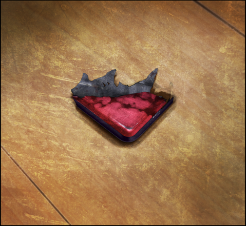

# 永劫回归的潘多拉 - 11
> 1.129954  
> [ 2011/01/23 ] 事后回到 LAB，真帆收到雷斯吉宁教授的邮件，得知办公室和酒店房间也被袭击了。冈伦从俄罗斯士兵的行动推测出，时间机器的开发竞争中，俄罗斯已经占据优势。最后众人决定先远离 LAB。  

| [←prev](./0141) | [menu](../) | [next→](./0143) |

---

秋叶原陷入了骚乱，天上飞着好几架应该是媒体的直升机。确认了没有人跟踪后，我们逃回到了 LAB。在酒店被袭后没过几天，就又连续遇到这种恶性事件，我们肯定会被怀疑。所以，我们在警察到达现场之前逃了出来。  
铃羽不在 LAB，也许感受到骚乱的气氛而不安，去查看时间机器的情况了。我们大气都不敢出，担心若是被听到动静，马上就会有恐怖的家伙破门而入。  
“桥田先生，这里有毛巾吗？”  
“嗯，卫生间里有。”  
比屋定点点头，从卫生间拿来了一条新毛巾，然后递给我。  
“冈部先生，你的脖子，出血了，用这个摁住吧。”  
“诶？啊……谢谢。”  
脖子上沾满了血，幸好伤得不深，很快血就止住了。比屋定把毛巾递给我之后，“啪”的一下瘫坐在地上。她的心情我能理解，何况是第二次被袭击了，这次还有人在眼前被杀。  
“你还好吧，比屋定小姐？”  
“嗯……”  
比屋定双目无神地点点头，脸色依旧很苍白。仔细一看，她的左手一直握得紧紧的，有血在往下滴。  
“受伤了吗？让我看看。”  
“诶？啊……”  
比屋定好像自己也没注意到这个伤口，疑惑地盯着自己的左手。  
“咦？”  
“怎么了？”  
“手指……打不开了……好奇怪呢……”  
比屋定的左手好像紧紧握着什么，长时间太过用力导致僵硬，无法自己打开了。她尝试了一下手就开始颤抖起来。我握住比屋定的左手，微微用力，一根一根打开她的手指。她的手指已经失去血色，相当冰冷。终于把她的手打开了，她一直紧握着的东西滚落到了地上。  

捡起来一看，那是一块深红的镁合金碎片。红莉栖的笔记本电脑被枪打得粉碎，她应该是在逃跑时捡到了其中一小块碎片。用力紧握如此尖锐的东西，出血也是必然的。我默默地把碎片还给了比屋定。她用双手珍重地接过，忽然，落下一行泪水。  
“呜……呜……呜呜……”  
接着再也忍不住，满脸泪痕，放声大哭。  
“红……红莉栖……对不起……对不起……没能……保护好……对不起……”  
好像这个碎片就是红莉栖本人一样，比屋定把它抱在胸前，不停地呜咽。  
“比屋定小姐……红莉栖她，一定感到安心了。”  
“诶？”
“因为你平安无事。所以……你不需要愧疚，不用道歉的。”  
“呜……”  
比屋定没有回答，默默啜泣。  

手机的振动声响起，比屋定拿出自己的手机，查看收到的邮件。  
“雷斯吉宁教授发来的。啊……！”  
“怎么了？”  
“说是被洗劫了……办公室，还有教授和我各自的酒店房间……现场一团糟。”  
“这样啊。”  
果然，Rounder 也好俄罗斯的士兵也好，最开始包围 cosplay 店的家伙也好，都是冲着红莉栖的笔记本电脑和硬盘来的。  
“那台笔记本电脑，没有备份吧？”  
“嗯……”  
“这样就放心了，红莉栖留下的遗物，已经不会成为导致数十亿人死亡的道具了。”  
就结果而言，还是达成了我所期望的结局。资料没有落入任何一方手里，被破坏掉了。已经变成了那样的碎片，要复原是不可能了。  
“话说，俄罗斯为什么要破坏那台笔记本电脑啊？不是想据为己有的吗？”  
“现在看来，**时间机器的开发竞争中，俄罗斯已经占据优势**。  
 从俄罗斯角度，能够得到笔记本电脑自然最好——  
 反之，与其被其他对手得到，还不如破坏掉。”  
这里是日本，光天化日下，他们本来应该想要避免和 Rounder 进行枪战而引发骚乱的。然而在那种情况下，他们还是理智地做出了冷酷的决断。这令我毛骨悚然，不愧是职业军人，行动完全不是外行人可比的。  

“那么，接下来要怎么办？”  
“可以的话不要待在这里。”  
先不说俄罗斯方面，对于桐生萌郁，这个地方可能已经暴露了。Rounder 的行动，和就在楼下的天王寺有关的可能性并不为零。  
“等太阳落山就转移吧。”  
铃羽要是回来的话大家都会放心一点，但是现在联系不上她。  

 

> (to be continued)

---

| [←prev](./0141) | [menu](../) | [next→](./0143) |
