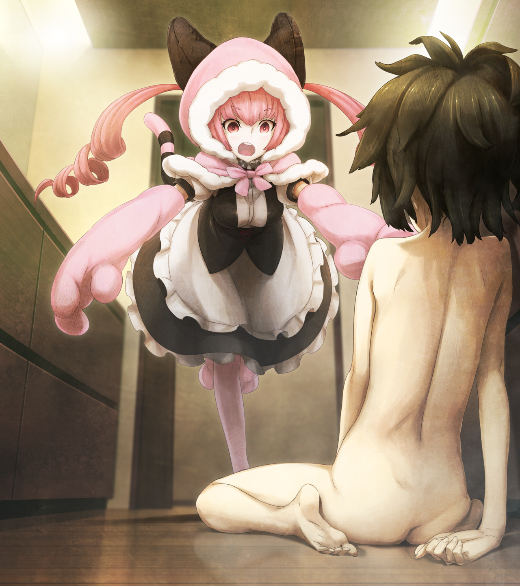
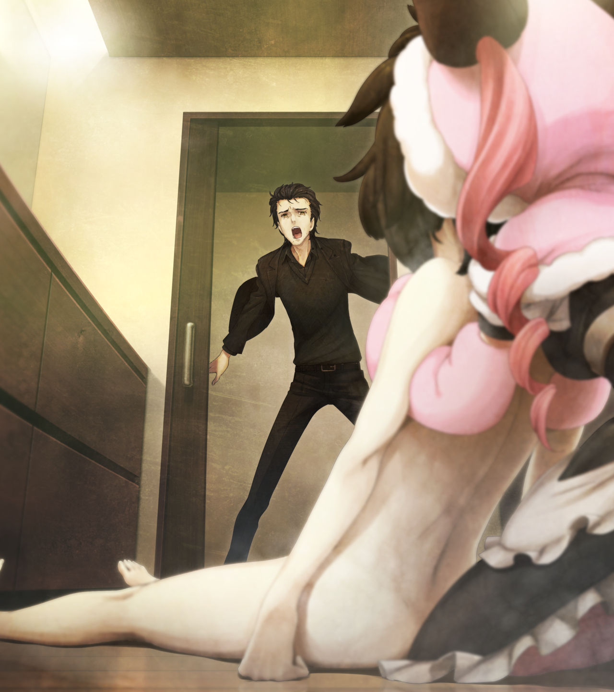

# 永劫回归的潘多拉 - 12
> 1.129954  
> [ 2011/01/23 真帆视角 ] 真帆和冈伦来到菲莉丝家避难。洗澡时真帆脱力瘫倒贡献 CG，夜间做噩梦，冈伦陪床安慰她。冈伦打算和她坦白自己的罪行，她察觉到冈伦的痛苦让他不要勉强。两人成为了彼此的心灵支柱。  

| [←prev](./0142) | [menu](../) | [next→](./0144) |

---

“呼……”  
真帆把身体泡进盛满热水的浴缸中，终于感觉全身的血气又回来了。像石头一样僵硬的身体，被渗入身体的热量融化了。受伤的手掌虽然有点痛，但是也不是不能忍受。终于有种活过来了的感觉。  
等到太阳落山，四周逐渐变暗之后，真帆和冈伦就去找了在 *MayQueen+Nyan²* 工作的猫咪女仆——菲莉丝·喵喵。菲莉丝家位于秋叶原黄金地段的某高层公寓顶层，安保方面和 LAB 相比是天差地别。菲莉丝很高兴地接受了真帆和冈伦的请求，提供了床铺和食物，现在连浴室也借给他们用了。真帆稍微有点担心桥田，他坚持说要等到妹妹铃羽回来，一个人留在了 LAB。已经过了一个小时了，他应该已经联系过冈伦了吧。  
虽然已经转移了地点，现在的情况也不能说是绝对安全。白天袭击的那群人，不管什么时候再攻过来都不奇怪。真帆内心的不安感越来越强，现在这样全裸躺在浴缸的自己毫无防备，越想越觉得可怕。于是她从浴缸里出来，到更衣间迅速擦干了身体。正要穿上菲莉丝为她准备的替换贴身衣物时——手颤抖起来，不止如此，腰腿都没了力气，她就那样软绵绵瘫坐在地上。  
（因为从极度紧张状态突然放松下来，而陷入了暂时性的肌肉松弛。）  
尽管借由分析自己的状态而冷静下来，但是对现状没有任何改善，只能倚靠在旁边的柜子上。  
（这下……麻烦了……）  
大脑正在发出警报。过一段时间应该就会恢复了，暂时保持不动好了……正这么想着，菲莉丝突然打开门探头进来：  
“真帆喵，热水温度——呜喵？！”  
看到瘫坐在地上一丝不挂的真帆，菲莉丝惨叫一声，开始慌张起来。  
“糟、糟、糟糕了喵！死掉了！真帆喵要死掉了——！”  
“不，那个，我没什么——”  
真帆的声音像蚊子一样微弱，方寸大乱的菲莉丝根本听不见。  

“那个、那个、总之得先搬到床上去。”  
菲莉丝本来打算把全裸的真帆抱起来，但是却漂亮地手滑了，把真帆又摔在地上。  
“唔咕！”  
真帆后脑勺重重地撞击地面，眼冒金星。  
“哇喵喵！对、对不起\~！”  
真帆以不雅的姿势躺在地上，想自己坐起来，手臂却使不上力气。  
“听、听着……我很快就会恢复了……”  
但是菲莉丝还处在更大的慌乱中，完全听不进真帆的话。这次她来到真帆背后，用手穿过她腋下，打算一口气把真帆抱起来。  
这时，听到菲莉丝惨叫的冈伦匆忙赶来。  
“怎么了，菲莉丝！”  
“噫！？”  
“啊……”  
“喵……！？”  
“啊，啊……啊\~\~\~\~\~\~”  
真帆本想拼命大声尖叫的，结果嘴巴里出来的确是这种软弱无力的、难为情的声音。  

“真是非常抱歉，请求你原谅。”  
冈伦对着躺在床上的真帆，深深低下了头。  
“不、不用道歉……刚刚的事说到底也只不过是意外。”  
虽然这么说着，但是真帆却无法正脸面对冈伦。被看到不雅姿态那瞬间的绝望和害羞，一想起来，就想把脸埋进枕头双脚乱踢。那之后，因为真帆自己没力气站起来，于是冈伦就用所谓“公主抱”的姿势把真帆抱回了房间，害羞感变得更重了。从来没有和男性身体近距离接触经验的真帆，今天才知道原来男性的手臂是那么的粗壮。被抱起来的感觉并不好，感觉随时会滑下来，因此不得不把身体蜷缩起来，委身于冈伦……然后，一种奇妙的感觉涌了上来，所以她到现在还没办法正脸面对冈伦。  
“喵……都怪菲莉丝太惊慌了喵……”  
菲莉丝在冈伦的旁边正坐着，垂头丧气地聋拉着肩膀。  
“不，没事的。不如说，是我吓到你了，真是对不起。”  
“身体没事吧？不用去医院吗？”  
“一直紧张过度才出现的反作用而已，我想，再休息一会儿就会恢复了。  
 让你们担心了呢……真丢人……”  
“才不会丢人。被卷入今天那样的事件，谁都会害怕的，谁状态都会不好的。”  
“你也、害怕吗？”  
“啊。”  
“这样啊……”  
“今晚就先休息喵。关于事件，关于以后该怎么办，这些复杂的事情，等精神好了再来考虑喵。”  
“是啊……嗯，就听你的吧。谢谢……”  
真帆道谢后闭上了眼睛。冈伦和菲莉丝关掉室内灯，走了出去。  

真帆躺在床上，放空了自己的大脑。能听见自己噗通噗通的心跳声，一会儿大一会儿小……交织出一种有些令人不安的节奏。就好像坏掉的电视一样，开始听到了疲劳性耳鸣和心跳声混杂在一起的噪音。然后，由于太在意而无法入睡。  
（说起来，冈部先生好像说过，他在服用镇静剂呢……）  
只要调查一下成分，真帆就能知道是什么药，有什么作用。虽然这样可能不太好，应该去找他稍微要一点吗？如果不行，至少拿一些加入了抗组胺成分的非处方过敏药也好，用来代替安眠药。这么想着，真帆一直没睡着，翻了下身。  
“……不要出声，照我说的做，否则……会没命。”  
突然，混杂在不愉快的耳鸣中，一个冰冷的声音清晰地传入耳朵。真帆吓得倒吸一口冷气，一下子掀开被子，带着脊梁发冷的恐惧滚落到地上，朝着门爬着逃去。但脚却没有如同预想的那样动作，膝盖没有力气。耳边的声音一直跟随着她，固执地，好像在玩弄猎物的野兽一样。真帆全身汗毛竖起，牙齿打着哆嗦，几乎咬到了舌头。她拼命在地毯上爬向门口。  
“……还是说，先杀掉一个，给你们看……比较好？”  
“住、住手！不！不要！不要啊啊啊啊啊——！”  
“比屋定小姐！喂！”  
肩膀被剧烈的摇晃，真帆愣愣地恢复了意识。她大口喘着气，环顾房间。自己还躺在床上，冈伦正注视着自己的脸。  
“哈……哈……”  
真帆全身是汗，感觉一阵恶心。胸口深处，还有胃的附近，有股呕吐般的灼热。  
“你怎么了！”  
“有、有人在这里……”  
冈伦环顾了房间。跟着过来的菲莉丝，还有一个年纪有点大的男性管家，都站在门口露出困惑的表情。  
“你一定是做噩梦了。”  
架子上漂亮的古董钟，已经指向了午夜 1 点多，看来在不知不觉中，已经睡了几个小时。  
“嗯……是啊……看来……是梦啊。”  
真帆无意识地说着，听起来就像小孩子一样。她痛苦地呼出一口气，擦掉了额头的汗水。冈伦让菲莉丝和管家回到了自己的房间，自己从卫生间拿来了毛巾。  
“你流了好多汗，擦一下吧。”  
真帆听话地接过，擦掉了脸上、胸口和手脚的汗水。正在犹豫要不要擦下睡衣下的身体时，冈伦觉察到这一点，立刻背过身去。  
“我也回自己房间了，有什么事你就叫我一声。”  
“啊，那个！”  
“嗯？”  
“那个，桥田先生怎么样了？”  
“啊，刚刚联系过了，他已经和铃羽会合了。”  
“这、这样啊……”  
“那晚安了。”  
冈伦正要离开床边，这时，真帆自己也意想不到地，不由自主地伸出手，抓住了他的衣角。  
“等、等等……”  
“嗯……？”
“拜……拜托了……稍微一会儿就好……在这里……再待一会儿……”  
“比屋定小姐……”  
“不要……留下我……一个人……”  
真帆惊讶于自己说出的话。但是，自己一个人留在这个噩梦般的夜里，不论如何也抑制不住害怕。冈伦好像理解了真帆的心情，平静地点了点头。  
“我知道了，我会陪着你，直到你睡着的。”  
“谢谢……说这么任性的话，抱歉……”  
“不，没关系的，反正我也睡不着。我先转过去，你好好地擦擦汗吧。”  
“嗯……”  
冈伦再一次面向门口。真帆脱下了睡衣，擦掉了全身大量的汗水。本想再穿上睡衣，但是已经湿透了，不是很想再穿上。只好只穿贴身衣物钻进被窝里，把被子一直拉到胸口以上。  
“可、可以了。”  
在床头灯微弱的光线下，冈伦把椅子拉到床边坐下。  
“我会在这里守着你的，什么都不用怕，这样能安心了吗？”  
“……”  
“还在不安吗？”  
“不，没事了。”  
这份自己都无法理解的感情，让真帆脸上发热。她往被子更深处一钻，背对着冈伦。眼睛轻轻闭上，背后能感受到冈伦的气息。两人间没有再谈话。飘荡在房间里的，只有偶尔透过窗帘，从远处传来的夜晚的声音。  

“……”  
“……”  
不知过了多久，真帆刚要睡着的时候，耳边传来了微弱的声音：  
“……比屋定小姐……还醒着吗……？”  
“诶？嗯……”  
真帆朦胧的意识清醒过来，睁开眼睛看向冈伦。他一直看着窗户的方向，好像在那端，能够看到某种景象——好帅的侧脸呢，真帆不知为何这么想到。  
“怎么……了呢？”  
冈伦好像没打算继续说话的样子，真帆便主动询问。冈伦深吸了一口气。  
“其实，有件事……一直想和你说。可是，我没有勇气……对不起。”  
“什么事？”  
“我……我……有一件事……”  
“一件事？”  
“对你……我隐瞒了……一件重要的事……”  
“……？”  
真帆坐了起来，没有注意到自己的胸口已经没有遮挡。  
“我之前告诉了你，其他世界线的事、在那里和红莉栖相遇的事、时间机器和时间跳跃的事……”  
“嗯……”  
“还有红莉栖和她父亲的事……”  
“嗯……”  
“那个时候……其实还有一件不能不说的事。但是……我无论如何……都说不出口。”  
冈伦不知不觉低下了头。真帆一直默默等着冈伦接下来的话。这时，远处传来直升机的声音。虽然没有看新闻，大概是白天的枪战让媒体热闹起来了吧。  
“……明明……这件事必须要告诉你的……”  
冈伦终于开口，表情是真帆至今为止从未见过的，仿佛处于无边的黑暗中，难过、痛苦、悲伤、心痛……然而，眼里却藏有，对自己的、无从宣泄的愤怒和厌恶。  
“冈伦……先生？”  
真帆突然感觉自己的胸口好像要撕裂般的疼痛。这份疼痛究竟从何而来，她自己也不清楚。总之，她不想看到冈伦露出这样的表情。  
“……那天……在广播会馆，把红莉栖……”  
冈伦的手，颤抖着做出了某种姿势，好像握着看不见的匕首。  
“把红莉栖……杀掉的是……！”  
“够了！”  
真帆忍不住叫出声。她已经忘记自己现在是什么打扮，从被子里钻出来，用自己小小的双手，努力包住冈伦的手。  
“好了！够了！不用再说下去了！  
 我、我相信你！所以，不用说了！  
 也许会有某一天，即使你不想，也要让你告诉我。  
 但不是现在。在那个时机到来之前，什么都不用说！”  
真帆双手逐渐用力，把冈伦那仿佛被诅咒的手势，强硬地掰开了。  
“……”  
冈伦没有再说话，点了点头。两人就这么对视着，冈伦那寻求救赎的彷徨眼神，让真帆无法移开目光。  
“……阿嚏！”
真帆打了个喷嚏。  
“……这、这样会感冒的吧？”  
真帆这才终于客观地认识到，自己正几乎全裸。冈伦也露出了有些害羞的表情。  
“不、不、不、不好意思！”  
真帆慌张地钻回了被窝，抱着膝盖缩成一团，揪着自己乱蓬蓬的长发，心里“哇啊啊啊啊啊啊啊”地大叫着。一次就算了，自己居然第二次，在男性面前露出裸体。  
“唔……我，这次真的，要睡了哦……”  
“打扰你睡觉了，抱歉。”  
“我、我没有觉得……被打扰啦……但是，刚刚的话题就到此为止了，好吗？”  
“……”  
“好吗？”  
“……好，谢谢你，比屋定小姐。”  
“不需要和我道谢啦。那么，晚安……”  
“晚安。”  

房间再次陷入沉寂。真帆一直无法入睡，大概是分泌了太多肾上腺素。过了一会儿，反而听到了冈伦进入睡眠的呼吸节奏，他那样坐在那里睡着了。他也很累了吧，毕竟他也一起遭遇了那样的袭击。冈伦的呼吸并不安稳，听起来非常痛苦，也许正做着很痛苦的噩梦。真帆犹豫了好几次，才怯生生地翻过身，把手从被窝里伸出来，轻轻地抚摸着冈伦的手背，指尖感受着他手上的温度。  
“红莉栖，是怎么叫你的呢？‘冈部先生’？还是……‘伦太郎’呢……？”  
虽然无从得知……不过这无所谓。  
“请振作起来，冈伦伦太郎。我喜欢上的，会是这么脆弱的男人吗？”  
她回想着红莉栖的说话方式，喃喃说着。终于，冈伦原本痛苦的呼吸，似乎变得轻松了一些……真帆松了口气，把手放开——马上又转了个念头，像刚刚那样抓住了他的衣角。虽然像个小孩子一样，有点害羞，但是感觉这样的话，今晚就不会做噩梦了。  
那天晚上，真帆的梦里，许久不见的红莉栖，在温柔地对她微笑着。  

 

> (to be continued)

---

| [←prev](./0142) | [menu](../) | [next→](./0144) |
