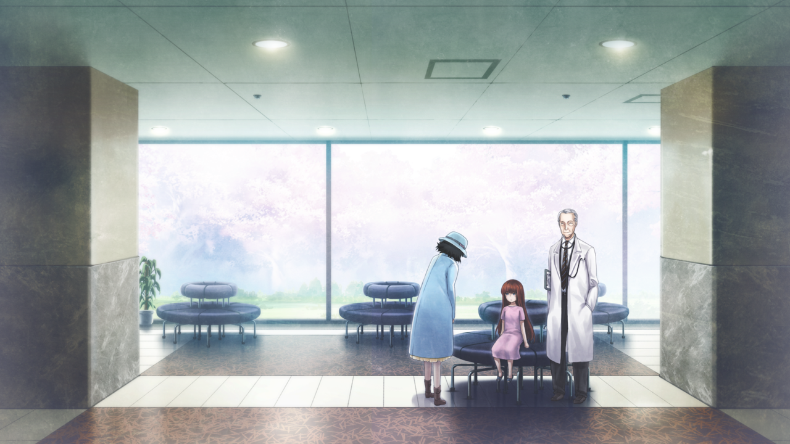
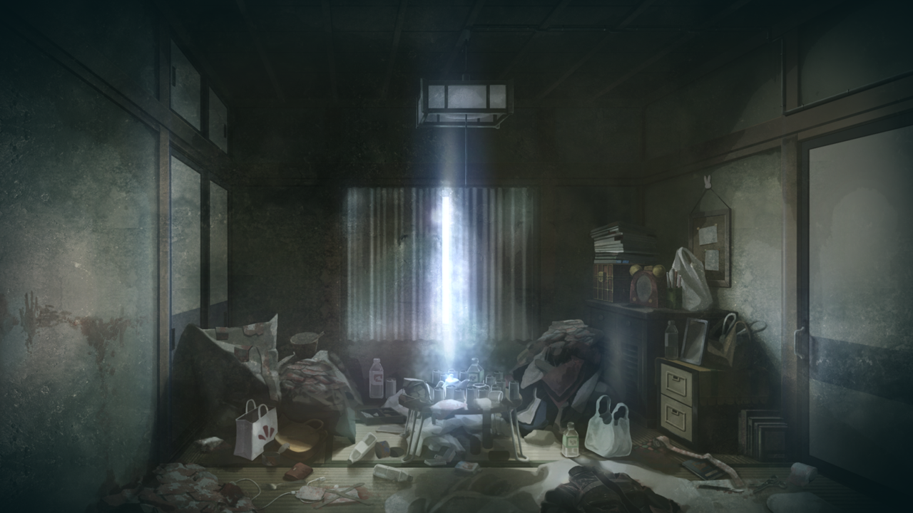
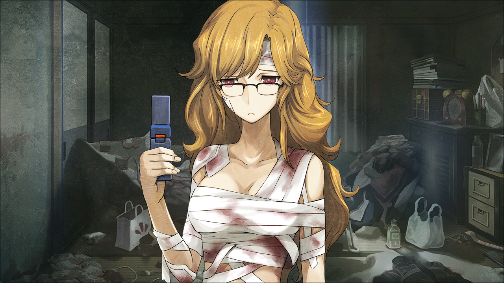
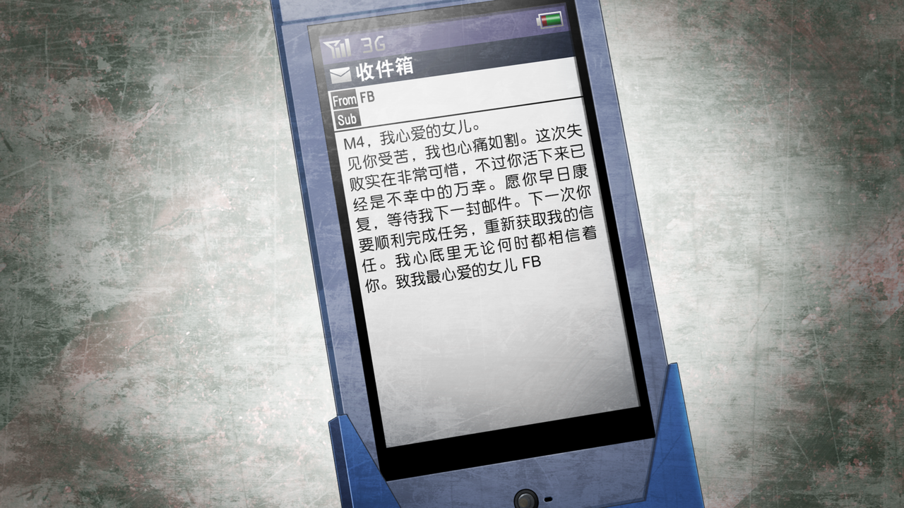
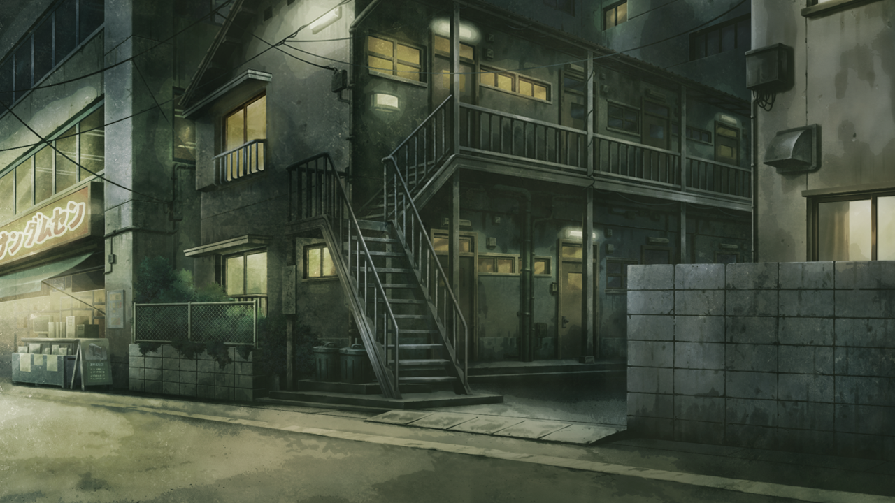

# 弹性界限的认知 - 01
> 1.129954  
> [ 篝视角 ] 篝 6 岁时在战争孤儿养护机构，正式成为真由理的养女。然而名义上的治疗实际上是洗脑，并且很有可能是小时候就接受过洗脑，在医院只是进一步植入指示。桐生萌郁抢夺电脑任务失败后被组织惩罚身受重伤，篝救她回公寓，并假借 FB 的名义控制了她。  

| [←prev](./0144) | [menu](../) | [next→](./0146) |

---

[ 2032 ]

“篝酱，今天呀，我们正式成为母女了哟\~”  
这是篝 6 岁的那一年。当时，篝被战争孤儿养护机构接纳，并在相邻的专业医疗设施接受治疗。和满是负伤者的一般医院完全不同，那里如同一个飘扬着牧歌的、能够让孩子安心生活的庭院盆景，与被绝望所支配的外界隔离开来。就在这里，篝与妈妈相遇了。妈妈——椎名真由理，是这所养护机构的二等养护官，一直亲切地照顾着篝。  
“真的？妈妈，变成篝真正的妈妈了吗？”  
“嗯，是的哦\~”  
“太好啦！妈妈！”  
任何语言都无法表达篝在那一刻的喜悦。如果和妈妈成为了真正的母女关系，也就意味着，“篝”这个名字将从临时的称呼变为她真正的名字。她，将会重生为椎名篝。  
“啊，哎呀，不要那么粘着我啦。嘿嘿嘿，篝还真是个爱撒娇的孩子呢\~”  
“那，这样的话就能离开这里了吧！？能和妈妈一起生活了吧！？”  
“……对不起呐，篝酱，貌似还有一些必要的治疗。”  
“是的呢。”  
“啊，医生……”  
那位“医生”走了过来加入了话题。篝并不知道他的名字，只知道是一位对她非常温柔的老爷爷。  
“还有半年就要结束了呐，再稍微忍耐一下哦。”  
“那个，半年吗？记得之前说的是，还有大概两周就可以了……”  
“那只是说身体上的创伤罢了。经历过东京大空袭的孩子们，心理上的创伤，可比大人要严重多了呐。  
 而且，通过昨天的诊断了解到，篝酱还是会梦见恐怖的事物。”  
“是这样吗，篝酱？”  
听到这话，妈妈露出了担心的表情。  
“没、没有啦，已经不会再梦见恐怖的东西了哟，都是很开心地梦哟，非常非常开心的！”  
“唔嗯……篝酱，说谎可是不好的哟。这样的话，治疗时间是会被延长的哦。”  
“啊唔……”  
“昨天你不是跟我说，现在还经常在夜里被恐怖的梦吓醒吗？”  
“……嗯。”  
当着医生的面，篝也只能低下头承认了。  
“啊……这样啊……”  
“这就证明，这孩子脑中还残存着关于空中轰炸的恐怖记忆呐。  
 现在不好好治疗，以后就来不及了。”  
“确实如此……”  
“情况就是这样，让她继续接受治疗没问题吧，孩子的‘妈妈’？”  
“啊，好的。篝酱，努力把这不好的病赶走吧。”  
妈妈被医生说服了，转过来抚摸着篝的头。只是这样，篝就感受到几乎要落泪般的安心感。  
“我知道了……”  
“嗯，真是好孩子。”  
“那，就之后再见了呐，篝酱。”  
“妈妈……”  
妈妈正在抚摸篝的手离开了。医生的大手取而代之，牵着篝，来到了熟悉的房间。  

这里是篝已经待过很久的治疗室。篝熟练地躺在白色的柔软舒适的可调节座椅上，戴上像是头戴耳机一样的装置，耳机连接着一个看起来冷冰冰的复杂装置。  
（听到了——一直以来的那个声音。）  
【你要保护妈妈，保护这个世界，你是为此才诞生的哦。】  
篝怎么也想不起来，是从什么时候开始听到那个声音的。但是，6 岁的时候，每当篝感到迷茫、烦恼和困扰的时候，就会听到那个声音，一直都温柔且有力地激励着她。篝幼小的心灵，认为那或许就是神明大人的声音。因为只有篝能听见，其他人都认定这是某种病状，唯有妈妈相信着她。  
（我要保护妈妈。所以，要努力接受治疗……!）  
幼小的篝心中唯一一直保有的对未来的希望，就是未来和妈妈——也就是真由理一起生活。  

[ 2011/06/03 ]

打开门，一股令人不快的热气就裹在了椎名篝的脸上。6 月初的这一天，标志着今年正式进入了夏天。室外是让人只是走一走就会冒汗的烈日，这间六叠大的房间紧闭着窗户，拉着厚厚的窗帘。这个房间昏暗狭小，地上乱七八糟，几乎连落脚的地方都没有。不只是衣物，还有各种各样的脏东西——吃剩下一半的甜面包就这么放在袋子里，还有腐烂了大半的菜饭放在盒子里，更有大量的垃圾放在便利袋里，被随意扔在各处。此外，还有一名半裸的女性依靠着墙壁呆坐在房间一角，周围散落着大量满是脓血的纱布和绷带。那名女性的腹部、胸部以及手脚也都随意地缠着绷带，上面也满是脓血。也不知是来自那些腐烂的垃圾，还是那名女性自身……房间弥漫着一股带着腥味、还有些甜腻的恶臭。  
“……！”  
听到开门的声音，房间的主人——桐生萌郁抬起头，投来了满是期待的目光。  
“M4，你还没死呐？”  
看到是穿着鞋就走进室内的篝，桐生萌郁沮丧地沉了下肩。  
“不是……FB……你是谁……？”  
“对救命恩人这么说话，还真是过分呢。”  
“咕……咳咳！”  
桐生萌郁猛地咳嗽了几下，呕出一滩混着血的胃液，弄脏了自己的大腿和榻榻米。  
“咳……哈……哈啊哈啊……”  
桐生萌郁艰难地喘着粗气，腹部的绷带渗出一片鲜红的血渍，似乎是伤口又裂开了。  

她没有接受医生的治疗，从 5 个月前起，就一直是这个样子。那一天，作为 Rounder 的桐生萌郁在作战行动中失利，遭遇俄罗斯军队发生枪战，不仅损失了两名队员，还没有成功获取目标——牧濑红莉栖的笔记本电脑。那之后，因为失败受到处分而身负重伤。那时椎名篝发现了奄奄一息的她，把她带回了这个房间。然而，因为她全身的伤口中有一部分是枪伤，所以不能去常规的医院，避免院方通知警察而惹上麻烦。因此，桐生萌郁没法接受正规的治疗。她的伤口不断化脓，过了 5 个月依旧疼痛无比。并且高烧不断，严重的时候能达到 39 度甚至超过 40 度。  
但是桐生萌郁本人，对自己的伤势毫不在意，反而一直握着手机片刻不离，拼命地发着邮件。篝不用猜也知道，她肯定在是在不断地发给敬爱的上级，仅在这短短 5 个月，就已经发了近千条。  
“……为什么？FB，为什么不回信？”  
FB，是桐生萌郁在 Rounder 的上级，一直通过邮件交流，给桐生萌郁发送指示。桐生萌郁对这位女性上级的感情，远远超出了对工作上级的崇拜。比起身体的痛苦，联系不上 FB 的痛苦要超过千万倍。  

篝将身上的背包，还有双手的塑料袋放在了桐生萌郁脚边。背包中，有一些处方药，还有一个盒子，里面装着用来抑制疼痛的违禁药物。原本这些药物是由医院严格管理的，一般人很难入手。塑料袋中，尽可能地塞满了罐装速食，以及不易腐败的食物。  
“如果觉得活腻味了跟我说一声，下次会帮你带毒药过来。”  
桐生萌郁对篝的话毫无反应，似乎在她眼中这里根本不存在其他人。5 个月以来篝也已经习惯她这种态度了。不过，今天的篝不打算继续放任她，沉默着伸手抓住了桐生萌郁手里的手机。  
“你、你要干什么……！”  
桐生萌郁企图反抗，可是她完全使不上力气，手机轻易地被篝夺走。虽然上面还沾着脓血，但篝没有什么犹豫，将其放进了自己衣服的口袋里。  
“还、还给我……！”  
桐生萌郁挣扎地向着篝这边爬过来，那副样子，简直和丧尸一样。  
“别误会，是 FB 传来了新命令。”  
这次桐生萌郁听到了篝的话，瞬间停下了动作。  
“……FB 的……命令？”  
“是的，好好接下吧。”  
篝从另一个口袋里取出了一只手机，和桐生萌郁之前使用的是同一款翻盖机，只不过是崭新的，上面没有脏污与伤痕累累的使用痕迹。  
“以前的线路，已经被俄罗斯和美国的谍报部门侦测而无法使用，以后就用这个来接收指令。”  
篝递出手机，桐生萌郁战战兢兢地伸出双手。突然下一个瞬间，便迫不及待地夺过来，像对待自己的孩子一般抱在胸前。  
“FB……会给这个手机……发邮件吗？”  
“大概，已经发来了。”  
桐生萌郁焦急地翻开手机屏幕，查看收信箱里面邮件的内容。  

然后，桐生萌郁原本毫无感情的双眼流出了泪水。  
“『M4，我心爱的女儿…………FB。』呜……呜呜……”  
“明明不用特意读出来的。”  
不用说，那封邮件，并不是 FB 的亲笔信，而是篝伪造的。5 个月以来，放任其在生死边缘徘徊，使其丧失正常的判断力，然后再放出其最渴望的东西作为诱饵，不管是什么样的人都能轻松地被自己控制。对此，篝深得要领。  
“唔……”  
桐生萌郁的脸上，一下子恢复生机。开始像是着了魔一样，翻找着篝带来的背包。  
“伤……要治好……不能辜负……FB 的信赖……”  
“这样才对，M4。”  
篝露出了满意的笑容，在桐生萌郁面前蹲下。  
“我来帮你治疗，先把绷带都取下来……”  

篝从公寓走出来的时候，天已经黑了。为了帮助桐生萌郁治疗，花费了好几个小时，手上也满是药物的味道，看来没有几天是消不掉的。篝咂了一下嘴，戴上黑色的全覆式头盔，骑上了一旁停放处的摩托。  
“神明的声音，差不多，又要听到了啊。”  
篝喃喃自语，然后发动了摩托，疾驰而去。  

 

> (to be continued)

---

| [←prev](./0144) | [menu](../) | [next→](./0146) |
