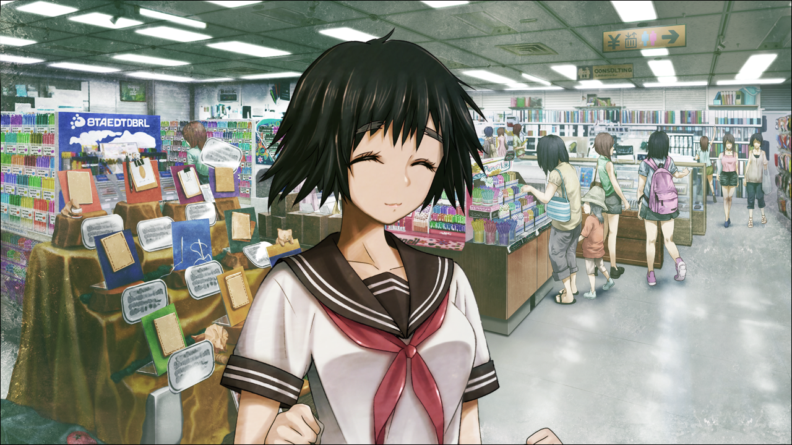

# 弹性界限的认知 - 02
> 1.129954  
> [ 2011/06/25 ] 与 0038 相似却略有不同的展开：在咖啡店发现『栗悟饭和龟波功』最近还在发帖，于是冈伦用『萨列里的邻居』的网名试探。  

| [←prev](./0145) | [menu](../) | [next→](./0147) |

---

马上就要进入 7 月了。今年的东京可能是干黄梅，至今还没有梅雨的迹象，却已经呈现出了梅雨期后的天气。从气温上讲，早就已经进入夏天了。  
（夏天啊……）  
也就是说……那个事件，已经快要过去一年了。  
这是个周六的午后。家里不仅闷热难当，还被老爸唠叨着帮忙店里的生意，于是我来到了池袋车站附近。如果是在一年前，还有 LAB 这个落脚处，现在因为铃羽住在那儿，就尽量不过去了。但是这样一来，休息日适合学习的地方，就不怎么好找了。去大学也嫌麻烦，休息日估计教室也不开放。经过种种考量，我最终决定，在离家较近的这间咖啡店坐几个小时。实际上，这种咖啡店里，像我这种点一杯咖啡坐几个小时的人非常多，有的带来了笔记本电脑，有的在读书。我说不定也加入了这些现充的行列了……不由得心中苦笑。  

正在咖啡店里看书的时候，手机响起了 RINE 的消息提示音。  
『嘟嘟噜\~♪现在在哪？』  
「」  
『啊，老地方的咖啡店啊』  
『刚才去了冈伦家，你不在』  
「你去我家了啊，老爸没有给你添麻烦吧？」  
『没有哟，还款待了麦茶』  
『我有些东西必须要买，能陪我去吗？』  
「」  
『』  
『那我现在就过去，在那等我哦』  

（那家伙，去过我家了啊……）  
我家的【冈部青果店】，位于一条古老的商业街中，建成差不多有 40 年了，残破得很，是时候该重新装修一下了。  
注意力没法集中了，还有不到 15 分钟真由理就到了，今天的学习就到这吧。上午把该读的都读过了，嗯，也算是可以吧。我都有些吃惊于自己最近的专注度，因为有了目标，简直干劲满满，我必须尽早达到去维克多·孔多利亚大学的条件。  
（维克多·孔多利亚大学啊……）  
我和比屋定有定期互发邮件和 RINE。她好像每天都在夜以继日地研究，总是一副睡眠不足的样子。  
我拿出了手机，下意识地在桌面寻找某个图标。但是，那个图标半年前就被我亲手删除了。  

不知道“红莉栖”现在还好吗？那家伙的话……肯定是在宣扬有点难懂的理论，或者开比屋定的玩笑吧。说不定还会瞒着比屋定，自己偷偷去看 @ch。也对，“红莉栖”也能上网浏览信息，因此看 @ch 并不奇怪。不过除此之外——  
（『Amadeus』也能在网络留言板上发帖吗？）”  
去年夏天，红莉栖为了驳倒约翰.提托，也拼命在 @ch 上发帖，虽然那是 α 世界线的事……这代表，红莉栖并不排斥在网络上发帖，那么“红莉栖”也有可能做同样的事情。『Amadeus』如果暂时获得联网许可，或许……我打开网页浏览器，几乎不抱期待地，试着搜索了那个不可能忘掉的网名——『栗悟饭和龟波功』——红莉栖过去在用的固定ID。  
“哇哦！”  
我不由自主地叫出声。面对其他顾客投来的冷眼，我微微点点头致歉，立刻看回手机的画面。令人惊讶地，搜索结果居然有几百条，貌似全部都是 @ch 的帖子。粗略看下搜索结果一览，确认日期，最早能追溯到 2008 年。这也是生前的红莉栖的遗留之物吗……竟然在这种地方都能发现红莉栖的痕迹。  
（话说，这也发得太多了吧……）  
没想到她是这么重度的 @cher……红莉栖发帖的版块有物理学、数学、科幻和……当然，也有很多在超自然板块。比如，SF 相关的帖子里，有关时间机器的问题，她都热火朝天地发表着意见。但和 α 世界线不同的是，她并没有完全否定时间机器，意外地，还发表过和肯定派相近的见解。  
（不，其实也没那么意外……）  
毕竟她可是私底下悄悄写出了货真价实的关于时间机器的论文啊。和那相比，在超自然板块上发的，只是一些激烈的讨论罢了。用仿佛让以前经常在电视上露面的某大学教授也会落荒而逃的气势，一个劲地驳倒那些拥护非科学主张的人们。比如解释麦田怪圈、闹鬼、人体起火之类的超自然现象，还有验证欧帕兹的可信性、玛雅历是否暗示了人类的灭亡、人类的基因是否来自地球外这些阴谋论。她以甚至会让其他人都感到扫兴的详细程度，分析关于神秘现象的小道消息，冷静而透彻地否定它们。如果有人勇于挑起争论，她就完全击溃对手。完全就是红莉栖的风格，条理清晰到令人无能狂怒。这家伙实际上，很喜欢这种关于神秘现象的小道消息吧？投入过多的热情才会对它们刨根问底吧。  
（不管怎么说，也太过孩子气了吧……）  
在和红莉栖第一次相遇的、去年夏天的 ATF，我也是这样被辩驳得体无完肤。但是……以那天为界，『栗悟饭和龟波功』的帖子应该就中断了吧。最后一条帖子定格在去年的 7 月 27 日，红莉栖去世的前一天，内容是针对嘲笑第二天中钵博士的时间机器发表会的言论，她有些较真的反驳。  

怀念和寂寥感，涌上心头。我正要关掉网页浏览器，却发现还有下一个帖子。看到上面标注的发帖日期，我一下子呆住了，然后将脸凑近手机屏幕，近乎执着地反反复复确认着那个日期——2010 年 12 月 1 日。  
（这，难道是……？）  
红莉栖死于 2010 年 7 月，因此，这不可能是红莉栖本人发的。那会是谁呢？毫无关系的人冒用了『栗悟饭和龟波功』？还是说……帖子没有带上用来确认个人身份的识别码，所以无法判断。不过去年 12 月 1 日，是比屋定和雷斯吉宁教授刚来日本不久，让我和“红莉栖”第一次会面的那一天……在那之后，『栗悟饭和龟波功』，以每周一次左右的频率持续发帖。我试着查了最新的日期——  
（不就是昨晚吗！）  
内容是关于相对论的，话风依然是老样子，在 @ch 上就很毒舌呢，喂……不过认真想一想，她好像当面也是这么说话的。假如这不是冒用，而是那个“红莉栖”发表的——这是多么荒谬又神奇啊。比屋定和雷斯吉宁教授知道这种事吗？应该不知道吧……因为“红莉栖”是绝对不会说的。我情不自禁地笑了起来。  
试着联系她一下吧？我想要确认，这个『栗悟饭和龟波功』背后是不是“红莉栖”。于是，我突然想到了一个很好的网名——『萨列里的邻居』。当然了，灵感来源于比屋定的 ID。假如『栗悟饭和龟波功』的背后就是“红莉栖”，看到这个名字，会做出相应的反应吧？  

编辑好了……发送。接下来会怎么样呢？我故意用了挑衅性质的语气，并且多多少少混进了一些错误的内容。虽然由我自己来说可能不合适，但是我觉得，我比雷斯吉宁教授和比屋定他们更了解红莉栖。  
“哼哼哼……应该会轻易上钩的，如果是‘红莉栖’的话……”  

“冈\~伦。”  
“啊……！”  
不知从什么时候开始，真由理站在了我面前。  
“什么嘛，你已经到了啊。”  
我太过沉浸于发帖，完全没有注意到。我连忙关掉手机站了起来。  
“那，走吧。”  
“……”  
“嗯？怎么了？”  
“没事，走吧\~”  

我和真由理来到了 HANDS（东京手创馆）。进到空调十足的店里，有种满血复活的感觉。这才 6 月份就热成这样，真不知道到了 7、8 月份该怎么办。  
“那么，到底要买些什么东西？”  
“那个，要做宣传商品用的 POP，所以，要买用到的卡片啊、荧光笔之类的。”  
“今年准备在漫展出同人本吗？”  
“不是的，是用在【冈部青果店】的哟\~”  
“啊？你说什么……？”  
我家的店？  
“今天，去冈伦家的时候，和叔叔谈到了这件事。  
 ‘那么就让真由喜来做！’——这样提案了。”  
“喂喂……”  
老爸那家伙，真是厚脸皮啊。  
“你没有必要做这事哦。”  
“但是但是，真由喜是想要做才做的。”  
“真的……没关系吗？”  
“因为总是受冈伦和叔叔阿姨的照顾呢。”  
“……那么，作为补偿，下次会送你礼物的。”  
“真的？好开心呐！”  

  

大致转了一圈卖场，用于 POP 的材料种类相当多。我尽量不发表意见，让真由理按自己的品味选择。真由理花了相当长的时间，仔细地斟酌着该买哪个好。只是，是因为平时在 *MayQueen+Nyan²* 待久了的原因吗？真由理的品味该怎么说呢……偏向于萌系的方向。  
“啊\~你看你看，这个心形的也很可爱呢\~”  
“明明是卖蔬菜水果的店，心形的要怎么用？”  
“嗯——？比如说，这么写怎么样？  
 ‘好大好大的松茸君\~♪这位太太，把它作为今晚的配菜如何？’”  
 还有就是……‘甜甜的黏黏的\~要快点吃掉哟\~♪成熟的小甜瓜酱！’  
“这……你该不会在不知不觉中被桶子洗脑了吧？”  
“诶~？”  
“啊，不，没什么。”  
真由理懵懂地歪着头，丝毫没有感觉到邪念。  
“总之，不可以用心形 POP，会让人觉得我们家的店是奇怪的店。”  
“这样吗？我觉得很可爱啊\~？”  
“不需要可爱啦……”  
本来我不打算发表意见的，结果还是说了很多泼冷水的话。  
“再说，再买就绝对太多了哦。”  
我手里的购物篮中，已经装了一大堆形色各异的卡片。  
“有这些就暂时够用了吧。”  
“是呢，那，就到这里吧\~”  
我们走向了结账处。  

因为是周六，收银台附近等待结账的客人堆得满了出来。感觉要排很久的样子，我就让真由理到别的楼层的动漫周边卖场去等我，那里会有真由理喜欢的《雷 NET 翔》的周边商品出售。真由理不好意思地按我说的去了。  

结果，结账花了 15 分钟。同时我为表歉意许下的送礼物的约定也兑现了。  
“诶嘿嘿\~\~♪”  
真由理高兴至极地注视着手上的钥匙圈。  

这是《雷 NET 翔》中登场的吉祥物角色“乌帕”。我让真由理在动漫周边卖场等待的时候随便选个喜欢的东西，于是她拿了这个。  
“乌帕的话，明明已经有很多了……还会这么高兴啊？  
 而且，这只是普通的绿色乌帕吧，不是稀有的那种啊？  
 稀有的貌似是……金属乌帕来着？”  
全身闪烁银色光辉的金属乌帕，在乌帕之中人气很高，作为商品的稀有度也很高。如果作为便利店的抽奖奖品，金属乌帕肯定是特等奖。之前也听真由理说过，在网上拍卖应该能值好几万。  
“不，不，不——”  
真由理不知为何露出得意洋洋的表情，左右摇动着食指。  
“不是的哦\~这个啊，虽然是绿色的乌帕先生，但是和普通的不一样哦！  
 这是在之前放映的电影中登场的‘绿之妖精先生乌帕’哟！”  
说起来，《雷 NET 翔》的剧场版在春季上映了呢，看来真由理也混在小孩子当中去看了。  
“绿之妖精先生？”  
“剧透电影的情节没关系吧？”  
“没事，反正不会看的。”  
“那个，这次的电影啊，是在虚拟世界中与邪恶的超级黑客先生战斗。  
 那个虚拟世界啊，就是妖精先生住的森林。  
 超级黑客先生特别强呢，翔君和乌帕们都陷入了危机……  
 ‘已经要不行了\~！’的时候，妖精先生们前来帮忙了呢。  
 其实，那些妖精先生们，就是翔君在照顾的学校花坛的花儿们哦\~  
 为了拯救一直都温柔地照顾它们的翔君来到虚拟世界，  
 ‘皮卡皮卡\~’地放着光与乌帕合体了！  
 就成为了这个‘绿之妖精先生乌帕’！超级可爱，超级强大的哟\~  
 真由喜好感动呀\~对这类剧情完全没有抵抗力呢\~导演先生真是天才啊\~”  
“原、原来如此啊。”  
很少有事情能让真由理这么热衷地诉说。的确，仔细看的话，能发现真由理拿着的乌帕和普通的绿色乌帕在设计上稍微有些区别。因为不怎么了解乌帕，具体有哪里不一样……要是被这么问的话还是一头雾水。  
“这个钥匙圈啊，我到处找过好久呢\~  
 超级有人气的，不管哪里都卖完了哟\~  
 没想到 HANDS 还有存货呢\~”  
“很幸运呢。”  
“嗯！而且，这是最后的一个哟\~今天来了真是太好了，要感谢冈伦和叔叔呢！”  
真由理用指尖灵巧地拆开纸质的商品包装，从包里取出家里的钥匙，然后小心地装了上去。  
“嘿嘿\~呐，冈伦，真由喜啊，会把这个一直\~一直\~\~珍藏着的！”  
“啊，好好珍惜吧。千万别才买了 5 分钟就丢了哦。”  
真由理可是有前科的——我在广播馆抽到的金属乌帕，在交到真由理手中后，仅仅 5 分钟就弄丢了，到最后也没有找到。我不怎么想回顾那个时期的事情，所以最终金属乌帕的去向也就不了了之了。  

“嗯！绝对、绝\~对\~\~不会再弄丢的！”  
一边聊着，两个人踏上了回家的路。  
“冈伦家店的 POP，我会鼓足干劲去做的！”  
“啊——还有这回事啊……”  
还以为买完材料就算结束了，不如说现在才要正式开始。  
“要我帮忙吗？”  
“不不，没事的，希望你能相信真由喜的品味啊\~”  
“……光是要买心形卡片这一点，就该怀疑你的品味了。”  
“没问题的啦\~”  
“嘛，能帮忙弄 POP 已经很感谢了，所以我也没什么抱怨的。”  
“啊，要给妈妈发个信息呢，告诉她晚饭的时候再回去。”  
“那干脆在我家吃也行啊？反正我爸妈他们肯定要留你的。”  
“唔嗯\~怎么办比较好呢\~  
 接下来的时间冈伦会一直在家的吗？不去联谊什么的吗？”  
“最近完全都没去了。”  
去年秋天，刚放下中二病那会儿，我倒是打算当一个普通的大学生，然后十分勉强地跑去参加各种联谊来着。最近则是忙于学习的事，去参加的机会也减少了。  
“这样啊\~那，我就去打扰了\~”  

就在真由理放下纠结拿出手机，想要输入邮件的时候——  
她的表情突然沉了下来，就那么站在原地不动了。  

 

> (to be continued)

---

| [←prev](./0145) | [menu](../) | [next→](./0147) |
