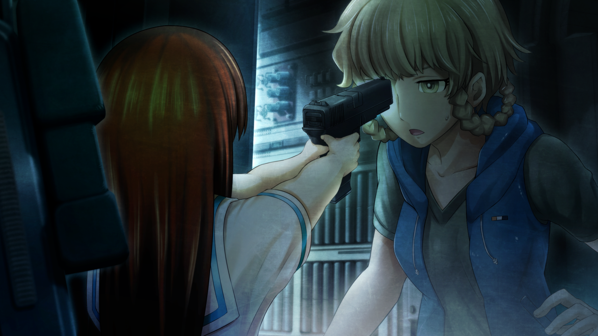

# 弹性界限的认知 - 04
> 1.129954  
> [ 1998/08/13 铃羽视角 ] 同 0040。  

| [←prev](./0147) | [menu](../) | [next→](./0149) |

---

1998 年，铃羽与椎名篝分别的那一天，天气很热。铃羽从附近商店补充了食物和水，回到时间机器打开舱门后，听到了篝歇斯底里的声音：  
“啊——真是的！完全搞不懂啊！”  
铃羽凑近看向机器内部，发现篝正在用她的小手吧嗒吧嗒地使劲敲打着控制台。  
“你……在干什么？”  
“啊……”  
篝看着铃羽的脸，蜷缩起了身体。  
“不、不是的……这是……那个……”  
“回答我。”  
“因、因为……因为！醒来之后，发现铃羽姐姐不在，
 周围好黑又没开灯，这里又狭窄又可怕又难受！  
 所以，我想把门打开……  
 然后，我就试着按一下这里按一下那里……就变成了这样……”  
她这么说着，开始流下了一滴滴的泪水。  
“对不起铃羽姐姐，对不起……但是我真的好怕，所、所以……”  
“……这样啊。”  
铃羽解除了对篝的戒心。之前听说过，篝是战争遗孤，有严重的心理创伤，好像还没有完全治愈。未来的真由理也说过，篝特别害怕黑暗和封闭的地方。既然这样，篝会恐慌也是情有可原。而且，这台时间机器，没有铃羽的生物体征验证是无论如何也无法启动的。凭篝的力气，就算再怎么用力敲打，也破坏不了控制台吧。  
“你因为时间移动的冲击失去了意识，所以才把你留在这里休息了……抱歉。”  
铃羽牵住篝小小的手，拉着她离开了座位，来到了机器外面。  
“呜哇……好热……”  
“篝，我们说好了，不管发生什么事，都不能碰控制台的按钮，可以吗？”  
“嗯、嗯……”  
“那么，我还有工作要干，你就在边上休息一下，随便吃点喝点什么吧。”  

铃羽把采购的食物和水递给篝之后，自己进入机器内部，把头探进驾驶座下面的储物仓，从里面取出一台 IBN5100，然后连接上从 2036 年带来的手机终端。虽然外观看起来很像 2000 年初期的手机，其内部却是 2036 年的小型量子计算机。当然，这也是未来的桶子亲手制造的。  
启动 IBN5100 之后，手机终端的屏幕上开始罗列出让人眼花缭乱的数据。  
“在干什么？”  
篝从机器外面凑过来看。  
“学过‘千年虫问题’吗？”  
“在设施学校稍微学到了一点，最后什么都没发生对吧？”  
“表面上是这样呢。”  
“嗯……？”  
“虽然没有被公开，可是在当时，因为那个问题，很多国家和地区都收到了严重的影响。”  
“是……吗？”  
“问题根源的就是这种 IBN5100 电脑。  
 它采用了一种古老的编程语言，技术人员没有修复某个程序的问题。  
 或者说，他们完全不知道，里面有一个使用这种语言编写的重要程序。  
 第三次世界大战，虽然表面上是以时间机器的竞争为导火索——  
 但更深层的原因可能是，由‘千年虫问题’引发的某个事象，以及由此引发的分歧。”  
铃羽不觉得年仅 10 岁的篝能理解这种话题，所以她也没打算深入说明。  
“而且，公元 2000 年是一个特殊的年份，好像所有的世界线收束成了一条。  
 以此为关联，这个问题说不定会严重影响所有世界线因果。  
 我们作为目标的‘处于缝隙的世界线’——命运石之门，也不例外。”  
铃羽把视线转向连接着 IBN5100 的手机终端。  
“所以这正是为了防止‘千年虫问题’的修正程序哦。”  
现在，她正在将修正程序转换成 IBN5100 专用语言。之后，再把这个程序以病毒的形式扩散到全世界，就能完全解决被这个时代的工程师忽略的“千年虫问题”。  
就在这时，手机终端的辅助屏幕上显示了 “CONNECT” 这个单词。  
“OK，连上了。”
听说这个时代的日本，ADSL 线路还处于测试阶段，一般用户的网络环境应该是使用 ISDN 的低带宽拨号链接。不过，类似秋叶原周边的大城市地区，大学和研究所，以及 PC 相关企业的核心区域，已经配备了可持续连接的光纤宽带线路，其中有些设施甚至已经开始使用无线局域网了。铃羽入侵了其中一处。爸爸曾经笑着说，在 2036 年的技术面前，20 世纪末的网络防火墙就像纸一样——事实上也的确如此。  

“但、但是……如果改变了未来，篝和大家在一起的未来世界……也会完全改变的吧……？”  
令人意外的是，篝好像粗略地理解了刚才铃羽所说的话。  
“没错，不会让那种世界存在了，我们就是为了抵达命运石之门才来到了这里。”  
“……”  
突然，篝本来带着不安表情的脸沉了下来。她仿佛灵魂出窍一般，缓慢地睁大双眼，面无表情。  
“**声音……听到了，神明大人的……声音……”**  
“篝？”  
“不行哟，这样不好的……绝对不行哟，铃羽姐姐，那么做……不可以的。”  
“喂？”  
篝的状态很奇怪，铃羽觉得不对劲，伸手向篝那边。可是，篝避开了铃羽的手。她用完全不像孩子的敏锐动作，用肩膀冲撞过来。  
“——啊！？”  
铃羽对篝这般迅猛的动作一时没有反应过来，眼看着对方的肩膀陷入自己的胸口。  
“嘎哈！”  
铃羽受到冲击，倒在了驾驶座上，手里的手机终端也被篝抢了过去。她用力扯开了连接 IBN5100 的线缆，两台设备的画面随即都显示了错误提示。  
“喂，你、在干什么——！？”  
铃羽声音颤抖着发问，然而篝没有回答。这个时候，她正拿起铃羽放在驾驶座上的帆布背包，倒出了里面所有的东西。方便食物、小零件、衣服等物品和自动手枪一起散落在地板上。铃羽吃了一惊，因为篝明显是要捡起那件东西。  
“住手！”  
铃羽忍住痛苦，纵身向篝扑过去，却又一次被她不可思议的力量顶飞了。  

“……！”  
冰冷的东西顶在了铃羽的眉间。  
“不许动！”  
篝握着自动手枪，小手没有一丝抖动。借着刚才那瞬间的空当，她解除了枪的保险。见状铃羽明白，篝绝对不是在胡闹发脾气。教会篝用枪的正是铃羽，所以她很清楚，篝现在非常冷静。  
“你认真的？现在马上把枪放下！立即停止这种闹剧！”  
“该停止的是姐姐你！”  
“什么？”  
“不能改变这个世界！姐姐说的话太奇怪了！”  
篝的眼里没有一丝动摇，只有坚持到底的决心。  
“那就这样，眼睁睁地看着战争发生也无所谓吗？”  
“我才不懂那些呢！我只想回到原来的世界啊！”  
“那个……已经不可能了。  
 我们已经用时间机器干涉了过去，世界线应该已经发生偏差了。  
 回到那里的可能性很低——”  
“吵死了吵死了吵死了！我绝对要救妈妈！  
 不能让这个世界消失！绝对不会让你这么做的！”  
篝声嘶力竭地哭喊着，把枪口对准了 IBN5100。  
“住、住手！”  
铃羽来不及阻止，篝不假思索地扣动了扳机——一枪，又一枪……  
“给我停下，篝！住手！”  

那之后，篝飞奔出了时间机器——  
——再也没回到铃羽的身边。  

 

> (to be continued)

---

| [←prev](./0147) | [menu](../) | [next→](./0149) |
