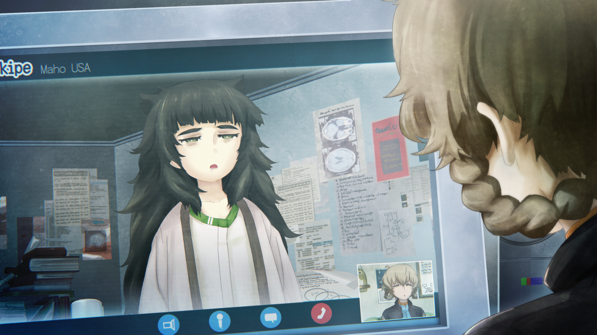

# 弹性界限的认知 - 05
> 1.129954  
> [ 2011/06/月末 铃羽视角 ] 在 0041 基础上添加剧情：比屋定远程协助桶子偷偷开发时间机器；研究所不批准她来日本的申请，她决定偷偷过来；未来桶子的同伴中没有比屋定。  

| [←prev](./0148) | [menu](../) | [next→](./0150) |

---

“……”  
“没有一个晚上不回想起篝的。”  
“虽然来到这个时代后不久就去寻找篝了，但还是没有发现关于篝的线索。”  
“但是——现在大概已经成长到 22 岁的椎名篝确实在这个秋叶原。”  
“铃羽对此确信不疑。”  
“喔、真帆碳，早啊。”  
“铃羽的身边，朝向 PC 的桶子对着显示器发出了声音。”  
“显示器里映出的视屏聊天画面，在那里出现的是一位衣冠不整的少女——纠正，了不起的成年女性。”  

“……早。”  
“在这里，秋叶原的未来小道具研究所的时钟指向的是下午 8 时 30 分。”  
“另一边，“Daylight Saving Time”，通常所说的位于夏令时的维克多·孔多利亚大学更有 1 小时的时差，现在是上午 7 时 30 分。”  
“比屋定小姐，没事吧。”  
“这个时间，刚睡醒吧。”  
“真帆的样子惨不忍睹。”  
“虽然头发乱蓬蓬的一直都那样，但是充血得通红的双眼不仅没有焦点，而且视线飘忽不定。”  
“眼圈下的黑影厚得只是稍微化妆下是掩盖不住的程度。”  
“也许是错觉，脸颊也消瘦了，本来就已经瘦小的身体又缩小了一圈的感觉。”  
“而且，肤色非常惨白，简直就像僵尸一样完全没有生气。”  
“低血压的真帆碳也好萌啊。”  
“……”  
“换作以前的话，对于桶子这样胡乱的称呼方式，真帆是不会隐藏不愉快的表情的。”  
“最近不知是习惯了还是放弃了，对此没有表现出特别的反应。”  
“……你们那边进展怎么样？”  
“总算重新组装到了冈伦分解掉之前的状态，我想机能基本能够重现出来。”  
“桶子把视线投向了 LAB 的深处，通称为『开发室』的隔帘里面。”  
“现在，也获得了真帆的协助，正在重新制作被冈部称为时间跳跃装置的机器。”  
“……进展不顺利吗？”  
“嗯，该说是不稳定吗，变成了普通的微波炉了。”  
“是吗……”  
“……到底哪里不对了呢。”  
“向冈伦问下这个就能知道哪里不对了。”  
“不行的……光是知道我们在这样做就会发火了。”  
“叔叔是在畏惧着这个被称为世界线收束的力量。”  
“要说服那个人不容易。”  
“实际上，铃羽一直都无法说服冈部，马上就要过去 1 年了。”  
“嗯……”  
“暂时沉默了一会。”  
“……”  
“呃，真帆碳！难道睡着了？”  
“哇！？”  
“显示器中的真帆身体哗地震了一下，差点连椅子一起翻到。”  
“……好危险，明明马上就要出勤了，差点又要睡着了。”  
“话说，拼过头了吧，勉强过度把身体搞坏了不是毫无意义吗？”  
“这点程度小意思，反而，都做到这种程度了，还是比不过“天才”啊。”  
“我觉得没有那么回事，我认为真帆碳也足够称得上天才——”  
“安慰的话就算了。”  
“冈部所说的时间跳跃，明明有这么多提示了，然而到现在还找不到其中的“答案”。”  
“记忆数据这么巨大的东西，到底是如何压缩并发送到过去的……”  
“明明红莉栖已经成功了……”  
真帆看起来有些急躁，那份急躁通过显示器传达了过来。  
“啊，对不起，不是抱怨的时候呢。”  
“今天的报告还有其他什么事吗？没的话，我想我差不多要上班了。”  

“还有一件事。”  
“铃羽这么说看向了桶子。”  
“关于之前你拜托的希望调查的事。”  
“知道什么了吗？”  
“明确的事还不清楚。”  
“是吗……”  
“试着强行入侵各处的网络，做到极限了。”  
“我没有责怪的意思，告诉我现在知道的事吧。”  
“不，反而猛烈地怒骂过来也 OK 哦。”  
“爸爸！”  
“快点，时间不多了。”  
“是是。”  
“桶子打开了显示器中的另一个窗口，文件夹中的某个文本文件被显示了出来。”  
“那里面写着桶子和铃羽搜集的信息记录。”  
“那么首先，真帆你们在酒店地下停车场被袭击的事件。”  
“根据警察的声明，是新兴宗教集团的男子因使用违禁药物导致的……这么说来着。”  
“那个，肯定是骗人的。”  
“假的……？”  
“犯人的身份和警察发表的一样，是某个大学的准教授。”  
“这点还好，但是他所属于宗教团体的事实根本查不到。”  
“我也入侵了安全局秘密藏有的教团成员数据，所以确定。”  
“也就是说……是捏造的吧。”  
“看了下 @ch 之类的，类似信徒的人偶尔会留言说“教团是无辜的”、“是阴谋”之类的。”  
“于是，一瞬间很多的教团黑涌了出来并往死里喷。”  
“而且那些喷子们，不断地拿出非常逼真的假证据，还附有图片。”  
“不管怎么说，那也有点异常。”  
“是吗？我，对那个 @ch 不太熟悉……”  
“包括 @ch 在内，大部分的大型网站都有水军看着。”  
“而且是作为职业收取工资的，从早到晚 24 小时盯着。”  
“情报操作，就是政治宣传呢。”  
“政治家和官僚们也利用网络舆论的引导，也有专业从事这方面的公司存在。”  
“原来如此，那我就明白了，这方面美国和日本都一样呢。”  
“但是水军什么的，以我来看就算换了 IP 也一目了然。”  
“于是查了一下发现，那件事投入了相当人数的水军的样子。”  
“到达了“哪来这么多钱请人”的程度。”  
“是吗……”  
“老爸工作地点被袭击的事件呢？”  
“那边也一样。”  
“在警察公布的消息里，事情的原因变成了想要在日本扩张地盘的国外黑手党组织之间的斗争。”  
“媒体也意外的老老实实地按照这样报道了，就连平时对于媒体的报道绝对不轻信的 @ch 上，也极为不自然地只认为这个报道为是正确的。”  
“当然，俄罗斯和 SERN 的事甚至都没有成为话题。”  
“然后，我试着假装成目击者发表了看见了俄罗斯的特种部队的帖子。”  
“于是啊，变得不得了了，批判声浪如潮吓了一跳【校注：Let’s 炎上】。”  
“那个时候，恨不得把水军的真名和公司名全部暴出来呢。”  
“看样子是相当的气愤。”  
“桶子像这样生气的样子很……不罕见的样子，铃羽纠正了想法。”  
“也就是说，某处施加了压力，事件被落下了帷幕这么一回事吧。”  
“不亏是日本，自由的国度啊。”  
“美国不也差不多么。”  
“没错。”  
两人露出了讽刺的笑容。  
“所以，我举手投降了。”  
“是吗……”  
“这足够了，感谢你的调查。”  

“比屋定小姐，研究所能通过来日本的许可吗？”  
“……那个，虽然以作为雷斯吉宁教授的助手带我一起过去这样申请过好几次，但是却都是否决。”  
“雷斯吉宁教授现在，来了这里吧？”  
“嗯，是关于新型脑炎的调查。”  
“因为不是关于人工智能的事情，真帆不能与之同行的样子。”  
“好吧，如果怎么样都不行的话，我也有想法。”  
“你准备怎么样？”  
“难道！即使无视长官的命令也要贯彻正义之类的！？然后被坏人抓住吧我懂的。”  
“那个那个真帆碳，“哼，杀了我吧”这么说说看，可以的话摆出非常不甘心的表情。”  
“哈？”  
“老爸！”  
“铃羽摆出了手伸到裤子口袋附近的样子之后。”  
“抱、抱歉。”  
“桶子马上头缩了起来并道了歉。”  
“最近只要这么做，就能阻止桶子无聊的笑话。”  
“习惯了处理方式这点是好事呢还是可悲的事呢。”  
“总之，最近会去你们那边。”  
“知道了，行程决定了就联络我们。”  
“另外，比屋定小姐，如果要出勤的话，再照一下镜子比较好。”  
“铃羽对着就要关闭视频聊天的真帆这么忠告道。”  
“……？”  
“真帆没有关掉视频聊天就离开了座位，走向壁橱。”  
“虽然从画面里消失了，但是不久——”  
“哇啊啊啊！”  
“大概是看到了自己吓人的样子了吧，回响起不像是女性的惨叫。”  

“结束了视频聊天，休息了一下。”  
“铃羽大致地回忆了成为时间旅行者之前的自己的记忆。”  
“和真帆进行视频聊天之后这么做成为了习惯。”  
“嗯。”  
“开发时间机器的协助者……比屋定真帆……吗？”  
真帆瞒着冈部对铃羽和桶子提出协助开发时间机器是在她回到美国之后。那也就意味着，现在到 25 年后桥田至完成时间机器的过程中，比屋定真帆也以某种形式参与其中。但是——  
“虽然说太多未来的事不太好……但是父亲的同伴中，没有这个名字的人啊。”  
“唉？是吗？”  
“也就是说，以某个契机脱离了开发成员这样吧。”  
“虽然不知道是以自己的意志呢，还是因为其他的外部因素呢。”  
“至少，不是开发的主要成员。”  
“是吗，是个相当可靠的人呢。”  
“……虽然不想这么说……也有可能是哪里的间谍。”  
“等！？不管怎么说，唯独真帆碳不会这样吧。”  
“抱歉。”  
“……但是，只是有这样的可能性这点要记在心里。”  
“说过了吧，第三次世界大战前的情报战已经开始了。”  
“……”  
“不管怎么说，随意地泄露机器的秘密很不好，哪怕只是这点也要好好的注意哦。”  
“嗯、嗯。”  
“那么，接下来的时间机器开发准备怎么办？”  
“嗯——果然没有冈伦的协助的话——”  
“结果，还是这点啊。冈伦叔叔……果然还是不行吗……”  
“既然这样，就强行地……”  
“之前，想这么做却失败的是哪位啊。”  
“……”  
“铃羽默默地噘起嘴唇。”  
“冈部伦太郎被枪指着威胁着，也不肯再次乘上时间机器。”  
“就铃羽来看，老实说已经毫无办法了。忍住了想要叹出的一口大气。不能一直悲观下去了。  

 

> (to be continued)

---

| [←prev](./0148) | [menu](../) | [next→](./0150) |
