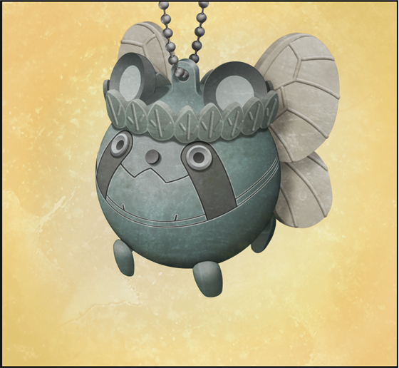
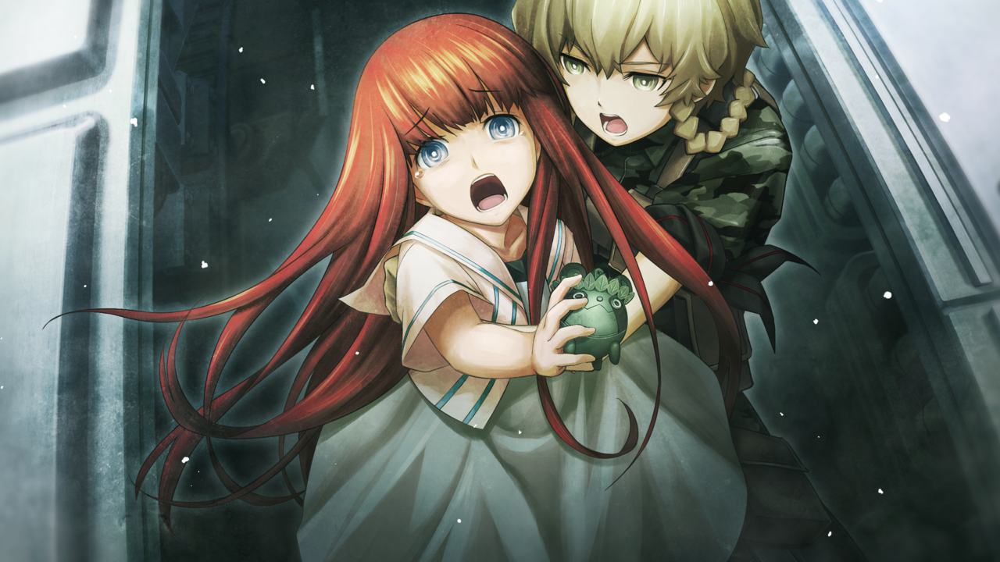
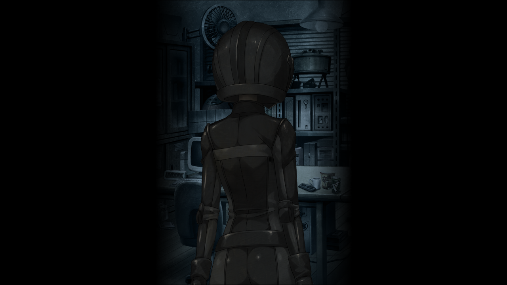
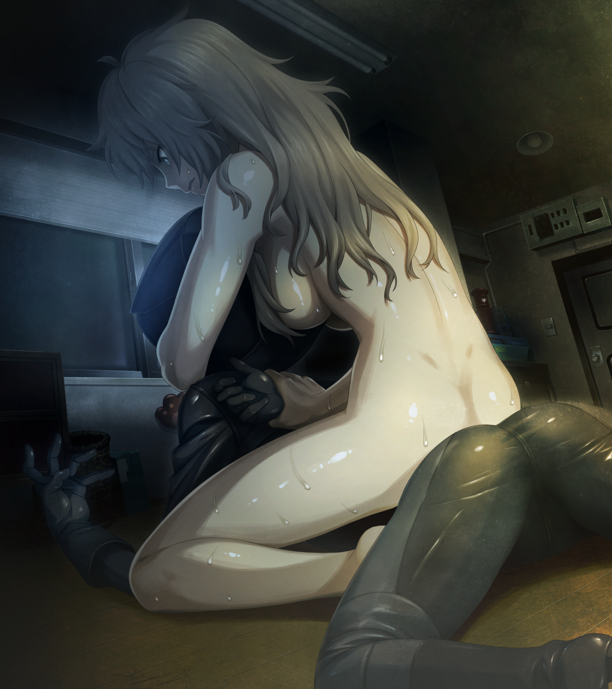

# 弹性界限的认知 - 06
> 1.129954  
> [ 2011/06/月末 铃羽视角 ] 同 0041 后段，增加去超市的理由，为了通宵开发『电话微波炉(暂)·二号机』。  

| [←prev](./0149) | [menu](../) | [next→](./0151) |

---

“话说，你跟妈妈相处得怎么样？”  
“嗯啊？”  
“我也很担心这方面啊。没问题吧？不会演变成我无法出生的情况吧？”  
“啊\~怎么说呢\~？这件事比制作时间机器还困难吗？”  
“喂——！”  
铃羽忍不住逼近了桶子。  
“别搞砸了啊，爸爸！”  
“嗯、嗯……爸爸会加油的。”  
“总是空口说白话，结果上次的电影票不也白白浪费了吗？”  
她指的是之前的圣诞节派对上，真由理和菲莉丝在“作战”中特意准备的那两张电影票。  
“啊、那个啊，冈伦和吹雪氏不是突然晕倒了吗？  
 后来，忙着去探病之类的事情，放映期就结束了……也是没办法嘛……”  
“但是，听说在那之后，她们打算给你准备新的电影票，也被你拒绝了吧？”  
“等下，听谁说的？”  
“当然是真由姐和留未姐咯。”  
“这、这个，因为那个哦，依靠真由喜和菲莉丝碳的话，太没有男子气概了吧。
<abbr title="作认真状">kiri！</abbr>”  
“所以呢？你自己有采取什么行动吗？”  
“没……”  
“啊\~这样不行啊……”  
的确，这方面的问题说不定真的比时间机器更困难，铃羽感到头痛。  
“听好了，爸爸，我没办法一直对你说教下去知道吗？我也马上就要离开了哦？”  
“啊……”  
桶子眼睛下垂，流露出寂寞的眼神。  
“别摆出那样的表情，咱们都说好不会再迷茫了哦。”  
这半年，铃羽一直在反复思考，把这条世界线变成没发生过，真的好吗？每当这种时候，从背后推她一把的，正是桶子本人和他说过的话。  
“对不起……”  
桶子垂头丧气的样子让铃羽实在看不下去，于是她用手掌拍了拍他庞大的后背。  
“别想这个了。快给妈妈发个邮件，问问她什么时候有空，然后约她去看电影。”  
“诶——？！难度系数突然变得这么高？！”  
“管它高不高，赶快去约她。听好了，这可是命令哦。”  
“命、命令什么的……”  
“回答呢？”  
“*Sir！Yes sir！*”  
铃羽听到后很满意，走向卫生间，准备去洗澡。  
“啊，不过在那之前，让我先去一下便利店……”  
“……去干什么？”  
“啊这，其实我晚饭还没吃……今晚感觉又要熬通宵，就想着趁还不太晚去买点东西——”  
桶子保持着卑屈的姿势，指了指开发室的方向，那里放着组装完毕，仍在试错阶段的『电话微波炉(暂)·二号机』。  
“……”  
“噫！不要瞪我啦！我会尽量买些吃了不会发胖的食物啦，恳请批准。”  
“……香草。”  
“啊？”  
“我洗完澡之后想吃冰激凌，香草的。”  
“嗯，遵命！我会给你买一堆庶民平常吃不到的高级品哦！”  
“不要那么多啦，一个就好。”  
“*Sir！Yes sir！*”  
桶子一下子恢复了精神，拿着钱包飞奔出 LAB。  

“哎呀哎呀，真是让人操心呢。”  
铃羽正准备脱掉上衣去洗澡，但是……  
“铃羽——”  
原本已经出门的桶子，突然又回来了。  
“怎么了？”  
“我在楼梯那儿捡到了这个。”

那是一个钥匙圈，那个全身暗淡绿色的圆形卡通角色……是乌帕。  
“你知道是谁的吗？”  
“不是真由姐的吗？”  
铃羽把脸凑近仔细观察，脑海中浮现出强烈的既视感。
“这个乌帕，好像在哪里……？”  
好像以前也看见过？完全想不起来是在何时何地。可是，铃羽本能地警惕起来，这个钥匙圈一定有什么重大意义。乌帕钥匙圈本身随处可见。这个钥匙圈本体的塑料部分呈圆形，涂装本来应该是更鲜艳的颜色，却已经严重褪色，并且遍布各类损伤的痕迹。不过，完全没有粘到灰和污渍，甚至被擦得闪闪发亮，想必它的主人一定很珍惜吧。挂环因为长年累月的老化，有个部分明显断裂了，想必这就是它掉在这的原因。  
“到底是在哪里呢……我记得在哪里见过……”  
“让真由喜看看怎么样？”  
“也是呢……”  
铃羽目不转睛地盯着桶子手里的乌帕——突然，脑内灵光一闪，回响起了一位少女的叫喊。  
“妈妈！！”  
“这是妈妈一直很珍惜的乌帕钥匙圈哦\~给你，要好好保管呐。”  

“……啊！！”  
铃羽不禁倒吸一口气，后背激起一阵难以名状的战栗。  
“莫、莫非……这个是……篝的……吗？”  
是那个时候——2036 年 8 月 13 日，铃羽乘坐时间机器带着篝逃离未来，就是那个时候看过它。虽然记忆有一些模糊，比那天看到的也旧了很多，但不会错，这就是未来的真由理交给篝的那个钥匙圈。铃羽也见过无数次，幼小的篝在时间机器里盯着它流泪的样子。  
“你说的篝……难道是那位未来的真由喜的女儿？”  
“……嗯。”  
“找到她了？”  
“还没，不过对方好像知道咱们这里。”  
“所、所以说，这到底怎么回事啊？”  
“那家伙……在监视 LAB。”  
半年前在广播馆楼顶上，那个穿着黑色骑手服窥视时间机器，被她发现追赶却逃之夭夭的人，绝对就是篝。那之后，铃羽一直更加谨慎地看管时间机器，附近再也没有发现篝的痕迹——铃羽完全没想到，篝居然在监视 LAB。  
“不，稍微思考一下也理所当然。  
 那家伙，想阻止我们到达命运石之门。  
 她不想把这个世界变成没有发生过。  
 也就是说，不止是我，爸爸你也被盯上了……？”  
“诶？我？”  
“不过我觉得……你应该没有生命危险。  
 如果相信世界线的至理，你至少会活到 2036 年。  
 但是，为了阻止我们到达命运石之门，她可能会妨碍你的研究。”  
最近，爸爸和冈伦叔叔身边，总是接二连三地发生各种事件，爸爸说不定也是目标之一。  
“从今天起，以防万一，我不在的时候一定要把门上锁。”  
“嗯、嗯，知道咯。”  
“就算和冈伦叔叔、妈妈、或者真由姐在一起，也绝对不能把门开着哦。  
 最好把门链也拴上，算是心理安慰也好。”  
“但是啊，冈伦和真由喜他俩姑且不论，  
 和阿万音氏两人独处的时候，这么做感觉会产生别的意思呢……  
 阿万音氏不会误解什么吧？”  
“啊……这点确实。”  
“如果因此被讨厌了，就是咱们家的大危机了哦。”  
“唔……你要是早点和妈妈在一起，就什么问题都没有了……”  
“诶，结果还是绕回那个话题了吗？！”  
“总之还是要多加小心啊。”  
桶子把绿色的乌帕钥匙圈递给铃羽。铃羽接过后一边注视着，一边用指尖轻抚它。  
“呐——铃羽，虽然没有血缘关系，但篝碳是真由喜的女儿吧？”  
“是啊。”  
“那样的真由喜抚养出的孩子，会做出袭击别人这么恐怖的行为吗……？”  
“呃……”  
“总感觉铃羽口中的篝碳，和想象中的差别很大啊……  
 我还在想会不会是更加温柔一点、更软乎乎的、更可爱的女孩子呢。”  
“如果是那样就好了。嗯，我之前也这么想。但是，现在的篝……可能……”  
看她当时从广播馆楼顶逃走的动作就能知道，她绝对接受了专业的战斗训练。她还是小孩子的时候，铃羽曾经教过她基础的防身术。年龄增长之后的她远超那种程度，被赋予了更加冷酷的杀人技术。从 1998 年行踪不明到现在，没有人知道她身在何处，到底经历了什么。但是，铃羽明白，她绝对是真心实意地在阻止自己的计划。  

（稍后）  

铃羽一边冲澡，一边叹了口气。因为是夏天，所以水温调的很低，接近常温的感觉。冲洗脑袋的时候，烦心事一件件地接连浮现，铃羽甚至希望它们都能被水冲走。快速洗完，铃羽双手拍了拍脸颊，关掉阀门。贴满瓷砖的狭窄淋浴间瞬间安静下来。在这悄无声息的环境中，铃羽用毛巾胡乱地擦着头发。这栋楼最初建设的目的并非居住，所以生活空间非常粗糙。淋浴间外连更衣室都没有，只有用帘布隔开的空间，狭窄又没有窗户，蒸汽全部闷在里面，夏天会变成难受的桑拿房。桶子和冈伦受不了这种闷热，所以经常近乎全裸地坐在房间里的风扇前。当然，这是屋子里没有女性以及漆原琉华时的限定行为。铃羽无法这么做，因为胸口处有一个很大的伤疤，万一不小心被由季她们看见就不好了，所以铃羽一直是在这狭窄的空间里穿好衣服再出去。  
“……！？”  
从淋浴间出来的瞬间，铃羽察觉到了异样。帘布外面，LAB 房间的荧光灯是关着的。洗澡之前，LAB 确实开着灯，铃羽记得她没有关掉过。铃羽连内衣都没穿，直接拉开了帘布。她匍匐在地板上，借助淋浴间漏出的灯光，警惕地环顾室内，但没有发现任何人的踪影，也没发现有人潜入的迹象。爸爸又回来过一次……？然后再次出门的时候，把灯关上了？  
不……不对……借助朦胧的光线，铃羽察觉到屋内被人翻过又恢复了，差别微小到普通人难以察觉。从桶子的电脑桌和沙发，到放杂志的架子和迷你厨房，全都有被人动过的痕迹。看来那开发室那边也一样。铃羽快速扫视了几处藏着枪的地方，最近的是平时当床用的沙发。铃羽把坐垫弄破，在里面藏了一把防身用的手枪，万一睡觉的时候被袭击能够迅速反应。因为是防身用的.32 口径，如果不击中的要害的话威力很弱。但是它尺寸小巧，声音也比较小，最适合现在的场合。铃羽全身的肌肉像弹簧一样绷得紧紧的，屏息向沙发靠近。她一边移动，一边注意周围的动静。开发室深处传来了一个微小的、地板的吱吱声，普通人不会在意，铃羽却抓住这个时机，一瞬间从刚才的“静”切换为猛烈的“动”。她一口气跳到沙发处，迅速拔出手枪，随即借势躲到了冰箱后面。这个位置能正好透过开发室帘布的间隙看到里面。  

室内恢复了鸦雀无声，可气氛和之前不同了。开发室里的入侵者明显也察觉到了铃羽，不再隐藏自己的气息。  
“如果你耍花招，我就开枪。双手放在头后，慢慢走出来。”  
铃羽沉着嗓子威吓，不过对方没有表现出丝毫动摇，缓慢地将全身暴露在铃羽的视线里。  
“哼，大热天的，亏你能穿成那样呢，至少把头盔摘掉如何？”  
对方和当时一样，穿着黑色骑手服，头盔也没变。完美贴合身体曲线的皮革，勾勒出凹凸有致的黄金比例身段，毫无疑问是位女性。  
“你要找的东西不在那里哦，在我外套的口袋里。”  
铃羽指向淋浴间的入口，之前脱下的衣服凌乱地堆在那里。好像被抓住了弱点，穿黑色骑手服的女人把脸转向那边。但由于头盔的遮挡，并不能看见她的表情。  
“呐，弄丢了可不好哦，这可是妈妈送给你的珍贵之物吧？**篝**。”  
话音刚落，穿黑色骑手服的女人——椎名篝率先采取了行动。她拔出藏在腰后面的那把经过消光处理的军用匕首，撞向铃羽怀里。铃羽避开要害，朝她的腿部扣动了扳机。伴随 .32 口径发出的轻快的枪声，篝失去平衡跌向地面——然而这完全是假动作。篝假装失去平衡，绕过铃羽向淋浴间冲了过去，看来她想要先发制人夺取目标物品。  
“这是！？”  
开枪后，铃羽立刻察觉到，即使是 .32 口径，后坐力也不会这么小。她又开了一枪，果然对篝的动作毫无影响。  
（空包弹！？怎么回事！？）  
铃羽手中的枪不知何时被替换成了空包弹匣。篝抓住这一瞬间的破绽，把手伸向了淋浴间前的外套。  
“可恶！”  
铃羽放弃射击，把枪投掷出去，一声钝响，击中了篝的脖子。她踉跄了一下，没能抓到外套。  
“唔咕！！”  
头盔里的篝第一次发出了沉闷的声音。铃羽毫不留情地绷紧了腿部的肌肉，冲过去猛踢向趔趄的篝。篝被踢飞，借势滚到了房间的角落。她应该已经断了几根肋骨才是——铃羽对自己刚才的发力有把握，打算乘胜追击。但是篝以可怕的爆发力迅速起身，向铃羽猛冲过来。这反击来的太快，使得铃羽无法立刻调整动作——  
“呃哈！？”  
刀尖的轨迹离铃羽裸露的腹部仅有几厘米。如果铃羽回避动作慢上零点几秒，锐利的刀锋就会划破肠子，造成致命伤。  
“你个混蛋！！”  
铃羽非常生气——这家伙毫无疑问打算杀了我，她的动作里没有任何的犹豫。铃羽稍微后退，同时寻找能作为武器的东西。但是，恐怕其他隐藏的枪也被做了手脚，替换成了空包弹。搞不好，连护身用的匕首也全部被拿走了。既然这样，剩下的就是——铃羽悄悄瞥向了厨房里摆放得很整齐的几把菜刀和小刀，是由季为了教真由理料理特意买来的。篝也已经注意到了它们，移步挡住了铃羽的移动路线。  
“嘿，很老练嘛。完全不像是那个在时间机器里哭哭啼啼的小丫头，真让我吃惊啊。”  
铃羽一边挑衅，一边对峙着沿着墙壁慢慢移动。她被激起了战斗欲，准备扭转不利的局面。  
“看，篝，你是想要这个吧？”  
铃羽移动到淋浴间前，捡起外套，拿出了口袋里的绿色钥匙圈。篝的呼吸出现一丝混乱，发出了似是愤怒似是不甘的呜咽。  
“怎么了？不来拿吗？”  
铃羽的手指动了动，像是要碾坏钥匙圈。篝的反应很大，自现身以来第一次表现出头盔也掩饰不住的心情波动。  
“……哼。”  
下一瞬间，铃羽把钥匙圈向着篝的腹部轻轻地抛了过去，动作轻巧，仿佛朋友间的传接。钥匙圈在空中缓慢地画出一道抛物线。再强大的人，看见自己重要的东西被如此抛来，都会本能地想要用双手小心地接住。篝即使受过训练也没有胜过这种本能，举着刀的右手和左手一起，紧紧地握住了妈妈的遗物。  
“嗬呀——！！”  
与慢悠悠地抛物线运动同时进行的，是铃羽迅猛地冲拳。她的右拳深深地陷进了篝的腹部，接着左勾拳全力打在篝的头盔上。篝被击倒，头盔下沉闷的痛呼、右肩触地脱臼以及匕首落地的声音相继传来。铃羽趁势跨坐在篝的背上，反扭住她的右臂，同时左臂绕前勒紧了她的脖子。  

“唔、咳、咳……！”  
耳边听到篝喉咙里发出的呻吟，嘎吱……嘎吱……手臂传来篝的颈骨发力扭曲快要碎裂的触感。  
“给我老实点！我不会杀你的！”  
但是，篝以这种极不自然的姿势，仍然用唯一自由的左手抓起掉在地板上的匕首打算刺过来。铃羽不得不再加大力度勒紧她的脖子。  
“咳、咳……！”  
“别再抵抗了！篝！现在的我已经明白你的心情了，可是这么做果然不对的！是错误的啊！”  
就算是这样劝说，篝依旧没有放弃抵抗——反而将全身的力量用到极限，想要把铃羽甩开。  
（这、这家伙，到底经历过怎样的训练啊！？）  
根据以往的作战经验，无论多么坚强的士兵，在这种被控制住要害即将晕厥的时刻也是会屈服的。铃羽不寒而栗，又加大了力度。再这样下去，恐怕就不止是勒晕，而是真的会勒死篝。但是，如果解开束缚，自己肯定会被攻击甚至被杀。到底该如何是好——  
“铃羽、姐姐……痛……好痛……”  
听到她如此悲伤又脆弱的声音，铃羽不由得放松了警惕，双手的力道也减小了。然而，这明显是篝的诡计。她用尽全力，将匕首刺向铃羽松弛下来的左手腕，迫使她松开了手臂，并借此机会翻身将她从背上甩下，双腿蹬着她的腰部踹飞了她。铃羽的后背猛地撞在电脑桌上，一瞬间无法呼吸。她倒在地上，桌上的显示器、打印机等物品掉落下来，无情地殴打着她赤裸的身体。  
“呼、咳、咳咳……！”  
“哈！嗬！呃嗬……！”  
两人都气喘吁吁地艰难地站起身，继续对峙。篝的右臂无力地下垂，朝完全相反的方向扭曲着，恐怕暂时是废了，但她的左手扔紧握着匕首。  
“你这家伙，连这种阴招都学会了吗……”  
铃羽恶狠狠地瞪着对面的头盔面罩，仿佛想要看清下面的篝成长到变得丑恶的嘴脸。两人维系着暂时的沉默，调整着呼吸。气氛紧张得连一根手指都不能轻易动作。汗水从额头流下，流进眼睛，尽管如此，铃羽眼也不眨地等待着对方的下一步行动。  

开门的声音，打破了此刻的平衡。  
“喂，铃羽？刚才里面传来了好大的声音啊？”  
听到那个声音，冷汗遍布了铃羽的后背。  
“咦，怎么黑乎乎的？”  
“不行！爸爸，别！”  
铃羽喊话的同时，桶子打开了房间里的灯。由暗到亮的突变让铃羽暂时失去了视野，篝却因为戴着头盔占据了优势，抢先一步到达了桶子身边。  
“呜哇！？”  
桶子被突然出现在眼前的陌生人和她手里漆黑的匕首吓到而发出惊呼。  
“爸爸！！”  
“咦？呀！呀啊——！！”  
刀刃抵在桶子因为恐惧而僵直的脖子上——篝绕到了桶子背后，用他巨大的身体作为盾牌。铃羽慢慢逼近，紧咬牙关，发出冰冷到极点的低吟：  
“放手，篝……你要是敢伤到我爸一根汗毛……就算是你，我也真的会下杀手。”  
“……”  
但是，篝仍然沉默不语，缩在人质背后退向门外。下一瞬间，全力撞向了桶子的后背。  
“啊！！！”  
桶子失去了平衡，将铃羽压倒在地上。他勉强用四肢支撑起全身，铃羽才没被压扁。  
“起开！”  
铃羽有点强硬地推搡着桶子的身体。因为太重，桶子费了很大功夫才翻到一旁。  
“跟你说过多少次了叫你减肥！”  
“诶诶诶……”  
这样下去要被她逃了。铃羽立刻起身，就要飞奔出去追篝。  
“——铃羽，穿上这个！”  
坐在地上还来不及起身的桶子，抓过一件 T 恤扔给全裸的铃羽。铃羽接过麻利地套上，立即追了出去。  

来到楼下，环视四周，已经看不到篝的影子，连她是向哪个方向逃跑的都无法判断。  
“……让她逃了。”  
事已至此，盲目地到处寻找反而危险，她有可能趁着空档返回 LAB 偷袭桶子。  
“刚才的那人，难道是……篝碳？”  
桶子随后也跟了下来。  
“……嗯，大概没错。”  
“这样啊……”  
“结果，那孩子，变成了这样啊……”  
相比于身体上的钝痛，内心由于自责产生的痛楚更为强烈。  
“我啊……真的很喜欢……那孩子啊……”  
“嗯。”  
“很娇小，但是很勇敢，一直在努力保护真由姐……  
 我也教过那孩子各种东西，一直……把她当成妹妹一样。”  
“嗯。”  
“但是，她已经……完全成为了敌人。”  
桶子帮衣着凌乱的铃羽整理了 T 恤的下摆。  
“现在的铃羽，就像是工口游戏里的痴女角色一样的造型哦。”  
“诶？啊——”  
桶子突然提起不相干的话题，让铃羽懵住了。  
<abbr title="os：这部分难道不值得一张 CG 吗 @5pb.">
确实，现在的铃羽像是穿着一件迷你连衣裙，T 恤从肩膀滑了下来，几乎露出胸部；下摆也卷了起来，几乎要被窥见隐秘部位了。  
</abbr>
“嘛，痴女也蛮对我胃口的。不得不说，不修边幅的真空 T 恤造型相当不错，唔呼\~”  
“又在胡言乱语，你刚才搞不好就受重伤了。”  
铃羽不满地抱怨着，桶子却摇了摇头：  
“我啊，虽然看见刀忍不住叫了出来，不过想想其实没必要害怕……  
 那时，如果我没听错的话——”  
桶子用手指摸了摸脖子，刚刚被匕首抵住的位置。  
“被刀抵着的时候……虽然很小，但是我听到了——”  
“什么？”  
“她……大概……在哭。”  
“……诶？”  
哭了……？头盔里的她，在和我激烈搏斗的同时，也在哭泣着吗？拿匕首抵在爸爸的脖子上的同时，也在哭泣着吗？究竟是，为什么啊——  
“所以啊，现在就认定她是敌人，是不是为时过早了呢？”  
“……唔……爸爸……”  
“哦？”  
“冰激凌，买来了吗，香草的？”
“啊，当然了。”  
“好想吃啊……我……稍微有点累……了……”  
话还没说完，铃羽就失去力气向前倾倒。  
“哇？！”  
桶子赶紧扑了上去，在她倒地前用厚实的身体抱住了她。  
“喂、喂，铃羽？”  
“啊，不好意思……没事的。不过……稍微，让我休息会儿……”  
这句话用尽了她最后一丝力气。铃羽就这样倒在爸爸怀里，闭上眼睛，失去意识，瘫软下来。  

 

> (to be continued)

---

| [←prev](./0149) | [menu](../) | [next→](./0151) |
