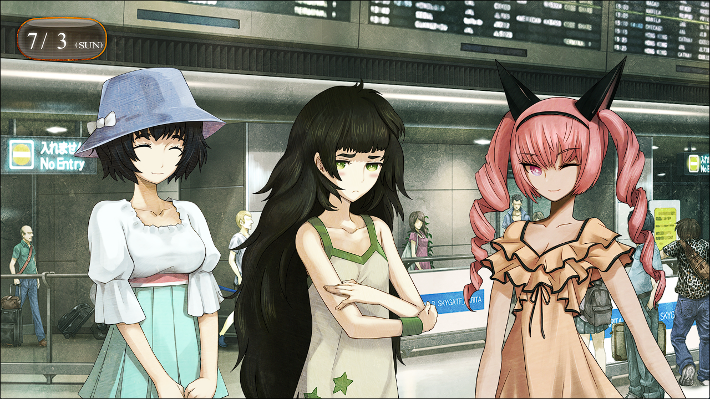

# 弹性界限的认知 - 07
> 1.129954  
> [ 2011/07/03 ] 真帆偷偷来到日本，冈伦、真由理、菲莉丝三人偷偷来到机场接机。  

| [←prev](./0150) | [menu](../) | [next→](./0152) |

---

进入 7 月，关东地区的日照接近顶峰，正式迎来了夏天。加上热岛现象的影响，连续几天新闻里都播放说今年可能是数十年来最热的夏天。就是这样的 7 月的第一个周日，成田机场的国际线到达大厅中，来访的外国人与归国的日本乘客人头攒动。  
“好多人啊\~好像越来越多了。”  
“小看星期天的机场了喵。”  
“别看漏了哦，真由理，菲莉丝，毕竟对方真的很小只。”  
我们三人正在这接机真帆，已经快一个小时了。琉华子有事没能过来，只好在 RINE 上拜托我替他问好。  
“冈伦，刚刚的问题发言，可是必须要跟她本人告状喵\~”  
“开玩笑的，别这样。”  
“但是，怎么等都不来呢。”  
“果然，想给她个惊喜，偷偷来迎接是个错误喵。”  
“至少应该问问她是几点的航班啊……”  
我们来迎接她这件事，对本人是保密的。为此，我们只知道她是今天中午到达成田。早知如此，应该不着痕迹地打探一下。乘客们一波又一波从眼前经过，然而，关键人物仍然不见踪影。刚要开始怀疑，是不是真因为太小而看漏了的时候，终于看到了她的身影——不，准确来说，是看到了一个巨大的旅行箱，四个轮子发出呼隆呼隆的响声自己从门中走了出来。然后，旅行箱的阴影中传来一个熟悉的声音：  
“真是的，我才没办假证呢！什么人啊！  
 每次每次每次都是，去哪个国家都要被查这查那的，浪费的时间要怎么赔我啊！”  
“哈……哈哈……”  
我苦笑着接近旅行箱，然后轻轻在上面敲了敲。  
“比屋定小姐。”  
“……诶？”  
真帆正以前倾的姿势拼命推着旅行箱，看到我后整个人愣住了。  
“好久不见，恭喜你平安入境。”  
“你你你你……？”  
“感觉你很憔悴啊，没事吧？”  
“当然没——等等，先不说这个！你为什么会在这里！？”  
“你不是说今天中午到嘛，为了给你个惊喜，特意来接机了。”  
“是、是吗？那还真是，谢……谢谢……”  
不知为何，我刚一搭话，她便很露骨地乱了阵脚，再怎么说也惊讶过头了吧。  
“可是，我不是说了自己能到秋叶原站，只要在检票口等我就好了嘛。”  
“这样也没什么不好的嘛，难得来一次。而且，我也很担心你是不是真能一个人到达秋叶原。”  
“太、太失礼了，我才没那么不可靠呢。”  
“啊哈哈。”  

真由理和菲莉丝也过来了。  
“真帆小姐\~嘟嘟噜\~♪”  
“嘟嘟……？”  
“嘟嘟噜\~♪”  
“好想你喵\~！真帆喵！”  
真由理紧紧握住真帆的手，一旁的菲莉丝则紧紧抱住她的身体。  
“真由理小姐和菲莉丝小姐也是，好久不见。  
 两位也特意来接我，谢谢了。  
 ……顺便，能不能别在这种地方大声喊我‘真帆喵’？”  
“为什喵？明明很可爱\~！”  
“看看周围啊，大家不都在笑吗？很害羞啊。”  
“唔喵\~？是喵\~？”  
毕竟菲莉丝很引人注目……在这等的时候，每个外国人都会看着她惊呼 “*NEKOMIMI! NEKOMIMI!*”——其中甚至还有过来请求摄影许可的。  
“比屋定小姐，行李给我吧。”  
“啊，嗯，谢谢……”  
“不过，你这次来日本还真匆忙啊。这次也是为了协助雷斯吉宁教授吗？”  
短短几天之前，才听真帆说要来日本。  
“啊——这个嘛……呃……”  
真帆突然扭扭捏捏地，眼睛不时地偷看我的表情。  
“……冈部先生经常和雷斯吉宁教授联系吗？”  
“啊。教授不是一直在这边做研究吗？时不时会邀请我一起吃饭，真是我的荣幸。”  
“这、这样啊……麻烦了呢……”  
“麻烦？怎么了？”  
“啊不，没什么！是我自言自语。”  
……果然举止异常慌乱啊，冬天见面时明明不是这样。因为长途跋涉累了吗？还是说，被我们的惊喜冲击到了之类的？  
“……这次不是为了协助教授，而是准备去冲绳的亲戚那里。  
 不过难得过来，就想先去秋叶原一趟。”  
“这样啊，冲绳啊……”  
听到这个地名的瞬间，想起了那噩梦般的光景。圣诞节昏倒后去往的世界线，我大约花了一个月才逃到了冲绳。  
“真好啊\~，冲绳，我也想去一次玩玩看啊\~”  
“真由喜学校的修学旅行不是冲绳喵？”  
“真由喜当时是去北海道呢\~”  
“菲莉丝是夏威夷喵。”  
“哇\~海外呢\~阿罗哈\~♪”  
先不论女高中生的轻松日常修学旅行漫谈。  
“那么，比屋定小姐不会在东京待太久吗？真可惜。”  
“诶！？是、是啊，确实是呢。”  

“在秋叶原时住的宾馆，已经订好了喵？”  
“还没呢，准备接下来找个便宜的商务宾馆。”  
“这样的话，直接来菲莉丝家就好了喵！之前的房间可以供你自由使用喵。”  
“诶？这样太过意不去了。”  
“又是这么客气，菲莉丝可是大欢迎喵。”  
“但是，也不能这么不客气……”  
“唔\~，那么这样如何喵？房间无偿使用的同时，要在菲莉丝的店里稍微帮帮忙喵。”  
“……店？”  
“*MayQueen+Nyan²* 呢\~”  
“难不成是，那个戴猫耳的店！？”  
“就是这个喵！  
 这段时间，猫耳女仆们为了准备 CM 都很忙喵，会哭着跑来要请假喵。”  
 也就是说！会出现很严重的猫耳娘不足问题的喵！”  
“的喵\~♪”  
“所以说，真帆喵，怎么样喵？”  
“怎么样喵？”  
“恕我拒绝。”  
“诶\~！”  
“为什喵！？”  
“什么为什么……这不是理所当然的吗？跟我一点都不合适。”  
“很合适啊\~绝对很可爱的啊\~，真由喜这么觉得。”  
“没有异议喵！冈伦也这么觉得喵？”  
“啊，肯定会有粉丝的吧。”  
“粉丝什么的，怎么会……我讨厌奉承哦。”  
“我没在奉承就是了。”  
“……那、那你最好去看看眼科比较好。”  
“喵喵？脸红了喵！”  
“才、才没有！”  
“真帆喵呢，应该好好对自己的魅力有些自觉喵。”  
“嗯！真由喜是男生的话，会忍不住一把抱住的。”  
“我都说了没这回事……”  
“比屋定小姐，大概，那个，稍微再……怎么说呢……  
 穿衣打扮什么的，稍微注意一下试试看的话，这样就会更……”  
“……”  
我拼命寻找词汇想要替她打气，结果话不知不觉变得很刺耳。意料之中的，真帆开始赌气了。  
“我现在这样子就足够了！因为摆在第一位的是研究！”  
“但是但是，这样的话，如果有了心上人可怎么办喵？没法向对方传达心意，会很困扰喵。”  
“……哼！没问题啦，那种人是不会有的，才不会因此困扰。”  

真帆这时，稍微有些刻意地打了个哈欠。  
“……抱歉，因为时差加上坐了这么久飞机，有些困了……”  
“我懂喵，时差犯困的确很要命喵。豪华轿车已经准备好了，真帆喵可以好好睡下喵。”  
“豪、豪华轿车！？”  
那是一辆纯白的加长豪华轿车，似乎是菲莉丝为了这一天特意租的。真是的，再怎么说也太夸张了。不过拜此所赐，我和真由理也沾了光，来成田机场的路上享受了那宽敞舒适又富有弹性的座椅。  
“还不行的话，菲莉丝来给你膝枕喵。还是说，真由喜的膝枕更好喵？”  
“真由喜完全 OK 的哦\~”  
“……不、不用了，我又不是小孩子。”  
“不过，光是旁观就能看出你相当疲劳了，研究有这么忙吗？”  
“这个嘛，毕竟还有副业要做——”  
“副业？就是说，除了『Amadeus』还在做些其他的吗？”  
“啊！”  
真帆慌张地捂住自己的嘴。  
“呃……这个是那什么……商业机密的说。”  
“这样啊，抱歉啊。”  
的确，美国的大学研究室里，这种研究还蛮多的，听说商业间谍也很多。一不小心泄露了情报的话，大概就不单单是被开除的问题了。是随口提问的我太轻率了。  
“说、说起来，桥田先生今天在干什么？”  
“那家伙啊，今天可是有件赌上下半辈子人生的大事呢。”  
“赌上人生……？”  
“桶子君呢，现在，在约会中哦\~”  
“……”  
真帆整个人明显呆住了。  
“我……我真是累过头了呢，出现了很严重的幻听。”  
“不，虽然你会这么想也没办法……”  
“真的是约会哟。”  
“诶诶！？难以置信！骗人的吧？那个 HENTAI 竟然！？”  
终于连真帆也开始叫他 HENTAI 了吗……听说平时桶子也会和真帆网聊，不难想象他的言行举止啊。不过事实上，如果桶子不好好努力的话，这个世界的因果律会乱套的。在这层意义上，今天桶子的约会，可以说是宇宙规模的大事件。  

 

> (to be continued)

---

| [←prev](./0150) | [menu](../) | [next→](./0152) |
