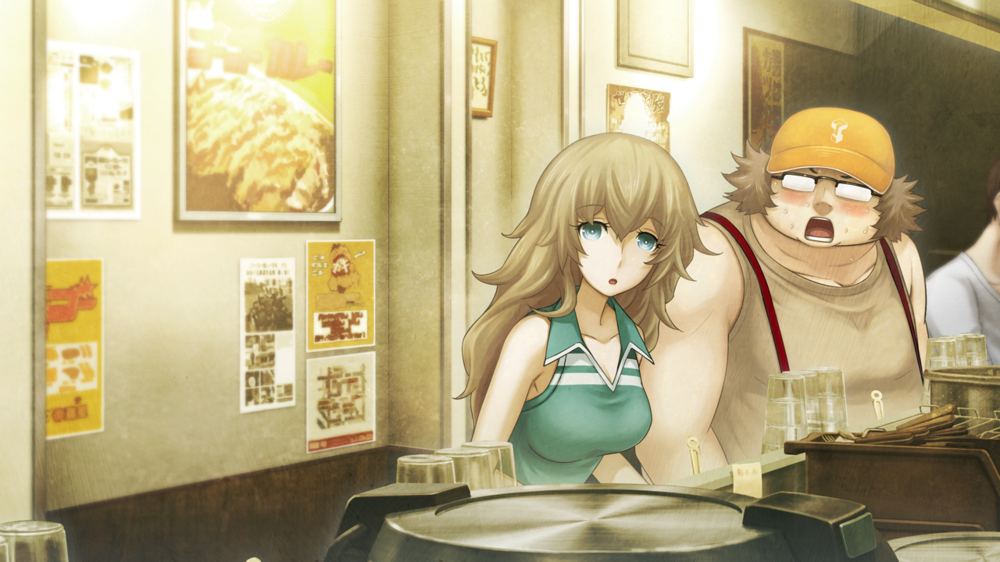

# 弹性界限的认知 - 08
> 1.129954  
> [ 2011/07/03 铃羽视角 ] 在 0043 基础上结尾不同：冈伦三人接比屋定来到 LAB，桶子二人急忙藏起开发中的电话微波炉（暂）二号机。  

| [←prev](./0151) | [menu](../) | [next→](./0153) |

---

GOGO 咖喱店，虽说是周日，到了下午两点，用餐的高峰也已经过去，店内用餐的客人只占据了差不多一半的座位。在这当中——铃羽坐在最里面的座位，把鸭舌帽檐压得很低藏住脸，认真地观察着坐在不远处的一对情侣客人。  
“久等了，超大份咖喱来了\~！”  
店员伴随着充满活力的声音，在那对情侣的面前，咚的放下两个巨大的银色盘子——应该说是两个很有气势的盆。其他客人看到这一场景开始骚动，毕竟这对情侣太引人注目了。虽然男方是符合超大份咖喱印象的巨汉，但是女方却是一位苗条温柔的美女。无论是这对情侣的组合，还是美女和超大份咖喱的组合，都非常的不平衡。超大份咖喱顾名思义就是分量超大，铃羽很有经验——巨大的银色盘子盛满了米饭和咖喱，其上还放着两块巨大的炸猪排、炸虾还有香肠，以及煮鸡蛋和堆得像小山一样的卷心菜丝——是比一般套餐多了两到三倍的咖喱，配以所有配菜的怪物级套餐。就算是食欲旺盛的年轻男性客人，要吃完这个也并不是一件容易的事情。 
（究竟为什么，第一次约会的午饭要选超大份咖喱啊，爸爸？）  
铃羽感觉有些焦躁。她观察着的美女与野兽的情侣组合，毫无疑问就是桶子和由季。上午他们俩在有乐町看完电影之后，来到了秋叶原……然后走进了 GOGO 咖喱。铃羽一路尾随，所以对爸爸安排的约会路线感到难以置信。  
（虽然我的话 GOGO 咖喱也完全没有问题，不如说是很喜欢，不过——）  
（难得的初次约会，不是还有很多其他的选项吗？）  
铃羽手里紧紧握着勺子，咬牙切齿。就连对 2011 年日本年轻人文化不太了解的自己都这么觉得，由季心里应该也相当为难吧——铃羽这样担心着，然而……  
“哇，比照片上更厉害呢！”  
意外地，由季毫不在意周围的眼神，对着面前的超大份咖喱发出天真无邪的声音。  
“我、我说，那个……阿万音氏……如果吃不完的话，那个……就交给我来帮你解决吧……”  
“好，谢谢啦。不过，别看我这样，也相当能吃的哟？”  
“是、是吗……真想不到哦。”  
“嘿嘿嘿\~实际上，我经常在店外看着菜单……想要吃上一次呢。你带我来这里，我很高兴。”  
“那、那真是太好了哦。”  
“……？”
看来铃羽的担心是多余的。然而她接着又察觉到，爸爸的样子有些奇怪。话说自从电影院出来之后，他的说话方式和走路姿势就变得很别扭，平时驼着的背，也用力挺了起来，总之一举一动都很僵硬，像破烂的机器人一样。而且，他还用僵硬的动作往杯子里倒了很多次水，一杯接一杯地灌进肚子里。  
“啊，不好意思，也请帮我倒一杯水……”  
“哈？好的好的\~请用\~”  
“十分感谢。”  
看着爸爸往由季的杯子里倒水的动作，铃羽心中涌起不详的预感。结果不出所料，动作生硬的他差点把水倒在了由季的手上。  
“呀……！”  
“没、没、没没……没事吧！？”  
“没事，只是手上打湿了一点而已。比起这个，赶快开吃吧？”  
由季用自己的手帕利落地擦了下手和桌子，双眼闪光地拿起了勺子和叉子。  
“那么，我开动了\~！”  
“我、我开动了。”  
由季看起来吃得十分开心。相比之下，桶子反而显得太过斯文且安静，就像松鼠吃松子的动作一样，切一刀炸猪排，小口小口慢慢地咀嚼着。期间，二人之间完全没有对话。  
（到底在干什么啊爸爸……这样下去，会被妈妈讨厌的啊！）  
事情发展成这样，铃羽想着用 RINE 给父亲打气。就在她正准备拿出手机的时候——  
“请用，超大份咖喱！咖喱加量！久等了\~！”  
“啊……！？”  
又一个巨大的银色盘子气势汹汹地出现在铃羽面前的桌子上，周围的客人又开始窃窃私语。说起来，尾随他们进入店内的时候，铃羽也习惯性地点了超大份咖喱——而且咖喱加量，然后不小心忘记了这回事。铃羽因此变得引人注目，在这绝不算大的店内，毫无疑问是自杀行为。  

“啊啦？”  
“唔……”  
果然，她和由季完全对上视线了。  
“铃羽小姐！你也在啊？”  
“啊——那个……嗯\~真巧呢\~由季小姐，还有哥哥……”  
“跟我们打声招呼也好啊。”  
“不，完全没注意到你们啊\~”  
虽然现在应该果断离开店里，但是却做不到放着眼前的超大份咖喱不吃就离开。对于经历过战争时代的铃羽来说，浪费食物是绝对不能被原谅的行为。在由季和爸爸的视线下，她不得已拿起勺子。  
“嘛，先不说了\~两位请慢用……”  
事已至此，只有争分夺秒地赶紧吃完面前的超大份咖喱，然后离开，为了不打扰那两位！但是——与铃羽的觉悟相反，由季迈着小碎步轻快地接近，一下端走了铃羽的咖喱。  
“啊……？”  
“那个——不好意思，店员先生？这是我的朋友，能换一下位置吗？”  
“好的，请便！”  
“OK 啦，一起吃吧？”  
“等等等……等等？为什么？”  
“要说为什么……你看，铃羽小姐你不也点的超大份咖喱嘛，我想着务必来一场比赛呢。”  
“哈！？”  
“裁判就请桥田先生来担任吧\~”  
然后，不等铃羽回答，由季就把她的咖喱端到了自己旁边的座位。  
“不，我说？！”  
铃羽只得移动到两人旁边，凑到由季耳边小声说：  
“你们不是正在约会中吗？”  
“诶？啊，是的，约会中。被人这样说还是很害羞呢，嘿嘿嘿。”  
“……”  
爸爸毫无反应，明明应该听到了这番对话的。  
“那个，虽然我没有约会过所以不太了解……  
 ……约会中，会和其他女生进行咖喱速食比赛吗？”  
“这个嘛，谁知道呢\~但是，你看，动画啊漫画之类的，不是有这样的情节吗？  
 不想哥哥被抢走的妹妹，对他的女朋友喊道‘来决一胜负吧！’这样的。”  
不知为何，由季在说这些话的时候，充满干劲，眼神闪闪发光，铃羽都被她的气势压倒了。  
“不、不知道啊……是这样吗，哥哥？”  
但是，作为被求助对象的桶子，依旧像机器人一样，僵硬地重复着将咖喱送进嘴里咀嚼的动作。  
“……哥哥？”  
再次呼唤之后，他一卡一卡地将脖子转向了这边。  
“你 说 什 么 ——”  
“你怎么了？感觉好奇怪哟？”  
“没 有 怎 么 哦 —— 并 不 奇 怪 哦 ——”  
“？？？”  
这下他连语言系统也彻底机器人化了。铃羽忍不住看了下由季的表情。  
“……”  
她现在终于第一次露出了困惑的表情。  

结果后来，由季和铃羽进行了超大份咖喱速食对决，两人都令人吃惊地吃得一干二净，铃羽最终以微弱的优势胜出。比赛很激烈，店内的客人和店员都激动地拍手起哄，但是桶子依然还是那样，一个人机械化地持续吃着咖喱……不用说约会了，就连对话都没有，只好让他一个人先回去了。可以的话，铃羽想立即逼问他，刚才为什么表现得那么不中用……不过她重新考虑之后，决定先和由季好好谈一谈。一直以来，铃羽害怕暴露真相，所以刻意避开由季。可现在已经是 7 月了，不久之后，她就会从这个时代消失，这可能就是最后能和由季好好说说话的机会了。  
“呼……幸好铃羽小姐在，真是太好了……”  
目送桶子离开后，由季轻声叹了一口气。  
“我，说不定做了什么事情惹他生气了吧……刚刚桥田先生和我在一起好像并不是很开心……”  
“他只是单纯地……紧张吧？”  
“可是，看电影之前还很开心地和我聊天的呀？  
 看完电影之后，他突然变得疏远起来……  
 我是不是做错了什么呢……？  
 是我主动提案，让他带我来咖喱店的……  
 如果一直是那个状态，我实在是有点不知道怎么办……  
 所以，就向恰好在店里的你求助了。”  
“……”  
大概在看电影的过程中发生了什么吧。铃羽并没有跟到电影院内，差不多 2 个小时的时间，她就待在外面打发了。  
“那个……由季小姐……为什么会喜欢哥哥呢？”  
“诶？诶诶？！”  
“不，虽然我这么说不太好，但是哥哥他，并不是那种受欢迎的类型吧。”  
“……铃羽小姐觉得你哥哥怎么样？”  
“我？”  
“喜欢吗？讨厌吗？”  
“……”  
“是喜欢吧？一看就知道了。”  
“嘛……嗯。”  
虽然有很多看不惯的地方，但是毫无疑问，铃羽非常喜欢爸爸。  
“等等，我喜不喜欢都无所谓吧？”  
“嘿嘿嘿\~”  
“那么，由季小姐呢？”  
“我……还不太清楚是不是喜欢……”  
“……这、这样啊。”  
的确，不说让桶子向由季告白了，今天二人都还只是第一次约会。平时也没有那么经常性地见面相处，甚至还没有以异性的角度去看待对方。铃羽在这将近一年的时间一直陪在桶子身边，也借助真由理和菲莉丝的帮助，想要撮合两人。尽管如此，也没有什么明显的进展。想到将来的事情，铃羽都会感觉到难以言喻的不安——自己的爸爸不再是那个爸爸，自己的妈妈不再是那个妈妈，爸爸和妈妈没有在一起——她控制不住地想象到那样的未来。  
（那样的未来……才不要！）  
铃羽心底这么想着，直直地注视由季的双眼。  
“我呢，再过不久，就要离开这里了。”  
“诶？”  
“要搬到……比较远的地方。”  
“是、是吗！？”  
“大概……不会再回来了，我很放心不下爸——哥哥。  
 所以啊，由季小姐，这种事，虽然由我来拜托有点奇怪——”  
说到这里，铃羽深深地鞠躬——  
“桥田至，就拜托您了！”  
“……”  
“……？”  
由季没有回答。铃羽战战兢兢地抬起头，瞄了下由季的表情。那副表情，感觉有些寂寞，又有些悲伤。  
“我，到底是怎么想的呢……？”  
由季自言自语着。对于这些话，铃羽——  

“啊——！怎么办啊！这样下去就是分手危机了啊！虽然还没有开始！”  
——铃羽一回到 LAB，就忍不住怒斥着一脸消沉的爸爸。  
“呜哦\~铃羽对不起啊\~桥田家已经不行了嗷——！”  
“别就这么气馁啊！这可不是闹着玩的！  
 总之，给我好好解释一下，今天为什么表现成那样？  
 早上出发的时候不是还挺开心的吗？妈妈也说了，看电影过程中也挺正常的。”  
“嗯……”  
“到底发生了什么？”  
“哎呀，是这样的，你听我说哦……  
 电影院的座位不是很窄么？所以我为了不妨碍到阿万音氏，就尽量靠边坐。  
 这时，椅子忽然咔嚓一声，好像要坏掉了。”  
“诶？”  
“于是，我慌慌张张地想要支撑住身体，就抓向了扶手——  
 但那、那里……那里啊！不是扶手，而是阿万音氏的……她的……手啊！！”  
“哦……这件事，妈妈完全没有提过……”  
“我没有说谎哦！那种柔软的触感不可能是扶手！肯定是女孩子的手！”  
“是、是哦……”  
“但是我，牵女孩子的手什么的，二次元暂且不说，三次元里几乎是毫无经验……呜呜呜……”  
“后来呢？怎么了？”  
“你也知道阿万音氏很温柔的吧……应该是不想让我难堪吧，居然没有甩开我的手哦……  
 我是这种体型对吧？手汗什么的很重对吧？黏糊糊的对吧？  
 然而阿万音氏什么都没有说，就保持着那样……  
 不知怎么的，之后我就特别地介意这件事……”  
“啊，原来如此，所以变得那么窝囊了啊……”  
“阿万音氏心里肯定在想‘恶心！烦人！快放开！变态！’这些，不会错的……”  
“妈妈不是这种人啦。”  
不如说，从由季的言行看来，她似乎是认为自己做了失礼的事而被讨厌了，所以闷闷不乐。问题是，她当时说的话——“我，到底是怎么想的呢……？”——究竟是想表达什么呢？  
“真搞不懂妈妈……”  
“铃羽啊\~事到如今就放弃妈妈，我们两个人好好生活下去吧\~！”  
“不要胡说八道啊！再说了，我要怎么出生啊！”  
“呜……可是我做不到啊\~！”  
“爸爸不努力怎么行？！要化危机为转机啊！”  
铃羽抓着亲生父亲的前襟，摇晃着那巨大的身体。  
“不然的话——”  
铃羽脑海中又浮现出和由季分别的时候，对方脸上的那副表情。  
“……不然的话，会变得不可挽回哦。”  
“也是啊……”  

就在这时，LAB 楼下传来车停下的声音，以及熟悉的人声：  
“到了喵\~，辛苦啦\~”  
“哦？这不是菲莉丝碳的声音吗？”  
铃羽松开手，走到窗户边，看到了楼下熟悉的一群人——冈部伦太郎、椎名真由理、菲莉丝·喵喵，然后还有比屋定真帆。  
“比屋定小姐已经到了啊，但是为什么和冈伦叔叔他们在一起呢？”  
铃羽突然想到了什么，回头看向房间。  
“啊，糟糕了，那个，就那么放在外面！”  
“诶？”  
铃羽指向开发室的桌子，上面光明正大的摆放着开发中的电话微波炉（暂）二号机。  
“啊！糟糕糟糕，快藏起来！”  
“*Okey-dokey!*”  
不管怎么说，这样就和比屋定真帆在未来道具研究所成功汇合了。由此，能使进展不顺利的电话微波炉（暂）二号机的开发取得少许突破，铃羽这么期待着。  

 

> (to be continued)

---

| [←prev](./0151) | [menu](../) | [next→](./0153) |
