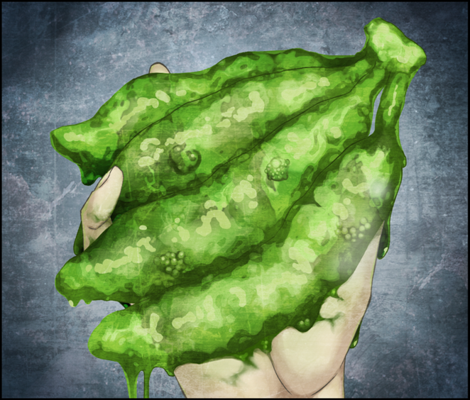
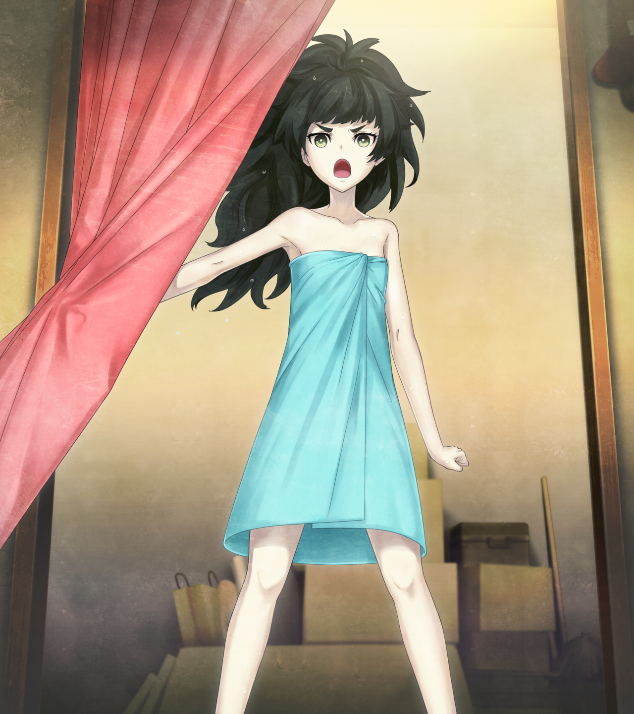

# 无限远点的牵牛星 - 02
> 1.129954  
> [ 2011/07/07 ] 冈伦发现了桶子在研究电话微波炉，激动地大骂。这时真帆出现。  

| [←prev](./0153) | [menu](../) | [next→](./0155) |

---

“哟，桶子。”  
“啊，冈伦啊，难得你一个人过来嘛。”  
刚走进 LAB，桶子带着有些慌张的表情来迎接我。房间里不知为何有股烧焦的气味，还有混着肥皂香味的潮气，是淋浴间刚被用过吗？但是，桶子肯定没有用过淋浴间，因为他的脸和衣服上都是黑色的污渍。可能是铃羽在吧，因为淋浴间的灯亮着。  
“你在干嘛？怎么搞的满身黑？”  
“啊……这是那个……之前捡了台被丢掉的微波炉，刚刚要加热便利店快餐的时候，爆炸了……”  
“爆炸……没事吧？”  
“布朗氏发火了。”  
“不要被他盯上哦，不然什么时候被赶出去都不知道。那样的话，你倒没事，铃羽会没地方去的。”  
“是、是的呢……那么，你今天来干嘛？真由喜没过来啊。”  
“有事和你说，好消息哦。”  
“但我拒绝。”  
“我还什么都没说吧。”  
“冈伦带来的消息没有一次是好的。”  
“好了，听着，我昨晚和雷斯吉宁教授一起吃了饭，谈了留学的事情。”  
“啊，又是那件事啊……”  
现在，我和雷斯吉宁教授会定期联系。当然，真帆来日本的事情，教授也知道，昨天还给我看了真帆从冲绳发来的照片。画面中，真帆一脸死板地站在浪花中，大概是家人或者朋友拍的吧。席间，雷斯吉宁教授诚心地邀请我去维克多·孔多利亚大学留学，就此商谈的最低条件，是从现在的大学毕业，然后通过维克多·孔多利亚大学的留学测试。  
“因为机会难得，所以也向教授介绍了你的事情。他对你也挺感兴趣。”  
“诶？我？”  
“维克多·孔多利亚大学有一个【情报科学研究所】，听说聚集了世界顶尖的黑客，以你的水平一定可以加入。”  
以前我也邀请过桶子一起去美国留学，可他并没有什么兴趣的样子，说什么“不能想象离开宅之圣地的生活”，或者“买不到工口游戏和手办的地方不可能去”，总是用这些理由搪塞。  
“毕竟我是超级黑客啦，加入倒是可以……”  
“总之先见一下教授怎么样？之前也见过一次。”  
“我最近很忙啊。”  
“一天时间总能挤出来吧。”  
“CM 结束前是不可能的。”  
“那不是还有一个多月吗？”  
“总之，暂时不行。”  
“哎呀哎呀，真是一直在搪塞啊，就那么不想去吗？”  

我叹了口气，坐在了沙发上。话说，这个房间还是老样子，一到夏天就像地狱一样闷热。窗户大开，风扇也全力转动，依旧汗如雨下。虽然有空调，但是没有开。  
“桶子，Dr. Pepper 还有吗？”  
“不知道啊，真由喜可能有买一些放着吧。”  
我站起来，打开房间角落的冰箱看了看，里面有普通的可乐、矿泉水、运动饮料等等，可一瓶 Dr. Pepper 也没有。冷冻室按惯例塞满了大量“多汁炸鸡 No.1”。真由理买的这个量，好像明显比以往还要更多？也许是包括了铃羽那份。  
“拿你一瓶运动饮料哦？”  
“只要不是铃羽喝过的就行。”  
拿了一瓶新上市的运动饮料，润了润干渴的喉咙。突然看到，冰箱旁边的零食架上，除了杯面和油炸零食，还放着 5 串香蕉，肯定也是真由理买的吧。再怎么说，炸鸡也好，香蕉也好，那家伙屯粮的量是不是太多了？虽然她本人说过自己是不管吃多少都不会胖的体质。即使如此，一下子买这么多，最后香蕉会过熟变得软糊糊且味道难以入口吧。  
“真由理那家伙，香蕉买太多了吧？”  
“啊，那些不是真由喜买的，是我——呃……！”  
桶子突然闭嘴，我一看过去，就明显地避开了我的视线。怎么回事？刚才开始他的样子就不对劲，这家伙……隐瞒着什么吗？  
“是你买的吗？你什么时候开始喜欢香蕉了？”  
“不、不是，你看，铃羽不是说过嘛，对减肥好，要每天吃。”  
“说起来，以前好像流行过这么减肥呢。”  
曾经电视上有位明星说可以吃香蕉减肥，结果第二天超市和水果店的货架上，一根香蕉都不剩了，真是令人哭笑不得。我家的冈部青果店，稍晚一步才觉察到这股热潮，老爸脑子一热进了很多香蕉，结果流行期过了，剩下一大堆……我对此印象深刻。  
“那也别一下子买这么多啊，大多数会黑掉的。”  
算了，正好有点饿，就从上面掰了一根，剥开。  
“总之，这也要考虑到啊。”  
“是、是的呢……嗯……”  

我三口吃完香蕉，正要把皮丢进可燃垃圾桶——发现了一件奇怪的事情，垃圾桶里一半都是香蕉，这个量很不寻常。而且不只是香蕉皮，还有半腐烂的香蕉果肉，由于夏天的炎热而散发着恶心的味道。垃圾桶中的这个景象，我印象中见过——是的，一年前，我住在这里，没日没夜地拉着桶子真由理连续进行某个实验的时候。我又想到冰箱里那异常的炸鸡块的存量，莫非是……！我无视肮脏，把手伸到垃圾桶中翻动着。”  
“等等，冈伦？！”  
桶子看到我的举动更加慌乱，但被我无视了。果然如我所料，大量的香蕉残骸下面，翻出了大量炸鸡块的包装袋。不管真由理再怎么喜欢，桶子饭量再大，也不可能这样这样连续几天只吃冷冻炸鸡块。我继续翻找垃圾桶更深的地方，终于，发现了我不想看到的东西。  
“呐……桶子？”  
“咋、咋了？”  
“香蕉和炸鸡块的组合……好怀念呢。”  
“呃、嗯……？”  
“大概一年前，我们也经常这样实验啊。因为太浪费，真由理总是生气地说我们不能这么粗暴对待食物。”  
“是、是的呢。”  
“所以没办法，我们只好吃掉微波炉加热过的香蕉，那味道真是糟糕啊。  
 可是，这种东西果然还是吃不下去啊。”  
我从垃圾箱里面掏出来的是——变成绿色的，黏糊糊的物质。就好像把大量的昆虫内脏碾碎得乱七八糟，再聚集起来，一看就恶心的粘液团。那东西从我的指缝间，啪嗒啪嗒地滴落到地板上，四溅开来。那本来是香蕉的东西，我们那时命名为胶蕉。  

“哦……完蛋了……”  
桶子抱住脑袋，仿佛陷入了巨大的挫败感。然后忽然态度一转，坦然地正面面对我。  
“呜——我输了……这么轻松就暴露了，还以为可以多隐瞒一段时间的说……  
 事实上，我本来打算，一旦有了头绪，就和你好好坦白，商量这件事的。”  
桶子扔给我一条毛巾，应该是他用过的，白毛巾有一部分已经被弄黑了。没办法，用它擦了擦被胶蕉弄脏的手。  

桶子走进开发室，挪开堆积的箱子和防尘盖板。  
“喏，这是『二号机』。”  
桌上的是——一年前我们造出来的，不断改良，又很快被我亲手拆掉的，那个招来灾厄的“未来道具 8 号机”。  
“重新……组装了吗……”  
“我还在犹豫是不是叫『电话微波炉(暂)·ver2』比较好呢。”  
“名字随便了。”  
“真的？听起来真不像是冈伦说的话。不论哪个未来道具，不是都要通过圆桌会议激烈讨论才能确定名字吗？”  
“那是黑历史……”  
“是吗？”  
桶子看向开发室里面的架子，曾经的未来道具们蒙上了厚厚的灰尘。桶子的目光充满怜惜，什么啊，这个态度是想说，那些事情是宝贵青春上的一页吗？“别开玩笑了！”本想这么说，还是忍住了。  
“你忘了我说过什么了吗？这东西很危险，不是我们能够持有的。”  
“嗯，可是……我未来不能不制造出时间机器的吧。所以我想，研究这东西就是迈出第一步。”  
“桶子！”  
我忍不住大喝一声，冲动地对着桶子大吼着逐步逼近：  
“我说过多少次了，多少次多少次多少次了啊！！  
 因为这东西，发生了什么？因为这东西，我经历了什么？  
 因为制造出这东西，真由理会被杀……！  
 因为制造出这东西，红莉栖牺牲了……！  
 因为制造出这东西，你的女儿跳回过去，最后自杀了……！  
 如果你忘了的话，那我就再跟你说一次。  
 你是笨蛋吗？那种不亲身经历一次就不会懂的笨蛋吗？！”  

“笨蛋的是你啊，冈部伦太郎！”  
背后突然传来一个饱含怒气的女声。转过身一看，发现真帆真帆正在瞪着我。  

“什！比屋定小姐！？”  
“哇……合法萝莉 ktkr……”  
“你这是什么打扮啊！？不对，你为什么在这里！？”  
“啊、那个！这是……一时冲动……！不要一直盯着看！我起诉你哦！”  
“是你自己这幅打扮冲出来的吧！”  
“等、等一下，我现在就穿衣服！”  
真帆慌慌张张地钻回了淋浴间。  

 

> (to be continued)

---

| [←prev](./0153) | [menu](../) | [next→](./0155) |
