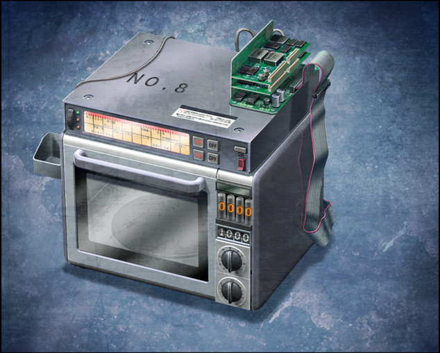

# 无限远点的牵牛星 - 03
> 1.129954  
> [ 2011/07/07 ] 冈伦发现真帆居然也瞒着他加入了开发，更加激动口不择言。桶子终于彻底爆发，挥出了“世界修正拳（被动）”。冈伦冷静下来，发现他们并不打算发送 D-mail 导致世界变化，反而更像是『时间跳跃机』，进度卡在了记忆数据压缩。冈伦知道真帆不可能忍住不用它拯救红莉栖，所以并不打算合作。  

| [←prev](./0154) | [menu](../) | [next→](./0156) |

---

过了一会儿，真帆穿好衣服出来了。  
“咳咳，失礼了，让你们久等了。”  
“该不会，你从我刚来的时候就一直躲在那儿了吗？”  
“我、我爱怎么做怎么做。”  
“发给雷斯吉宁教授的在冲绳的照片，也是特意伪造的吗？”  
真帆站在浪花中的照片，我和教授都没有产生怀疑，结果完全被欺骗了。那种完成度，肯定是出自桶子之手。  
“也就是说，你来日本的目的……不是冲绳。”  
“嗯，是的。是为了你那台毫无命名品味的机器——『电话微波炉(暂)』。”  
“我应该也和你说过了，D-mail 到底会引发什么。你打算重蹈覆辙吗？”  
“不是哦。”  
“怎么不是？一旦发送 D-mail，就会被<abbr title="Echelon，传闻中的一个以美国为中心的情报收集分析网路的俗称。由美国国家安全保障局（NSA）运营，参与国家为英美防卫协定的五个签署国，即英国、美国、加拿大、澳大利亚及纽西兰，又称五眼联盟。迄今五国官方没有证实它的正式存在，而能够证实它存在的证据，也未完全得到五国官方一致地确认。据传，日本作为第三方，以在日本国内设立梯队系统的监听设施作为交换，从而获取相应的情报。位于日本青森县三泽机场中，通称“象之槛”的便是梯队系统的设施。窃听内容多种多样，从军事通信到个人的手机信号，积累了各种各样的信息并进行分析。">‘梯队系统’</abbr>截获，就会再次从现在的 β 世界线回到 α 世界线。  
 这样的话，真由理会再次……死去，不论重复多少次都无法拯救，永远地经历死亡——”  
我突然产生了很恐怖的想法，目不转睛地盯着真帆的脸。难道……再怎么说她也不会是那样的人……我的心情十分复杂，心里想要相信真帆，不想认为她会那么做。可是……“禁忌的机器”再一次出现在我的眼前，让我怎么也冷静不了。回忆又开始不断在脑海中翻涌，红莉栖和真由理的死亡瞬间不断闪过——终于，我说出了绝不该说出口的话：  
“你……难道想回到 α 世界线吗？”  
“诶……？”  
“你期盼的，是那个红莉栖还活着，而真由理死去的世界吗？”  
“什！？”  
真帆难以置信地看着我，想不到我会说出这种话。然而在她做出反应之前——  
“你这混蛋！！”  
“唔——！！”
我的脸感受到了一波冲击，耳朵听到了一声巨响，回过神来，我已经仰面躺在了地板上，一时间无法理解发生了什么。左半边脸火辣辣的——我被揍了？被桶子？和他相识 5 年之久，还是第一次发生这样的事。  
“给我道歉！现在立刻向真帆碳道歉！”  
“等、等等！住手啊，桥田先生！”  
“冈伦到底有多痛苦，我只能靠想象。  
 所以我不会随便给予廉价的同情，连这种想法都没有！  
 可是啊，你到头来只是一直在用这个借口撒娇而已啊！
 真帆碳也好、铃羽也好、真由喜也好，所有人都为了你做了多少……！”  
“够了！别说了！”  
瘦小的真帆几乎挂在了桶子巨大的身体上，拼命地制止他。  
“放开我！这家伙，不多挨几拳是不会明白的！”  
“已经够了！现在这样就够了！所以冷静点！”  
真帆“啪啪”的敲打着桶子的肩头，然后指着淋浴间。  
“接下来的事情我来解释！你先去洗一下！快去！”  
“好的……”  
桶子终于冷静下来，好像在闹别扭一样，放下了高举的拳头。桶子并不是很擅长这种沉闷的气氛，通常这种时候都会讲一些 HENTAI 绅士的笑话——可是这次他没有这么做，直接消失在淋浴间的帘布里，很快传出了水声。  

“真是的……”  
真帆低头看向我。  
“都是因为你说了奇怪的话。”  
“……是、是啊……对不起，刚刚绝对不是真心话……”  
“我知道的，你不是那样的人。好了，能站起来吗？”  
我握住真帆伸来的手，慢慢站了起来。毫无防备的状态下吃了一拳，脑袋稍微有点迷糊。  
“刚刚那拳……力道很足。平常温柔的家伙，发起火来……真厉害呢。”  
“是啊，而且还不是为了自己，而是为了其他人发火，感觉挺棒的，稍微有点刮目相看了呢。”  
真帆有点开心地把目光投向了淋浴间。  
“只是有点吗？”  
“谁叫他平时的言行都只有性骚扰而已。”  
“说不定是因为喜欢你呢。  
小时候经常这样吧，故意捉弄喜欢的女孩子什么的。  
同样的道理……那家伙内心完全是个孩子。”  
“别开玩笑了，你想让铃羽小姐成为我的女儿吗？”  
“这的确挺难办呢……”  
我苦笑了一下，但很快收敛笑容再次看向真帆。由于身高差，真帆要抬头看着我。  
“从我的主观来看，这个世界是出于红莉栖的选择才存在的。  
 正因为红莉栖，真由理才能没事，才能幸福地生活着。  
 我，必须要保护这样的世界。  
 你是科学家，有着比我优秀很多的头脑。  
 所以能够理解吧，这个世界的至理。”  
“嗯。”  
真帆静静地点点头。  
“如果用一个概念来表示，大概就是‘神’吧。  
人类妄图挑战‘神’，太无谋了。  
 然而，我却挑战了几次、几十次、几百次……  
 全部都失败了，做什么都是徒劳的。  
 人类的傲慢，‘神’绝对不会原谅。”  
“是呢……”  
真帆望着窗外，好像在思念远方的故土和故人一样。  
“所谓的‘神’，在我的国家和故乡冲绳，都有很多人相信其存在。  
 我从祖父母、父母那里学到了那种观念。  
 虽然我是献身科学的人，但也绝对不会轻视‘神’。”  
“既然如此——”  
真帆微微摇了摇头，用锐利的目光抬头看着我——  
“但是呢，那和你挂在嘴边的‘神’完全不同。”  
真帆斩钉截铁地说道。  
“世界的至理？你说的那种东西，不过是构成这个世界的‘公式’而已。  
 其中并没有‘神’那种伟大的存在，我们也没道理无法得出‘解’。”  
我正要辩驳，真帆却已经先我一步进入了开发室，我也只好跟了过去。  
“D-mail 和‘梯队系统’的因果，以及由此带来的危险，我已经充分认识到了。  
 放心，D-mail 现在还封印着。  
 你担心的事态没有发生，我也绝对不会让它发生，不会回到 α 世界线。  
 当然，我也和在桥田先生讨论规避 D-mail 风险的方法，和让‘梯队系统’无效化的对策。  
 不过，从我个人角度而言，与其把资源分配在这方面的论证上，不如优先完成另一个项目。  
真帆拍了拍『电话微波炉(暂)·二号机』的机体。  
“我们现在研究的是，红莉栖实现过的时间跳跃。”  
“那……这台机器只能进行时间跳跃吗？”  
“就是这么回事。”  

不需要特意观察，就发现比起『电话微波炉(暂)』，这东西的确更像是『时间跳跃机』。这台机器上重现了那些特征——红莉栖独自对『电话微波炉(暂)』进行改良，从而开发出的『时间跳跃机』的特征。最容易理解的部分，就是本体的微波炉连接着另外一台电脑连接，这台电脑又用很多拖着导线的电极，连接在耳机上。在这条世界线，只有我知道『时间跳跃机』的具体构造，我也没有详细告诉过桶子和真帆。也就是说，真帆凭借仅有的提示，就制造出了和红莉栖一样的东西。  
“说实话，我真的很不甘心……”  
“不甘心？”  
“越深入研究越是亲身体会到，果然，我无法成为红莉栖。  
 把记忆数据化，再和 Top-Down 记忆检索信号一起传送到手机上……这一步我已经实现了。  
 但是……最大的问题却解决不了，明明红莉栖已经实现了。”  
“……数据的压缩……是吧？”  
真帆点点头。  
“如何才能压缩好几 TB 的庞大记忆数据……这个谜题，我怎么也解不开。”  
这也曾是红莉栖最伤脑筋的部分，但是那位天才少女借助桶子的力量，最终还是完成了。  
“你……有没有听红莉栖说过，解决的方法……”  
真帆明显心有不甘，但还是向我提问了。直接开口询问答案，相当于已经放弃凭借自己的力量解决问题，也就意味着承认了自己的失败。或许对她而言，这是难以忍受的。即便如此，她比起自尊更想要完成这台机器。但是——我对于这个提问，并不打算立刻给予解答。  
“之前给你讲我的经历的时候，我们做过一个约定，还记得吗？  
 ‘绝对不要想着，用时间机器去拯救红莉栖。’”  
“……嗯。”  
“现在，你还打算遵守这个约定吗？如果做不到的话，我无法协助你。”  
真帆没有立刻回答。但是，不需要仔细观察她的脸色就知道，她的心里产生了强烈的动摇。  
“……当然……会遵守的，我和你约定好了。”  
“呵呵。”  
过了好一会儿，才听到她嘟嘟囔囔的回答，我忍不住笑出声来。  
“你果然不擅长说谎呢，你那副表情，一眼就看穿了。”  
“呃……”  
“这话题到此为止吧。”  
我轻声说道，走出了开发室。  

看了下淋浴间，还有水声，看来桶子还没有要出来的样子。  
“呐，桶子，我才是笨蛋，真的很抱歉。”  
虽然我开了口，但是另一侧却没有回答，也许是没有听到。也许明天再好好道歉，对双方都比较好。  
“明天……我再过来。”  
说完，我走向了玄关。  

 

> (to be continued)

---

| [←prev](./0154) | [menu](../) | [next→](./0156) |
