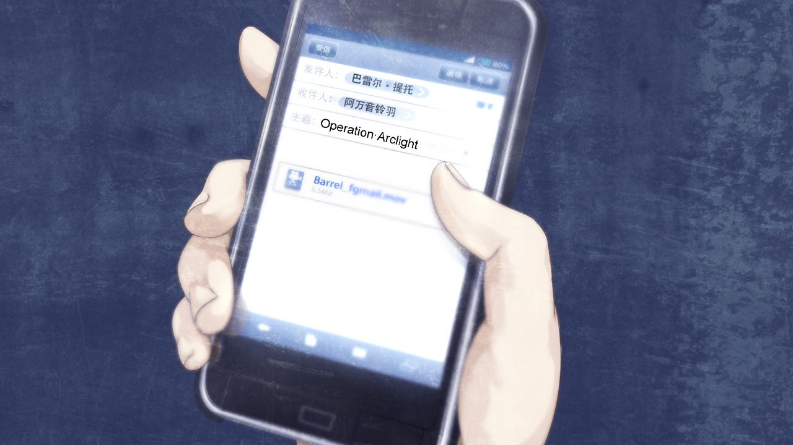

# 无限远点的牵牛星 - 05
> 1.129954  
> [ 2011/07/07 铃羽视角 ] 真由理来到时间机器处找到铃羽，得知了一切真相。她明确了自己的心意，想要再次见到凤凰院凶真，决定去执行铃羽构思的作战「牵牛星的复活」。这时铃羽收到了一封来自未来的视频邮件。  
> 在铃羽检修时间机器时，发现桶子在主控电脑核心处藏了一个硬盘，以防被其他人发现。然而根据 0141，在桶子的秘密基地被桐生萌郁带队袭击时，红莉栖的笔记本电脑和硬盘应该俄罗斯的武装部队物理毁灭了。所以不确定这里藏的硬盘是什么，是之前只破坏了笔记本电脑，移动硬盘被桶子私藏了，还是桶子有额外的备份，亦或只是单纯的秘密资料之类的。  

| [←prev](./0156) | [menu](../) | [next→](./0158) |

---

“呼——还是这么热呢。”  
时间已经快到下午 6 点，夏至后的太阳，虽然终于躲进了建筑的另一边，天空稍微浑浊的蓝色中，仍然渲染着一抹暗红色。这几天，铃羽都在仔细地保养位于广播会馆楼顶的时间机器。出发前往过去的时刻已然临近，对机器的保养也自然更加用心，连原本稍微脏点也没关系的部件，也擦得闪闪发亮。  
（是不是太过头了……我果然在不安吗？）  
结束保养后，铃羽整理了工具收纳箱，把箱子放进时间机器的驾驶舱中收好，然后坐在驾驶席上，再次确认了剩余电量。考虑剩余的燃料，计算得出，再过大概一个月，就不够回到“2010 年 7 月 28 日”，这就是铃羽能够留在这个时代的剩余时间。结果，可能无法像当初计划的那样，把冈伦叔叔带回过去。那样的话，铃羽只能试着独自一人去挑战，在这一年里学到的、自己计划的“某个任务”。  
“说起来……即使是爸爸……这也是不行的吧。”  
铃羽苦笑着，把手伸进了主控电脑的核心所在。放在那里的外置硬盘，怎么看都不像 2036 年的科技，而是现在——2011 年的东西，应该是桶子瞒着铃羽偷偷放在这里的。铃羽一启动时间机器，液晶触摸屏上就弹出了“驾驶舱内探测到异物”的警告。这台先进的机器不花一秒就识破了 21 世纪初的伪装。作为伪装的数据线并没有连接到主控电脑上，可以看出，桶子的目的不是为了监视或者得到数据，应该只是为了不让这个硬盘被其他人发现，所以偷偷藏在这里。出发前都要装作没发现那东西吗……  

正考虑着这些事情的时候，铃羽听到外面沉重的铁门打开的声音。  
有谁来了！铃羽迅速从枪套中拔出手枪，在驾驶舱中窥探铁门的方向。前几天才发生篝的事件，还是小心为妙。不过，看清来人的面容，铃羽立刻解除了警戒状态。  
“真由姐，很少见你来这里呢。”  
铃羽收起枪，从驾驶舱跳下来迎向真由理。  
“铃小姐……”  
“嗯……？你怎么哭了？发生什么事了？”  
铃羽很困惑，总是带着笑容的真由理，会哭泣的理由是什么。  
“为什么……大家都不告诉我呢？”  
“……诶？”  
“那位名叫红莉栖的小姐的事，和真由喜的事，为什么都不告诉我真相呢？”  
“啊……！”
铃羽一时间说不出话来。是从谁那里听来的？为了真由理的存活需要牧濑红莉栖的牺牲，这个残酷的真相——真由理知道这个真相时的表情，是铃羽最不想见到的。  
“……听谁……说的？”  
虽然这么问，但知道这件事的人并不多。除铃羽以外只有冈伦，桶子，菲莉丝，还有真帆，都不是会把真相告诉真由理的人。反而，为了真由理，大家都在隐瞒。  
“听到了……冈伦和真帆小姐的谈话……”  
果然是偶然事件……”  
“呜……呐，铃小姐？可以……跟我说说吗？2036 年的……真由喜和冈伦的事……”  
铃羽语塞，她其实不想回答。那些内容，对于现在的真由理来说绝对没有帮助。  
“未来的事情，不知道会比较幸福 。”  
真由理的脸上又流下一道泪痕。  
“真由喜呢……即使在这个世界，也什么作用都发挥不了。  
 所以，对于世界也好，对于冈伦也好，更需要的是红莉栖小姐啊。”  
铃羽突然陷入了一种错觉，好像未来和现在的真由理重叠在了一起。眼前的人，收束成为了铃羽从小一直看着的“真由姐”……铃羽再也无法拒绝她的请求。  
“我所了解的未来的真由姐……偶尔也会这么说……  
 那种时候，她总是茫然地望着天空，非常寂寞、悲伤的样子。  
 我和篝看到真由姐那样的表情，都感觉好难过。”  
“篝……？”  
铃羽这才想起来，篝的事情还在对真由理保密。  
“篝是一个女孩子的名字。她是战争孤儿，被真由姐收养了。所以，成为了真由姐的……女儿。”  
“真由喜的……女儿……”  
“很温柔，但是很坚强的一个孩子。在她还是那么小的时候，就经常说，自己要保护妈妈。  
 因为是那样的孩子，所以看到妈妈表现得那么寂寞，她应该也在忍受……”  
“啊……”
“说起来，7 月 7 日……今天被叫做‘七夕’呢。”  
“诶？嗯、嗯。”  
“我小时候从真由姐那里了解到，这一天是织女和牛郎一年一次的相见之日。 
 虽然那是一个大气污染严重，连星星都见不到的时代，但是真由姐还是这么说——  
 ‘就算夜空被乌云覆盖，星星依旧未从世界上消失，它依然在乌云的彼端，亘古不变地闪耀着。  
  所以让我们一起许愿吧。’  
 真由姐的这些话，成为了我和篝的希望，我希望能让你知道。  
 至少，对于我和篝来说，真由姐是必要的。  
 而且，冈伦叔叔也是，直到死前都把真由姐看得很重要，想让真由姐的幸福。”  
“直到，死前……？”  
“啊……！”  
这个事实对于真由理来说，也许依旧太过残酷了。但是铃羽下定决心，毫无保留地说了出来。  
“是……的。”  
“从现在算起，冈伦叔叔……只能再活 15 年。”  
“诶……！？”  
“为了保护真由姐……牺牲了。”  
“骗人的吧……”  
“后来从爸爸那里听到，冈伦叔叔最后是这么说的——  
 ‘能够拯救真由理的生命，真是太好了，因为我就是为了保护真由理才活到现在的。’”  
“怎……怎么会……”  
真由理用两手捂住嘴巴。  
“可是，真由姐心里一直放不下这件事……  
 每到七夕，常常在我们看不见的地方，偷偷地，仰望天空，嘟囔着——  
 ‘**那一天，如果我的牵牛星复活的话，一切是不是都会改变呢？**”  

“那一天……？我的……牵牛星，我的……”  
真由理嘴里重复着这句话，泪水又开始接连不断地滴落。不过，她开始逐渐抑制住悲痛的恸哭——虽然还在因悲伤而颤抖，但声音逐渐稳定了。  
“这是……什么意思呢……？”  
“我现在，大概能够理解了。  
 一年前……我对冈伦叔叔的态度真的很生气。机会明明就在眼前，为什么要放弃？  
 真由姐也是，宠着、保护着那样的冈伦叔叔，说实话，我也很难原谅。  
 但是，通过这一年的生活，我感受到了，那时，错的是我。  
 现在的我，也许可以好好地和那天的冈伦叔叔谈谈。”  
“那一天……”  
“虽然还是没有自信……到底能不能好好说服他。”  
太阳继续西落，时间机器和在旁边站着的铃羽的影子逐渐拉长。  
“留给我的机会，只有唯一的一次。既然如此，我打算赌在，未来的真由姐的那句话上。  
 我打算，不跳回牧濑红莉栖被杀的那天，而是跳回真由姐所说的**那一天**……  
 我想试试，能不能实现真由姐的愿望。”  
“真由理的、愿望……”  
铃羽温柔的抚摸着真由理比自己瘦弱得多的肩膀。  
“我想要相信……那就是通往命运石之门的钥匙。  
 因为我想明白了，能打开命运石之门的，不是放弃当牵牛星的普通星星——只能是‘真由姐的牵牛星’。  
 所以，我思考的新的作战是——「牵牛星的复活」。  
 用爸爸的风格来说的话——”  
 就是「Operation·Altair（牵牛星）」、「Operation·Arclight（织女星）」之类的，  
 或者，取让牛郎和织女连接在一起的含义，应该是「Operation·Deneb（鹊桥）」？  
 ……爸爸那样的命名品位，我身上好像没有呢。”  

一直安静地听着铃羽说话的真由理，突然摇摇晃晃地站了起来。  
“呐，铃小姐，那个作战……让真由喜来执行吧。”  
铃羽有点怀疑自己的耳朵，认真地看着眼前的少女。  
“这是很危险的赌博。如果我的想法错了，可能就只有失败一种结果。  
 时间机器也到了极限，不知什么时候就会失去控制，也说不定会直接消失。”  
“即使这样……也拜托了。真由喜也是 LABMem 哦，已经，不想再这样，总是向冈伦和桶子君求救。”  
真由理用自己的手用力擦掉了眼里的泪水，生机慢慢地、慢慢地……回到了她那柔弱的身体里。  
“真由喜呢……喜欢……冈伦。大概、和红莉栖小姐差不多……  
 不，不对，绝对，是不输给红莉栖小姐的程度。一直都最喜欢了！  
 呜……可是……可是啊……  
 我啊，我更加更加喜欢的是，**凤凰院凶真**……  
 在我失去了奶奶，快要从这个世界上消失了的时候……  
 是他救了我，对着我说‘要在这个世界一直活下去’。  
 这才是他，这才是我的牵牛星。  
 我……我啊……想再次见到他……  
 我想再次听见那个嚣张的笑声……  
 就算知道，自己无法成为那位‘织女星’……  
 即便如此，我的牵牛星……从以前，到现在，到未来，一直一直，都只有他一人啊！  
 我想去见，凤凰院凶真啊……！”  
即使少女知道自己无法成为“织女星”，但依然声嘶力竭地，把这万千思念交织而成的话语喊了出来。在这一刻——  

铃羽的手机响起了从未听过的提示音。  
“啊？！这……这是！”  
是收到视频邮件的提示音。看到发送人和文件名，铃羽不禁屏住了呼吸。  
“这是，来自未来的视频邮件……”  

发件人：巴莱尔·提托  
收件人：阿万音铃羽  
主题：Operation·Arclight  

 

> (to be continued)

---

| [←prev](./0156) | [menu](../) | [next→](./0158) |
