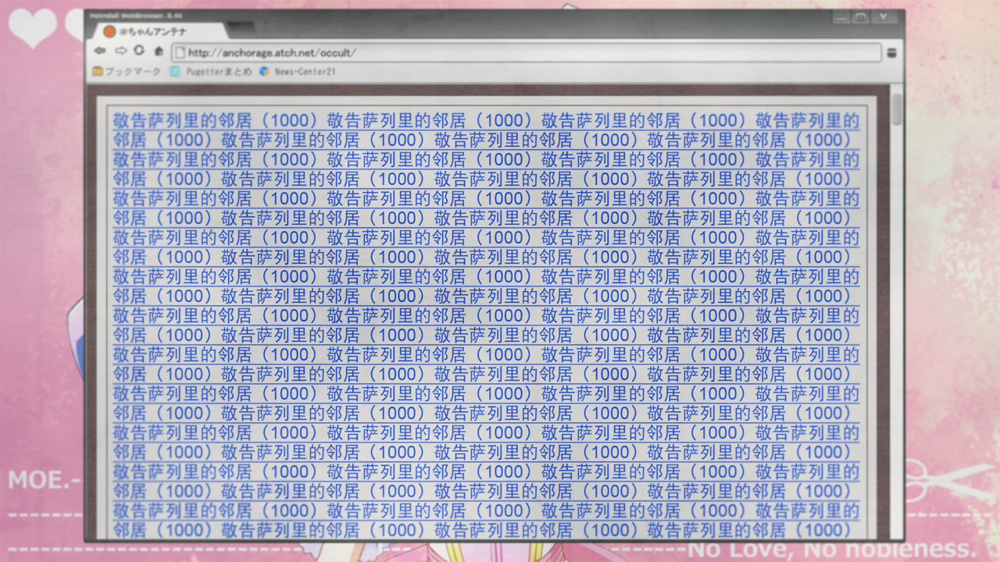

# 无限远点的牵牛星 - 06
> 1.129954  
> [ 2011/07/07 ] 哪里都找不到真由理。这时冈伦、桶子、比屋定三人发现，手机全都没有信号，联想到 α 世界线的恐怖袭击，有种不详的预感。@ch 上看到“红莉栖”发来的消息，怀疑时间机器的情报泄露。想要联系『Amadeus』，发现维克多·孔多利亚大学的程序和记忆数据在任何地方都不存在。  

| [←prev](./0157) | [menu](../) | [next→](./0159) |

---

“哈……哈……哈……”  
我用手撑着显像管工房的墙壁，大口调整着呼吸。真由理还是没有找到。我去 *MayQueen+Nyan²* 看过了，她可能去的店也看过了，都没有发现。  
“冈部先生！”  
真帆也气喘吁吁地回来了。  
“找到了吗？”  
“不行，周围已经找了一圈，但是没发现……”  
这种焦躁感让我快没了魂。你到底去哪里了，真由理……  

“桶子！你有找到吗？”  
我拜托桶子留在 LAB，联系真由理的朋友和熟人。  
“冈伦……那个……”  
“怎么了？”  
“电话……打不通了。”  
“我也给真由理打过好几次，好像关机了——”  
“不是的，不只是真由喜，给谁都打不通。并且，我的手机一直显示不在服务区……”  
“什么？”  
我立刻拿出自己的手机确认了一下。  
“我的也……不在服务区。”  
“我的也是。”  
真帆的手机也是一样。之前在 LAB 还从来没有出现过收不到信号的现象。我跑到楼顶，试图使用传统方法——把手机举高，但——结果还是一样。  
“楼顶也不行。”  
“楼外面也没有信号。”  
我和真帆从室外返回 LAB，分享了测试结果。这期间，桶子在用网络调查情况，幸好网络还保持畅通。  
“哦，有快讯了！”  
“Taboo！！”的首页上，刊登着手机大规模通讯障碍的新闻。  
“诶，这是怎么回事……秋叶原一带的基站……全频段故障……？”  
“全频段……怎么可能会发生这种事情？”  
“啊……！”  
我倒抽一口凉气。这种极不正常的情况，让我回想起了，一年前，α 世界线发生的事。那个晚上，真由理被无情地杀害，我一直深信不疑的安稳生活被终结，一切的痛苦开始萌芽。那个晚上，就是开始于，秋叶原站收到爆炸预告，公共交通系统全面瘫痪。  
“这是……人为的破坏。”  
——我有一种预感，现在的秋叶原，即将要被某种恐怖的东西吞噬。我拼命抑制那段记忆的闪回，现在不是颤抖的时候，我必须去找真由理，不能放下她不管，不能败给迄今为止背负的各种恐惧。我咬紧牙关，抬起了头。  
“桶子，网络还能用对吧？”  
“啊，嗯。所以通过 RINE，和琉华氏、阿万音氏取得了联系。”  
很好，这样的话，大家应该也在寻找真由理。  
“我也再去附近找一遍——”  
“等一下，实际上，我还有一件事很在意。  
 我之前上 @ch 调查信号故障的消息，结果发现超自然版块正在被爆版。  
 而爆版的帖子，你看——”  
桶子在电脑上打开了 @ch 的界面，催促我看。我还在奇怪，这和现状有什么关系吗，结果一看——  
“这是……！”  

『萨列里的邻居』，这不是我之前为了和『栗悟饭和龟波功』接触用的网名吗！？  
“怎么了？”  
真帆不了解背后的含义。我暂时顾不上解释，先点开了那个帖子。  

所有的帖子都是『栗悟饭和龟波功』发布的，最初的发帖时间大概是一小时前，除了那一条是正常的文字，后面的内容全都是胡乱罗列的无意义的数字和字符乱码。  
“这是……怎么回事？”  
真帆在旁边看着画面，好像从字里行间察觉了异样，于是用锐利的目光投向我询问。  
“这是『Amadeus』。”  
“诶？”  
“这家伙，是『Amadeus』的‘红莉栖’。”  
“啊……！”
“‘红莉栖’发生什么事了……”  
这些文字应该暗含什么信息，她想把那信息传达给我。  
“司掌时空之奥秘……”  
“不就是指时间机器吗？”  
桶子的猜测应该是正确的。  
“什！时间机器的情报泄露了吗？”  
“话说，为什么『Amadeus』知道时间机器的情报呢？冈伦你说的吗？”  
到底是怎么回事呢？印象中，担任测试员期间，我没有跟‘红莉栖’说过。但是……不，现在不是深究的时候。  
“比屋定，你能够访问『Amadeus』吗？”  
“虽然违反规定……但是现在不是考虑这种事的时候呢。  
 桥田先生，这台电脑可以借我用一下吗？”  
真帆和桶子换了个位置，从 LAB 的电脑连接上了脑科学研究所的计算机，输入了“Salieri”——她的账号和密码。按下回车键，可是，『Amadeus』没有出现。  
“……和平常不一样，怎么回事？”  
真帆面露困惑的神情，在电脑上一行行地输入命令，速度连桶子也要甘拜下风。然而，无论怎么做，『Amadeus』的程序都没有出现。真帆很快访问完研究所内的所有服务器，盯着屏幕咬紧嘴唇。  
“怎么会……！怎么会有这么荒唐的情况……”  
“怎么了！？”  
“没了……『Amadeus』所有的程序和记忆数据……都找不到了。”  
“什！！”
正如『栗悟饭和龟波功』的信息所说，“双生子，将被迫临时远离家园”。  
“桶子，黑进去！  
 不仅是脑科学研究所，维克多·孔多利亚大学的所有数据，从服务器到个人电脑，都给它撬开。”  
“*Okey-dokey!*”  
“比屋定也来帮忙，拜托了。”  
“……嗯、嗯。”  

但结果还是一样。维克多·孔多利亚大学从服务器到个人电脑，都找不到『Amadeus』的“红莉栖”和“真帆”，无影无踪，不留一丝痕迹。  
“被转移到其他地方了吗？”  
“这是不可能的，只有雷斯吉宁教授拥有『Amadeus』系统相关的管理权限。”  
“雷斯吉宁教授……”  
刚刚的帖子中，『栗悟饭和龟波功』所写的“天父”，究竟是指谁？从『Amadeus』的角度来看，亦父亦神的存在，也就是——  
“难道是……雷斯吉宁教授干的？”  
“不要凭空臆测。比起这个，更现实的可能是，教授的 ID 和密码被破解了！”  
“你有办法联系上雷斯吉宁教授吗？”  
电话打不通，电脑发邮件的话，对方不知道什么时候才能看见，也不知道什么时候才会回复。真帆拼命思考，依然想不到方法。这样下去只会陷入僵局。虽然很在意真由理，但是，这方面的危机也不能放任不管。  

“总之，我先去广播会馆。如果‘红莉栖’的警告是真的，被盯上的就是那里。”  
“我也去——”  
“你和比屋定留在这里收集情报！而且真由理说不定会回来！但要记住，一旦发生什么立刻逃跑！”  
我交代完，立刻冲出 LAB 奔向广播会馆。  

 

> (to be continued)

---

| [←prev](./0157) | [menu](../) | [next→](./0159) |
