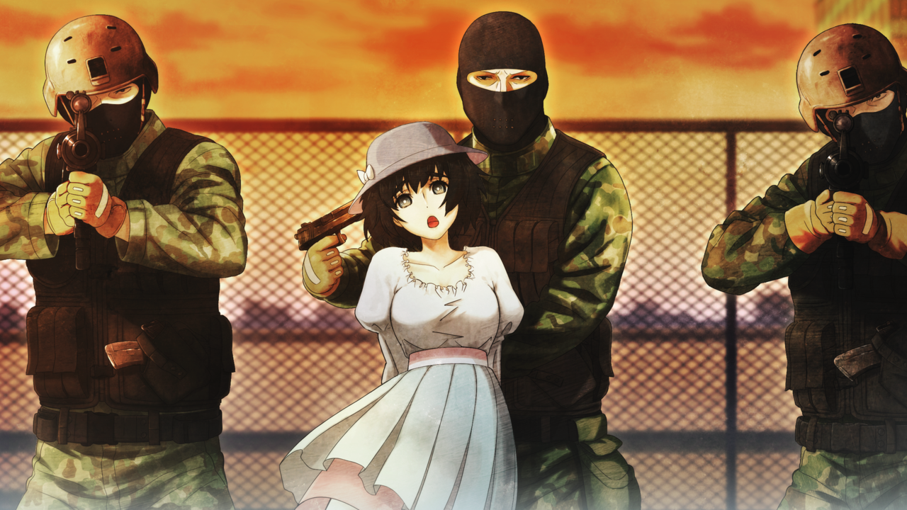

# 无限远点的牵牛星 - 07
> 1.129954  
> [ 2011/07/07 铃羽视角 ] 铃羽收到了未来另一世界线桶子的视频，表示她和真由理一起又发现了一条通往命运石之门的道路，准备给她们讲解「*Operation·Arclight*（织女星）」。这时真由理被武装部队挟持，铃羽只能暂时听从他们的要求。  

| [←prev](./0158) | [menu](../) | [next→](./0160) |

---

铃羽打开了手机收到的视频邮件，按下了播放键。视频画面经过相当大比率的压缩而显得模糊。在这样的画面中，那个人出现了。对铃羽来说，那是平时都会看见的面孔，现在也在身边的面孔，同时也是非常想念的面孔。年幼时经常抱着铃羽的那个人，在视频中大概 35 岁左右。  
“呀，铃羽，你还好吗？是爸爸哦，这里是 2025 年。  
 把各种各样的事情都托付给你，真是对不起，请你原谅我。  
 既然你收到了这封视频邮件，就说明……  
 你，不，**你和真由喜又发现了一条通往命运石之门的道路**。  
 这代表，计划将进入下一阶段。  
 你或许会生气，我为什么不在最初就把所有的指示都告诉你。  
 但是，不是不告诉你，是没办法告诉你。  
 因为，你出发的世界线的我，并没有制定现在这个作战计划。  
 或许你已经意识到了——**因为你和真由喜的选择，世界线又变动了一点**。  
 也就是说，我和你出发的那条世界线上的桥田至不同，是**另一条世界线的桥田至**。  
 不过，铃羽，你不要多想，不管在哪条世界线上，我都是最爱女儿的。  
 哈哈，顺便问，相比之下，你觉得哪个爸爸更帅啊？  
 其实我最近开始锻炼肌肉了……哼哼？”  
“桶子！不要说无聊的事了，赶紧讲作战计划的内容！”  
“真是的，反正你也就三分钟热度，不要做这些无关紧要的报告！”  
“录像的时长快要到了喵！”  
其他熟悉又陌生的声音从视频中传出，那是冈伦、真帆和菲莉丝。  
“好啦好啦，别催我嘛。  
 言归正传，接下来说明这封视频邮件的原本目的——  
 「*Operation·Arclight*（织女星）」的详细内容。  
 这是连一瞬间的失误也不允许的，极限的作战。  
 要用心听好，知道了吗？”  
于是铃羽暂停了视频。既然要“用心听好”，就必须要做好心理准备。为了能完美地记下作战内容，现在有必要转换掉现在轻飘飘的心情。老实说，收到来自 2025 年的父亲的视频邮件，铃羽相当兴奋。那种感觉，是自己独立决定要做的事情，得到了父亲的认同。正因如此，她必须要绷紧神经。  

真由理一个人伫立在一旁，一个劲儿地在手机上输入什么。收到视频邮件的时候，铃羽就向真由理说明了，可能由于预料之外的事态，今天就要出发回到过去。今天——这一天，这一刻——收到视频邮件这件事，一定是有意义的，铃羽有着这样的感觉。  
“你在做什么呢？”  
“啊，铃小姐，怎么样？今天可以出发吗？”  
“我正在准备确认作战内容。”  
“这样啊……那个，如果今天出发了的话，真由喜是不是就要下落不明了？  
 因为不想让他们担心，所以我想给爸爸妈妈，还有朋友们预先写一封邮件。”  
“要是还有时间能亲口告诉冈伦叔叔他们就好了。”  
在太阳下山之前，应该就能确认完作战内容，并决定如何行动。  
“也给冈伦写了邮件了，没问题的。”  
“邮件就可以了吗？”  
“……嗯。”  
真由理，腼腆地，重重地点了点头。她的眼中已经没有泪水，不过，淡粉色的脸颊上，泪痕依然清晰。  
“……总感觉……很难为情呢。  
 不过呢，难得写了邮件，能不能发过去也不一定，现在有点为难呢。”  
“为什么？”  
“没信号……显示不在服务区啊，是地点不好吗？”  
“不在服务区……？”  
铃羽看了看真由理手机显示的画面。信号状况指示，一格都没有。  
“真奇怪，这个地方平常都有信号的啊。”  
铃羽立刻也掏出自己的手机确认。  
“我的也是。”  
铃羽和真由理是不同的手机运营商，却同样没有信号，瞬间绷紧了面孔。  
“……有一种不好的预感。”  
铃羽让真由理先躲在时间机器背后，自己放轻脚步，跑到通往楼下的铁门前。尽可能不发出摩擦声的同时，把铁门拉开了一个拳头宽的缝隙。楼内的气息，和平常没有丝毫变化，寂静无声。下面的楼层，只有一些活动房间和仓库等，再像今天这样的普通日子里，一般都是这么安静。  
（……是我的错觉吗？）  
“铃羽很纳闷，同时轻轻地准备关上铁门——  
“啊啊啊啊——!”  

铃羽听到真由理的悲鸣，赶紧回头，看到穿着迷彩服的武装部队接二连三地越过楼顶的栅栏。真由理被其中的一个挟持了。  
（是从外面的墙壁爬上来的？！）  
铃羽对自己的失误非常后悔。对于外墙方向的入侵应该要充分警戒才是，可是因为收到父亲的视频邮件，心情不知不觉就放松了。对面一共有大约 30 个男人，都穿着迷彩战斗服，装备着手枪和自动步枪。  
“放下枪，趴在地上，双手放在头后面。”  
其中一个男人应该是队长，冷漠地命令铃羽放弃抵抗。
“抵抗的话，我无法保证这个女人的生命。”  
挟持真由理的男人站在她的背后，一只手别住真由理的双手，另一只手打开手枪的保险，抵在真由理的太阳穴。  
“可恶！” 
真由理被当作人质，铃羽只能服从，按照对方的要求，摆出无抵抗的姿势。  
“铃小姐……！”  
“不要说话，这些家伙，要是动真格的，真的会杀了姐姐的。”  
“啊……！”  
“我不会有事的。”  
光看这群人的行动，就能轻易想到，他们是实战的专家。想必他们的目标就是时间机器，并且已经掌握情报，知晓铃羽是唯一能够操作它的人吧。因此，铃羽判断自己是不会轻易被杀的。那个队长走到铃羽身边，蹲下用一侧膝盖压住她的后背，双手毫无顾忌地对她进行搜身。
“喂……我姑且也是女性，稍微注意点啊。”  
身上藏的用来以防万一的另一把小型手枪，还有几把小刀，都被搜走了。  
“目标 2 和目标 3 确保。那边呢？”  
队长向围在时间机器周围的几个部下问道。  
“目标 1 确保！应该上了锁，操作全都显示错误！”  
看来有几个人进入了机器里面。舱门一直开着是铃羽的失误，她对机器内部被脏兮兮的鞋子踩踏感到不悦。  
“别白费力气了，那东西只听我的话。”  
“……站起来。”  
队长用鞋尖轻轻踢了一下铃羽的侧腹。  
“双手就保持那样，慢慢地站起来。稍有一点多余的动作，就立刻杀掉人质。”  
铃羽按他说的站了起来。队长把她的双手扳到背后用手铐铐住，然后用枪顶着她的后背，把她带到了时间机器旁边。  
“……是生物认证啊。”  
“是的。不过，即使复制我的指静脉和指纹也是没用的。  
 砍下来的手，或者挖掉的眼睛，也是不能认证的。  
 2036 年的系统，才没有那么愚蠢。”  
他们似乎已经掌握了铃羽所说的情报，没有丝毫的动摇和焦躁。  
“『教授』怎么样了？”  
队长向那个挟持真由理的部下问道。  
“现在正在赶往这边。”  
“目标 1 和目标 2 是绑定的，不洗脑的话是没法使用。”  
听到洗脑这个词，铃羽咬牙切齿。曾经，铃羽看过许多『瓦尔基里』的伙伴们，遭受了非人道的洗脑，强迫他们作为间谍潜入，最终都变成了废人。  
队长转向铃羽：  
“洗脑之后会变成什么样，你应该是知道的。『教授』不会使用药物，而是直接鼓捣大脑。  
 变成那样之前，坦率和我们合作才是聪明的选择吧？”  
“『教授』……吗？”  
在未来，也有一个以此为代号的老年博士，以毁灭『瓦尔基里』为目标，率领着一支洗脑团队。而且，不使用药物的做法也是一样的。对于铃羽而言，他是最不能原谅的敌人。看来，现在与未来的两个『教授』，毫无疑问就是同一个人。  
“……我明白了。”  
铃羽老实地点了点头。  

 

> (to be continued)

---

| [←prev](./0158) | [menu](../) | [next→](./0160) |
