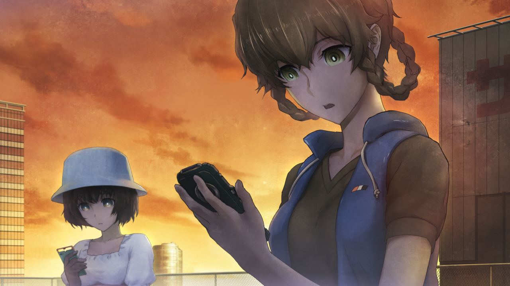

# 无限远点的牵牛星 - 07
> 1.129954  
> [ 2011/07/07 ] 

| [←prev](./0157) | [menu](../) | [next→](./0159) |

---

“铃羽按下了手机收到的视频邮件的播放按钮。”  
“画面经过相当大比率的压缩而显得模糊。在这样的画面中，那个人出现了。”  
“对于铃羽来说，这是一直都看过的面孔，现在也在身边的面孔，同时也是非常想念的面孔。”  
“在年幼的时候经常抱着铃羽的那个人，在影像中大概在 35 岁左右吧。”  

“呀，铃羽。还精神吗？是爸爸哦。这里是 2025 年。”  
“把各种各样的事情都托付给你，真是对不起。请你原谅我。”  
“你已经收到了这封视频邮件就说明……你，不，你和真由理又帮我发现了一个通往命运石之门的道路了吧。”  
“总之计划将进入下一个阶段。”  
“你说不定有生过气，为什么在最初开始时没有把所有的指示都告诉你。”  
“但是，不是不告诉你。是我没能告诉你。”  
“在你出发的世界线的我，并没有现在这个的作战计划。”  
“也许你已经意识到了——因为你和真由理的选择，世界线又变动了一点。”  
“也就是说，我和你出发那条线上的桥田至不同，是另一条世界线的桥田至了。”  
“但是，铃羽，你不要搞错了。不管在哪条世界线上，我都是最爱女儿的。”  
“哈哈。顺便问一下，比较一下如何呢，和你的那个爸爸比起来那个更帅啊。”  
“我最近开始锻炼肌肉了……哼哼？”  
“桶子，不要说无聊的事了，赶紧说作战计划的内容！”  
“真是的，反正你也是三分钟热度，不要做这些无关紧要的报告！”  
“可以录像的时间快要结束了喵！”  
“哎呀，别样催我嘛。”  
“总之，接下来说明这封视频邮件本来的目的。”  
“Operation Arclight（织女星）的详细内容。”  
“这是连一瞬间的错误也不允许的，极限的战斗，用心的听好了？”  
“于是铃羽暂时停止了视频。”  
“既然说“用心听”的话，就必须要有相当的心里的准备。为了能完美地记下作战内容，转换现在轻飘飘的心情是有必要的。”  
“说实话，从 2025 年的父亲那里收到视频邮件，铃羽相当的兴奋。”  
“像是自己独立去完成的事情，得到了父亲的认同般感觉。”  
“正因为如此，才必须要认真。”  
“真由理一个人伫立着，拼命地在手机上打进什么。”  
“在收到视频邮件的时候，就向真由理说明了可能由于不测的事态，今天就要向过去出发。”  
“今天——这一天，这一刻——收到有视频的短信这件事，一定是有意义的。”  
“铃羽有着这样的感觉。”  
“你在做什么？”  
“啊，铃小姐。怎样？今天可以出发吗？”  
“我打算先确认一下作战概要。”  
“是吗……”  
“嗯，如果今天出发了的话，真由喜是不是就要下落不明了？”  
“因为不想让他们担心，所以我想给爸爸妈妈，还有朋友和大家预先写一封邮件。”  
“能有直接传达给冈伦叔叔的时间就好了。”  
“在太阳下山之前，应该就能完成作战内容的确认并且决定如何行动吧。”  
“也给冈伦写了邮件了，没问题的。”  
“邮件就可以了吗？”  
“……嗯。”  
“真由理，害羞地，重重地点了头。”  
“在她的眼中已经没有泪水，不过，淡粉色的脸颊上，泪水滴下的痕迹依然清晰。”  
“……总觉得……很难为情呢。”  
“但是，难得写了的邮件，能不能发过去也不一定，现在有点为难呢。”  
“为什么？”  
“信号……显示在不在服务区啊，是地点不好吗？”  
“不在服务区……？”  
“铃羽看了看真由理手机显示的画面。”  
“信号状况指示，一条都没有。”  
“真奇怪。在这个地方的话，平常都有信号啊。”  
“铃羽马上将自己的手机也确认了一下。”  
“我的也是。”  
“铃羽在确认了自己和真由理的手机信号状况一样后，瞬间绷紧了面孔。”  
“……有不好的预感。”  
“真由理照着铃羽的指示隐藏在了时间机器的背后，铃羽一边隐藏起脚步声，一边跑向通往楼下的铁门前。”  
“尽可能的小心不发出摩擦的声音，同时把铁门开启了一个拳头宽的缝隙。”  
“听了一下馆内的气息，和平常没有丝毫变化，寂静无声。”  
“下面的楼层，只有一些活动空间和仓库等，再像今天这样的普通日子里，这样的安静的是常有的。”  
“……是我的错觉吗？”  
“铃羽感到很纳闷，同时轻轻地想关上铁门——”  
“啊啊啊啊——!。”  
“听到真由理的悲鸣后赶紧回头，穿着迷彩服的特工的身影接二连三地越过屋顶的栅栏。”  
“真由理，被其中的一个抓住了。”  
“是从外面的墙壁爬上来的吗？”  
“铃羽对自己的失误非常的后悔。”  
“对于墙上的入侵应该要充分警戒才是。”  
“但是，收到父亲的电子邮件后，心情不知不觉就放松了。”  
“装备着自动步枪的穿着迷彩服的男人们，约 30 名。”  
“真由理被劫做人质，铃羽无法动弹。”  
“就那样放下枪趴在地上。手放在头上。”  
“男人中的一个，冷淡地向铃羽命令道。”  
“抵抗的话，这个女人的生命就无法保证。”  
“将真由理的手别在背后的男人，把顶在她后脑勺的枪的保险打开，以威慑铃羽。”  
“可恶！”  
“只有服从。铃羽把从枪套中拔出手枪，放在地上，趴了下来。手放在头后面，采取无抵抗的姿势。”  
“铃羽……”  
“不要说话。这些家伙，一旦认真起来真的会杀了姐姐你的。”  
“……啊。”  
“我不会有事的。”  
“单是看这个迷彩服集团的行动，就能轻易地想像得到，他们是实战的专家。”  
“这样的话，想必他们的目标就是时间机器，并且已经掌握情报证明铃羽是唯一能够操作它的人的了吧。”  
“因此，铃羽判断自己是不会轻易被杀的。”  
“最初命令铃羽的那个队长似的男人，从旁边用膝盖顶着铃羽，毫无顾忌地对铃羽进行搜身。”  
“啊……我姑且也是一个女人。给我稍微小心点。”  
“隐藏着的用来以防万一的另一把小型手枪，还有几把小刀也都被夺走了。”  
“目标 2 和目标 3 确保。”  
“你那边呢？”  
“那个队长向在时间机器的周围聚集的数人呼唤道。”  
“目标 1 确保！被锁上了，一切都在报错！”  
“好像有数人进入了机器中。”  
“虽说舱门一直开着是铃羽的失误，她对机器内部被鞋子踩踏也感到不悦。”  
“做什么都没用的，那东西，不是我的话是不会听的。”  
“……站起来。”  
“队长，用鞋子的前头轻轻地踢了铃羽的侧腹。”  
“手就保持那样，慢慢地起来。如果有稍微一点多余的动作，就立刻会把人质杀掉。”  
“按照所说的那样站了起来，铃羽手被手铐靠在了后面。”  
“后背就那样被顶着，硬带到了机器的旁边。”  
“……是生物认证啊。”  
“是的。”  
“但是即使拷贝我的静脉和指纹也是没用的。”  
“哪怕是砍下手，或是挖掉眼睛，也是不能认证的。”  
“2036 年的系统才没有这么愚蠢呢。”  
“铃羽说明的这件事，穿着迷彩服的家伙们似乎都知道了。”  
“没有丝毫的动摇和焦躁。”  
““教授”怎么样了？”  
“队长，向那个用枪指着真由理的部下问道。”  
“现在正在赶往这边。”  
“……“目标 1”和“目标 2”是捆绑的，不做洗脑是不行的。”  
“听到洗脑这个词，铃羽咬牙切齿起来。”  
“曾经，『瓦尔基里』的许多伙伴们都被非人道的进行了洗脑，强迫他们作为间谍潜入，最终都变成了废人，铃羽就看过了很多。”  
“面对那个队长，铃羽转过身来。”  
“洗脑会怎样，你应该是知道的。教授不会使用药物，而是直接鼓捣大脑。”  
“在那之前，坦率地和我们合作才是比较聪明不是吗？”  
““教授”……吗？”  
“在未来也有被这么称呼的老年的博士，率领着以毁灭『瓦尔基里』为目标的洗脑小组。对于铃羽来说，是最不能原谅的人。”  
“而且，不使用药物的做法也是一样的。”  
“现在与未来的两个“教授”，是同一个人是不会错的。”  
“……我明白了。”  
“铃羽老实地点了头。”  
“我会听从的。但是，这样子是不行的。”  
“铃羽，像是故意似地用背后面手铐发出叮叮当当的声音。”  
“解开手铐。但是，如果抵抗的话，那女人就会死。”  
“如今，那枪仍然顶着真由理头。”  
“就算抵抗，在这么多专业的对手下，救助真由理是不可能的。”  
“双手自由了的铃羽，进入驾驶舱，使用了生物认证解除了锁定，开始操作控制台。”  
“突然，机器各处的亮起，类似轰鸣的声音开始发出。”  
“好，下去。之后由我们来调查。”  
“……我倒是不认为你们能够理解。”  
“铃羽走出了驾驶舱，队长，向着像是与刚才战斗班不同的，技术班的人，使了个眼色。”  
“——铃羽等的就是这个瞬间。”  
“从驾驶舱出来时，随意地触摸了控制台的下面。”  
“在那里，有刀藏着。”  
“没有声音。”  
“铃羽用刀，以那个队长为目标扔去。”  
“啊！”  
“那刀的刀尖刺进了队长的喉咙，他在发出悲鸣后立刻倒下。”  
“铃羽快速地架起了另一把刀，在身穿迷彩服的男人间穿梭起来。”  
“目标是持枪威胁真由理的男人。”  
“低下腰身的瞬间，从背后向颈部切了过去。”  
“喷出的血，洒在了呆然的真由理的背上，不过，没有担心的功夫了。”  
“捡起男人掉落的自动步枪，就这样贴着腰胡乱射击牵制的同时，牵着真由理的手向机器的背后滚去。”  
“……咕！”  
“到那里，都顺利地进行了。但是铃羽失算了，对方是比她预测的还要高上几个等级的训练有素的部队。”  
“有个疑是二把手的马上站在了前面，接着进行指挥。”  
“铃羽手上的，只有夺来的枪和一把刀。”  
“还必须要保护非战斗人员的真由理。”  
“敌人还有 25 人以上。”  
“要怎么打破局面，铃羽找不到答案。”  
“不管怎么说，现在，时间机器也正在运作着。不能把它丢弃在这里，自己逃出去。”  
“用自动步枪进行的威胁射击，打到铃羽藏身的机器上弹了开来。”  
“啊——”  
“真由理的身体像是被打中了一样猛地震了一下。”  
“头的一边，突然飞溅出血。”  
“真由姐。”  
“呃……啊……”  
“真由理可爱的脸上，染上了鲜血。”  
“应该是被跳弹擦伤了。”  
“空虚的表情，紧紧地抱着自己。”  
“那纤细的身体正在瑟瑟发抖。”  
“被卷入到这样的事态，会有那样的反应也是没办法的。”  
“铃羽也持枪应战，牵制着缩小包围圈的敌人。”  
“走过了各种战场……被逼到这个程度还是第一次啊……”  
“眼前是时间机器维修用的升降口。”  
“确认了之后，铃羽在头脑中模拟了最后的手段。”  
“如果打开那个的话……就能从内部爆破时间机器……”  
“但是如果实行的话，所有的计划都会付诸东流。”  
“通向命运石之门的道路，将被永远封闭。”  
“但是，让真由理牺牲在这里的冷酷，铃羽是没有的。”  
“站在世界线的收束的角度看，真由理是不会死在这里的。”  
“但是，刚才收到的视频邮件中，父亲所说的话令铃羽在意。”  
“也许你已经意识到了——因为你和真由理的选择，世界线又有点变动了。”  
“也就是说，我和你出发那条世界线上的桥田至不同，是另一条世界线的桥田至了。”  
“因此，铃羽不能确定真由理一定能活到 2036 年。”  
“——世界线真的改变了吗？”  
“当然，为了『Operation Arclight』，铃羽希望它改变。”  
“但是这样的话，铃羽现在就寸步难移。”  
“（——还是预想最坏的结果吧）。”  
“最糟糕的事态，那就是，时间机器被这些穿着迷彩服的家伙夺走。”  
“那样的话，甚至有可能会朝着比铃羽所知更为可怕的世界线变动。”  
“可能变为不要说真由理，就连至的生存都没办法保证的世界线。”  
“如果会是那样的话——”  
“迅速地做了判断。”  
“铃羽，一边观察着敌人的情况，一边用生物认证打开了维护用的舱口。”  
“看见了发出低沉声音的引擎的一部分。用枪向那里瞄准。”  
“幸好，生成克尔黑洞的部分还没有启动。这样的话，就算让机器爆炸，也不会对时间空间造成严重的影响。”  
“铃羽确认过后，就要扣动扳机——”  
“不，不行。”  
“真由理拼命地制止。”  
“不能弄坏它。”  
“不要阻止！我已经决定了！”  
“铃小姐！”  
“被真由理制止了。”  
“铃羽也在一瞬间犹豫了。”  
“但在战场上，一瞬间就能决定命运。”  
“铃羽急忙确认周围的情况。”  
“在那里，意料之外的出现了。”  
“混在重重包围的迷彩服的男人中，不知何时出现的，穿着暗色的骑手服，戴着头盔打扮的女人伫立着。”  
“啊、那家伙！？篝……！？”  
“泄漏这个地方的，果然是篝？”  
“篝的战斗能力，在两次邂逅中已经有把握了。”  
“只有半吊子的觉悟的话，会马上被杀掉的。”  
“铃羽对自己说道。”  
“看来我不得不放弃活下来的想法了……”  
“要拖几个人一起死，为真由理逃跑创造机会吗？”  
“现在只有考虑让真由理回到冈部伦太郎那里的方法了。”  
“于是，在正要开始盘算的时候——”  
“铃羽感觉到了正在看着自己——不，是看见真由理额上滴血的篝的视线。”  
“然后，紧接着。”  
“篝她做出了一个预想之外的行动。”  
“……你们对妈妈……做了什么……？”  
“你们这些家伙，对妈妈做了什么啊啊啊啊啊啊啊！！”  
“尖叫——”  
“不，那种的话，应该算是野兽的咆哮了。”  
“……唔！？”  
“然后，就是杀戮，正确来说是开始虐杀。”  
“篝左手抓住副队长的头，右手架着自动步枪，就这样将他的脸打得粉碎。”  
“那变形了的头被拽下来后扔到地上四处转动。”  
“……咦！？”  
“干什么！？你在做什么！？”  
“篝把副领队的头拍在地上变成碎片后，以迅雷不及掩耳之势，冲向了那群胆怯的迷彩服队员当中。”  
“然后，在近距离固执地依次用步枪一通乱射。”  
“你们对妈妈做了什么！？你们对妈妈做了什么！？你们对妈妈做了什么啊啊啊啊啊啊啊！”  
“不论对方是否已经倒在血泊，篝都将他们击得粉碎，四肢飞散，那些家伙连人形都没有了。”  
“为了自保而向篝射击的人自然也有，但是无论子弹打到了哪里，篝都丝毫没有畏惧，更不要说停止杀戮。”  
“用光了自动步枪的弹匣，这次双持巨大的军刀，并配合上体术，将视野内的对手挨个屠杀。”  
“这时，傍晚的楼顶上到处都是那帮队员的脏器，篝自身也被血肉染了个遍。”  
“……唔。”  
“不要看！把耳朵堵上！”  
“铃羽将真由理抱了过来并用胸前挡住了她的脸。”  
“因为太恐怖而瑟瑟发抖并紧抱着她的真由理，按照铃羽的话，用手堵上了耳朵。”  
“就算这样，人肉撕裂的声音，骨头碎裂的声音，依旧可以传达到鼓膜。”  
“（这种……简直已经不是人类了……！）。”  
“连铃羽都不禁呻吟道。”  
“自己身处战场的时候，像这样单方面的屠杀是从来没有遭遇过的。”  
“之前铃羽和篝战斗的时候就亲身体会到，她根本感受不到正常人感受的恐惧和疼痛，只是在考虑着如何葬送对方罢了。”  
“人类，为了保护自己的肉体，是会时刻限制肌肉的使用量的。”  
“但是，篝像是缺失了这一功能一样。”  
“刚刚，篝用军刀刺向一名背对着她逃跑的队员 ，仅用一只手就将那庞大的身躯击倒在地，进而用脚猛踢腹部使内脏破裂，将他虐杀致死。”  
“包，包，包围射击！那家伙只有一个人啊！”  
“去右边，右边！”  
“不知到底有几人，不，几十人化作肉块——剩下的数人好容易才回过神来，想与大部队取得联系，悲鸣声此起彼伏。”  
“篝那恐怖的反射神经，在他们射击的间隙，又将数人化为尸骨。”  
“但是——”  
“咕……！”  
“终于，弹雨打到了篝的左手，她手上的军刀被弹飞到地上。”  
“不，不是这样。”  
“被打飞的不只是刀子……篝的左手也被打飞了。”  
“这下冲击，使篝的身体剧烈地摇晃了一下。”  
“就，就是现在，射击！”  
“不知是谁，用毫无身为军人的骄傲与勇猛的声音，嘶喊道。”  
“然后开始一起连射，篝的身体又中了几发子弹。”  
“骑手紧身衣裂开了几个大口，头盔也有了裂缝。这时开始，篝身上的血已经不再是被杀者的了，而明显是她自身喷涌而出的鲜血。”  
“最终，这位杀戮者倒在了尸体堆成的山中。”  
“漂亮！”  
“肯定想着终于干掉她了吧。”  
“存活下来的迷彩服队员中的一个，用枪口对准了篝，正要扣下扳机——”  
“咕啊啊啊啊啊啊啊啊啊啊！”  
“哇啊啊啊啊啊啊啊！”  
“篝野兽般的咆哮与男人恐怖的尖叫这两个不和谐音重叠在了一起。”  
“她以倒下的姿势强行地跳了起来，那男人持枪的手腕被篝用刀背猛地敲断并击飞至老远。”  
“即刻，男人的咽喉已经被军刀切开并丧命。”  
“撤，撤，撤退，撤退啊！”  
“残存的几名男子开始恐慌的逃命。”  
“哈啊哈啊哈啊！”  
“（没事的，不要急躁！）。”  
“（还有时间，什么都不要担心！）。”  
“（铃羽和真由理都会没事的，不要多久，就能回到 LAB 了……！）。”  
“好不容易到了广播会馆，在行人当中，一些举着电话的人貌似发现了什么抬头望着天。”  
“在车站前，也没有信号。”  
“我调整了一下气息，往广播会馆的上面望去。”  
“就在这时，听见了远处传来的炸裂声。”  
“但是并不止一发。”  
“声音是连续起来的。”  
“听见了这样异样的声音，旁边的人也开始不安的四顾周围。”  
“我注意到了。”  
“这……这是枪战……！”  
“想起了以前 SERN 手下的 Rounder 和俄罗斯部队交手的时候就发出过这类激烈的声音。”  
“声音的来源是，广播会馆的楼顶……！”  
“来不及了吗！？”  
“铃羽……！”  
“我飞奔进广播会馆中。”  
“电梯不知为何在检修中，不能使用。”  
“不得已只能上楼梯了。”  
“心脏像是要破裂了一样扑通扑通的跳动着，脚也因为焦急而不听使唤。”  
“一次又一次地在阶梯上绊到，差点要摔倒。”  
“我到底是第几次，抱着这样的心情登上楼梯了呢？”  
“感觉简直是被诅咒了一般，一边痛骂着自己的体力不足，一边向下一楼进发。”  
“好不容易到了 7 楼，但却遇见了一个根本不想见到的人。”  
“不……虽然我也预感我会见到这个人。”  
“但还真不希望那个预感成真……”  
“雷斯吉宁……“教授”……！”  
“呀，Rintaro。”  
“还真是没想到你这么快就到了呢。”  
“雷斯吉宁教授他，用一副为难的表情看着我。”  
“哈啊……哈啊……哈啊。”  
“为什么……会在这里……”  
“稍微冷静一下。这么上气不接下气的话，可不能清楚地说话了哦。”  
“……为什么，会在这里！”  
“『Amadeus』，你把它怎么了！？”  
“……”  
“拜托你做的样本测试在半年前就已经结束了。”  
“现在可没有办法跟你说呐。”  
“这样回答道。”  
“雷斯吉宁他，在『Amadeus』消失的现在，却显得非常的平静。”  
“丝毫没有要处理『Amadeus』的问题的样子——而且，既然他不在办公室而是在这种地方，这一事实就说明了问题。”  
““红莉栖”给我发的信息内容，是真的吧？”  
“在那所写的“父亲”，果然就是指雷斯吉宁吧。”  
“你把“红莉栖”和“真帆”怎么了！？”  
“你肯定打算将她们的记忆数据解析，然后取出有关时间机器的信息吧！？”  
“还真是让人震惊呐……！”  
““红莉栖”对你说了那样的话么。明明有一直在监视的，什么时候做出了这样的行动……”  
“雷斯吉宁他，貌似真的被震惊到了。”  
“也就是说，“红莉栖”在使用@channel 的事以及我和“她”进行的对话，应该都没有注意到。”  
“这时——雷斯吉宁从怀中取出了一把手枪，对准了我。”  
“……！”  
“看来你有点涉足太深了。”  
“你……到底是什么人？”  
“科学家哦。”  
“但是，科学家可不是什么慈善事业哦。”  
“你知道“STRATEGIC·FOCUS”这个美国的民间情报公司么？”  
“STRATEGIC·FOCUS 公司？美国的……？”  
““STRATFO”么！”  
“以前，在被当作阴谋论的网站上看到过。”  
“连 CIA 都很难得到的俄罗斯的弹道导弹相关的最高机密，都能轻易地得到并且买卖，让 CIA 颜面扫地。”  
“而且，其结果，导致了俄罗斯军队的战略从根本上被动摇。”  
“也有传言说，不管是海湾战争还是伊拉克战争，他们比任何机构都要快地取得了所有参战国的军事情报，并且根据需要卖给了各个国家。”  
“世间所称的“影之 CIA”，就是我们哦。”  
“也就是说，要把『Amadeus』利用在军事上吗！？”  
“那个研讨会上所说的事，全都是漂亮话么！？”  
“嘛，我的事怎么样都可以吧？”  
“说起来 Rintaro。虽然只是从 Katsumi（克美）那听到的——”  
“你貌似，也有“新型脑炎”的症状呐。”  
“……!。”  
“而且，关于新型脑炎的机理，你也知道些什么不是吗。”  
“真是让我感兴趣。你所拥有的那些“情报”，请务必提供给我好么？”  
“没什么，只是接受一个很简单的手术罢了。”  
“这样的话，我接纳你为助手也是可以的。”  
“手术，不知为何，听到后我起了一身鸡皮疙瘩。”  
“那已经不再是为人亲切，有着像孩子一样恶作剧的心和好奇心，令人尊敬的雷斯吉宁教授了。”  
“而是一名对生命和人心毫不关心，残忍的科学原教旨主义者，在用枪指着我。”  
“……不。也许，这才是他的本性么？”  
“突然，发现了这是一位根本不知道真面目的恐怖的人。”  
“怎么样呢？”  
“教授进一步向我逼近了。”  
“就在这时。”  
“楼上，响起了激烈的枪响声。”  
“雷斯吉宁听到这声音后砸了一下嘴。”  
“向楼上望了过去。”  
“为什么会有枪战？都交代过了不要把事情弄大——”  
“唔啊啊啊啊！”  
“——！？”  
“在这间隙之中，我冲了过去。”  
“幸好是在楼梯当中。”  
“我狠狠地抱住了他的双脚想绊到他，平衡被破坏的雷斯吉宁顺势跌倒。”  
“咕……！”  
“因为后脑勺在由一定高度坠落被猛烈撞击到，在一瞬的呻吟之后，雷斯吉宁就一动不动了。”  
“……说不定已经死了。”  
“但是，我并不后悔。”  
“我已经在过去，不知道杀了多少次人了。”  
“打开楼顶的门后映入眼帘的，简直是真正的地狱景象。”  
“一片血海，其中还有大量的尸体倒里面。”  
“……这是……什么啊……”  
“在这血海之中，还倒着一位身着骑手服并头戴面罩的女性，身上都是血。”  
“她的手上，拿着一把巨大的军刀。”  
“一眼就可以看出，这出惨剧是这女的一手造成的。”  
“肩膀貌似还在上下起伏，看来还活着。”  
“强忍着令人作呕的血的气味，我靠近那个女人。”  
“……没，没事吧？妈妈？”  
“声音从那位骑手服女性满是裂缝的头盔里发了出来。”  
“好不容易看见，她身上的血并不只是溅到别人的血。她的全身，都已经被子弹打的破烂不堪。左手也不见了。简直让人不敢相信她还活着。”  
“貌似她并没有注意到我，而是在满是血的地上一寸寸挪动。”  
“视线再往前望去，在时间机器的阴影处，看到了铃羽和真由理的身姿。”  
“铃羽貌似并没有受伤，而真由理的脸上沾有一些血。”  
“真由理……！”  
“没想到真由理会在这里，虽然很担心她有没有受伤，她没什么事就太好了。”  
“真由理注意到了我的声音，抬起了脸。”  
“但是，下个瞬间，她的双眼就盯着了那个紧身衣女性。”  
“啊……啊……”  
“不要啊啊……！”  
“看到那向自己爬了过来的，发出了悲鸣。”  
“……唔？妈妈……？”  
“……妈，妈妈……不是这样的……这是……因为…………篝，并不想杀人……只是，想保护妈妈……”  
“篝？”  
“是篝么？”  
“直到现在我才知道，这个骑手服女性，就是铃羽一直在寻找的『椎名篝』。”  
“对……不起，妈妈……”  
“篝，已经够了！”  
“铃羽忍不住喊了出来。”  
“已经够了，不要再动了！你会死的啊！”  
“篝呐……从来没有想过让妈妈感到害怕哟.....是真的哦？”  
“篝只是想要帮助妈妈而已……所以，妈妈，求求你……不要讨厌我……求求你……”  
“妈妈……对不起……原谅，我。”  
“然后——篝终于因为力尽而倒在那里。”  
“好不容易回过神的我，先铃羽一步赶了过去。”  
“喂！？没事么！？”  
“她的呼吸声越来越微弱。大概是因为肺部的被子弹打中的缘故。”  
“也许将那破烂不堪的面罩掀开会好受一点。这样想着的我将手伸向面罩，但篝却抓住我的手，拒绝了我。”  
“不，不要……不要啊……”  
“不，不要取下来……如果在妈妈和铃羽姐姐面前的话……”  
“拜托了……冈部先生……”  
“……啊！！”  
“这个声音，这种称呼方式。”  
“我注意到了，这位被称作椎名篝的人的真实身份。”  
“定睛一看，感觉这张脸似曾相识。”  
“这，怎么可能……你……为什么……”  
“冈伦叔！篝怎么样了！？”  
“不要过来！”  
“我立刻制止了正要过来的铃羽。”  
“这里交给我！真由理就拜托你了！她的伤没问题么！？快去确认一下！”  
“虽然那一瞬铃羽的表情有些许惊讶，但还是按我的话去做了。”  
“回到了真由理那里，开始检查伤势。”  
“另一边的真由理，在众多的尸体前，又一次把脸埋在双手中。”  
“不要紧！真由姐伤得不重！”  
“听到铃羽的话，我松了口气。”  
“太好了……。妈妈……没事……啊……太好了……”  
“在我怀里，篝像是安心了下来，轻声说道。”  
“然后，慢慢地闭上双眼。”  
“呼吸变得越来越微弱。”  
“振作点！你、你为什么……！？”  
“没关系……不用担心……。我就算伤成这样，也不会疼，不会痛苦的……”  
“我一直……能听见神的声音……”  
“说着“你不会疼的，你不会痛苦的”。”  
“所以、我一点也……咳、咳！”  
“哈、哈……有、有件事……要告诉、冈部呢……”  
““真身”她、什么都不知道……”  
“她、在三年前就去了欧洲……留学……”  
““教授”为了把我送进秋叶原……、暗中做了手脚……”  
““真身”她……真的、什么都……不知道……”  
“居然是……“教授”……？”  
“那个“教授”、难道是……？”  
“……在这个世界线……本来、应该在明年的……桥田先生和“真身”的相遇……”  
“篝再一次微微地睁开双眼……朝时间机器的方向……真由理和铃羽的方向看去。”  
“没关系……“真身”也一定会、喜欢上、桥田先生的……”  
“和我一样……”  
“呵呵……说出来了。别告诉任何人……哦？”  
“然后，她眼里闪过一抹欣慰，这次真正地闭上了双眼……在痉挛了一下之后，她的身体一下子失去了力气。”  
“啊……啊……”  
“生命在我的手中，消失了。”  
“本来有一大堆想问的。”  
“她为什么要用“那个名字”出现在我们面前。”  
“全是不明白的事。”  
“然而，椎名篝的生命，在这个瞬间，走到了尽头。”  
“冈伦叔！篝没事吗！？”  
“……”  
“我被铃羽的喊声拉回了思绪。”  
“如果现在告诉她篝的死讯，铃羽会极大地动摇吧。”  
“那不是上策。现在不尽早想办法处理时间机器的话……！”  
“没事！我会把这孩子送去医院！”  
“我把浑身是血的篝的遗体架在肩上，站了起来。”  
“铃羽你赶紧停止时间机器，伪装起来！马上警察就要到这里——”  
“已经来不及了。”  
“什……！？”  
“我刚要去开门，通往楼下的铁门自己先开了，门后，一个的巨大身影逐渐显现。”  
“教授……！”  
“还没死吗……！”  
“但是，可能因为头上受了很重的伤，他脸色苍白，一只眼睛无法聚焦。”  
“这里马上就会成为战场……”  
“美国、俄罗斯和日本都已经开始行动了……”  
“开始转动的齿轮，已经无法停止了……”  
“如果篝早点向我们报告的话，现在事态也不会恶化到这个地步……”  
“……雷斯吉宁认识篝？”  
“这么说的话，果然！”  
“然而，在我之前，铃羽先反应过来了。”  
“是吗，你就是“教授”吗……！”  
“洗脑了篝的人就是你吧！？”  
“…………”  
“是……这样吗？”  
“原来……你是这种人吗！？【译注：原来……你是这种石膏！】。”  
““现在的我”什么也没干哦。”  
“雷斯吉宁对于我的质问，并没有要否定的意思。”  
“不如说，大约 10 年前，我还给了她援助，救下了在路上迷路的她，把她养育到了这么大呢。”  
“竟然说援助……”  
“她要是过着普通的生活，怎么可能变成现在这样！”  
“你能不能……不要这么大声呢？我头疼得像要裂开一样……”  
“我没有……骗你。是她自己过来接触我的。”  
“为了潜入这个城市甚至去做了整形，这也是她的计划哦。”  
“好像是她脑中的“神”，告诉她这些事情的……”  
“虽然，一开始我还以为是无家可归的孩子为了食物编出来的无聊的谎言呢……”  
“不过在检查了她的大脑和记忆以后，我知道了一件非常有趣，非常棒的事。”  
“那个“神”呢——”  
“即使激痛让他的脸都扭曲了，他还是夸耀般地笑了。”  
“她脑中那个“神”啊，竟然是未来的——2036 年的我。”  
“你……你是……”  
“真正的，疯狂科学家……”  
“很唐突地，街上响起了警报声。”  
“听着就让人很不安的声音。”  
“至今为止从没听过的警报声。”  
“这是？什么……”  
“游击队攻击情报。游击队攻击情报。本地区可能会发生游击队攻击。请进入室内避难，并打开电视或收音机。”  
“街区的广播喇叭这么宣告着。【校注：全国瞬时警报系统，统称 J-ALERT，是在日本投入使用的一种针对地震、海啸、火山、气象灾害等紧急事件的警报系统，利用通信卫星、无线电和有线广播方式传输警报】。”  
“游击队攻击……？”  
“不知什么时候，上空已经响起了几架直升机盘旋的声音。”  
“它们伴随着狰狞的引擎声飞行着，很明显和报道用的民间直升机不同。那是曾经在恶梦般的战时世界线中听到过的，战斗直升机的声音。”  
“我说过的吧？再过不久，这里就会成为争夺时间机器的战场……”  
“第三次世界大战……要开始了吗……！”  
“恐怕这里的居民们做梦都想不到，世界大战会从自己的城市中心开始吧……”  
“雷斯吉宁说完，就这么靠着墙壁坐到地上，不动了。”  
“是失去了意识，还是因为脑部受到的伤害而造成的意识障碍，我已经没有确认的余裕了。”  
“整个秋叶原的空气……仿佛都变得沉重起来。”  
“这种感觉。”  
“让我不寒而栗。”  
“在战时的那个世界线呆过的 1 个月。”  
“和那个世界线同样的未来，现在也要到来了。”  
“在日本，会变成这种事态什么的。就好像电视剧或电影一样。”  
“但是，我本能地察觉到，那不是虚构的。”  
“征兆从半年前开始就有了。”  
“在日本，东京，名为秋叶原的这个地方。”  
“有很多看起来和这里太不相符的，各国间谍和军人在暗中行动着。”  
“……所以，我早就知道了。”  
“因为我拒绝了铃羽的请求，期待着真由理活着的这个世界线，所以才迎来了 50 亿以上的人会死去的未来。”  
“选择了这个未来的，是我。”  
“是我啊……。”  
“冈伦叔！”  
“往那边看去，铃羽正护着真由理让她坐进时间机器。”  
“事已至此，那我们就这样跳回过去！”  
“唉……！？”  
“篝就拜托你了！”  
“不知道篝已经死去，铃羽说着，自己也坐进了机器中。”  
“慌张的我按住了时间机器的舱门往里面看。”  
“跳回过去，难道是要回到一年前——“那一天”吗！？这么突然！？”  
“并不突然。而且，不是跳回那一天。”  
“铃羽一遍操作着机器一边说。”  
“什么……？不跳回那一天，是怎么……”  
“我要暂时，把真由姐给借走了。”  
“真由理已经坐在了座位上。”  
“和 1 年前，我和铃羽一起跳跃时一样。”  
“真由理……你……？”  
“冈伦……”  
“远处响起了激烈的枪战声。还能听到惨叫声。”  
“大概是哪边的间谍之间已经开始了战斗。”  
“和被篝杀掉的迷彩服的家伙们不同的，另一个国家的军队正在朝这里逼近。”  
“冈伦，这个。”  
“说着，真由理伸出手，把手机交给了我。”  
“我想也没想就接过了手机。”  
“因为之前没有信号，所以给你这个！读一读里面的邮件！是真由喜的心情！”  
“等等！为什么你要去！？就算你去了结果也是一样的，什么都做不到！”  
“而且，现在跳跃的话就回不来了！”  
“不是的。冈伦是不行的！这个呢，是真由喜的任务！”  
“我不懂，我一点也不懂！”  
“拜托了，下来吧真由理。连你也被从因果之环排除的话，那我是为了什么才选择了这个世界线——”  
“冈伦。”  
“真由理温柔地，抚摸着我的脸颊。”  
“悲伤地，微笑着。”  
“…………”  
“真由理轻轻地推开了我。”  
“……”  
“我因此失去了平衡，手脱离了舱门。”  
“在这期间，舱门开始关闭。”  
“真由理！等等——！”  
“已经迟了。”  
“再次扶住舱门时，舱门已经完全关上了。”  
“因为使用了生物认证技术，除了铃羽以外谁都打不开门。”  
“时间机器呜呜地响着。”  
“青白的燐光浮现在机器周围。”  
“曾经在α世界线见过的情景。”  
“为什么……真由理……”  
“这时，屋顶的铁门被踢开了，武装着的一伙人蜂拥而至。”  
“那是接受过战斗训练的军队。”  
“此外，除了军队，天空中还有架武装直升机正在接近。”  
“士兵们纷纷向那架直升机开枪。”  
“而战斗直升机好像完全不介意那些枪击的样子，在空中摇摇晃晃地悬停着。”  
“在机体的左右装备着的，看上去很厉害的火箭弹发射器，直接瞄准了我——不，是瞄准了时间机器。”  
“难、难道！？”  
“停下……住手……”  
“然而，我最糟的预感应验了。”  
“直升机发射了火箭。”  
“仿佛被吸引着一般，导弹朝着时间机器飞去。”  
“而时间机器还被光芒包围着，在那里的——”  
“住手啊啊啊啊！”  
“在我喊出来的瞬间，全身承受了剧烈的爆炸冲击波，我被震飞了。”  
“……”  
“回过神时，我正趴倒在地面上。”  
“环视周围，许多士兵已经倒在了那边的尸体山里。”  
“之前对直升机开枪的士兵也在其中。”  
“唔……咕……”  
“我拼命站了起来。”  
“全身都像被烧着一样痛。”  
“很多处皮肤都溃烂了。”  
“衣服也破烂不堪。”  
“不，我的情况怎样都好。”  
“时间机器呢！？”  
“我立刻抬起头，看向时间机器所在的地方确认。”  
“如果时间跳跃赶上了的话，应该回避了那个火箭弹的直击才对。”  
“可是——。”  
“……！”  
“有大量的残骸散落在那里。”  
“一看就知道，那是时间机器的残骸。”  
“……没赶上，吗？”  
“铃羽……？真由理……？”  
“我在土烟之中，巡视着周围。”  
“呐，真由理……？你在哪儿？”  
“真由理！铃羽！回答我啊……！”  
“明明地上有大量的残骸。”  
“可是，却找不到铃羽和真由理。”  
“连她们的生死都确定不了。”  
“连尸体都没有。”  
“她们的存在消失了。”  
“事态已经超出了我的想象，变得很严重了。”  
“秋叶原的空中和地面都开展着激烈的战斗。”  
“在新闻里偶尔会看到的，中东地区之类战场的录像。”  
“就这样，在秋叶原再现了。”  
“我趁着战斗的混乱场面，好不容易从广播馆里逃了出来。”  
“篝的尸体，也只能留在了那里。”  
“为了不被发现而绕了一大段路，回到 LAB 的时候，天已经完全黑了，爆炸的火焰和曳光弹的轨迹点亮了黯淡的夜空。”  
“整个秋叶原就像是捅了蜂窝一样，混乱不堪。”  

 

> (to be continued)

---

| [←prev](./0157) | [menu](../) | [next→](./0159) |
