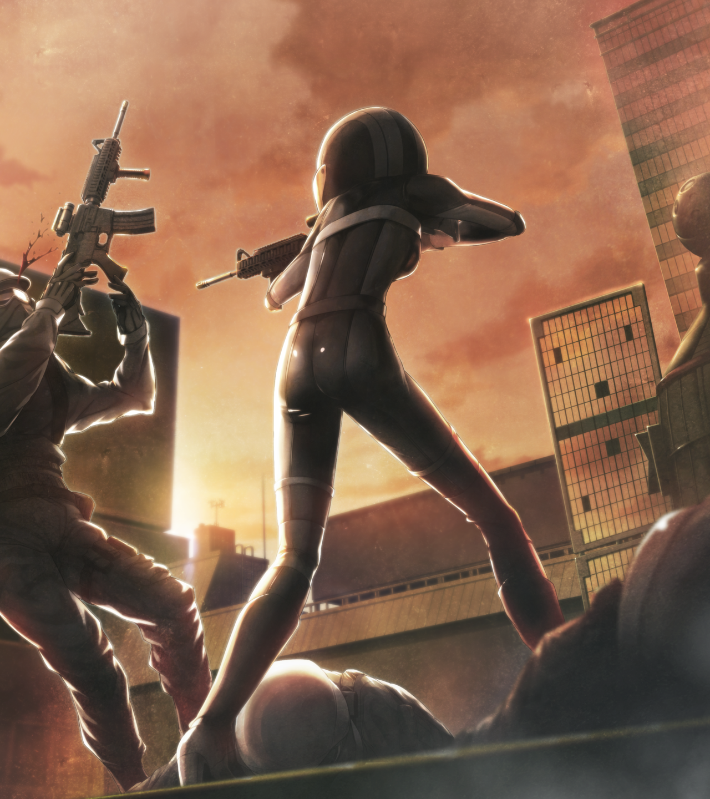

# 无限远点的牵牛星 - 08
> 1.129954  
> [ 2011/07/07 铃羽视角 ] 铃羽找准机会反杀几人，混战中真由理受伤。正当铃羽打算毁掉时间机器时，篝来到现场，由于真由理受伤而发狂，虐杀了剩余的士兵。  

| [←prev](./0159) | [menu](../) | [next→](./0161) |

---

“我会听从的。但是，这样子是不行的。”  
“铃羽，像是故意似地用背后面手铐发出叮叮当当的声音。”  
“解开手铐。但是，如果抵抗的话，那女人就会死。”  
“如今，那枪仍然顶着真由理头。”  
“就算抵抗，在这么多专业的对手下，救助真由理是不可能的。”  
“双手自由了的铃羽，进入驾驶舱，使用了生物认证解除了锁定，开始操作控制台。”  
“突然，机器各处的亮起，类似轰鸣的声音开始发出。”  
“好，下去。之后由我们来调查。”  
“……我倒是不认为你们能够理解。”  
“铃羽走出了驾驶舱，队长，向着像是与刚才战斗班不同的，技术班的人，使了个眼色。”  
“——铃羽等的就是这个瞬间。”  
“从驾驶舱出来时，随意地触摸了控制台的下面。”  
“在那里，有刀藏着。”  
“没有声音。”  
“铃羽用刀，以那个队长为目标扔去。”  
“啊！”  
“那刀的刀尖刺进了队长的喉咙，他在发出悲鸣后立刻倒下。”  
“铃羽快速地架起了另一把刀，在身穿迷彩服的男人间穿梭起来。”  
“目标是持枪威胁真由理的男人。”  
“低下腰身的瞬间，从背后向颈部切了过去。”  
“喷出的血，洒在了呆然的真由理的背上，不过，没有担心的功夫了。”  
“捡起男人掉落的自动步枪，就这样贴着腰胡乱射击牵制的同时，牵着真由理的手向机器的背后滚去。”  
“……咕！”  
“到那里，都顺利地进行了。但是铃羽失算了，对方是比她预测的还要高上几个等级的训练有素的部队。”  
“有个疑是二把手的马上站在了前面，接着进行指挥。”  
“铃羽手上的，只有夺来的枪和一把刀。”  
“还必须要保护非战斗人员的真由理。”  
“敌人还有 25 人以上。”  
“要怎么打破局面，铃羽找不到答案。”  
“不管怎么说，现在，时间机器也正在运作着。不能把它丢弃在这里，自己逃出去。”  
“用自动步枪进行的威胁射击，打到铃羽藏身的机器上弹了开来。”  
“啊——”  
“真由理的身体像是被打中了一样猛地震了一下。”  
“头的一边，突然飞溅出血。”  
“真由姐。”  
“呃……啊……”  
“真由理可爱的脸上，染上了鲜血。”  
“应该是被跳弹擦伤了。”  
“空虚的表情，紧紧地抱着自己。”  
“那纤细的身体正在瑟瑟发抖。”  
“被卷入到这样的事态，会有那样的反应也是没办法的。”  
“铃羽也持枪应战，牵制着缩小包围圈的敌人。”  
“走过了各种战场……被逼到这个程度还是第一次啊……”  
“眼前是时间机器维修用的升降口。”  
“确认了之后，铃羽在头脑中模拟了最后的手段。”  
“如果打开那个的话……就能从内部爆破时间机器……”  
“但是如果实行的话，所有的计划都会付诸东流。”  
“通向命运石之门的道路，将被永远封闭。”  
“但是，让真由理牺牲在这里的冷酷，铃羽是没有的。”  
“站在世界线的收束的角度看，真由理是不会死在这里的。”  
“但是，刚才收到的视频邮件中，父亲所说的话令铃羽在意。”  
“也许你已经意识到了——因为你和真由理的选择，世界线又有点变动了。”  
“也就是说，我和你出发那条世界线上的桥田至不同，是另一条世界线的桥田至了。”  
“因此，铃羽不能确定真由理一定能活到 2036 年。”  
“——世界线真的改变了吗？”  
“当然，为了「*Operation·Arclight*（织女星）」，铃羽希望它改变。”  
“但是这样的话，铃羽现在就寸步难移。”  
“（——还是预想最坏的结果吧）。”  
“最糟糕的事态，那就是，时间机器被这些穿着迷彩服的家伙夺走。”  
“那样的话，甚至有可能会朝着比铃羽所知更为可怕的世界线变动。”  
“可能变为不要说真由理，就连至的生存都没办法保证的世界线。”  
“如果会是那样的话——”  
“迅速地做了判断。”  
“铃羽，一边观察着敌人的情况，一边用生物认证打开了维护用的舱口。”  
“看见了发出低沉声音的引擎的一部分。用枪向那里瞄准。”  
“幸好，生成克尔黑洞的部分还没有启动。这样的话，就算让机器爆炸，也不会对时间空间造成严重的影响。”  
“铃羽确认过后，就要扣动扳机——”  
“不，不行。”  
“真由理拼命地制止。”  
“不能破坏它。”  
“不要阻止！我已经决定了！”  
“铃小姐！”  
“被真由理制止了。”  
“铃羽也在一瞬间犹豫了。”  
“但在战场上，一瞬间就能决定命运。”  
“铃羽急忙确认周围的情况。”  
“在那里，意料之外的出现了。”  

“混在重重包围的迷彩服的男人中，不知何时出现的，穿着黑色骑手装暗色的骑手服，戴着黑色的全覆式头盔的女性。  
“啊、那家伙！？篝……！？”  
“泄漏这个地方的，果然是篝？”  
“篝的战斗能力，在两次邂逅中已经有把握了。”  
“只有半吊子的觉悟的话，会马上被杀掉的。”  
“铃羽对自己说道。”  
“看来我不得不放弃活下来的想法了……”  
“要拖几个人一起死，为真由理逃跑创造机会吗？”  
“现在只有考虑让真由理回到冈部伦太郎那里的方法了。”  
“于是，在正要开始盘算的时候——”  
“铃羽感觉到了正在看着自己——不，是看见真由理额上滴血的篝的视线。”  
“然后，紧接着。”  
“篝她做出了一个预想之外的行动。”  

“……你们对妈妈……做了什么……？”  
“你们这些家伙，对妈妈做了什么啊啊啊啊啊啊啊！！”  
“尖叫——”  
“不，那种的话，应该算是野兽的咆哮了。”  
“……唔！？”  
“然后，就是杀戮，正确来说是开始虐杀。”  
“篝左手抓住副队长的头，右手架着自动步枪，就这样将他的脸打得粉碎。”  
“那变形了的头被拽下来后扔到地上四处转动。”  
“……咦！？”  
“干什么！？你在做什么！？”  
“篝把副领队的头拍在地上变成碎片后，以迅雷不及掩耳之势，冲向了那群胆怯的迷彩服队员当中。”  
“然后，在近距离固执地依次用步枪一通乱射。”  
“你们对妈妈做了什么！？你们对妈妈做了什么！？你们对妈妈做了什么啊啊啊啊啊啊啊！”  
“不论对方是否已经倒在血泊，篝都将他们击得粉碎，四肢飞散，那些家伙连人形都没有了。”  
“为了自保而向篝射击的人自然也有，但是无论子弹打到了哪里，篝都丝毫没有畏惧，更不要说停止杀戮。”  
“用光了自动步枪的弹匣，这次双持巨大的军刀，并配合上体术，将视野内的对手挨个屠杀。”  
“这时，傍晚的楼顶上到处都是那帮队员的脏器，篝自身也被血肉染了个遍。”  
“……唔。”  
“不要看！把耳朵堵上！”  
“铃羽将真由理抱了过来并用胸前挡住了她的脸。”  
“因为太恐怖而瑟瑟发抖并紧抱着她的真由理，按照铃羽的话，用手堵上了耳朵。”  
“就算这样，人肉撕裂的声音，骨头碎裂的声音，依旧可以传达到鼓膜。”  
“（这种……简直已经不是人类了……！）。”  
“连铃羽都不禁呻吟道。”  
“自己身处战场的时候，像这样单方面的屠杀是从来没有遭遇过的。”  
“之前铃羽和篝战斗的时候就亲身体会到，她根本感受不到正常人感受的恐惧和疼痛，只是在考虑着如何葬送对方罢了。”  
“人类，为了保护自己的肉体，是会时刻限制肌肉的使用量的。”  
“但是，篝像是缺失了这一功能一样。”  
“刚刚，篝用军刀刺向一名背对着她逃跑的队员 ，仅用一只手就将那庞大的身躯击倒在地，进而用脚猛踢腹部使内脏破裂，将他虐杀致死。”  
“包，包，包围射击！那家伙只有一个人啊！”  
“去右边，右边！”  
“不知到底有几人，不，几十人化作肉块——剩下的数人好容易才回过神来，想与大部队取得联系，悲鸣声此起彼伏。”  
“篝那恐怖的反射神经，在他们射击的间隙，又将数人化为尸骨。”  
“但是——”  
“咕……！”  
“终于，弹雨打到了篝的左手，她手上的军刀被弹飞到地上。”  
“不，不是这样。”  
“被打飞的不只是刀子……篝的左手也被打飞了。”  
“这下冲击，使篝的身体剧烈地摇晃了一下。”  
“就，就是现在，射击！”  
“不知是谁，用毫无身为军人的骄傲与勇猛的声音，嘶喊道。”  
“然后开始一起连射，篝的身体又中了几发子弹。”  
“骑手紧身衣裂开了几个大口，头盔也有了裂缝。这时开始，篝身上的血已经不再是被杀者的了，而明显是她自身喷涌而出的鲜血。”  
“最终，这位杀戮者倒在了尸体堆成的山中。”  
“漂亮！”  
“肯定想着终于干掉她了吧。”  
“存活下来的迷彩服队员中的一个，用枪口对准了篝，正要扣下扳机——”  
“咕啊啊啊啊啊啊啊啊啊啊！”  
“哇啊啊啊啊啊啊啊！”  
“篝野兽般的咆哮与男人恐怖的尖叫这两个不和谐音重叠在了一起。”  
“她以倒下的姿势强行地跳了起来，那男人持枪的手腕被篝用刀背猛地敲断并击飞至老远。”  
“即刻，男人的咽喉已经被军刀切开并丧命。”  
“撤，撤，撤退，撤退啊！”  
“残存的几名男子开始恐慌的逃命。”  

 

> (to be continued)

---

| [←prev](./0159) | [menu](../) | [next→](./0161) |
