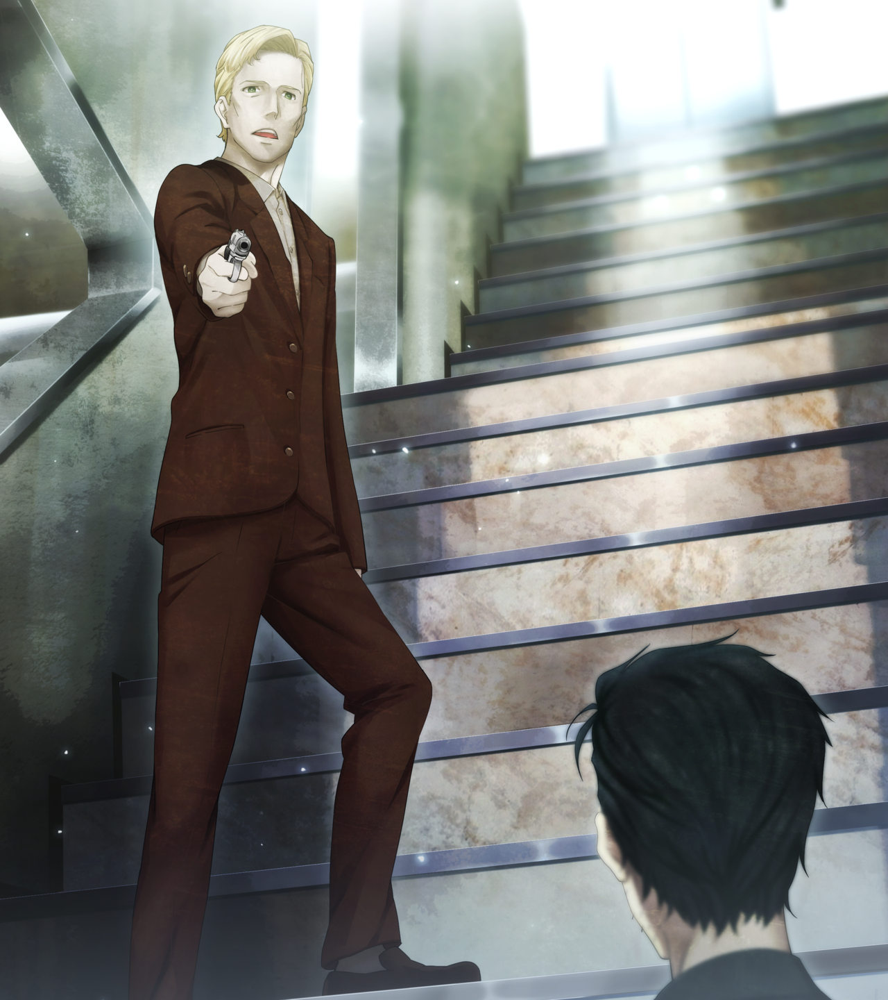

# 无限远点的牵牛星 - 09
> 1.129954  
> [ 2011/07/07 ] 冈伦赶到广播会馆，在 7 楼遇见了正式暴露身份的雷斯吉宁『教授』。  

| [←prev](./0160) | [menu](../) | [next→](./0162) |

---

“哈啊……哈啊……哈啊……！”  
（没事的，不要急躁！）  
（还有时间，没什么可担心的！）  
（铃羽和真由理都会没事的，要不了多久，就会回到 LAB 了……！）  
我大口喘着气，好不容易来到了广播会馆。有一部分行人举着手机，抬头望着天，看来车站前也没有信号。我调整了呼吸，抬头观望广播会馆楼顶。这时，传来了类似爆炸的声音，而且不止一发，连绵不断地响着。听到这种不寻常的声音，周围的人也开始不安地四处张望。我察觉到，这是……枪战声……！以前 SERN 手下的 Rounder 和俄罗斯部队交手的时候就是这种激烈的声音。声音的来源是……广播会馆的楼顶！来不及了吗！？  
“铃羽……！”  
我立刻冲进广播会馆。电梯不知为何在检修中，不能使用，不得已只能跑楼梯了。心脏像要破裂一样扑通扑通地跳着，双腿也因为焦急而不听使唤，好几次在阶梯上绊到，差点要摔倒。我到底是第几次，怀着这样的心情跑这座楼梯了呢？简直像是被诅咒了一般。我一边痛骂自己的体力不足，一边向楼上跑着。  

好不容易到了 7 楼，遇见了一个根本不想见到的人。不……我已经有预感会见到这个人，但还是不希望这个预感成真……  
“雷斯吉宁……教授……！”  
“呀，*Rintaro*，真是没想到，你这么快就到了呢。”  
雷斯吉宁教授用一副为难的表情看着我。  
“哈啊……哈啊……哈啊……你为什么……会在这里……”  
“稍微冷静一下，你这么上气不接下气的，话都说不清楚了哦。”  
“为什么……你会在这里！『Amadeus』呢？它怎么了！？”  
“唉……拜托你做的样本测试，半年前就已经结束了，现在无可奉告呐。”  
雷斯吉宁的回答很平静，明明是『Amadeus』已经消失的现在，也没有丝毫要处理问题的样子——而且，既然他不在办公室，而是出现在这种地方，这一事实就已经说明了问题。  
“‘红莉栖’给我发的消息，是真的吧？”  
帖子里所写的“天父”，果然就是指雷斯吉宁。  
“你把‘红莉栖’和‘真帆’怎么了！？  
 你想要解析她们的记忆数据，提取时间机器的信息，对吧！？”  
“真让我吃惊呐……！‘红莉栖’跟你说的这些吗？  
 明明一直在监视的，什么时候做出了这种行为……”  
雷斯吉宁的惊讶不似假装，也就是说，他并未发现“红莉栖”在使用 @ch 的事，以及我和“她”进行的交流。  

这时，雷斯吉宁从怀中拿出了一把手枪对准了我。  
“啊……！”  
“看来你涉足得有点深啊。”  
“你……到底是什么人？”  
“科学家哦。但是，科学家做的可不是什么慈善事业哦。  
“你知道 *Strategic·Focus* 吗？一个美国民间情报组织。”  
“*Strategic·Focus*？美国……STRATFO 吗？！”  
我在中二病时期，曾经在一个专门讨论阴谋论的网站上了解过。俄罗斯的弹道导弹相关的最高机密，连 CIA 都难以获取，他们却轻易得手后卖了出去，不仅让 CIA 颜面扫地，更是最终动摇了俄罗斯军队的战略根基。也有传言说，不管是海湾战争还是伊拉克战争，他们都赶在世界各大机构之前，获取了所有参战国的军事情报，并且根据需要卖给了各个国家。  
“世人所称的‘影之 CIA’，就是我们哦。”  
难道，他是要把『Amadeus』用于军事吗！？那个研讨会上说的，都是冠冕堂皇的谎言吗！？  
“嘛，我的事都无所谓了。  
 说起来，*Rintaro*，我从 *Katsumi*（克美） 那听说——”  
 你好像，也有‘新型脑炎’的症状呐。  
 而且，关于新型脑炎的机理，你应该也知道些什么吧。  
 我真的非常感兴趣，你所拥有的那些‘情报’，请务必提供给我好吗？  
 很容易的，只是接受一个很简单的手术罢了。  
 如果你答应的话，我可以接纳你为助手。”  
手术——不知为何，听到这个词我起了一身鸡皮疙瘩。眼前的这个人，已经不再是为人亲切、令人尊敬、同时像孩子一样喜欢恶作剧、充满好奇心的雷斯吉宁教授了，而是一个蔑视生命和人心、残忍的科学原教旨主义者。不……也许，这才是他的本性。突然发现，本以为熟悉的人，竟然有着不为人知的恐怖的另一面。  

“怎么样呢？”  
雷斯吉宁进一步逼近我，向我施压。  
就在这时，楼上响起了激烈的枪声。雷斯吉宁听到后砸了下嘴，向楼梯上方看过去。  
“为什么会发生枪战？我都交代过了，不要把事情闹大——”  
“呃啊啊啊啊——！”  
“唔——！？”  
抓住这一瞬间的破绽，我猛地冲了上去。幸好是在楼梯上，我狠狠地抱住了雷斯吉宁的双腿，破坏他的身体平衡，使他重重地摔倒在台阶上。他的后脑勺收到了猛烈的撞击，发生一声短促的痛呼后就一动不动了。难道……已经死了？但是，我并不后悔——过去的我，已经不知道体会过多少次杀人的感觉了。  

 

> (to be continued)

---

| [←prev](./0160) | [menu](../) | [next→](./0162) |
