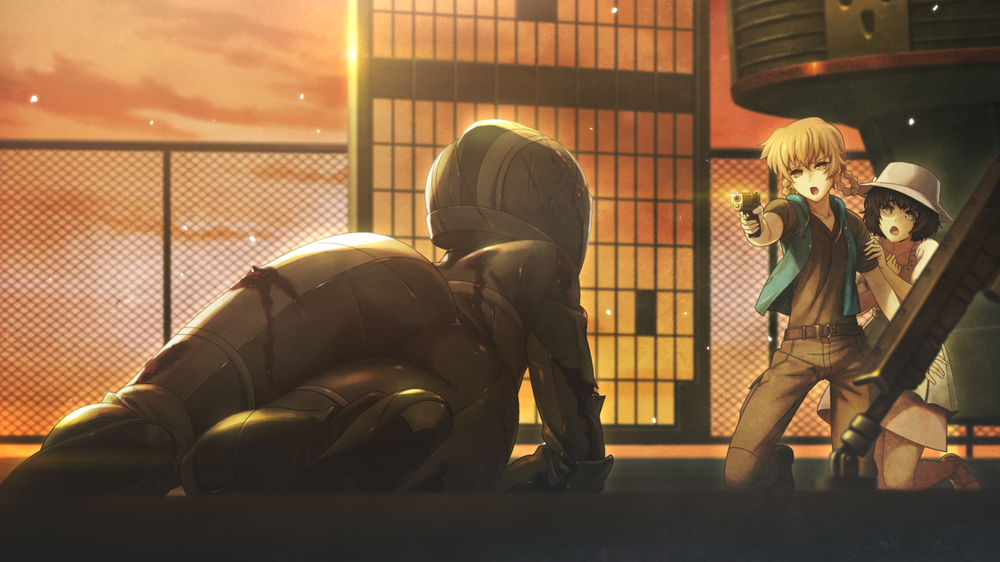

# 无限远点的牵牛星 - 10
> 1.129954  
> [ 2011/07/07 ] 篝力战退敌后倒地。冈伦冲过去看到头盔下的脸居然是由季，是被『教授』整容送到秋叶原，为了潜伏在他们身边。真正的由季三年前就去了欧洲留学，对此毫不知情，原本应该在明年与桶子相遇。这里的篝也喜欢上了桶子。最终篝重伤身亡，冈伦隐瞒了她的身份与死讯。雷斯吉宁诈尸出场，交代了篝脑中的‘神明大人’是 2036 年的『教授』，所以篝 10 岁那年从铃羽身边逃走，找到了现在的教授，交给他时间机器的情报。  

| [←prev](./0161) | [menu](../) | [next→](./0163) |

---

打开楼顶的铁门，映入眼帘的，简直是真正的地狱景象。  
“……这是……什么啊……”  

大量的尸体倒在一片血肉之海中。血海中间，趴卧着一个穿着黑色骑手服、头戴黑色全覆式头盔的女性。她浑身是血，手里握着一把柴刀形状的军刀，一眼就可以看出，眼下的惨烈场面正是她一手造成的。她的肩膀还在上下起伏，应该还活着。我强忍令人作呕的血腥味，靠近了她。  
“……没、没事吧，妈妈？”  
虚弱的声音从满是裂缝的头盔里传了出来，听着有点耳熟。离近了才看清，她身上的血不只是别人溅的，她的全身都已经被子弹打得破烂不堪，左手也不见了，伤成这样居然还活着。她好像并没有注意到我，拼尽仅剩的力气，一点点地在血海中往前挪动。顺着她爬动的方向，我看到了铃羽和真由理，正躲在时间机器的阴影中。铃羽似乎没有受伤，真由理的脸上却满是鲜血。  
“真由理……！”  
没想到真由理居然在这里，我很担心她有没有受伤，幸好看起来并无大碍。真由理听到我的声音，抬起头来，下个瞬间，她的双眼就紧紧盯着正在向她爬过来的女人。  
“啊……啊……不要啊啊……！！”  
“看到那向自己爬了过来的，发出了悲鸣。”  
“唔……妈妈……？妈、妈妈……不是的……这是……因为……篝本来不想杀人……只是，想保护妈妈……”  
篝？她是篝？我这才知道，这个穿黑色骑手服的女性，就是铃羽一直在寻找的“椎名篝”。  
“对……不起，妈妈……”  
“篝，够了！已经够了，不要再动了！你会死的！”  
铃羽忍不住喊了出来。  
“篝、篝啊……从来没有想过，让妈妈害怕哟……真的哟？  
 篝只是，想要救妈妈而已……所以，妈妈，求求你……不要讨厌我……求求你……  
 妈妈……对不起……请……原谅……我……”  
接着——篝终于耗尽力气，倒在了地上。  

我终于回过神来，先一步跑到她身边，蹲在地上把她的上半身抱起来。
“喂！？没事吧！？”  
她的呼吸声越来越微弱，大概是因为肺部被子弹打穿的缘故。我想着掀开那个破破烂烂的面罩也许会好受些，于是伸出手，却被篝抓住阻止了。  
“别……不行啊……不、不要取下来……  
 不能被妈妈和铃羽姐姐看见……  
 拜托了……冈部先生……”  
“啊……！！”  
这个声音，这种称呼方式——我发现了，这位被称作椎名篝的人的真实身份。低头看到的，是熟悉的面孔。  

“怎、怎么可能……你……为什么……”  
“冈伦叔叔！篝怎么样！？”  
“别过来！”  
我立刻制止了正要跑过来的铃羽。  
“这边交给我！真由理就拜托你了！她的伤势如何！？拜托你确认一下！”  
铃羽虽然有些纳闷，但还是按我说的去做了。她回到了真由理身边，开始检查伤势。而真由理看到这么多的尸体，又一次双手捂住了脸。  
“不要紧！真由姐伤口不深！”  
听到铃羽的话，我松了口气。”  
“太好了……妈妈，没事……啊……太好了……”  
怀里的篝喃喃自语，像是也安心了下来。接着，缓缓闭上了双眼，呼吸越来越微弱。  
“振作点！你、你为什么……！？”  
“没关系……不用担心……我就算伤成这样，也不会疼……一点都不痛苦……”  
 我一直……能听到神明大人的声音……  
 祂在说，‘你不会疼的，你不会痛苦的。’  
 所以，我一点都……咳、咳咳！  
 哈、哈……有、有件事……要告诉……冈部先生呢……  
 ‘真身’她，什么都不知道……  
 三年前，她就去了欧洲……留学……  
 『教授』为了把我送进秋叶原……暗中做了手脚……  
 ‘真身’她……真的……什么都……不知道……”  
“你说……『教授』……？”  
那个『教授』，难道是……？  
“……在这条世界线……本来，应该在明年的……桥田先生和‘真身’相遇……”  
篝再一次勉强睁开双眼，朝时间机器的方向……真由理和铃羽的方向看去。  
“不用担心……‘真身’也一定会……喜欢上，桥田先生的……和我一样……  
 嘿嘿……说漏嘴了……别告诉……任何人……哟？”  
她眼里闪过一抹欣慰，这次真正地闭上了双眼……痉挛了一下，她的身体随即失去了力气。  
“啊……啊……”  
生命，在我的手中，消逝了。我还有一大堆问题呢，她为什么要用“那个名字”出现在我们面前？全是无法理解的事情。然而，椎名篝的生命，在这个瞬间，走到了尽头。  

“冈伦叔叔！篝没事吧！？”  
我被铃羽的喊声拉回了现实。如果现在告诉她篝的死讯，她的内心肯定会产生极大的动摇吧。那不是上策，现在必须尽早处理好时间机器！  
“没事！我会送她去医院！”  
我把浑身是血的篝的遗体架在肩上，站了起来。  
“铃羽你赶紧停止时间机器，伪装起来！马上警察就要到这里——”  
“已经太晚了哦。”  
“什……！？”  
我刚要开门，通往楼下的铁门自己打开了，一个的巨大身影出现在门后。  

“教授……！”  
他没死吗……！不过，可能因为头部受了重伤，他面色苍白，一只眼睛无法聚焦。  
“这里马上就会成为战场……  
 美国、俄罗斯还有日本，都已经开始行动了……  
 齿轮一旦开始转动，就无法停止了……  
 如果篝早点向我报告，事态也不会恶化到这个地步……”  
……雷斯吉宁认识篝？这么说，果然——！在我之前，铃羽先反应过来了。  
“原来，你就是那个……『教授』吧！洗脑了篝的人，就是你吧？！”  
“呵……”  
“是……这样吗？你……原来是这种人吗？！”  
“‘现在的我’什么也没干哦。”  
雷斯吉宁轻描淡写地否定了我的质问。  
“倒不如说，大约 10 年前，多亏了我的援助，救下了迷路的她，把她养育到这么大呢。”  
“竟然说是援助……！她要是过着普通的生活，怎么可能变成现在这样！”  
“你能不能……不要吼那么大声呢？我头疼得要裂开了……  
 我……没有说谎。是她自己主动接触我的。  
 为了潜入这个城市甚至去整形，也是她的计划哦。  
 说什么，她脑中的‘神明大人’，让她做这些事情……  
 虽然，一开始我还以为，这些都是无家可归的孩子为了食物编的无聊的谎言呢……  
 不过，在检查了她的大脑和记忆之后，我发现了一件非常有趣、非常美妙的事情呢——”  
即使已经头疼到面部扭曲，他居然挤出了自豪的笑容。  
“她脑中那位‘神明大人’啊，竟然是未来的——2036 年的我啊。”  
“你……你才是……真正的，疯狂科学家……！”  

 

> (to be continued)

---

| [←prev](./0161) | [menu](../) | [next→](./0163) |
