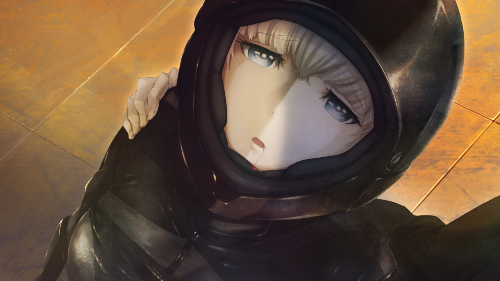

# 无限远点的牵牛星 - 10
> 1.129954  
> [ 2011/07/07 ] 篝力战退敌后倒地。冈伦冲过去看到头盔下的脸居然是由季，是被『教授』整容送到秋叶原，为了潜伏在他们身边。真正的由季三年前就去了欧洲留学，对此毫不知情，原本应该在明年与桶子相遇。这里的篝也喜欢上了桶子。最终篝重伤身亡，冈伦隐瞒了她的身份与死讯。雷斯吉宁诈尸出场，交代了篝脑中的‘神明大人’是 2036 年的『教授』，所以篝 10 岁那年从铃羽身边逃走，找到了现在的教授，交给他时间机器的情报。  

| [←prev](./0161) | [menu](../) | [next→](./0163) |

---

“打开楼顶的门后映入眼帘的，简直是真正的地狱景象。”  

“一片血海，其中还有大量的尸体倒里面。”  
“……这是……什么啊……”  
“在这血海之中，还倒着一位身着骑手服并头戴面罩的女性，身上都是血。”  
“她的手上，拿着一把巨大的军刀。”  
“一眼就可以看出，这出惨剧是这女的一手造成的。”  
“肩膀貌似还在上下起伏，看来还活着。”  
“强忍着令人作呕的血的气味，我靠近那个女人。”  
“……没，没事吧？妈妈？”  
“声音从那位骑手服女性满是裂缝的头盔里发了出来。”  
“好不容易看见，她身上的血并不只是溅到别人的血。她的全身，都已经被子弹打的破烂不堪。左手也不见了。简直让人不敢相信她还活着。”  
“貌似她并没有注意到我，而是在满是血的地上一寸寸挪动。”  
“视线再往前望去，在时间机器的阴影处，看到了铃羽和真由理的身姿。”  
“铃羽貌似并没有受伤，而真由理的脸上沾有一些血。”  
“真由理……！”  
“没想到真由理会在这里，虽然很担心她有没有受伤，她没什么事就太好了。”  
“真由理注意到了我的声音，抬起了脸。”  
“但是，下个瞬间，她的双眼就盯着了那个紧身衣女性。”  
“啊……啊……”  
“不要啊啊……！”  
“看到那向自己爬了过来的，发出了悲鸣。”  
“……唔？妈妈……？”  
“……妈，妈妈……不是这样的……这是……因为…………篝，并不想杀人……只是，想保护妈妈……”  
“篝？”  
“是篝么？”  
“直到现在我才知道，这个骑手服女性，就是铃羽一直在寻找的『椎名篝』。”  
“对……不起，妈妈……”  
“篝，已经够了！”  
“铃羽忍不住喊了出来。”  
“已经够了，不要再动了！你会死的啊！”  
“篝呐……从来没有想过让妈妈感到害怕哟.....是真的哦？”  
“篝只是想要帮助妈妈而已……所以，妈妈，求求你……不要讨厌我……求求你……”  
“妈妈……对不起……原谅，我。”  
“然后——篝终于因为力尽而倒在那里。”  

“好不容易回过神的我，先铃羽一步赶了过去。”  
“喂！？没事么！？”  
“她的呼吸声越来越微弱。大概是因为肺部的被子弹打中的缘故。”  
“也许将那破烂不堪的面罩掀开会好受一点。这样想着的我将手伸向面罩，但篝却抓住我的手，拒绝了我。”  
“不，不要……不要啊……”  
“不，不要取下来……如果在妈妈和铃羽姐姐面前的话……”  
“拜托了……冈部先生……”  
“……啊！！”  
“这个声音，这种称呼方式。”  
“我注意到了，这位被称作椎名篝的人的真实身份。”  
“定睛一看，感觉这张脸似曾相识。”  

“这，怎么可能……你……为什么……”  
“冈伦叔！篝怎么样了！？”  
“不要过来！”  
“我立刻制止了正要过来的铃羽。”  
“这里交给我！真由理就拜托你了！她的伤没问题么！？快去确认一下！”  
“虽然那一瞬铃羽的表情有些许惊讶，但还是按我的话去做了。”  
“回到了真由理那里，开始检查伤势。”  
“另一边的真由理，在众多的尸体前，又一次把脸埋在双手中。”  
“不要紧！真由姐伤得不重！”  
“听到铃羽的话，我松了口气。”  
“太好了……。妈妈……没事……啊……太好了……”  
“在我怀里，篝像是安心了下来，轻声说道。”  
“然后，慢慢地闭上双眼。”  
“呼吸变得越来越微弱。”  
“振作点！你、你为什么……！？”  
“没关系……不用担心……。我就算伤成这样，也不会疼，不会痛苦的……”  
“我一直……能听见神的声音……”  
“说着“你不会疼的，你不会痛苦的”。”  
“所以、我一点也……咳、咳！”  
“哈、哈……有、有件事……要告诉、冈部呢……”  
““真身”她、什么都不知道……”  
“她、在三年前就去了欧洲……留学……”  
“『教授』为了把我送进秋叶原……、暗中做了手脚……”  
““真身”她……真的、什么都……不知道……”  
“居然是……『教授』……？”  
“那个『教授』、难道是……？”  
“……在这个世界线……本来、应该在明年的……桥田先生和“真身”的相遇……”  
“篝再一次微微地睁开双眼……朝时间机器的方向……真由理和铃羽的方向看去。”  
“没关系……“真身”也一定会、喜欢上、桥田先生的……”  
“和我一样……”  
“呵呵……说出来了。别告诉任何人……哦？”  
“然后，她眼里闪过一抹欣慰，这次真正地闭上了双眼……在痉挛了一下之后，她的身体一下子失去了力气。”  
“啊……啊……”  
“生命在我的手中，消失了。”  
“本来有一大堆想问的。”  
“她为什么要用“那个名字”出现在我们面前。”  
“全是不明白的事。”  
“然而，椎名篝的生命，在这个瞬间，走到了尽头。”  
“冈伦叔！篝没事吗！？”  
“……”  
“我被铃羽的喊声拉回了思绪。”  
“如果现在告诉她篝的死讯，铃羽会极大地动摇吧。”  
“那不是上策。现在不尽早想办法处理时间机器的话……！”  
“没事！我会把这孩子送去医院！”  
“我把浑身是血的篝的遗体架在肩上，站了起来。”  
“铃羽你赶紧停止时间机器，伪装起来！马上警察就要到这里——”  

“已经来不及了。”  
“什……！？”  
“我刚要去开门，通往楼下的铁门自己先开了，门后，一个的巨大身影逐渐显现。”  

“教授……！”  
“还没死吗……！”  
“但是，可能因为头上受了很重的伤，他脸色苍白，一只眼睛无法聚焦。”  
“这里马上就会成为战场……”  
“美国、俄罗斯和日本都已经开始行动了……”  
“开始转动的齿轮，已经无法停止了……”  
“如果篝早点向我们报告的话，现在事态也不会恶化到这个地步……”  
“……雷斯吉宁认识篝？”  
“这么说的话，果然！”  
“然而，在我之前，铃羽先反应过来了。”  
“是吗，你就是『教授』吗……！”  
“洗脑了篝的人就是你吧！？”  
“…………”  
“是……这样吗？”  
“原来……你是这种人吗！？”  
““现在的我”什么也没干哦。”  
“雷斯吉宁对于我的质问，并没有要否定的意思。”  
“不如说，大约 10 年前，我还给了她援助，救下了在路上迷路的她，把她养育到了这么大呢。”  
“竟然说援助……”  
“她要是过着普通的生活，怎么可能变成现在这样！”  
“你能不能……不要这么大声呢？我头疼得像要裂开一样……”  
“我没有……骗你。是她自己过来接触我的。”  
“为了潜入这个城市甚至去做了整形，这也是她的计划哦。”  
“好像是她脑中的‘神明大人’，告诉她这些事情的……”  
“虽然，一开始我还以为是无家可归的孩子为了食物编出来的无聊的谎言呢……”  
“不过在检查了她的大脑和记忆以后，我知道了一件非常有趣，非常棒的事。”  
“那个‘神明大人’呢——”  
“即使激痛让他的脸都扭曲了，他还是夸耀般地笑了。”  
“她脑中那个‘神明大人’啊，竟然是未来的——2036 年的我。”  
“你……你才是……真正的，疯狂科学家……！”  

 

> (to be continued)

---

| [←prev](./0161) | [menu](../) | [next→](./0163) |
