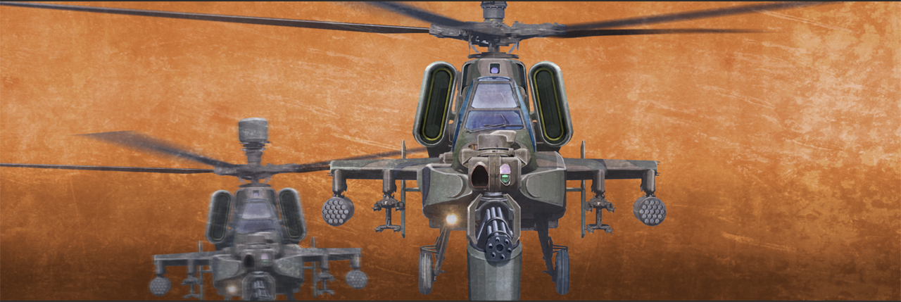
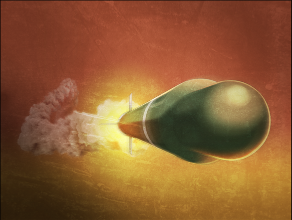

# 无限远点的牵牛星 - 11
> 1.129954  
> [ 2011/07/07 ] 战火已燃，真由理决定和铃羽登上时间机器执行任务。这时有直升机对时间机器发射导弹，冈伦被震飞昏倒，醒来看见了时间机器的残骸，但没有铃羽和真由理的尸体，无法确定她们的生死。  

| [←prev](./0162) | [menu](../) | [next→](./0164) |

---

突然，街上响起了警报。这种警报音令人不安，迄今为止我从未听过。  
“这是，什么……？”  
“<abbr title="在日本，发生紧急事件时，全国即时警报系统（J-ALERT），会利用通信卫星、无线电和有线广播向公众发出行政警报。针对地震、海啸、火山、气象灾害、环境卫生、核事故、武装攻击等不同类型，分别采用不同的警报音和播报内容。">游击队攻击警报</abbr>！游击队攻击警报！
 本地区可能遭遇游击队攻击！  
 请立即进入室内避难，并打开电视或收音机。”  
街区的广播喇叭不断重复着警报音和播报内容。  

不知什么时候，上空回荡着几架直升机盘旋的声音。明显不同于报道用的民用直升机，它们发出狰狞的引擎声。在那条处于战争时期的世界线，在那噩梦般的一个月里，我曾经无数次听过，那是武装直升机的声音。  
“我说过的吧？再过不久，这里就会成为争夺时间机器的战场……”  
“第三次世界大战……要开始了吗……！”  
“恐怕这里的居民们做梦都想不到，世界大战会从自己的城市中心开始吧……”  
雷斯吉宁兴奋地说完，就靠着墙壁瘫坐到地上，不动了。是失去了意识，还是因为大脑受到损伤而造成意识障碍，我已经没有确认的余裕了。整个秋叶原的气氛……仿佛都变得沉重。这种感觉，让我不寒而栗。在那条处于战争时期的世界线中经历的一切，即将在这条世界线的未来重演。日本竟然出现了这种事态，本以为只能在电视剧或电影中看到。然而，本能在告诉我，这一切都是真实的。并且，早在半年以前就有征兆了。日本，东京，名为秋叶原的这座城市，早就有各个实力的间谍和部队在暗中行动着。明明这一切都显得那么格格不入，明明那么明显地摆在我的面前，我甚至已经好几次被卷入过异常事件，我却一直自欺欺人地无视了……所以，我早就知道了。我拒绝了铃羽的请求，盲目地期待着真由理活着的这条世界线，所以才迎来了会有超过 50 亿人死亡的未来。选择了这个未来的，是我，是我啊……  

“冈伦叔叔！”  
我回头看去，铃羽正护着真由理让她坐进时间机器。  
“事已至此，我们就直接跳回过去！”  
“诶……！？”  
“篝就拜托你了！”  
铃羽不知道篝已经死去，留下这句话，自己也坐进了时间机器中。我慌张地跑过去，抓住时间机器的舱门，看着里面。  
“你说过去……难道是要回到一年前——那一天吗！？这么突然！？”  
“并不突然，并且，不是跳回那一天。”  
铃羽一边操作着主控台一边回答。  
“什么……？不跳回那一天，那要做什么……”  
“我要暂时借走真由姐了。”  
真由理已经坐在了座位上，和一年前，我和铃羽一起跳跃时一样。  
“真由理……你……？”  
“冈伦……”  
远处响起了激烈的枪战声，还能听到惨叫，大概是不同势力的游击队之间已经开始了战斗。  
“冈伦，这个给你。”  
真由理伸出手，把手机递给我，我想也不想就接了过来。  
“之前没有信号，所以给你这个！读一下里面的邮件！是真由喜的心意！”  
“等等！为什么你要去！？  
 就算你去了结果也是一样的，什么都无法改变！  
 而且，现在跳跃的话就回不来了！”  
“不是的，冈伦去是不行的！这个呢，是真由喜的任务！”  
“我不懂，我完全不懂啊！  
 拜托了，下来吧真由理。  
 连你也被因果之环排除的话，那我是为了什么才选择了这个世界线——！”  
“冈伦！”  
真由理温柔地抚摸着我的脸颊，悲伤地微笑着。然后，轻柔而坚定地推了我的肩膀。我因此失去平衡，手脱离了舱门。同时，舱门开始关闭。  
“真由理！等等——！”  
已经迟了，舱门已经完全关上了。因为使用了生物认证技术，除了铃羽以外，谁都打不开。时间机器发出低沉的呜呜声，蓝白色的磷光在周围舞动，这个情景我曾经在 α 世界线见过。  
“为什么……真由理……”  

这时，楼顶的铁门被一脚踢开，又一伙武装部队蜂拥进来。装备和之前被篝杀掉的穿迷彩服的家伙们不同，应该属于另一个势力，并且是训练有素的军队。  

除了他们，还有一架武装直升机从空中接近。  

士兵们纷纷举枪射击那架直升机，看来两方分属不同的势力。而武装直升机完全无视了那些子弹，淡定自若地在空中悬停，微微调整着姿态。机体的左右，挂载着看上去很厉害的导弹，直接瞄准了这里——不，是瞄准了时间机器。难、难道？！  
“不要……住手啊……！”  

我最糟的预感应验了，直升机发射了导弹。导弹仿佛被吸过去一样，毫无偏移地飞向了，被光芒笼罩的时间机器。  
“住手啊啊啊啊——！”  
剧烈的爆炸声掩盖了我的呐喊，强烈的冲击波把我整个人掀飞了出去。  

“呃啊……”  
等我清醒过来，发现自己正趴在地上。武装直升机已经飞走，之前对直升机开枪的士兵们也成为了尸体堆的一部分。我痛苦地呻吟着，拼命站了起来。衣服破破烂烂的，全身都火辣辣地疼，很多处皮肤都溃烂了。不，我的情况不重要。时间机器呢！？我赶紧抬起头，看向时间机器所在的地方。如果时间跳跃及时，应该能够回避那发导弹的直击。然而——那里散落着大量的残骸，一看就知道，是时间机器的残骸。没赶上吗……  
“铃羽……？真由理……？”  
我茫然地环顾四周，入目只有一片烟尘。  
“呐，真由理……？你在哪儿？真由理！铃羽！回答我啊……！”  
明明地上有大量的残骸，可是，却没有看到铃羽和真由理。没有她们的遗体，连她们的生死都确定不了。她们的存在消失了。  

事态愈演愈烈，已经完全超出了我的想象。秋叶原的天空和地面，到处都开展着激烈的战斗，那场景平常只能在报道中东战场之类的新闻中看到。我趁着战斗的混乱场面，好不容易逃出了广播会馆。篝的遗体，也只能留在那里了。  

 

> (to be continued)

---

| [←prev](./0162) | [menu](../) | [next→](./0164) |
