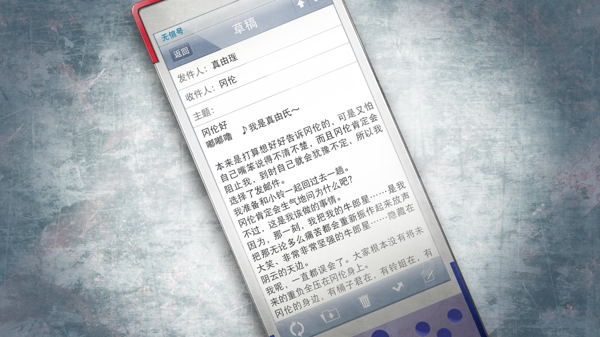

# 无限远点的牵牛星 - 12
> 1.129954  
> [ 2011/07/07 ] 冈伦回到 LAB，阅读真由理的邮件，痛苦不已。他终于再度身披白袍，号令众人，在两天后完成了『时间跳跃机』。  

| [←prev](./0163) | [menu](../) | [next→](./0165) |

---

“为了不被发现而绕了一大段路，回到 LAB 的时候，天已经完全黑了，爆炸的火焰和曳光弹的轨迹点亮了黯淡的夜空。”  
“整个秋叶原就像是捅了蜂窝一样，混乱不堪。”  
“LAB 的灯关着
“但房间里桶子、真帆和菲莉丝都在——黑暗的房间中只有电视和电脑的屏幕发着光。”  
“冈伦！”  
“冈部先生！还好没事……”  
“受了重伤啊！”  
“没事吧！？”  
“被卷入战斗里了！？”  
“必须赶紧处理一下！”  
“我没心思去回应 三人的话。”  
“看向电视中的影像。”  
“临时新闻的记者穿着防弹衣，带着安全帽，以不输给其他机构记者的声音怒吼着。”  
“简直就是战争！秋叶原站前和中央大道已经被封锁，美军和自卫队的直升机和装甲车——”  
“啊！刚才又响起了猛烈的炮火声！”  
“这里真的是日本吗？简直就像在采访内战中的国家一样！”  
“政府称这是恐怖袭击，但这样的——”  
“这时，在报道现场旁边，某阵营特殊部队的反器材步枪开枪，误击了一辆转播车，使其引擎燃烧爆炸了。”  
“呜哇，爆炸了！发生了爆炸！”  
“想死吗！赶紧跑！已经是战争了！真的会死的！”  
“闯入画面中的自卫队员怒吼着，想让媒体离开。”  
“战争，是和哪里打！？”  
“鬼知道！”  
“突然随着一声剧烈的爆炸声，影像中断了。”  
“被直接打中了吗……。”  
“看着影像，在场的所有人都沉默了。”  
“这里也很危险啊……”  
“回不了家了……”  
“网上的情报也一片混乱！”  
“喂冈伦，铃羽呢！？还有，真由氏找到了吗！？”  
“铃……铃羽和真由理她们……”  
“铃羽和真由理，可能跳到了过去，也可能丧命了……”  
“……诶？”  
“我模糊的言辞让桶子烦躁地逼了过来。”  
“到底怎么回事！？好好给我说清楚！”  
“武装直升机，对着时间机器，发射了火箭弹……”  
“……”  
“时间机器，被破坏了……”  
“还是在铃羽和真由理坐在上面……往过去跳跃前的一瞬间……”  
“机器留下了残骸，但不是全部……”  
“呐，桶子……不管怎么找，都没有找到铃羽和真由理的尸体……”  
“连身体的一部分都没有留下来……。简直就像毫无痕迹地消失了一样……”  
“那两个人，成功跳到过去了吗……”  
“一直忍着的泪水如雨般滑落。”  
“桶子听了我的话，一下瘫在了地上。”  
“菲莉丝和真帆靠着肩，睁大了眼睛。”  
“畜生！畜生，畜生！！”  
“桶子狠狠地捶着地板。”  
“怎么会有这么混账的事！？怎么会——！”  

“我想要擦掉泪水，才发现自己右手一直握着一个东西。”  
“是真由理交给我的手机。”  
“要我读邮件，她这么说过。”  
“没有上锁。”  
“试着打开邮件箱。”  
“那里留着好几封给家人和朋友的邮件，还没发出去。”  
“其中也有给我的。”  
“读这个……她是这么说的吧？”  
“用颤抖的手点开那封邮件。”  

“至冈伦。嘟嘟噜~是真由喜。”  
“其实是想好好告诉你的，但没有信心能够好好说出来。又怕被冈伦阻止后自己会犹豫，所以还是用了邮件。”  
“我要和铃小姐一起回一趟过去。”  
“为什么？冈伦也许会这样生气吧。”  
“但是，这是我必须要做的事。”  
“因为，那个时候，把我的牵牛星……把那个无论多么困苦的时候都会站起来高声大笑的、坚强的牵牛星……藏到乌云的后面的，就是我啊。”  
“我原来误会了。大家并没有把未来推到冈伦一个人的身上。”  
“冈伦的周围，有桶子君，有铃小姐，有琉华君、有菲莉丝酱、有由季、而且真帆小姐也加入了……”  
“所以这次到我出场了。因为这可是 LABMem No.002 的第一次重大任务啊。”  
“虽然我知道冈伦一定会很担心，但是没事的。”  
“而且我相信，就算发生了什么……你也一定会来救我的。”  
“我最喜欢的凤凰院凶真，一定会乘着他新开发的时间机器而来……”  
“所以我要出发了。而且一定会回来。回到冈伦的身边。稍等一会就好。”  
“我喜欢凤凰院凶真。”  
“但是……”  
“更喜欢，冈部伦太郎。”  
“呜……呜……真由理……”  
“你……忘记了吗？”  
“你可是我的……人质啊？”  
“人不在的话……不就当不了人质了吗……”  
“要是发生了什么就来救我？区区人质，太嚣张了吧……”  
“狂气的疯狂科学家，会为了你这种家伙……为了……你这种家伙……”  
“……你真是，笨蛋……”  
“但是……更笨蛋的……是我……”  
“心很苦，很痛。”  
“就像杀死红莉栖之后一样。”  
“哪怕现在倒地而死也比这样要好。想从这个痛苦中解脱。”  

“但是，我……在泪水中的视界的一角，发现了那个。”  
“凤凰院凶真最后的武器。最后的希望。”  
“——不，不如说它给我带来过无数次的绝望和噩梦。”  
“我摇晃着踏入开发室，轻易拆去伪装用的纸箱。”  
“那里的那个东西。”  
未完成的『电话微波炉(暂)·二号机』。”  
“瞒着我，真帆和桶子铃羽做的东西。”  
“——这个，完成的话。”  
“我转身擦过眼泪，看向阴暗房间中消沉的同伴们。”  
“完成『时间跳跃机』的方法，你们还不知道吧。”  
“能……按我说的做吗？”  
“我会把红莉栖导出的“解”——教给你们。”  
“然后……启动时间跳跃机。”  
“真帆说过，唯有记忆数据的压缩方法弄不清楚。”  
“也就是说，除此之外的部分都做好了。”  
“而我知道完成它的方法。”  
“桶子率先点了点头。”  
“我要做！告诉我吧，冈伦。”  
“……我也来帮忙。”  
“决定了喵。”  
“三人的回答没有犹豫。”  
“对着我的视线，斩钉截铁地，这么回答了。”  
“好！桶子，开始入侵 SERN，我们要远程操控 LHC。  
 这样就能把记忆数据压缩到 36 字节，就能发回过去了。  
“只、只有 36 字节……？”  
“果然是研究者。对于差了许多数量级的数字，真帆一下变了脸色。”  
“但是……好像功能不太稳定……这东西，有时会变成一台单纯的微波炉……”  
“显像管工房的 42 寸显像管，它打开的时候，『电话微波炉(暂)』就会发挥机能。”  
“显像管……？啊，这样啊！”  
“不愧是真帆。只听到显像管，就察觉到了。”  
“刚才的唉声叹气已经不在，表情再次焕发生机。”  
“那样，也许就能完成……”  
“但是，就算完成了，你打算马上就用吗！？”  
“不经过任何实际验证，就要做出这种像人体实验一样的行为……！”  
“对自己做的东西，没有自信吗？”  
“……但，但是。”  
“在另一个世界线上，红莉栖可是漂亮地做到了 。”  
“那，那是……因为是红莉栖啊。我是没法成为她的……”  
“@ch 上写的，“红莉栖”的信息你看了吧。”  
“诶……？”  
“故此终时，愿君将此告与吾之敬者（最后，希望你这样转告我最尊敬的人）。”  
“——我认为，自己是凡庸之人的代表。”  
“而，你一直是我的目标、。”  
“你才是名副其实的 Amadeus——以上。”  
“都让红莉栖说到那个份上了。而你还想要逃吗？”  
“逃跑什么……我不会做的。不要低估我。”  
“我还以她一个点头，然后用手一撩自己因为暴风凌乱的刘海。”  
“凶真，这个。”  
“菲莉丝把长时间一直挂在开发室墙上的白衣拿了过来。”  
“我在紧咬双唇，再一次擦掉泪水之后。”  

“接过那件白衣，双手穿过长袖。”  
“猛地翻起下摆——”  
“像曾经那样，威严耸立在 LAB 的中心。”  
“接着高声宣告道。”  
“现在起，完成『电话微波炉(暂)·二号机』，进行时间跳跃！助我一臂之力。”  
“这次，我绝对不会放弃……！”  
“将视线逐个投向桶子、菲莉丝，最后是真帆。”  
“哪怕是失败了几次、几十次、几百次……我也要挑战几千次、几万次、几亿次，然后拯救所有的一切，包括铃羽和真由理——还有，红莉栖！”  
“这，将成为那最初的一步！”  
这种中二病全开发号施令的感觉，真是久违了。  
“三位可靠的同伴看着我，回以我一个充满决意的点头。”  

“完成『电话微波炉(暂)·二号机』，花费了近两天的通宵作业。”  
“这之间，秋叶原的骚乱一直持续，不能轻易外出。”  
“虽然没有卷入战斗中，但还是担心会被什么组织袭击——一边与这样的恐惧战斗一边进行的作业，是一件削弱全员神经的苦行。”  
“即使如此，还是把机器完成了。”  
“我，跳跃了——”  

 

> (to be continued)

---

| [←prev](./0163) | [menu](../) | [next→](./0165) |
