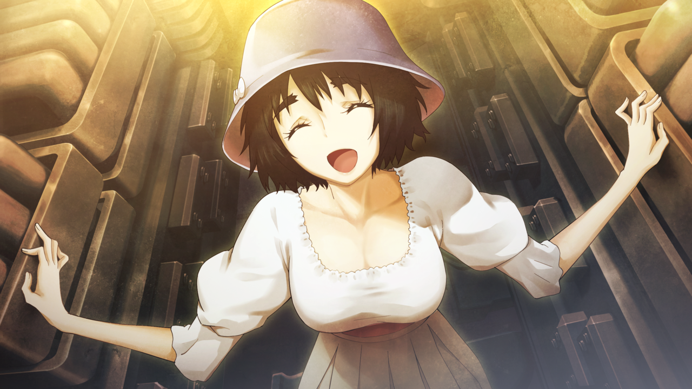

# 无限远点的牵牛星 - 14
> 1.129954  
> [ 2011/07/07 ] 篝一个人先赶到，想阻止时间机器跳跃，因为“神明大人”哄骗她，会用时间机器送她回未来与妈妈重聚，冈伦拦住了她。跳跃前真由理将桶子私藏的硬盘交给冈伦，那正是桶子私藏的红莉栖的遗产，原来并没有被俄罗斯军队破坏，而这应该能帮助『瓦尔基里』在未来成功开发时间机器。冈伦则正式以 LAB 所长的身份，派出 LABMem No.002——椎名真由理去完成「*Operation·Arclight*（织女星）」。时间机器成功完成跳跃，冈伦也安抚住了篝。  

| [←prev](./0165) | [menu](../) | [next→](./0167) |

---

“咕啊！”  
腿部一痛，我受到冲击，滚到了几米外。  
“冈伦？！”  
“冈伦叔叔？！”  
我看向腿部，腿肚子的部分一片鲜红，剧痛随着心跳的节奏一波波传来，站不起来了……我意识到，我被枪击中了。  
“你是……篝……！”  
铃羽的视线前方，站着一个身穿黑色骑手服，头戴黑色全覆式头盔的女人。她的右手举着手枪，左手提着一个疑似炸弹的东西作为威胁。我知道，她是篝，比预想的稍微早了一些出现。万幸的是，穿迷彩服的部队还有『教授』并没有一同到达。稍微算错了时间，看来时限已到了！  
“铃羽，乘上时间机器！现在立即跳跃！”  
“诶！？”  
“抱歉说了无聊的话！为了保护你，桶子什么都能做到！怎么可能‘失败’！”  
“冈伦叔叔……！”  
“所以，时间机器肯定会顺利跳跃的！是吧？！”  
“当然了！”  
事实上，篝以外的部队还有『教授』并没有出现，这说明，桶子和真帆的任务顺利完成，从 STRATFO 手里成功保护了时间机器的秘密了吗？  
“真由理也去！快点！”  
“可、可是，冈伦你怎么办！？”  
真由理惊慌失措地看着我受伤的腿。  
“不用担心我！不到 14 年后，我是绝对不会死的。”  
篝又开枪了，子弹击中的地方离我大约 30 厘米。  
“谁都不准动！不然我就杀了他！  
 不准坐上机器！我要把它交给『教授』！  
 他会教我使用方法，篝要用它回到未来！”  
“……”  
真由理还在犹豫，见此我再次对她们大喊道：  
“别管了！这里我会搞定！快点！铃羽也是！篝就交给我了！”  
“知道了！真由姐！进来！”  
“诶！？啊！？等——！”  
真由理被铃羽塞进时间机器，看不见了。  
“冈伦叔叔！篝就拜托了！”  
“了解！”  
铃羽也随着真由理钻进了时间机器。同时，舱门开始关闭。  
“我都说了不行嘛！给我下来啊！”  
篝冲着时间机器跑过去，语气与其说是威胁，不如说是看到父母跑远的小孩子在撒娇。我强忍直冲大脑的剧痛，勉强站起来，挡在她的面前。  
“不会让你阻止的！”  
“啰嗦，让开！”  
“我拒绝！”  
“让开啊！！”  
“咕啊——！！”  
篝猛踢我受伤的腿，强烈的疼痛让我一阵眩晕，差点倒下。  
“下来！不然我就用这颗炸弹炸了时间机器！”  
篝从我的身边穿过，想要留住时间机器。如果放她靠近，她可能会引爆手上的炸弹，这样结果就会和上次一样！时间跳跃回来做的一切都会化为泡影。  
“住手！”  
我从背后扑上去抱住篝，钳住她的双臂，强忍腿上的疼痛，把她从时间机器旁边扯开。  
“你明不明白！？要是那样做，你心爱的妈妈会死的！！”  
“啊……！可、可是，我……我！”  
“给我老实点！求你了！”  

这时，通过正在关闭的舱门，真由理丢出来一个东西。  
“冈伦！这个给你！”  
“这、这是，红莉栖的！？为什么在这里！？”  
那是一块移动硬盘，原本由真帆保管，后来交给桶子破解的“红莉栖的遗产”。可是，之前明明应该被俄罗斯部队破坏了……  
“不要生爸爸的气，我相信今后的时间机器研究，一定会用到它。”  
原来是这样，谁都不知道，它其实被桶子偷偷藏在时间机器里了……也就是说……  
“那么冈伦，我出发了！”  
我和真由理通过舱门的缝隙彼此对视。是的，这只是，暂时的分别。一定，还会再见的。对吧，真由理？所以，挺起胸膛，为勇敢的 LABMem No.002 送行吧。  
“交给你了，LABMem No.002——椎名真由理！  
 去完成「*Operation·Arclight*（织女星）」吧！  
 把那个没用的我……打醒吧！”  
“嗯，交给我吧！”  
“冈伦！我呢，对冈伦——最喜欢了！”  
“……嗯！”  

笑着目送中，舱门完全关闭了，时间机器慢慢发出低沉的轰鸣。远处，似乎听见直升机螺旋桨的声音。虽然相信桶子他们……可是这么短的时间，我也没有百分之百的把握，他们能破解『Amadues』这么复杂的系统，彻底删除全部的数据。说不定，就在此时此刻，各国的特殊部队还在向这座城市陆续汇集。想到这种场景，心中的焦躁感又升了一级。快点——快点走——我祈祷着，看着被蓝白色的磷光包围着的时间机器。  
“不要走！妈妈！铃羽姐姐！”  
篝近似乞求的哭喊，空洞地回荡着，却无法传达到——时间机器，被耀眼的光芒包围着，从这个时空，完全消失了。  
“成功了……！”  

“啊……啊……”  
篝失声，挣脱了我的手，用枪指着我，用憎恨的眼神死死盯着我。  
“为什么……为什么让妈妈走了？！”  
我直直地注视着她。  
“你的全世界最棒的妈妈，和铃羽一起，  
 去说教那个，让这个世界变得糟糕的笨蛋男人了。  
 为了这个世界，要去做一件非常重要的事情。”  
“骗、骗人……骗人的……妈妈也是，铃羽姐姐也是，把篝丢下了……”  
“没有骗你。我接下来也会拼尽全力，为了让你和真由理在更幸福的地方相遇。所以，停手吧，呐？”  
“这、这种……这种话，我不相信……”  
“不，你的话，肯定会相信的。因为我非常了解……你到底是谁，是多么温柔的人。”  
“啊……？！”  
指向我的枪口，开始微微颤抖。  
“你……知道……我是谁？”  
“知道，因为我是从 48 小时后时间跳跃回来的。”  
“……唔……啊——！！”  
篝抱住头盔弯下身子，看起来非常痛苦。  
“神明大人的……声音……说着‘不要被骗了’……  
 说你是谎话连篇的敌人，只要杀了你，我就能回到妈妈的身边……  
 说你是想要破坏世界的坏家伙，要杀掉……  
 这样我就能，回到原来的世界……”  
篝的话语，变得支离破碎——这就是“洗脑”吗？这种不人道的行为，就是『教授』干的吗？  
“搞不懂搞不懂搞不懂！我搞不懂啊！！”  
我握住篝拿着枪乱晃的手，认真地看着头盔下的眼睛。那双眼睛充满不安与恐惧，流着泪水。  
“听好了，妈妈肯定不会回来了。  
 但是，只要我们接下来一起努力，  
 就有可能迎来，妈妈和你一起幸福生活的世界。  
 你的妈妈，就是为此选择了时间跳跃。  
 不要让妈妈的心意，白费了。  
 你，现在还可以重新来过。”  
“呜呜……呜呜……反抗神明大人的声音……也可以吗？”  
“嗯。”  
篝听到的神明大人的声音，就是『教授』施行的洗脑吧。我不知道这对篝的精神侵蚀得有多深，但是，我们有真帆这位专家。只要耐心治疗，一定没问题。  
“……呐，冈部先生……”  
篝对我的称呼，变回了平时那样。  
“我好想……见妈妈啊……还能见到吗……？”  
“能见到的，总有一天。”  
“……太好了。”  

“啪——”  
突然，一声枪响再一次从背后传来。  

 

> (to be continued)

---

| [←prev](./0165) | [menu](../) | [next→](./0167) |
