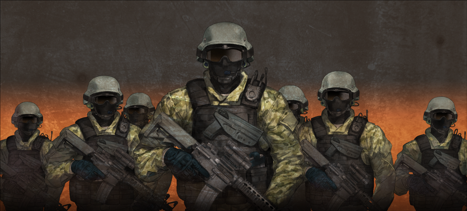

# 无限远点的牵牛星 - 15
> 1.129954  
> [ 2011/07/07 ] 篝被桐生萌郁射杀，『教授』带着 STRATFO 的武装部队赶到现场，武装直升机在空中盘旋，游击队攻击警报也响起，战争依然无法避免。但是，时间机器已经成功跳跃回过去，凤凰院凶真狂笑着对着所有敌人发出胜利宣言！与动画不同，这里是时间机器已经完成跳跃之后武装直升机才赶到现场。个人更喜欢动画的版本，冈伦在最后的紧急关头亲眼“观测”了导弹与时间机器擦身而过，更能呼应前文没看到尸体的伏笔，以及“观测”的意义。   

| [←prev](./0166) | [menu](../) | [next→](./0168) |

---

“嘎哈……”  
篝发出一声痛呼，在我的眼前倒下了。  
看向枪响的方向，是一个和篝一样穿着黑色骑手服的女人——因为没有戴头盔，可以肯定就是桐生萌郁——她举着枪，脸色病态而苍白，流着眼泪。  
“为、为什么……为什么，你要这么做……？为什么啊！桐生萌郁！！”  
“FB……呐，FB……？我，没有被这种女人骗到……  
 我知道的，这是假的手机……  
 所以，求求你，不要抛弃我，FB……FB……”  
手机从桐生萌郁手中滑落。她再次开枪，将那部手机打得粉碎。  

我蹲下抱起篝，眼看着她的胸前，一点点被血浸透。  
“咳……”  
“喂，振作点！”  
“啊……太好了……原来神明大人的话……也会有错的时候……  
 这是我……自作……自受……因为践踏了她的心灵……想要利用她……  
 对不起……我本来不想……变成这样的……坏孩子的。  
 呐，妈妈……你在哪？你在哪里啊……？”  
篝的声音，逐渐变得微弱。桐生萌郁拿着枪，瘫坐在在不远处。双眼失去了焦点，只是不停喃喃自语着，完全不能正常思考。两个人的状态都很危险，得立刻送她们去医院。但是——  

数十个穿着迷彩服的男人越过了楼顶的栏杆。  
“啊！？”  
果然，即使是桶子和真帆，这么短的时间也是没办法吗……？还是说，最终，这条世界线会从这里开始爆发战争——这样的收束是无法避免的吗？不，但是……  
“呵……并不是没用的……”  
至少，他们俩为我争取到了时间。拜此所赐，袭击的时刻延后了——铃羽和真由理已经顺利启程了。没错——现在，这个瞬间，我们的“目标”毫无疑问地达成了。虽然还不确定，但是通往命运石之门的道路，毫无疑问就在我们前方。  
“目标 1，丢失……目标 2，目标 3 也丢失了！怎么回事？”  
迷彩服队长通过无线电向谁报告着目前的状况。  

武装直升机在空中盘旋，听过一次的警报广播也不断重复着：  
“游击队攻击警报！游击队攻击警报！
 本地区可能遭遇游击队攻击！  
 请立即进入室内避难，并打开电视或收音机。”  
战争，即将开始了。果然，就算时间跳跃，这个也无法改变。  

“这不是 *Rintaro* 嘛——”  
雷斯吉宁从迷彩服队员们的身后走了出来，是啊……这家伙，和穿迷彩服的男人们，都是 STRATFO 的成员。  
“你为什么在这里……？*Kagari* 死了吗？”  
“……”  
“告诉我，*Rintaro*，时间机器在哪里？”  
我让篝躺在地上，慢慢站起身来。血止不住地从腿上的伤口流出来，疼痛也加剧了。即便如此，我也稳稳地双脚踩在地面上，面对用枪指着我的穿迷彩服的男人们，面对挂载着导弹的武装直升机，面对『教授』，面对即将开始的战争面前——我用那个声音，放肆地大笑。  

“哼……哼哼……哼哼哼哼……呼——哈哈哈哈哈哈！！  
 给我听好了，你们这些蠢货！  
 你们想要得到的时间机器，已经不在这里了！  
 已经不存在于这个时代了！  
 真可惜呐！懊悔吧！然后恐惧吧！  
 我凤凰院凶真，对你们这些家伙也好，对命运也好，绝对不会输！  
 我，一定会，找到命运石之门！”  
没错，前面等待我的，是为了到达命运石之门，将要刻下的漫长的碑文。所谓疯狂，即无数次重复同样的事情，却期待着不同结果——曾经，爱因斯坦曾如此叹息人类的愚蠢。然而，现在的我，很乐意放任自己，投身到这种疯狂和愚蠢之中。带着所有的执念，不需要“神的至理”，只是追求着一个不同的结果。  
“这就是！本大爷的！选择！！”  

 

> (to be continued)

---

| [←prev](./0164) | [menu](../) | [next→](./0166) |
