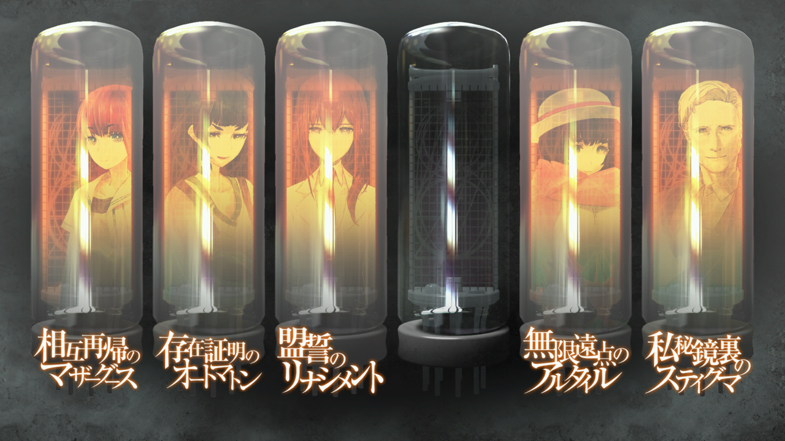

# 瓦尔基里报告 - 真由理结局
> 1.129954  
> [ 2036/08/13 ]  

## 情报整理 | 各方势力
### LAB
- 冈部伦太郎
  - 已觉醒——世界修正拳（被动）+ 真由理的真心
  - 2025 年去世，为了保护真由理
  - 意识到身边有 LABMem 的大家在支持着他，没必要把所有事都扛在自己肩上
  - 正式派出 LABMem No.002——椎名真由理去完成「*Operation·Arclight*（织女星）」
  - 以凤凰院凶真的身份正式对『教授』等敌对势力发出胜利宣言
  - 未来将成立并带领『瓦尔基里』，完成时间机器的开发
- 比屋定真帆
  - 保管红莉栖的笔记本电脑和硬盘，请桶子破解密码
  - 与众人分析得出，真正的战争起因是《中钵论文》背后的红莉栖原版论文
  - 从冈伦处得知时间机器情报
  - 喜欢冈伦
  - 与桶子偷偷开发『时间跳跃机』，被发现后与冈伦大吵一架，唤醒他心底的不甘
  - 在凶真的指导下，与桶子合力开发出了『时间跳跃机』
  - 未来将加入『瓦尔基里』
- 椎名真由理
  - 七夕当天，意外得知了 α 世界线与红莉栖的真相
  - 想要找回自己的“牵牛星”，即使明知自己不会是他的“织女星”
  - 改变前的时间线：
    - 主动找到铃羽，想要回到自己包庇冈伦，把牵牛星藏到乌云后面的那一天
    - 二人的决定促成了「*Operation·Arclight*（织女星）」
    - 邮件告白，推动了凤凰院凶真的觉醒
  - 改变后的时间线：
    - 说服冈伦，以 LABMem No.002 的身份去执行「*Operation·Arclight*（织女星）」
    - 当面告白

### 敌对
- 穿黑色骑手服的女人
  - 真实身份为篝，幼时被『教授』洗脑，主动找到过去的雷斯吉宁
  - 整形扮演由季，潜伏在众人身边
    - 真正的由季 2008 年去了欧洲留学，原本应该在 2012 年与桶子相遇
  - 七夕当天带领 STRATFO 武装部队抢夺时间机器
    - 改变前的时间线：
      - 因为真由理受伤而觉醒摆脱控制，杀掉了大部分 STRATFO 队员后重伤身亡
      - 向冈伦坦白了身份
      - 喜欢上了桶子
    - 改变后的时间线：
      - 一个人提前赶到广播会馆，想要阻止时间机器跳跃，被冈伦拦住
      - 被随后赶到的桐生萌郁射杀
- 阿莱克西斯·雷斯吉宁 *Alexis·Leskinen*
  - 【美】STRATFO，代号『教授』
  - 擅长洗脑技术，控制了篝
  - 2036 年的自己通过篝和过去的自己达成了合作
  - 被冈伦评价为真正的疯狂科学家
- 桐生萌郁
  - SERN - Rounder
  - 带领武装部队袭击桶子的秘密基地，想要抢夺红莉栖的笔记本电脑和硬盘
    - 紧要关头被俄罗斯武装部队阻止
  - 任务失败后重伤，被放弃，被篝以 FB 的名义收服
  - 七夕当天射杀了篝，处于精神崩溃的状态
- 俄罗斯武装部队
  - 阻止了桐生萌郁的行动，破坏了红莉栖的笔记本电脑和硬盘（共识）
  - 七夕当天，改变前的时间线，排除武装直升机发射导弹，疑似摧毁了时间机器

## 情报整理 | 重要物品
- 『Amadeus』
  - 系统最终被『教授』攻破，“红莉栖”和“真帆”泄露了时间机器相关情报
  - “红莉栖”私下通过 @ch 上与冈伦取得联络，及时向冈伦预警
    - 坦诚自己的想法，对她来说，真帆才是名副其实的 Amadeus
  - 连同全部记忆数据，最终被桶子和真帆抢先一步删除
- 《中钵论文》
  - 大战导火索，但本身质量很差
  - 实际存在红莉栖所著原本
- 红莉栖笔记本电脑和硬盘
  - 本来由真帆保管，交由桶子破解密码
  - 桶子的秘密基地被袭击时，被俄罗斯武装部队破坏（共识）
  - 真帆保留了笔记本电脑的残片作为纪念
  - 实际上，硬盘被桶子藏在时间机器，并在七夕的时间跳跃前交给凶真（骗过世界）
- 『FG-C204 2nd EDITION ver2.31』
  - 改变时间线前：疑似被导弹炸毁
  - 改变时间线后：凶真亲眼“观测”其成功跳跃回过去

## 情报整理 | 重要事件
- 未知原因跳跃世界线——苏联线
  - 发生时机：圣诞节听到八音盒中《星之奏》后
  - 新世界线中，苏联疑似未解体，世界处于战争中
  - 冈伦最终被交给美军基地
  - 结束时机：见到美军手中的『Amadeus』的“红莉栖”
- 新型脑炎
  - 实际就是不同程度的 *Reading·Steiner*
  - 吹雪记得在其他世界线的经历
  - 『教授』在收集新型脑炎患者
    - 医治（研究）吹雪的过程中意外得知了冈伦说的 *Reading·Steiner*
    - 想要研究出背后的机理，配合时间机器打包出售
- 桶子秘密基地遭遇袭击
  - 桐生萌郁带领武装部队，想要抢夺红莉栖的笔记本电脑和硬盘
  - 紧要关头俄罗斯武装部队出现，破坏了红莉栖的笔记本电脑和硬盘（共识）
- 「*Operation·Arclight*（织女星）」
  - 铃羽理解了冈伦为何不愿配合，决定自己跳回 2010 年 8 月 21 日，和他好好谈谈
  - 真由理希望牵牛星的复活，想要再次见到凤凰院凶真，决定和铃羽一起回到那一天
  - 因为二人的选择，世界线成功变动了一点
  - 新世界线的未来的桶子制定出「*Operation·Arclight*（织女星）」
  - 成功将视频邮件发送给铃羽和桶子

## Steins;Gate 达成条件
- 删除红莉栖的时间机器相关论文
  - ■■《中钵论文》的红莉栖原本
  - 破坏红莉栖的笔记本电脑和硬盘
    - 成功欺骗所有人，认为红莉栖的硬盘被破坏
- 删除红莉栖的记忆备份
  - 删除『Amadeus』和记忆备份
  - 『教授』未制作其他记忆备份
- 凤凰院凶真觉醒
  - 世界修正拳（被动）+ 真由理的真心
  - ■■■■■■■■■■
  - 「*Operation·Arclight*（织女星）」
- 『FG-C204 2nd EDITION ver2.31』未被破坏

---

“那一天，如果我的牵牛星复活的话，一切是不是都会改变呢？”  

LABMem No.002『与星辰握手』
  

 

> Hope is always there in the “future”.
---

| [←prev](./0167) | [menu](../) | [next→](./0169) |
