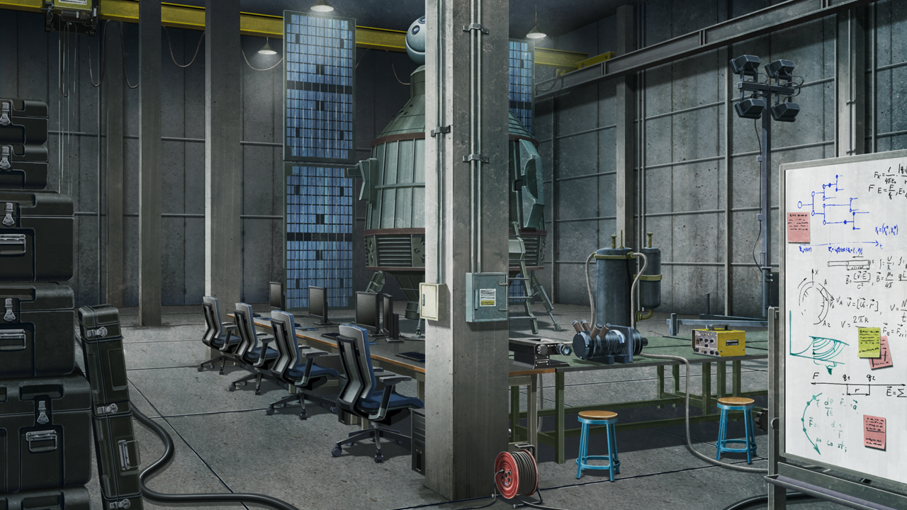
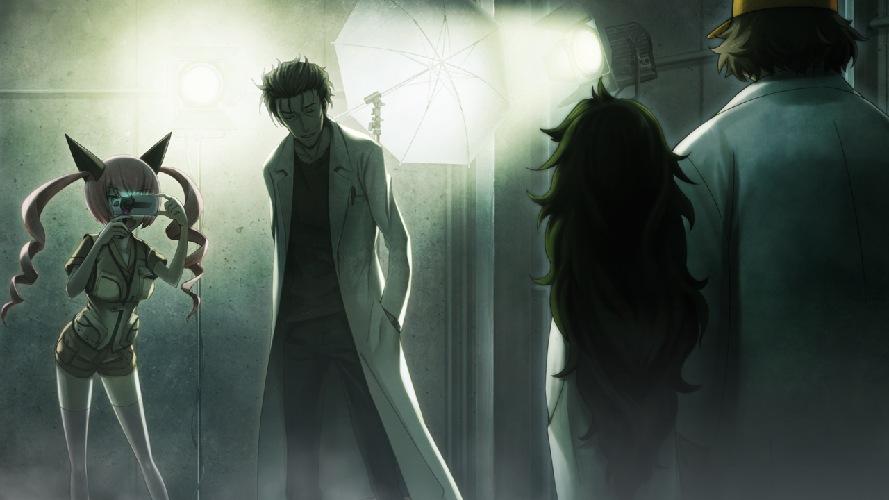
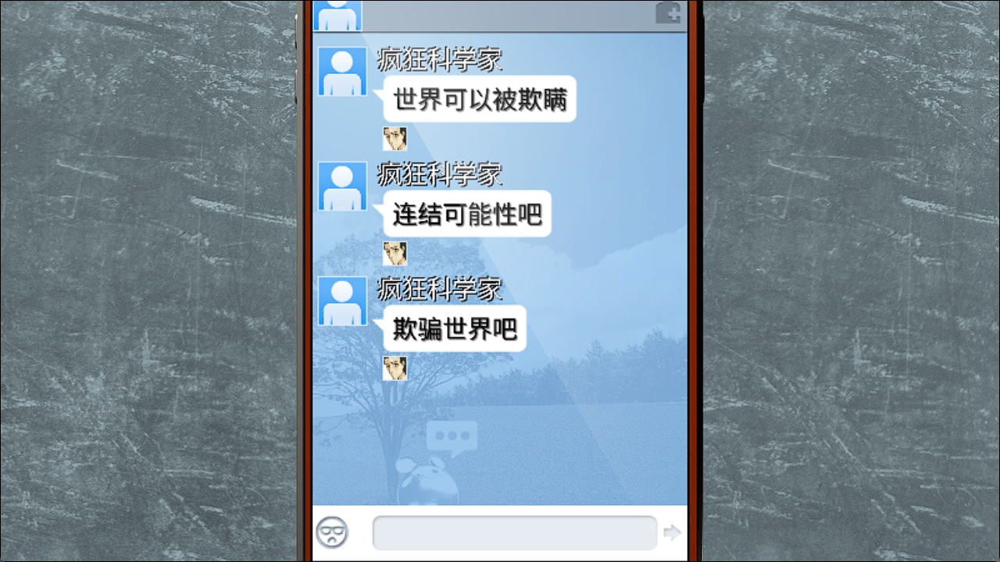
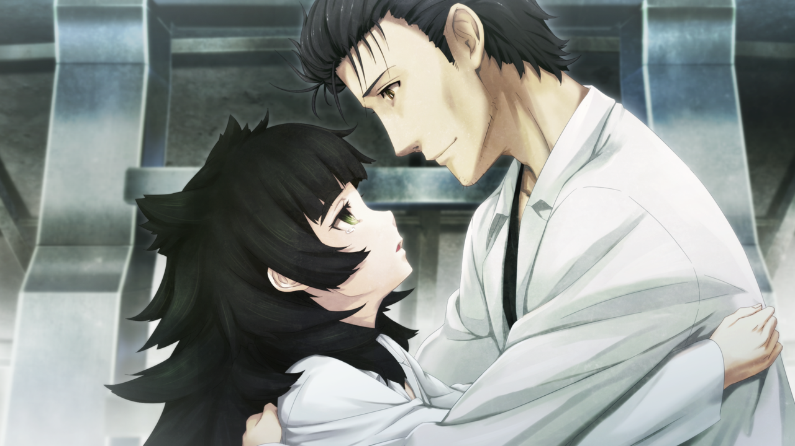
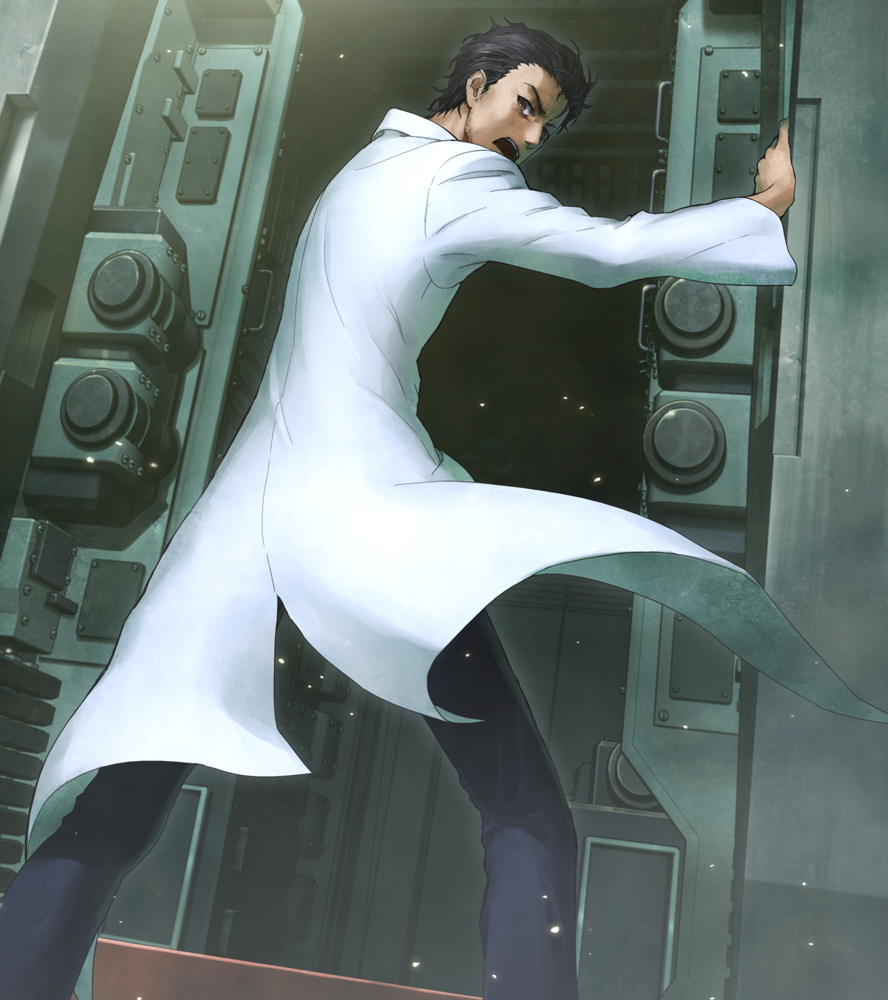

# 交叉坐标的星尘
> 1.xxxxxx  
> [ 2025/07/28 ] 动画收到的视频邮件的幕后视角。给 2010 年的冈伦发送了「*Operation·Skuld*（掌管未来的女神）」，给 2011 年的铃羽发送了「*Operation·Arclight*（织女星）」，然后凶真决定欺骗世界，以“乘坐时间机器离开这条世界线”代替“去世”，执行「*Operation·Altair*（牵牛星）」，乘坐 FG-C193，利用『克尔黑洞追踪仪』追踪 C204 寻找失踪的真由理和铃羽，顺便验证欺骗世界的可行性。篝送上了绿色乌帕钥匙圈作为护身符，真帆送上了拥抱，凶真在众人的依依不舍中出发了。  

| [←prev](./0168) | [menu](../) | [next→](./0170) |

---

“因果已经成立。接下来就谈一谈计划的最终阶段吧。  
 改变世界线变动率，到达未知的世界线——命运石之门。  
 顺便一提，‘命运石之门’的命名者是我。  
 为什么叫‘命运石之门’，如果是你的话应该知道的——  
 ‘**并没有什么意义。**’对吧？”  

公元 2025 年，未来道具研究所，通称『LAB』。同时，也是抵抗组织『瓦尔基里』的总部。LAB 曾经位于秋叶原杂居建筑的一个房间，由于第三次世界大战的影响，已经转移到了新据点。说是 LAB，其实是个很寒酸的地方。但是，这里却聚集了世界最强的头脑，进行时间机器的研究，验证命运石之门的到达方法。在楼层的中央，『凤凰院凶真』——冈部伦太郎任凭白大褂随风飘扬，摆出一个舞台剧演员一样的姿势，正在说着什么。  
“你现在正身处于，因为我们共同怀抱‘想要拯救红莉栖’的信念，才能到达的瞬间。  
 我的计划的前期准备已经完成，接下来就是你的任务了。  
 ……接下来，对最终任务——「*Operation·Skuld*（掌管未来的女神）」的概要进行说明。  
 ‘**不要改变既定的过去，去改变结果。**’”  
稍远的地方，『KURISU』——比屋定真帆在『瓦尔基里』的代号——看着凶真的样子，有点受不了地叹了口气，对身旁的桥田至问道：  
“唉……呐，那种东西真的没问题吗？”  
“嗯，大概吧。”  
桶子虽然这么说，脸上却微微浮现着开心的笑容。这个被称为史上最强超级黑客的男人，无法抑制对凤凰院凶真的喜欢。  
“2010 年的伦太郎，和大家一起看到那种东西，真的不会害羞吗？”  
“没事的，他那时候比这还要更过分呢。”  
“啊……这样啊……”  
真帆貌似更加不耐烦地摇了摇头。虽然摆出这种表情，其实内心正在拼命战斗着，和一种心脏被拧紧一般的寂寞心情。恐怕，怀有这种心情的人不只有真帆。桶子、漆原琉华、还有负责摄影的秋叶留未穗，一想到接下来的安排，就有一种不舍的气氛弥漫开来。  
“**欺骗‘最初的你’**。  
 **欺骗世界**。  
 这就是为了到达‘命运石之门’必须做出的选择。”  
接着，凶真转身朝菲莉丝端着的摄影机走去。明明是他自己要求的，为了酝酿出那种气氛，强行采用远景，还要用背对镜头的姿态进行拍摄，为什么又要自己凑上去？真帆内心无语。凶真很自然地从菲莉丝手里接过摄影机，把脸凑近镜头，然后说出了最后的经典台词。  
“希望你的计划顺利，狂气的疯狂科学家哟——El Psy Congroo。”  
讲完后，凶真停止了录像。就这样，用来发送到过去的视频录制结束了。那一天到现在已经过了 15 年，太漫长，同时也感觉很短的 15 年。  
“好，这样就完美了喵。”  
“很好，接下来就是和 D-mail 一起发送到过去。琉华子，收件人和时间不要搞错了哦？”  
“是！现在的这个，发到 2010 年的凶真先生的手机上。  
 刚刚拍摄的至先生的视频邮件，是发给 2011 年的铃羽小姐，没错吧。”  
“啊，拜托你了。”  

凶真摄影结束，扬着飘动的白大褂，朝真帆这里走来。  
“辛苦了。”  
“这样就抵达了通往命运石之门的道路了。  
 现在的我能做的就是这些了，剩下的就交给 2010 年的我去做了。”  
“哦！”  
“嗯……”
“怎么了？都这么不开心的样子。”  
“因为……果然大家还是很担心，突然要用时间机器的试验机进行载人试验……”  
真帆抬头看着屹立在购房的巨大时间机器——型号为 FG-C193。外形和 2010 年出现在秋叶原的 C204 型几乎一样，但是性能上还有很多令人不放心的部分，还未走出试验机的范围。  
“没事的，我相信我的左右手的能力，一定会成功的。”  
“你在 2025 年去世，在这条世界线是确定的。就算这样，我也无法赞同你这种送死的行动。”  
这个争议，已经在真帆他们之间重复了几百次。在迎来这天之前，真帆为了说服凶真，总是重复着这些话。  
“的确，铃羽曾经告诉我，我是在 2025 年去世的。  
 因为她的话，我才能拼着被暴徒刺伤也要保护真由理。  
 虽然现在真由理不在了，但是世界线仍会收束。  
 所以我一直在思考，我会在今年去世这件事。不过——”  
凶真夸张地甩开白大褂，双手横挡于胸前。  
“不过，这也不一定就代表我‘注定死亡’对吧？  
 如果我选择在 2025 年，从这条世界线消失——这同样可以解释成‘去世’。”  
“……什么意思？”  
这个假说，真帆是头一回听到。  
“也就是说，我在 2025 年‘离开了这个世界’，并不是指我死亡了……  
 而是意味着，我乘坐值得纪念的时间机器初号机，安然无恙地前往其他时空旅行了。”  
“相当乐观呢……”  
“但是，作为假说的话也成立吧？  
 ‘世界可以被欺骗。’——从其他世界线发来的这些信息，给了我勇气。  
 接下来我要做的，也相当于对「*Operation·Skuld*（掌管未来的女神）」的验证实验。”  
“……是……的确如此呢。”  

但是……以结果而言，对于真帆他们来说没有不同。2025 年以后，冈部伦太郎就不会存在于此，冈部伦太郎无法再次回到这里。这种事情，虽然凶真嘴上不说，但是他也明白吧。他好像要把同伴的脸铭刻入记忆中一样，一个一个地仔细看过去。在这里为凶真送行的，是『瓦尔基里』的创建者，前身为未来道具研究所的 LABMem 们。桥田至、秋叶留未穗——又名菲莉丝·喵喵、漆原琉华、比屋定真帆，还有在后方静静伫立的桥田由季，以及此时才 7 岁，躲在由季背后的桥田铃羽。  
“诸位，感谢你们跟着我这种人走到了今天。  
 但是，以‘神的至理’为对手的战斗还在继续。  
 下一个节点就是 2036 年了。在那之前，就拜托你们了。  
 祝『瓦尔基里』好运！”  
听着凶真告别的话语，真帆拼命忍住行将落下的泪水。不能在这里哭，很久以前就决定了，要充满希望地给冈部伦太郎送行。  
“好了，差不多该去抓捕逃走的人质了。”  
“铃羽也拜托你了。”  
“交给我吧！只要有它搭载的『克尔黑洞追踪仪』，一定会顺利的。”  
那是只有这台 C193 搭载的特殊装置，能够追踪在某个特定坐标处，克尔黑洞产生的时空扭曲的“连续”，最多能够追踪到前后七千万年，也就是“能追踪时间机器轨迹的雷达”。这个能够追踪其他时间机器的设备，是为了这次的作战特别设计的，其目的只有一个——找到 2011 年七夕那天，进行了时空旅行的椎名真由理和阿万音铃羽。根据推测，真由理和铃羽乘坐的 C204 型，由于电量耗尽，已经不能进行正常的时空转移了。接下来用 C193 型找到她们，替换上准备好的备用电池，然后回到这个时代……可以的话，凶真也会一起回来。如果能够做到这一点，这个作战就算 100% 完成了。但是，这台试验机级别的机器，恐怕很难完美完成任务。凶真应该也明白，也许他正考虑着这样的选项——牺牲自己，让真由理和铃羽回到这个时代。  

“那么，我出发了。”  
“嗯。”  
“等、等一下！请等一下！”  
最后一位加入的 LABMem——椎名篝，赶到了这现场。  
“篝，我还在想怎么没看见你，你去哪里了？”  
“哈啊哈啊哈啊……抱歉，我去拿这个了。  
 冈伦先生，请带上这个，作为护身符。”  
篝这么说着——把一个很古老的绿色乌帕钥匙圈交给了凶真。  
“可以吗？这是你重要的宝物吧？”  
“是的，所以请你一定要回来……和妈妈一起。”  
“……我知道了，一定会回来的——一定。”  

凶真和在场的全员握手道别，最后，来到了真帆的面前。  
“……保重。”  
“你也是，『KURISU』……不，真帆。”  
“……呐——”  
“嗯？”  
“你觉得，命运石之门，真的存在吗？  
 真由理小姐没有死去……并且，红莉栖也没有牺牲，  
 这种夹缝中的世界线，真的存在吗？”  
自那年七夕，战争爆发以来，时隔 14 年，真帆再次问起这个问题。
“存在，绝对存在。”  
冈部伦太郎——凤凰院凶真，微笑地给出了回答。那个笑容看起来是那么寂寞，看到那副表情，真帆再也忍不住泪水。  
“呜……”  
“别哭啦。”  
“才、才没哭啦……”  
真帆轻轻地抱了一下凶真，心里发誓，绝对不会忘记他的温度，这个活在执念中的人。  
“一路顺风……”  
冈部轻轻点点头。  

“好！全员退后！现在开始执行作战，作战名为——「*Operation·Altair*（牵牛星）」！”  
凶真高声宣言，既是鼓舞大家也是鼓舞自己，然后进入了 FG-C193 型时间机器的驾驶舱。真帆她们紧张地开始了时间机器的启动流程。作为验证实验，有必要详细记录时间机器的各项数据。时间机器全身发出了巨大的轰鸣和振动，好像连建筑物都在微微摇晃。不过，真帆观察的测量数据并无异常。厚重的舱门，慢慢地、慢慢地关闭了。很快响起了尖锐的密封声，代表从此刻起，凶真与真帆他们完全隔离开来。  
真帆：“……一定要……顺利进行啊……”  
菲莉丝：“没事的……凶真一定会完成使命的喵！”  
琉华子：“就是这样，因为他是化不可能为可能的人。”  
桶子：“啊，这才是我们的冈伦呢。”  
篝：“冈伦先生……”  
时间机器周围缠绕着彩虹一样的光雾。同时，引擎的声音大到震耳欲聋。  
“冈伦！管他什么‘你的死是确定的’！你一定要给我回来！！”  
桶子忍不住大喊出来，真帆也仿佛要喊破喉咙。  
“大家都会等你！我，也会等你！所以一定要回来！！”  
时间机器渐渐地失去了形态——然后，为了实现那遥远的约定，追逐着那两位“织女星”，发出耀眼闪光的一瞬间，从 2025 年向着时间彼端跳跃——消失了。  

 

> (true end)

---

| [←prev](./0168) | [menu](../) | [next→](./0170) |
