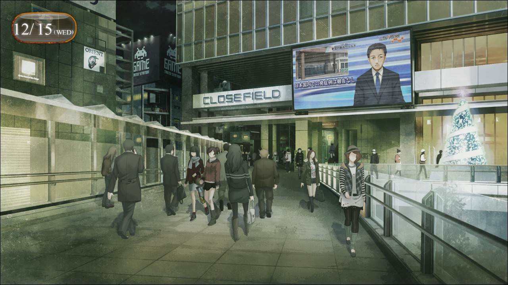
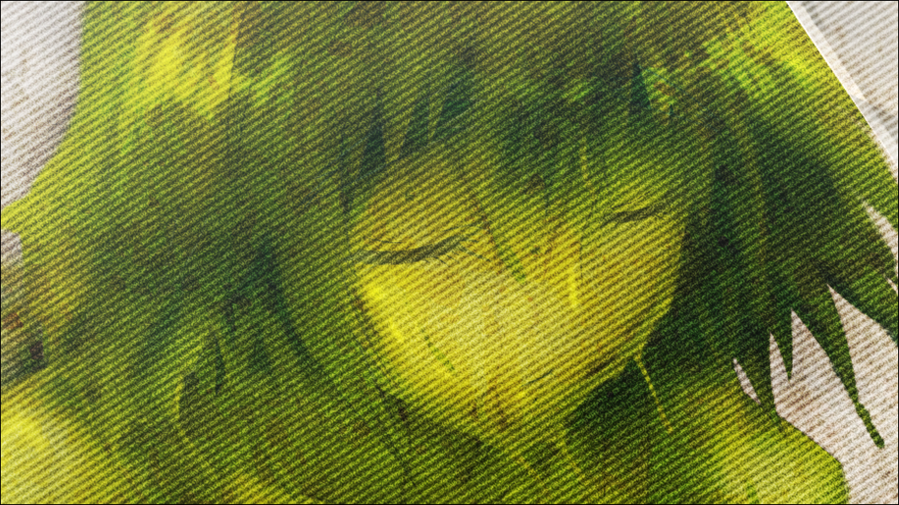
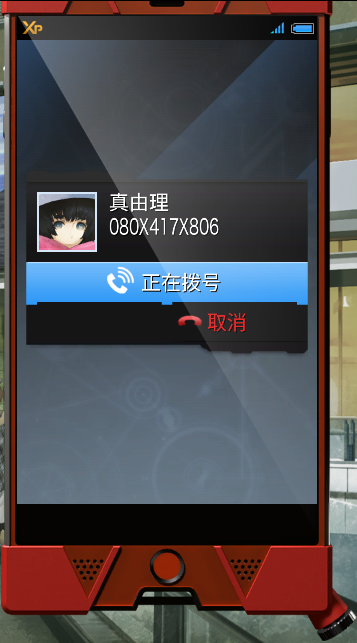
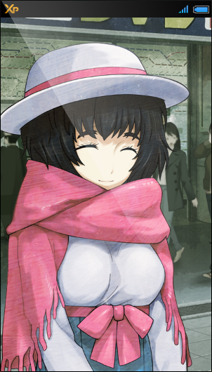
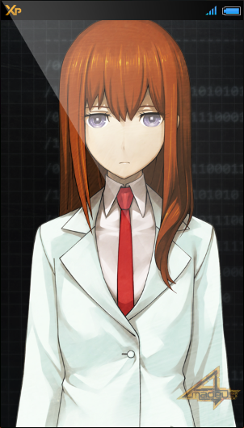

> <big> **亡失流转的寂寥 - 01** </big>  
> 1.064750  
> [ 2010/12/15 ] 疑似世界线变动。与“红莉栖”打电话确认却被告知之前回了电话道歉，其他方面与记忆基本一致。强行说服自己只是错觉。  

升腾的黑烟弥漫，将天空染得暗红。  
瓦砾四散零落，叫人无处踏足。  
悲鸣，枪声。  
还有异臭。只要是一息尚存的人都能明白那气味从何而来。  
那是烧焦的气味。是家园、大厦、汽车、单车、树木、草地，  
还有人，  
被焚烧、熏烤、焦灼的气味。  
瓦砾之间立着什么又黑又细的东西。  
是人类的手。  
就像要抓住天空一样，僵直地伸着却一动不动的手。  
并不仅仅是这里，所到之处遍地都是破碎的残肢、破手、断颅。  
人类的残骸随处可见。  
枪声撕裂了远方的天空，一声悲鸣，然后归于静寂。  
景象与之前别无二致，只是徒增了一滩尸块而已。  
世界的确在向着毁灭前行，人们终于明白了这一点。  
这并不是死后世界的光景，而正是现世的惨状。  
地狱。  
是的，除了地狱之外无法形容。  

“唔……呼哈……哈……”  
终于，眼前的世界重新染上了颜色。来来往往的行人的声音和汽车的噪音，以奔流之势一齐涌入耳中。  
“那个，冈伦……没事吧？你出了好多汗啊……  
&emsp;&emsp; 是不是身体不舒服？”  
“啊……不是……”  
吹雪和枫……眼前依旧是这两人，她们正担心地看着我。也就是说，刚刚只是眼花而已吗？  
“真的没事，谢谢你们的关心。”  
“那我们就先走一步了。”  
“我很期待这次的聚会……”  
留下道别的话语，两人向着车站的方向离去。  
我呆呆地望着她们的背影。  
刚刚的……是怎么回事？  
行色匆匆的路人们没有一个会关心一直傻站着着的我。大家都活在一个连续的时间中。  
但那果然还是……  
是的，我知道——只有我知道。
刚才的感觉——是 *Reading·Steiner*……  
也就是说，世界线——变动了？  
“……！”  
我摇摇头，打消了刚刚浮现的猜想。  
不可能会有这种荒唐事。世界线仅仅会在什么人改变了过去的时候变动。迄今为止，我只有在用电话微波炉（暂定）发D-mail的时候经历过。但是为了防止那样的事情再度发生，我应该已经把电话微波炉（暂定）废弃了才对。为此，我甚至不惜牺牲了红莉栖。  
那么，这次到底是谁，到底是怎么做到的？如果是某个人开发了和电话微波炉（暂定）相同的装置呢？  

“——唔！”  
真由理……得快点确认真由理的平安！如果因为世界线的变动，真由理又遭遇了什么不测的话……只是想象就让我毛骨悚然。  
那种事绝对不能发生！  
绝对不会发生！  
虽然我想这样坚信，但是浮现在眼前的是，无论如何都会在α世界线里一次又一次经历死亡的真由理。  
总之想要尽快和她取得联系，想要听到真由理的声音。  
怎么办才好……  
我意识到自己陷入了恐慌。沉住气，冷静下来……  
我用手机调出真由理的名字，拨打了她的号码。  

回铃音一遍又一遍地在耳畔作响，但是一直都没有人接。   
7秒，8秒，9秒……  
时间过得越长，心中的焦躁和不安就会越发急剧，令人不适的冷汗沿着背脊一路滑下。  
12秒，13秒，14秒……  
即便如此我还是以祈祷的心情执拗地等待。  
大约在即将超过一分钟的时候，回铃音冷不防地在耳边中断。  

“啊——！”  
“嘟嘟噜——这里是真由喜~”  
“真由理！是真由理吗！？真的是真由理吧！？”  
“冈、冈伦？怎么了，这么慌张？”  
电话那头传来的悠然自在的声音，毫无疑问来自真由理。  
“我很担心啊，一直都不接电话……”  
“啊，对不起。电话被我放在包里了。”  
什么都没发生。没有立即接听的理由非常简单。  
“难道有什么急事吗？”  
“不，别在意。只是……有点不安而已。”  
“不安？”  
“……你现在在哪里？有和谁在一起吗？”  
“现在要去打工哦~”  
“到几点？”  
“八点之后吧。”  
“是吗，我知道了。”  
“冈伦，你要过来玩吗？”  
“不，今天还有事，去不了啊。”  
“我打完工还打算去LAB一趟哟~”
“我知道了……如果我有时间，怎么呢就在那汇合，一起回去吧。”  
“真的~~？今天很稀奇呢！欸嘿嘿~”  
“那，打工加油啊。”  
语毕，我挂断了电话。  
真由理平安无事。也就是说，刚刚的世界线变动与真由理无关吗？虽说不能疏忽大意……或者刚刚的只是单纯的眼花啊白日梦之类的，根本就不是什么世界线变动？如果真是这样，我反倒觉得现实过头了。  

以防万一，我又拿起了手机。最近几天经常点的位置，果然那个图标还静静地待在那里。  
“……”  
我稍微有些犹豫，毕竟那时候做了那种行为，现在又要唐突地打过去……
但转念一想，还是先确认一下现在的状况更重要，于是我点击了那个图标。  

“怎么？有什么事忘说了的？”  
“红莉栖”的语气极其普通。  
“……你不生气吗？”  
“生气？为什么？”  
“因为……刚刚说到一半我就关机了吧？所以……”  
“关于这个，你刚刚已经道过歉了。我又不是那种会对已经原谅的事耿耿于怀的人。”  
“我刚刚……道过歉了？”  
“是啊，你不是又打过来了吗？”  
“又打过去了？我吗？”  
“就在短短的7分43秒前，你忘了吗？”  
“我……已经向你……道歉了？”  
“……你没事吧？”  
“红莉栖”一本正经地说着，看起来并不像乱讲的。  
“发生了什么？感觉跟刚刚不是同一个人。”  
“……不，没事。”  
没有印象。我虽然还记得关机的事，但对于那之后又与她——『Amadeus』的“红莉栖”对话的事，却是毫无印象。如果是以前的话，我只会坚持觉得自己是对的，而她搞错了吧。但是现在的我——毫无自信可言。经历了数不清的过去，体会了数不清的艰苦和悲痛的这颗脑袋，即便现在过去了半年也还是非常疲乏。到底哪些是实际发生了的，哪些是没有的；又有哪些是对的，哪些是错的，我对这些都没有自信了。也可以说是已经再也不想多加思考了。未来什么的，过去什么的，世界什么的，我已经再也不想和这些东西扯上关系了。  
“你看起来状态很差呢。跟哪位熟人联系一下，或者找个地方休息一下比较好吧？”  
“……”  
“……冈部？”  
“呐，‘红莉栖’……我可以…问你一件事吗？你知道刚才打完电话后，我准备去做什么吗？”  
“嗯……之后你是要与雷斯吉宁教授和真帆前辈见面的吧？不是预定要报告一些关于我的事嘛？”  
看来与我的记忆没有什么分歧。  
“……这样啊。”  
“要不要事先向真帆前辈说一下你的情况？”  
“真的没事。很抱歉让你担心了。”  
“别太逞强哦。我可不想变成你最后一个说过话的人。”
“啊哈……”  
我苦笑着结束了与“红莉栖”的对话。  
以防万一，我又向桶子打电话确认了一遍，了解到自己的确是在前往教授和比屋定小姐那里报告的途中。顺便一提，这几天的事基本也都与我的记忆吻合。也就是说，即使世界线变动了，在我能确认的范围内也没有发生什么变化。应该没什么大问题。说起来，刚才那一瞬的眩晕也有可能是因为什么精神性的疾病引起的。有可能只是由于感觉相同，激起了过去的心理创伤，害得记忆混乱了。电话微波炉（暂定）一开始就不存在。那么改变过去什么的，根本就不可能。  
是的，就是这样。  
我好几次这样说服自己，向着与教授他们等候的地方继续前进。  

 

> (to be continued)
---

| [←prev](./0050) | [home](../../) | [next→](./0052) |
