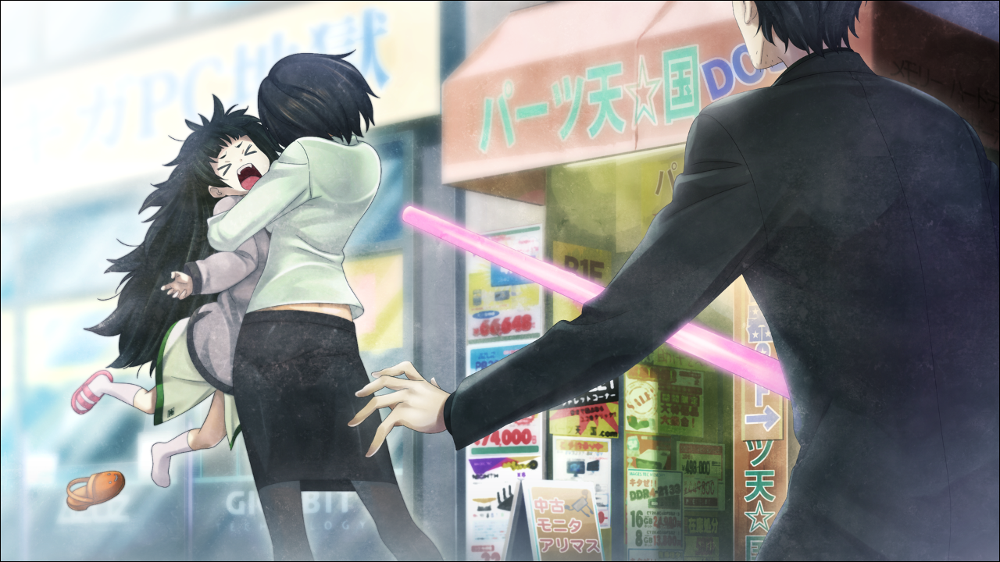
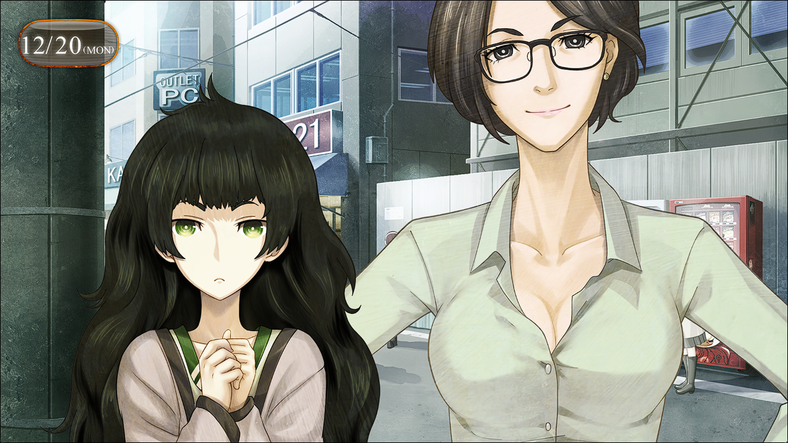

> <big> **亡失流转的寂寥 - 10** </big>  
> 1.064750  
> [ 2010/12/20 ] 初见雷耶丝，跟踪者并不是她。真帆到LAB参观，冈伦继续拜托萌郁找人。冈伦厌恶自己对“红莉栖”的依存，依旧保持断联。  

“……”  
“冈伦，发生了什么事？”  
那个声音——很明显发生了什么糟糕的事。  
“有个熟人被人袭击了！”  
“等……真的？是谁？”  
没时间继续回答桶子的问题，我抓住手边能当武器的东西就飞奔出了LAB。  
比屋定说了她在LAB附近。要说从车站过来的路线并且是人烟稀少的地方的话，大概就是——通向LAB前的小巷子。我赶到那里，看到了人影。有一位身型修长的人背对着我……他的前面有个小小的人影扭动着。那是……！没错，那个身高一定就是比屋定。  
“住手……放开我……！”  
比屋定被什么人紧紧抓住，拼命地挣扎着想要逃走。  
“比屋定小姐！”  
“诶？”  
“哦——？”  
听到我的大喊，控制着比屋定的人惊讶地回过头来。  
（……女人？）
于是才发现，那是个女人，而且还注意到她不是日本人。  
“冈部……先生？”  
“喂，放开比屋定小姐！”  
“……”  
语言不通吗？不，大致的意思应该能通过气氛明白吧。  
“放开……她。”  
我用手上的东西摆好威武的架势给对方看，发现出门随手抓的东西偏偏是荧光棒saber，不过虚张声势还是没问题的。  
“再说一遍，放开——”  
“不是的，冈部先生。”  
“诶？”  
不是的？什么？  

“*Oh——Are you Maho's boyfriend?*”  
于是那个女人放开抱着的比屋定，满脸笑容地张开双手向我走了过来。  
“啊？诶？那，等等——”  
比我问出“怎么回事”还快一步，她的双手伸向了我的背后——被紧实地抱住了。  
“所以说，都说了不是了……”  
搞不清到底是怎么回事，只知道我的胸口被某样有弹性的鼓起压着，只能手足无措地站在那里。  
“那么，这位是比屋定小姐的熟人吗？”  
“对不起，因为我太着急了……”  
“*I'm Judy, Judy Reyes. Pleasure meeting you, Mr.Okabe.*”  
名为朱蒂·雷耶丝的女性带着太阳般灿烂的笑容伸出了右手。  
“啊，那个……奈斯凸……米特YO………”  
“呵呵……说日语就行了。”  
“诶？教授会说日语吗？”  
“嗯，会哟。”  
“我都不知道呢……但是，为什么？”  
“呵呵，女人到了我这个年纪的话，有很多情况的呢。”  
她的日文发音相当地道，恶作剧般地抛媚眼也挺有模有样的。  
“那么，重新自我介绍。朱蒂，朱蒂·雷耶丝。多多指教。”  
我牢牢地握上了她再次伸出的手。  
“我叫冈、冈部伦太郎。”  
“雷耶丝教授，据说是为了出席这次将在日本召开的AI相关学会而来到了日本。”  
“你叫她教授的话，是维克多·孔多利亚大学的吗？”  
“我研究的是 *Psycho physiology* 哦。”  
“赛扣非……？”  
“是指精神生理学。也就是研究大脑活动所带来的心理活动以及心理疾病之类的。  
 从那个方面来讲，相比我们的研究，说是对人类更有帮助也不为过。”  
“没有那样的事哦。你们的『Amadeus』依据今后的发展很有可能成为非常有用的技术。”  
“您这样说我很荣幸。”  
简单来说，就是来到日本的雷耶丝教授，偶然在秋叶原看到了比屋定，并猛地抱上去吓了她一跳，应该是这么一回事。  
“但是，雷耶丝教授真是坏心，居然从车站一路跟踪过来。”  
“跟踪？真帆？我吗？”  
“嗯……你一直跟在我的后面吧……？”  
“没那回事哦，我只是刚才在那边的店里偶然看到了你，想要吓你一跳而已哦。”  
“诶？”  
听了雷耶丝教授的回答，明明刚刚放下心了的比屋定又变了脸色。  
“比屋定小姐，被跟踪了吗？”  
“嗯……的确是有这种感觉……”  
“雷耶丝教授，有看到什么可疑的人物吗？”  
“*hmmm……*”  
雷耶丝教授用外国人特有的习惯动作，耸了耸肩表示否定。回头看向小巷子，当然没有类似的人影。  
“……那么，是我的错觉吗？”  
“一定是那样的，日本可是世界治安第一的国家啊。”  
是……么？
“真帆，接下来有什么打算？”  
“我……”  
比屋定没有说出口，只是看着我。雷耶丝教授好像察觉到了什么。  
“嗯哼？原来如此，这么回事啊！那么，我先走了。伦太郎，之后找个机会聊聊吧。*Bye~！*”  
她抛了个意味深长的媚眼之后离开了。不过走向了与车站相反的方向，没关系吧？话说，感觉又被奇妙地误会了的样子，不过一一总是反驳也嫌麻烦。  

“就是这样，这位就是比屋定小姐。之前我有说过吧在研讨会上遇到的事吧。”  
“惊扰到各位真是对不起。”  
顺其自然地带着真帆回到了LAB。大家都在等着我回来。铃羽那时似乎也追出来了，不过已经看不到我的身影了。  
“嘛，不过幸亏什么事都没有啊。”  
大致上地解释与介绍结束后，大家总算放下心来。虽然比屋定想问各种关于LAB的事，但是我有不得不先解决的问题。  
“抱歉……之前说到哪里了……”  
“说到还有其他人在寻找篝碳。”  
“没错，就是这个。是……真的吗，桐生小姐？”  
“……真的……”  
再次着眼于调查报告，各种情报都写得很详细。桐生萌郁为了核实真伪，连信用调查社也用上了。也就是说，这份报告的可信度是足够大的。  
“有没有可能这里面说的其他人是指铃羽？”  
“我也考虑过这点，但是……”  
“……找人的都是男人……其中也有外国人……”  
外国人？他们为什么找篝？  
“这个时代与篝有关联的只有我。可是为什么，到底是谁……”  
难道说，是SERN！？SERN发现篝是从未来来的，所以在搜寻她……这样？但是那样的话桐生萌郁应该没有理由不知道……不，Rounder的行动都是直接分配到个人的，不知道其他Rounder在做什么也是合理的。  
“椎名篝来到这里已经12年了，在此期间交了朋友也没什么奇怪的吧……”  
“反过来说，如果没有受谁照顾的话，篝碳应该无法生存下去的吧。”  
“也就是说，从这份报告里能知道的是——  
 有知道椎名篝的人最近因为某种理由正在寻找她……  
 也就是说直到近期，椎名篝还活着。”  
“……！”  
“啊，对啊……”  
只要不是像铃羽一样能穿越时间，有人在寻找篝就意味着篝也同样从他们面前消失了，应该是这么一回事吧。寻找篝的人是最近1、2个月出现的，也就是说直到最近她还活着的可能性很大。从桐生萌郁的报告里无法知道更多的事了。  
“怎么……说……？”  
“……能拜托你继续调查吗？”  
寻找篝的那群人也出现在秋叶原地界，也就是说，果然篝可能就在这一带。  
“……知道了。”  
桐生萌郁暂且收下了至今的报酬，然后离开了LAB。至于费用，暂时是由桶子出的。即使是未来的，事关女儿的事情，桶子就会如此好说话。  
“在找人吗？”  
到刚才为止一直兴趣满满地在LAB里转悠的比屋定问道。  
“嗯，找个旧识……”  
寻找椎名篝的人里有外国人这点，果然还是很让人在意。即使不是SERN，如果时间机器的存在曝光，世界各地都会有人闻风而至。如果篝不小心被知道了是来自未来的人，因此被卷入了什么事件之中的话……  

“那么，冈伦，差不多该介绍下比屋定氏了吧？详细地！”  
“就算要详细点，之前也说明过了吧。”  
她是雷斯吉宁教授的助手，二人都对我很亲切，偶尔让我帮忙研究。以前也这样说明过了。  
“比如让比屋定氏成为这个LAB的成员这样的神展开，有吗？”  
“没有吧。”  
“那么至少，让我叫真帆碳可以吗？话说我就这么叫了哦！”  
“真帆……碳？”  
“哎？名字搞错了？”  
“不！我是在意那奇怪的称呼方式。”  
“但是，真帆碳就是真帆碳的感觉啊，是吧，冈伦？”  
“别扯上我。”  
“总之，那样的称呼还是别了。”  
“但是，我拒绝！”  
这家伙又来了……  
“那么，比屋定小姐，今天为什么来LAB？我有和你说过这里的事吗？”  
“『Amadeus』告诉我的。  
 今天……本来有事想说的，但是算了。  
 见到了传闻中的LAB，另外，你们也很忙的样子。”  
“难道说，那家伙，生气了吗？”  
“嗯，非常生气。说她怎么联络你也不接。”  
……和想象的一样呢。  
“哎？等，什么什么？你们在说什么？”  
“并不是什么八卦，不用特别在意……”  
“……冈部先生，果然很辛苦吗？那么放弃测试员也……”  
“不，不是那样的。只是……”  
我厌恶那样依存于她的自己。  
“……心情好的时候再和她聊聊吧，那孩子也正觉得寂寞呢。”  
“……知道了。”
“正觉得寂寞”这句话，让我心里略微作痛。  
即使那样，我这天，也没有和“红莉栖”会话。  

在LAB时与真由理在RINE上的聊天记录：
『呐，冈伦今天准备什么时候回家？』  
「嗯？有什么事吗？」  
『遇到伯母了，晚饭拜托给我了~』  
 
『伯母被叫去商店街的会议了，正在烦恼晚饭该怎么办  
 我说“由真由喜来做吧~”，伯母说“拜托了——”』  
「没问题吗？真由理你也很忙吧，不要勉强」  
『完全没问题哦~我会做很好吃的东西，你早点回来哦~♪』  
「是么？真的？真没问题？」  
『等着你哦~』  

 

> (to be continued)
---

| [←prev](./0059) | [home](../../) | [next→](./0061) |
